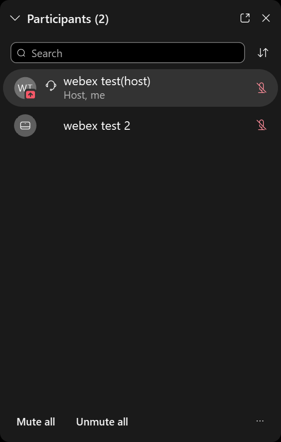

## Roles

Webex Meetings has the following roles.
* **Host**： can start / end a meeting and assign users to “Presenter. ” They can also mute / unmute microphones of participants, but participants can cancel it themselves.
* **Presenter**： can share the contents. If the host has chosen the setting “Anyone Can Share,” the participant who shared the content automatically becomes the presenter. When "Anyone can share" is on, any participant can share content in the meeting.
* **Participants**： can mute / unmute the microphone and send the camera image. They can chat with other participants and the host.

## Screen composition

* When you enter the conference room, the following screen will be displayed (It looks different if another participant is already in the room).

	{:width="400px"}

* Buttons are lined up at the bottom of the screen. Hover the mouse over the button to display the name. We will explain from left to right.

	{:.medium}
	1. **Mute**： This button turns black when the microphone is on, and  turns red when muted. **Mute your microphone (make the icon red) when you don’t speak. Unexpected sounds may be leaked to other participants if you do not mute the mic.**
	1. **Stop video**： This button turns black when the camera is on, turns red when the camera is off.**If the connection environment is unstable, stop the video (make the icon red).**
	1. **Share contents**： Share your screens to share materials with other participants. There are three options: share your PC screen, share specific application windows, or share specific Chrome tabs. It is also used to show a PowerPoint document at hand, to show a video, and to show your writing by connecting to a OH camera, etc. There is also a whiteboard function, so you can share material you have handwritten on your device.
	1. **Record meeting**： You can record your meeting. You can save it to the cloud (on the Webex server) or your computer, but sometimes it does not allow you to save it to your computer, depending on the setting.
	1. **Participants**： Press the participant button to display a list of participants. In the participant list, you can hover your mouse over each name to send a direct message to that participant or to make that participant leave the meeting from a pull-down menu.
	1. **Chat**： Pressing the chat button will bring up a chat window where you can send a message to everyone or a specific person.
	1. **Other options**： There are other options here. You can prevent the entry to the conference room (when participants are not allowed to be late for a certain period of time, etc.), mute participants or generate a sound when someone new enters the meeting, etc. The voting function cannot be performed in the browser, and requires a desktop application.
	1. **Leave**：  Leave the conference room.

The following describes the additional details of the menu items used mainly.

## Screen sharing
	
When you press "Share Content", the screen options to share will appear. Select the one you want to share and click "Share" to start sharing the screen.

{:width="400px"}
	
* When "Screen 1" is selected, a screen which the person is literally looking at is shared with everyone (If there are multiple screens such as when using a multi-monitor, the number of options increases like “Screen 1,” “Screen 2,” ...).
* The currently open window/app is also displayed as an option. You can  share a specific window/app to share. If you don't want participants to see the whole screen, select only the window/app you want to share.
* If you select "New Whiteboard", a whiteboard that participants can draw freely will be shared with everyone.

## Detailed Settings for Speaker, Microphone and Camera

{:width="300px"}

Click "Other Options" and then "Speakers, Microphones, Cameras" to set and check the speaker, microphone and camera.
* **Speaker** : You can select the speaker you want to use (You will have multiple choices in case you have a separate speaker on your PC. Select the one you want). Click "Test" to hear a confirmation sound.
* **Microphone** : You can select the microphone you want to use (You will have multiple choices in case you have a separate microphone on your PC. Select the one you want). If the microphone properly collects sound, the meter below will oscillate. Check "Automatically adjust volume" box if necessary.
* **Camera** : You can select the camera you want to use (You will have multiple choices in case you have a separate camera on your PC. Select the one you want). A preview of the camera is displayed down below.

## Participants

Pressing "Participants" will bring up a screen where you can see a list of participants.

The left side shows the host’s view, and the right side the participant's view.
* **Hand icon**： When the participants (other than the host) press the hand icon, they can raise their hands. The host can check who is raising a hand. In the figure above, the test attendee is raising his/her hand.
* **Microphone icon**： Participants with a red microphone icon have their microphones muted. The host can also mute participants' microphones. In the above figure, the microphone of the test attendee is muted.

## Chat
	
Press "Chat" to enable text chat. You cannot read the chat history before you join.

	
* **Recipient**： Select the recipient of the message. If you select "Everyone", it will be sent to everyone.

 
 
<a href="index" target="_blank">Return to How to Use WeBex</a>
