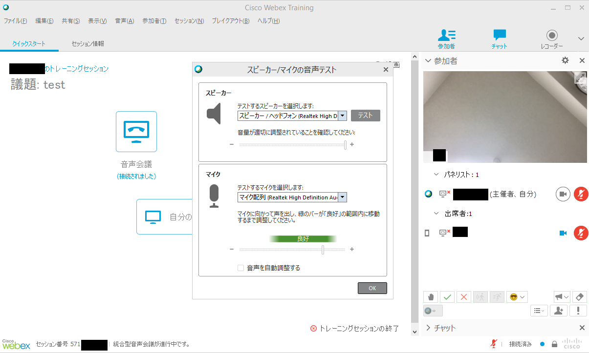
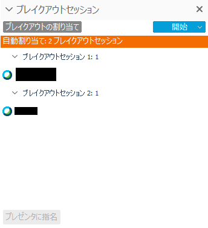
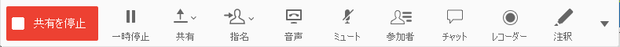
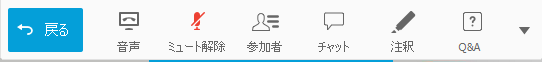

## Roles

There are four main roles in Webex Training．
* **Host**： Hosts can start/ close the event,  change the other participants' authorizations and build breakout session.  However, hosts cannot share the contents, nor participate in a poll. 
* **Presenter**： Presenters can share the contents and change the other participants' authorizations. Presenters can also make and organize polls and breakout sessions.
* **Panelist**： Panelists can answer questions from participants.
* **Participant**： Participants can share their camera screen and mute/ unmute their microphone. However, if organizers or presenters mute participants, the unmute function becomes locked. 

## Webex Training Screen

* Below is the Webex Training screen. Although this screenshot looks small, the actual brower can be a maximum screen.
	* Entering the training session, the screen shows "Test your speaker/ microphone". Choose the speaker and mirophone that you want to use. Click OK button and test your speaker and microphone.
	{:.medium}

* For presenters, you can see the screen below. Click "Share your desktop screen", and share your screen with participants. Click the arrow next to "Share your desktop,"  and presenters can share designated applications.
	{:.medium}

### Participants Panel

* On the participant panel, you can see the list of participants. Hosts and presenters can mute or give the authorizations to attendees on right click.
* If a partcipant shares their camera screen, the shared screen is shown as below. If you double-click the screen, the clip maximize on your computer / tablets.
* Press the icon on the bottom and you can give feedback to organizers.

	{:width="300px"}

### Chat Panel

*  Chat panel allows all attendees to send messages. You can send a message to organizers or presenters by switching the email destiny. 

	{:width="300px"}

### Recorder Panel

* In the recorder panel,  you can manipulate recording on the server.

	{:width="300px"}

### Q&A Panel

* Q&A allows participants ask questions to panelists, presenters and organizers. Answered questions can be seen on the other participants' screen.  Those who have just entered the session can read all Q&As.

	{:width="300px"}

### Poll Panel

* Poll panel allows participants to answer quizzes and questionnaires. Only presenters can start polling．

	{:width="300px"}

### Breakout Session Panel

*  At the breakout session panel, organizers and presenters can organize breakout sessions.

	{:width="300px"}

### Operating on Maximized Screen

* When presenters share the contents with participants or participants double-click the camera screen, all participants view the maximized screen.
* In Maximized screen mode, place the cursor over the upper screen and then you can see buttons below.

	
	

* Above: Organizers' monitor; Below: Attendees' monitor

 
 
<a href="index" target="_blank">Back to How to Use Webex</a>
