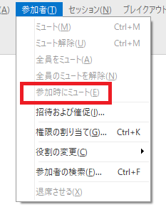
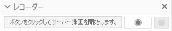
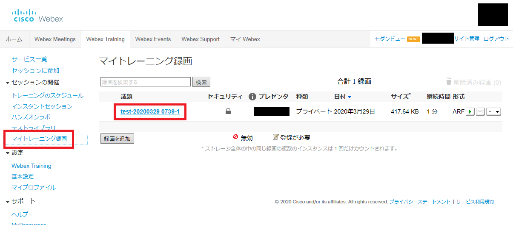
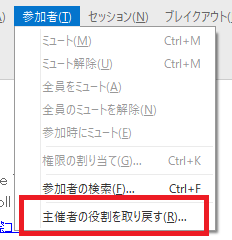
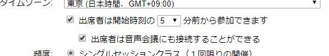
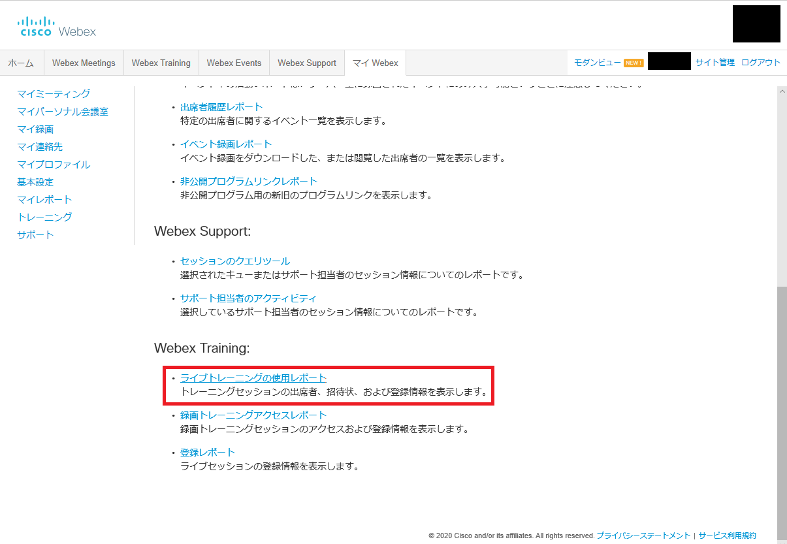
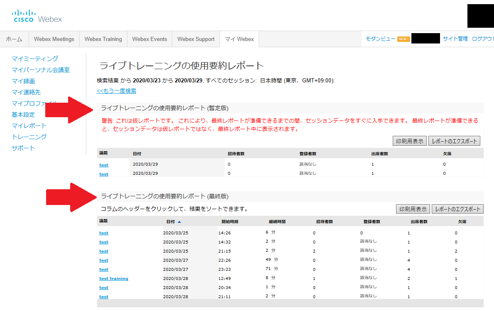
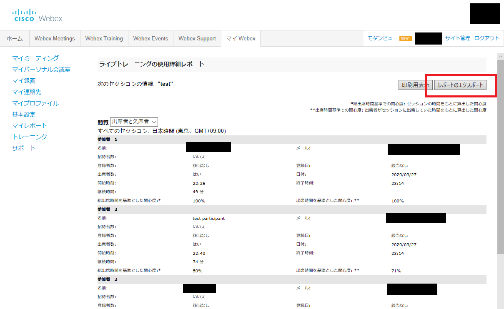

* This section describes the Webex Training functions only available to the host.	
* Click <a href="do_training" target="_blank">here</a> for basic use instructions.

## Functions only available to the host

### Mute all participants

* To mute everyone as they join, select "Mute on Entry" from the Participant menu.
* If the host selects "Mute on Entry", participants cannot unmute themselves.

		

* To mute all attendees, go to the Participant tab and select Mute All.

	

### Participants’ Roles

* To assign roles to other participants, select "Assign Privileges" from the Participant tab.

	
	{:width="400px"}

### Recording

* If you record the entire training and upload it on an online platform like ITC-LMS (How to publish: TODO), you can use the recording as a learning material for students with poor communication conditions or as a review material for the class.
* You can start recording anytime during the meeting by clicking the recorder icon.

	{:width="400px"}

* Recorded video files are automatically saved in ARF format and saved in "My Training Recordings". You can also get a link (URL) with a password to share.
* Details can be changed from the "Change" button.

	{:.medium}
	{:.medium}

### How to Become a Host Again

* When the host gets disconnected due to network trouble, etc., other participants will automatically be assigned to a new host.
* In such case, join the meeting as a participant, press "Change Role To" from the "Participant" menu, and select “Host.”

	{:width="250px"}

* If you enable “Attendees can join at least n minutes before the start time” when scheduling the training time, participants can enter the training before the host. If a participant changes his/her own role to the host before the original host joins, he/she will be able to proceed the training as a host.

	{:width="500px"}

### Participants

* You can download a record of who participated in the training and how long they have participated.
* It will take some time to generate participants’ reports.

1. From "Analysis" on the home screen, click "Show All" in the upper right corner.
{:.medium}
1. Click on "Live Training Usage Report".
{:.medium}
1. Search for the training you have held. Enter the date and agenda, and click "Display Report".
{:.medium}
1. A list of trainings will be displayed. If the report is shown in the "Live training usage summary report (provisional version)" section, the proper report has not yet been generated. Please wait for it to move to the "Live Training Usage Summary Report (final version)" section. Then click on the agenda.
{:.medium}
1. A list of participants' attendance will be displayed. Click "Export Report" to download the displayed content as a CSV file.
{:.medium}

 
 
<a href="index" target="_blank">Back to How to Use Webex</a>

