- This article provides an overview of Webex Meetings and Webex Webinars features specific to the host.
- For basic instructions on how to use Webex, please click [here](do_webex).

## Breakout Session
Hosts can set the number of breakout sessions, assign participants to breakout sessions, rename each breakout session, and set the time limits and countdown timers for breakout sessions.**Please note that breakout sessions are not available for End-to-End Encrypted Meetings.**
- You may set up to 100 breakout sessions.
- (Only for Webex Webinars) Hosts may assign panelists to each breakout session, but may not assign participants. Participants have to choose the breakout session they wish to enter.
- Breakout sessions have to be enabled when scheduling the meeting or from the menu bar after the meeting has started.

    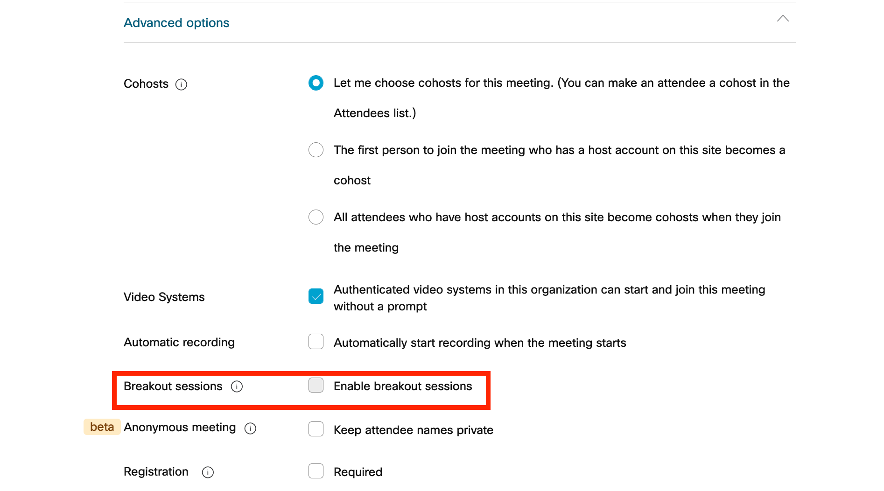{:.border}
	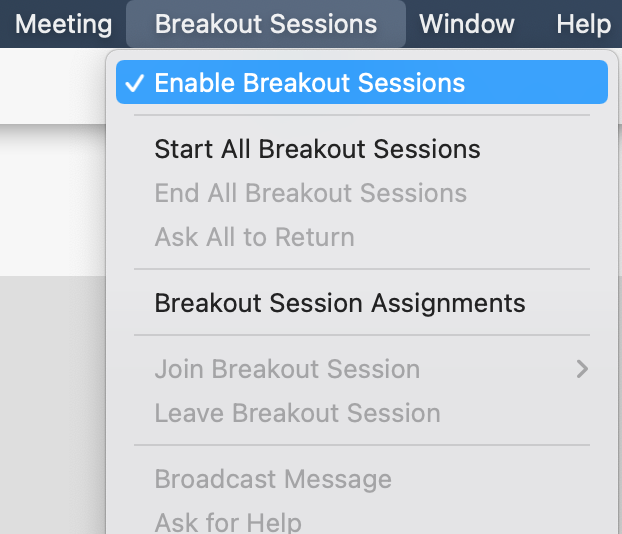{:.border}

- When you click “Breakout Sessions”, the “Create breakout sessions” windows will appear.
  - If you select “Assign participants automatically”, participants will be randomly assigned to each breakout session.

    {:.border}

- When you click on “Create Assignments”, the “Breakout session assignments” window will appear.
  - From this screen, you may confirm or change the participants assigned to each breakout session, as well as add, delete, or rename breakout sessions.
  - By clicking on "Reset", you may reset the number of breakout sessions. Any assignments made manually will be overwritten.
  - By clicking on "Settings", you may allow participants to join or leave the breakout session (return to the main meeting), set the sessions time limit, and set a countdown timer for the end of sessions.

	{:.border}
	{:.border}
	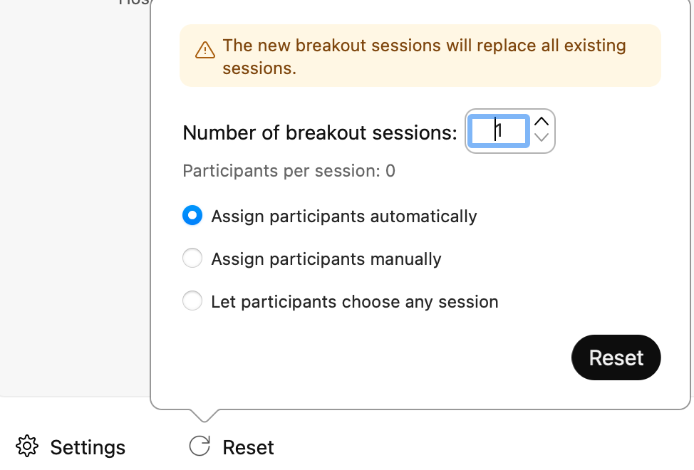{:.border}

- When creating a meeting, you can assign invited participants to breakout sessions by clicking “Preassign participants to breakout sessions”. You can also preassign people to breakout sessions by importing a CSV file.

	{:.border}
	{:.border}
	{:.border}

- Press “Start breakout sessions” to begin.
  - The participant list will be divided into the main session and breakout sessions. A participant list will be shown for each breakout session.

	{:.border}
	{:.border}

- Click “Join” to join a breakout session. The option is displayed next to the breakout sessions on the participant list.
  - When leaving a breakout session, click “Leave session” displayed in red to return to the main session.
- When you are in the main session and a participant asks for help from a breakout session, a window will pop up allowing you to join the session.

	{:.border}

- During a breakout session, click “Breakout sessions” to reassign participants or end the breakout session.
  - Click “Broadcast” to send messages to a specific breakout session or to all participants.

	{:.border}
	{:.border}

## Locking your Webex Meeting
When hosting a highly confidential meeting, you may lock the meeting to prevent new participants from freely joining. **Note that the Lobby fuction is not available in End-to-End Encrypted Meetings.**
- When a meeting is locked, new participants who come to join the meeting will wait in the lobby.
	{:.border}

- When a participant is waiting in the lobby, their name will be displayed above the participant list so that you can confirm and allow them to join.
	{:.border}

- You may also move a participant who has already joined the meeting to the lobby by right clicking on the participant and selecting “Move to Lobby”. However, you cannot move the participant with the presenter role.
	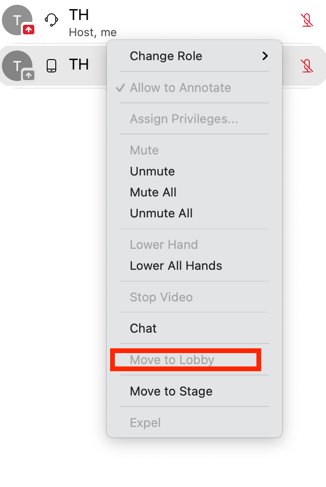{:.border}

- When scheduling a meeting, you can set up the option to send unregistered participants (those who do not have a utelecon.webex.com account) to the lobby, even if you have not locked the meeting. However, you cannot prevent a participant with a utelecon.webex.com account from joining the meeting when it is not locked.
	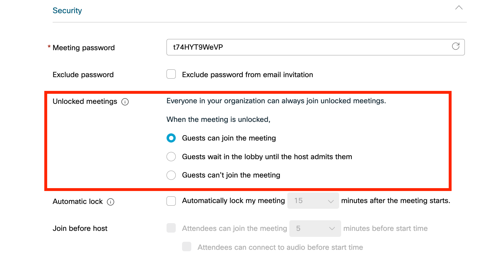{:.border}

## Lowering Participants’ Hands
- You may lower a participant’s hand, or lower all hands at once when more than one person has raised their hand.
- Right-click on the participant with hands up and select "Lower hand" or "Lower all hands".
	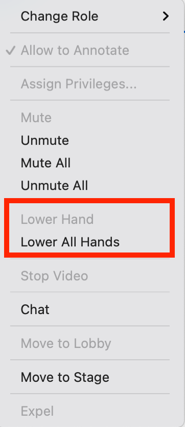{:.border}

## Muting participants
- In the initial setup of the meeting, you can select to mute participants who are entering the meeting.
- Even after the meeting has started, you can mute participants who are entering the meeting by selecting “Mute on Entry” in the “Participant” menu.
	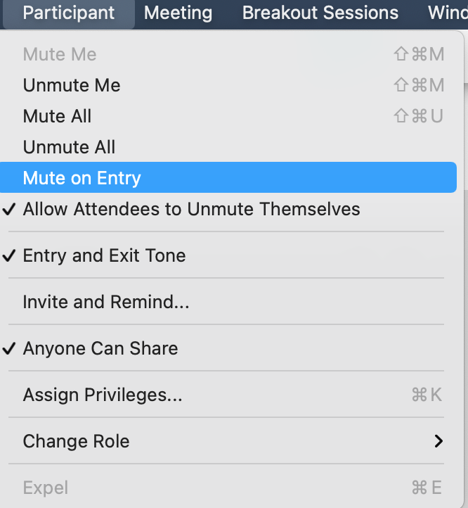{:.border}

- You may mute all participants instantly by selecting “Mute All” from the “Participant” menu or from the participants list.
- You may unselect "Allow attendees to unmute themselves" to prevent participants from unmuting themselves and start speaking without permission.
	{:.border}
	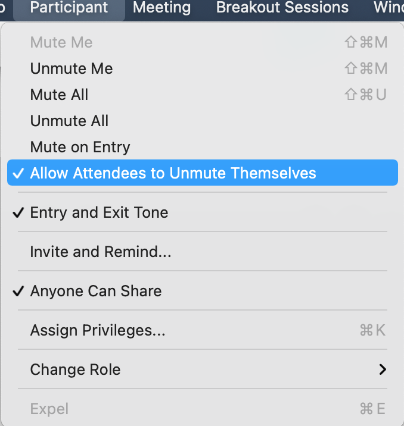{:.border}

## Sharing restrictions
- Hosts may restrict content sharing from participants other than those assigned the role “Presenter”.
- You can prevent participants from unexpectedly sharing their screen by unselecting “Anyone can share” under the “Participant” menu.
	{:.border}

## Entry and exit tone
- A sound can be played every time a participant enters or exits the meeting. This can prevent unexpected participants from entering the meeting unnoticed, but can become annoying in a meeting with many participants.
- You may set the entry and exit tone in the initial meeting setup.
- Select “Entry and Exit Tone” from the “Participant” menu.
	{:.border}

## Setting Participant privileges
- You may modify the privileges of participants according to their role in detail in the "Assign Privileges" section of the "Participant" menu.
	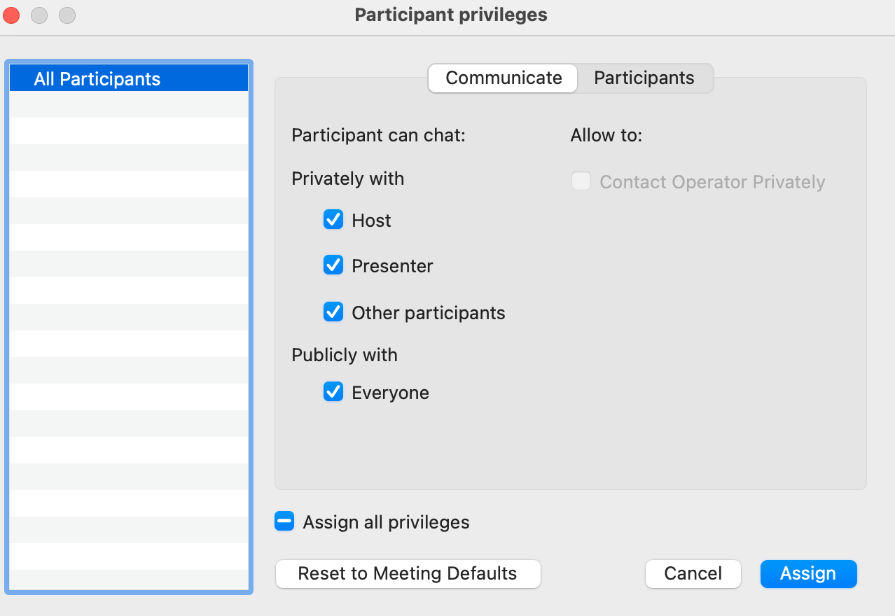{:.border}
	{:.border}

## Recording the Webex Meeting
- Webex meetings can be recorded and made available on UTOL or other systems for students who had wifi connection issues or who want to use the videos for review purposes.
- Recording can be set by turning on "Automatic Recording" during the meeting setup or started at any time by clicking the “Record” button during the meeting.
- Co-hosts are unable to start the recording if the meeting host is present.
- Recording is paused during breakout sessions.
	{:.border}

- Recorded video files are automatically saved in MP4 format and stored in the Recordings menu in the home page. You may download the file or obtain a password-protected link (URL) to share the recording.
	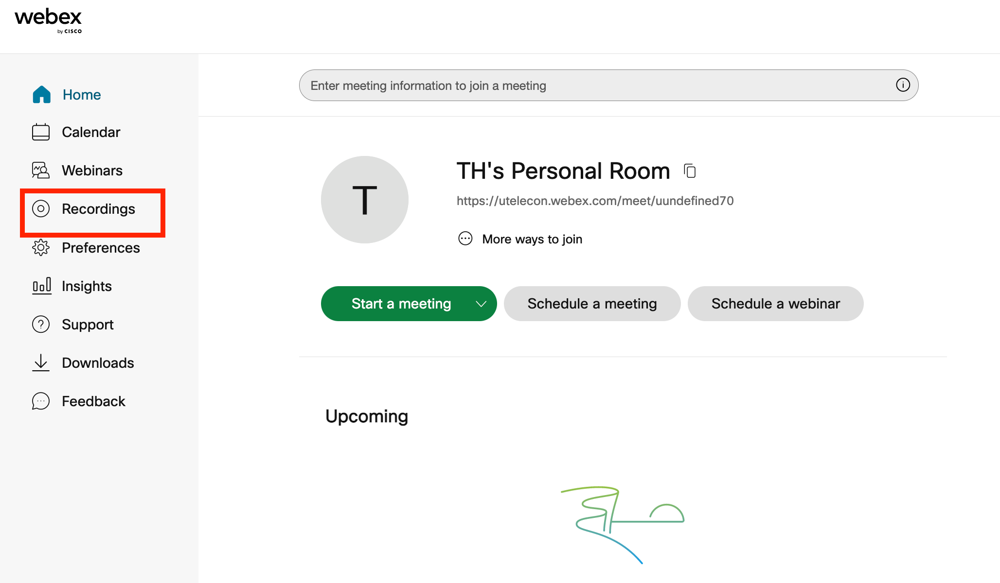{:.border}
	{:.border}

## Reclaiming Host Role
- If the meeting host is disconnected due to network issues or other problems, the host role will be transferred to another participant.
- In such cases, after rejoining as a participant, you can reclaim your role as host by pressing "Reclaim Host Role" from the "Participant" menu and entering the "Host key" displayed when the meeting was created.
	{:.border}

- If "Join before host" is set in the "Scheduling Options" when scheduling a meeting, participants can enter the meeting room even if the host has not started the meeting. In such cases, if a participant selects "Reclaim host role", they can become the host and proceed with the meeting.
	{:.border}

## Exporting Attendance Report
- You may view and download a record of who attended the meeting and how long they were there.
- It may take some time after the meeting ends for the attendance reports to be generated.

1. Click "Calendar" on the left side of the home page.
{:.border}
1. Click "Completed" and select the meeting for which you wish to obtain the participant list.
   * Only meetings from the last 7 days are displayed by default. Search for earlier dates by selecting them from the date selector.
{:.border}
1. The participant list will be displayed.You may export the information by selecting “Export attendance report".
{:.border}
   - You may download the information as a CSV file containing details such as the participants’ names, e-mail addresses, and connection time.

## Activating Slido
- This function is not available for End-to-End Encrypted Meetings.
- Note that only the host can activate Slido. (Co-hosts cannot activate Slido.)
- Note that Slido can only be activated from the desktop application. (Slido cannot be launched from the mobile or web applications.)

1. Click the "Apps" button on the menu at the bottom of the screen during a Webex Meeting.

1. When the application list appears, select Slido (Polling and Q&A).
{:.border}
1. Slido will be activated.
{:.border}
   1. You may select an event prepared in advance on the host's Slido Event List page.
   1. You may also create a new Slido event by clicking the “Create new Slido” button.
      - Slido events created in Webex meetings will be archived on the host's Slido Event List page.

## Operating Slido
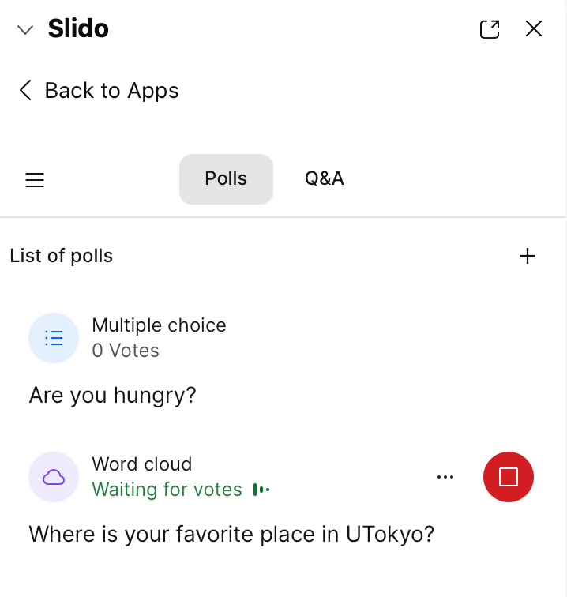{:.border}

1. Switching between Polls and Q&A
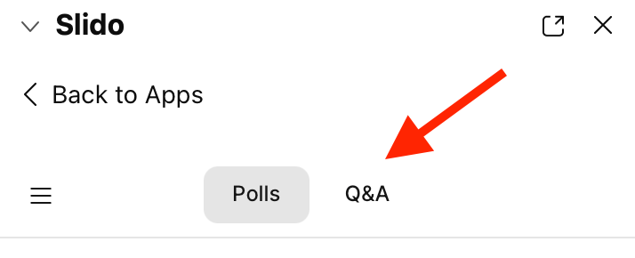{:.border}
    * You can switch between Polls and Q&A using the tabs.
   * You may click the launch/deactivate button (①) on the List tab to launch/deactivate the Poll.
   * New polls can also be created by clicking the Add Poll button (②) on the List tab.
   * The polling results can be viewed on the Live tab (③).
   * Basic operations are the same as that of the web version of Slido.

1. Operating the Q&A Tab
{:.border}
   * You can answer and manage questions using the Q&A tab.
   * Basic operations are the same as that of the web version of Slido.

 
 
<a href="index" target="_blank">Back to How to use Webex</a>
