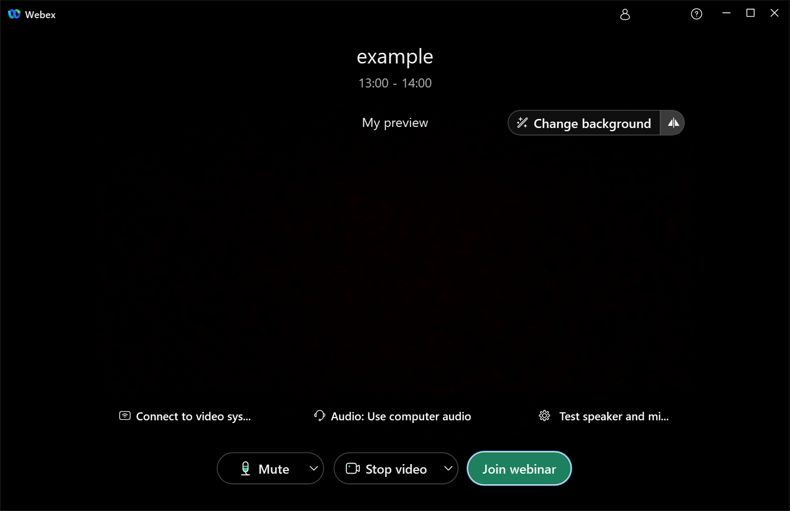

## Joining a Webinar

* Clicking on the link in the email sent by the organizer will open your default browser and launch the Webex application.
* After entering your name, you will be taken to the preview screen.
  {:.border}
* The audio and microphone settings are located at the bottom of the screen. This is where you switch the audio and microphone settings for your equipment, such as when you wear a headset. If you have any problems with these settings, you can change them after you join.
* The microphone button on the screen allows you to mute and unmute the microphone.
* Click "Join Event" to join the meeting.
* If the organizer is not in the session, you will not be able to join the meeting even if the scheduled time has passed.

 

[Back to "How to use Webex"](.)

[See "What is possible with Webex Events?"](do_events)
