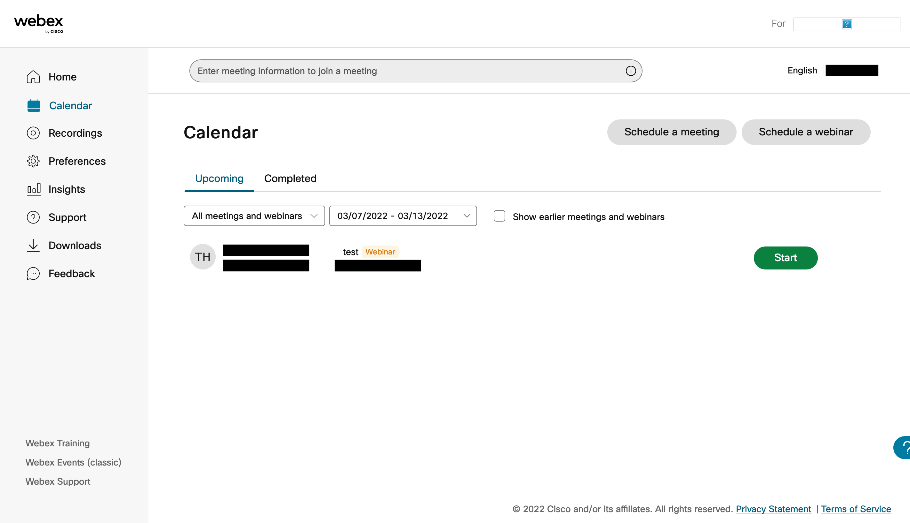

## Start a webinar
* **To start a webinar, the organizer must resume it.**
* The scheduled event will be displayed on the home screen; press the "Start" button of the corresponding webinar. A preview screen will be displayed. Once you check the connected devices and audio, you can start immediately with the "Start Webinar" button.

	{:.medium}

 
 
<a href="index" target="_blank">Back to How to Use Webex</a>
