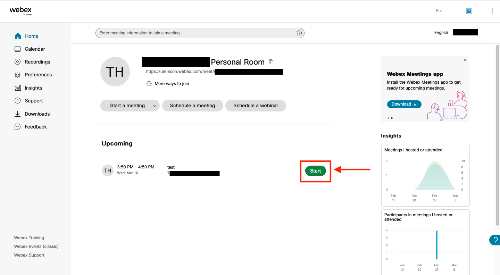

## How to Begin a Meeting
* **To start a meeting, the organizer must operate the WebEx system.**
* There are two kinds of meetings: Scheduled meeting and Instant meeting.
* To start a scheduled meeting, locate your meeting in the “Upcoming Meetings” section on the home screen and select “Start”. Check the connected devices and audio on the preview screen, and select the "Start a meeting" button.

	{:.medium}

* To hold an instant meeting, click the “Start a Meeting” on the home screen. You will immediately move to the preview screen, where you can start the meeting by clicking "Start a Meeting". Invite participants to the meeting by sharing the URL displayed below the “Personal Room” or the meeting number. You can check your meeting number by selecting “More ways to join.”

	{:.medium}

* Participants will not be able to join a scheduled meeting unless the organizer clicks “Start Meeting”. However, the organizers can allow participants to join before the host by checking off “Join before host” in the meeting setting screen. (“Show advanced options”→”Scheduling Options”) 

 
 
<a href="index" target="_blank">Back to How to Use WeBex</a>
