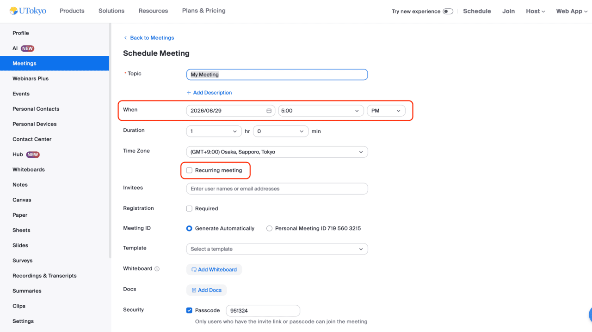
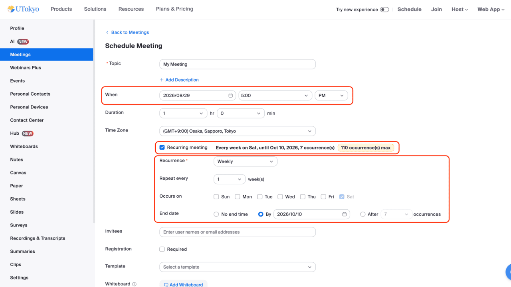
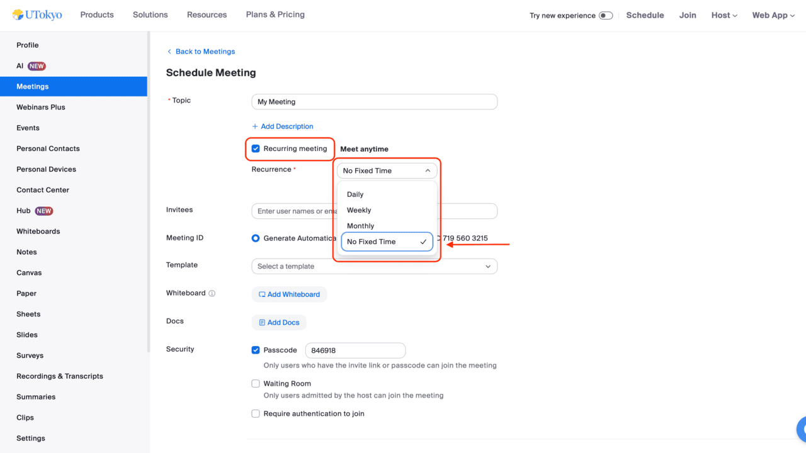

This page explains the different types of detailed date and time settings for Zoom meetings and the features of each type. By configuring the date and time settings, you can set up a meeting that can be held multiple times using the same URL. For basic procedures on how to schedule a Zoom meeting, please refer to [Scheduling a Zoom Meeting](/en/zoom/create_room/).

## Three Types of Date and Time Settings
When scheduling a meeting, you can choose whether to set it as a one-time meeting or a meeting that is held multiple times (recurring meeting). Furthermore, for meetings held multiple times, you can select whether or not to specify the date, time, and recurrence pattern.
- One-time meeting
- A recurring meeting with a specified date, time, and pattern
- A recurring meeting with no fixed date or time

The following sections explain the features of each setting and how to configure it.

## How to Set Up a One-time Meeting
This section explains how to set up a one-time meeting by specifying the date and time.

Open [the My Meetings Page in Zoom](https://u-tokyo-ac-jp.zoom.us/meeting) using a web browser, and click "Schedule a Meeting" in the upper right corner to open the meeting schedule screen. If you leave the "Recurring meeting" checkbox unchecked on this screen, it will be a one-time meeting. For a one-time meeting, you only need to decide the date and time in the "When" section.

In practice, you can use the meeting room at a time that is different from the one you specified. Also, the meeting will not be forcibly terminated even if it continues past the specified end time.

In fact, even a one-time meeting can be used to hold multiple meetings using the same URL. However, the URL for a one-time meeting expires 30 days after the specified date. Therefore, if you would like to use the meeting room multiple times, it is better to set it as a **recurring meeting** as shown below.

Note that you can also change a meeting that has already been scheduled from a one-time meeting to a recurring meeting. For details, please refer to [Editing and managing Zoom meetings](/en/zoom/misc/edit_meeting/).

## How to Set Up a Recurring Meeting with a Specified Date, Time, and Recurrence Pattern
Here, we introduce how to set up a recurring meeting with a specified date, time, and recurrence pattern.

When setting up a meeting, checking the "Recurring meeting" box turns it into a recurring meeting. A recurring meeting takes the date and time specified in the "When" as the first session, and by setting the recurrence pattern thereafter, it becomes a regular scheduled meeting.

First, under the "Recurrence" item that appears after checking "Recurring meeting", you can choose the recurrence unit for subsequent meetings from "Daily", "Weekly", or "Monthly". (If you select "No Fixed Time", it becomes a recurring meeting without specifying a date and time, as described later.) Furthermore, you can configure more detailed settings by specifying "Repeat every" and "End date". For example, if you set the date and time to "2026/08/29 05:00 PM", the recurrence unit to "Weekly", the repeat frequency to "1 week", the day to "Sunday", and the end date to "2026/10/10", you can set up a meeting every Sunday at 5:30 PM from August 29 to October 10, 2026.

Even when you specify a date, time, and recurrence pattern for a meeting, you can still hold the meeting at other times.
However, if you wish to hold multiple meetings without a fixed recurrence pattern, the "**No Fixed Time**" setting explained in the next section is suitable.

## How to Set Up a Recurring Meeting with No Fixed Date or Time
After checking "Recurring meeting", by selecting "No Fixed Time" in the "Recurrence" field, you can set up a meeting room that does not have a specified date and time.

Even with a one-time meeting or a recurring meeting with a specified date, time, and recurrence pattern, you can hold multiple meetings using the same URL. However, there are inconvenient aspects: each has limitations on the period and number of times it can be held, and when holding a meeting outside the scheduled time, the pre-specified date and time will still be displayed, which may cause confusion. Therefore, if you plan to hold meetings at irregular intervals, it would be appropriate to set the recurrence to "No Fixed Time."

