The participant registration feature of Zoom sets the system up so that it requires prospective participants to register in advance so that only those who have registered can attend the meetings.

The meeting host creates a registration link using this feature.
Subsequently, the host sends the relevant link to prospective participants and asks them to complete the registration procedure.
Prospective participants who wish to attend the meeting are required to access the registration page provided by the host and complete the registration procedure.
Prospective participants who register are automatically approved to join the meeting on completing the procedure and receive a confirmation email containing an individualised link.
It is not possible to join the meeting unless you complete the registration process and obtain the link.

The host can check what information has been entered on the registration form by the prospective participants.
There is an option that allows the host to manually decide whether or not to approve the participation of a prospective participant who has completed the registration procedure.

## Basic Usage

Here, we will explain how the host creates a meeting where the participant registration feature is enabled and how the participants register in advance and how they attend the meeting.

### When Creating a New Meeting Requiring Participant Registration

1. Please go to the [Zoom meeting page](https://u-tokyo-ac-jp.zoom.us/meeting/) in your web browser and click on "Schedule a Meeting".
1. On the next screen, please switch on  the "Required" checkbox for "Registration".
   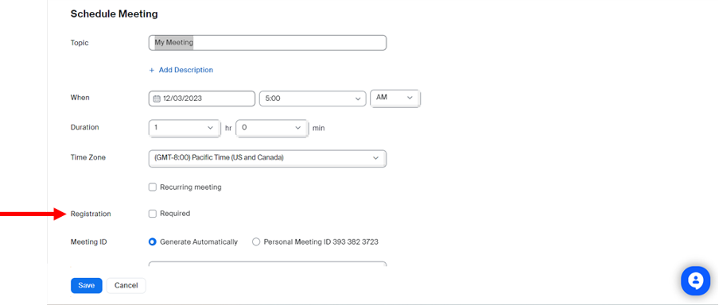{:.medium} 
1. Please click on the "Save" button at the bottom.
1. Please inform prospective participants of the "Registration Link" shown below.
   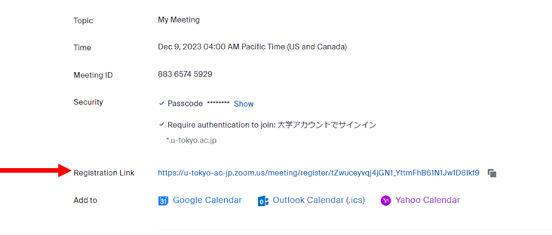{:.medium}
1. Prospective participants can perform the necessary registration procedures through the "Registration Link".
   Participants who have completed the registration procedure will automatically receive a confirmation email containing the individualised link.

※For the host to be able to individually decide whether or not a prospective participant will receive the confirmation email or not, please use the "Manual Approval" option mentioned below.

### Enabling the Participant Registration Feature in an Already Created Meeting (Not Recommended)

You can change a meeting that did not require participant registration to one that requires after it has been scheduled. However, this is not recommended because if the participants have the original link instead of the registration link created after the host has applied this change, they will be able to attend the meeting without completing the registration procedure.

1. Please go to the [Zoom meeting page](https://u-tokyo-ac-jp.zoom.us/meeting/) in your web browser.
1. When you hover the mouse over the meeting which you wish to enable the participant registration feature, the "Edit" button will be displayed on the right side. Please click on this button.
   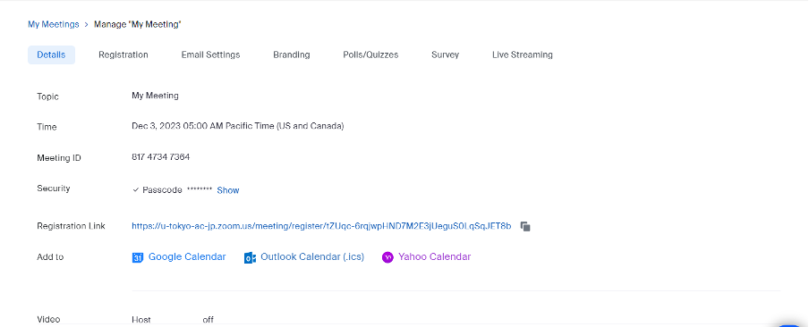{:.medium}
1. On the next screen, please switch on the "Required" checkbox for "Registration".
1. Click on the "Save" button at the bottom.
1. Please inform the prospective participants of the "Registration Link" displayed on the next screen.

### What Prospective Participants Need to Do

1. Please click on the "Registration Link" informed by the host.
1. The screen shown in the figure will be displayed. 
   Please enter your information in the entry fields and click on the "Register" button below. 
   In the email address field, enter your own email address. 
   Members of the University of Tokyo should enter their UTokyo Account (10-digit Common ID) followed by @utac.u-tokyo.ac.jp, e.g. `0123456789@utac.u-tokyo.ac.jp`.
   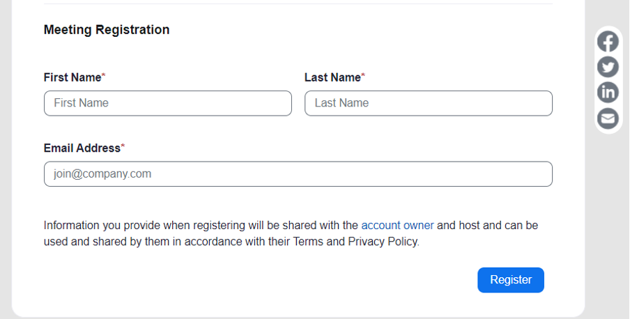{:.medium}
1. Once approved by the host, a confirmation email will be sent to the entered email address. 
   An individualized link required to attend the meeting will be provided in the confirmation email. 
   Since this link is assigned individually to registered prospective participants, please make sure not to leak it to others or lose it.
1. On the day of the meeting, please click on the join link to attend the meeting.

#### If You Are Unable to Register for UTokyo Member Restricted Zoom Meetings

In spite of being a member of the University of Tokyo, if you cannot register for a meeting restricted to UTokyo members, please check the following. 
If participant registration is open to external participants as well, this step is not necessary.

-  You have not entered your UTokyo Account: Please enter your UTokyo Account (10-digit Common ID＋`@utac.u-tokyo.ac.jp`).
-  **You have never signed in to Zoom with your Zoom account of the University of Tokyo**： 
   If you have never logged into your account of the University of Tokyo before, it is possible that you cannot register for Zoom meetings restricted to UTokyo Member. 
   In such cases, please perform the registration procedure again after signing in following the [Sign-in Methods for Zoom](/en/zoom/signin/).

※For Hosts: This problem may occur when the "Require authentication to join" option is enabled.

## "Require authentication to join" Option

Here, we will explain the "Require authentication to join" option, which allows you to restrict registration in advance to UTokyo members. 
This is an option that only prospective participants having specific email addresses can register in advance. 
By setting so that only participants who have a UTokyo Account which have `u-tokyo.ac.jp` at the end, assigned to members of the University of Tokyo, can attend, you can restrict "Participant Registration" to UTokyo members only.

1. Please go to the [Zoom meeting page](https://u-tokyo-ac-jp.zoom.us/meeting/) in your web browser and click on "Schedule a Meeting".
1. On the following screen, please switch on the "Required" checkbox for "Registration".
1. Then, on the same screen, please switch on the "Require authentication to join" checkbox.
   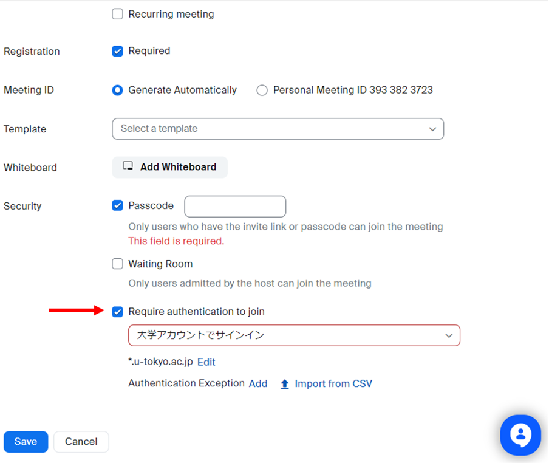{:.medium}
1. Then select "大学アカウントとしてサインイン (Sign in with university account)" from the dropdown menu just below.
1. Please ensure that the field further down in the menu is "*.u-tokyo.ac.jp". If not, please click on next "Edit" to change it.
   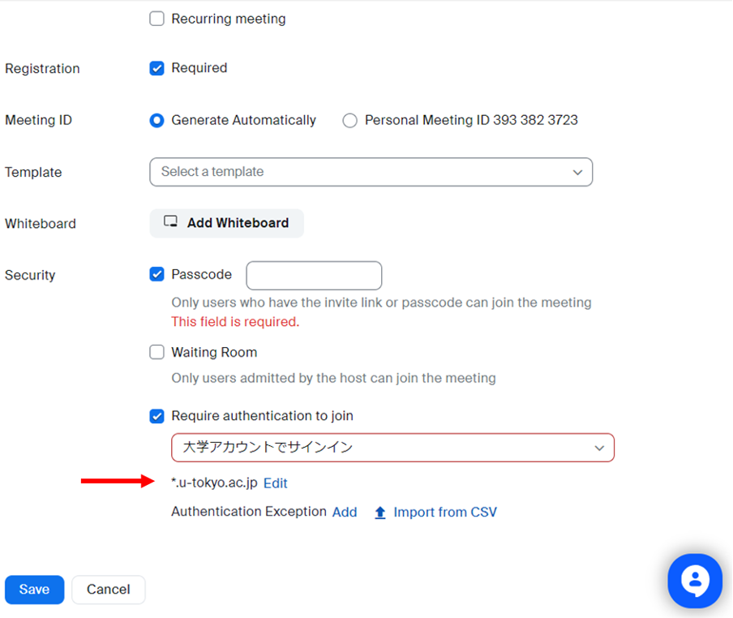{:.medium}
1. Click on the "Save" button at the bottom.
1.	Please inform the prospective participants of the "Registration Link" displayed on the next screen and guide prospective participants to enter their UTokyo Account (10-digit Common ID+ `@utac.u-tokyo.ac.jp`), e. g. `0123456789@utac.u-tokyo.ac.jp` in the email address field.
   {:.medium}

※If the email addresses of prospective participants are not in the format of `0123456789@utac.u-tokyo.ac.jp`, you may still be able to register in the Zoom system (if you have the Zoom account with `u-tokyo.ac.jp` at the end). 
However, because using the UTokyo Account (10-digit Common ID+`@utac.u-tokyo.ac.jp`) as the Zoom account is standard at the University of Tokyo, please enter in the format of `0123456789@utac.u-tokyo.ac.jp`.

## Resending Confirmation Email

Here, we will explain how to resend a confirmation email to registered prospective participants. This method allows you to resend the confirmation email as many times as needed to registered prospective participants. 
This is useful when you receive inquiries from prospective participants who have completed the registration procedure, such as "I lost the confirmation email" or "Please send the confirmation email again".

1. Please go to [Zoom meeting page](https://u-tokyo-ac-jp.zoom.us/meeting/) in your web browser.
1. Your scheduled meetings will be displayed as a list. Please click on the name of the meeting registered by the prospective participants to whom you want to resend the conformation email.
   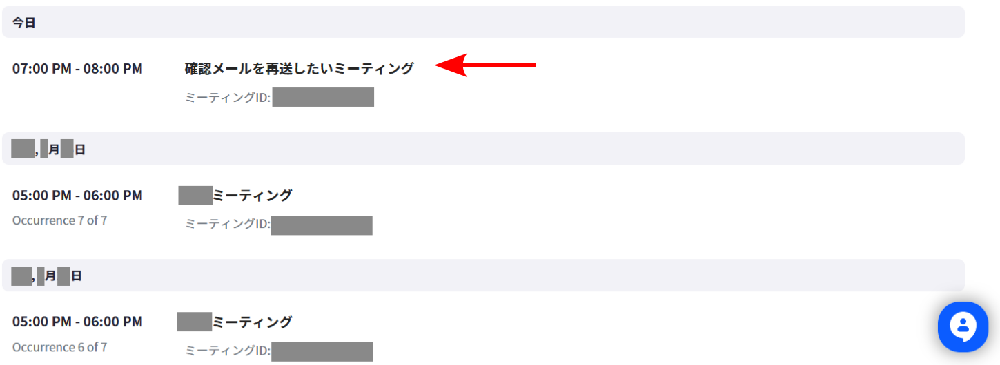{:.medium}
1. The meeting information will be displayed. You will see a row of tabs at the top, such as "Registration", "Email Settings", etc. Please select the "Registration" tab.
   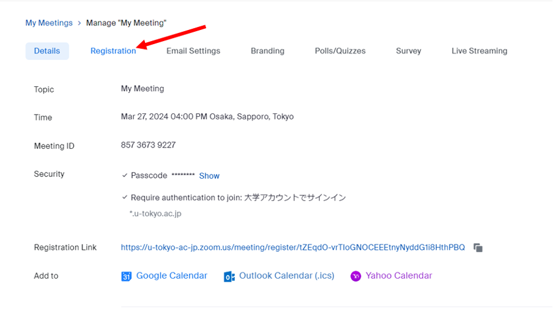{:.medium}
1. Please click on the "View" button located to the right of "Manage Registants".
   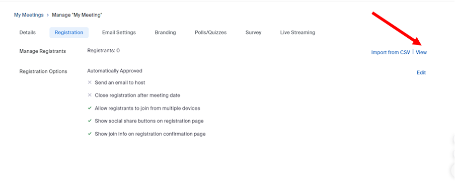{:.medium}
1. The list of the meeting registrants will be displayed.
1. Click on the checkbox for the registrant to whom you want to resend the confirmation email, and click on the "Resend Confirmation Email" button.
   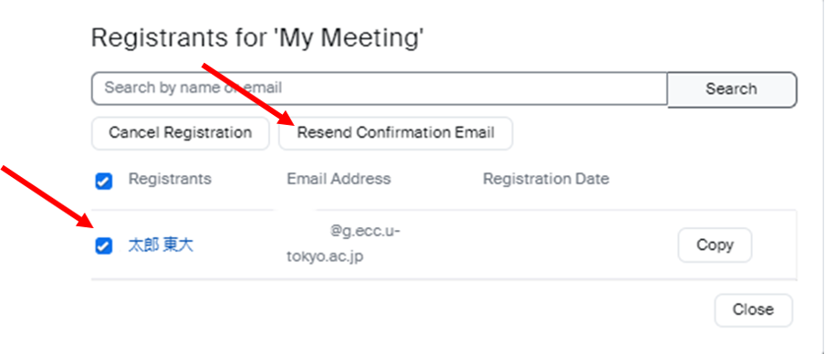{:.medium}

※If you have set up manual approval (as described below), you can only resend the confirmation email to prospective participants who are listed in the "Approved" list.

## Other Options

Using Zoom's participant registration feature allows you to accomplish the following.

-  Using the "Manually Approve" option to prevent registered prospective participants from receiving the join link until approved by the host.
-  Customize the fields in the form that prospective participants fill out on the registration page.
-  View the information entered on the registration page by prospective participants.
-  Ask for registration in advance for recurring meetings.
-  Close registration after the scheduled end time has passed.
-  Display original banners or logos on the registration website.

### Manual Approval

Here, we will explain about the option which prevents registered prospective participants from receiving the link until approved by the host. 
With this method, the host can choose which prospective participants receive the link.

※Usually, when prospective participants complete the registration procedure, the system automatically sends them their individualized link. 
Therefore, all registered prospective participants can receive their link.

#### Enabling the Option

Here, we will explain how to enable the "Manual Approval" option.

1. Please go to [Zoom meeting page](https://u-tokyo-ac-jp.zoom.us/meeting/) in your web browser.
1. Your scheduled meetings are displayed as a list. Please click on the name of the meeting for which you want to enable the manual approval option.
   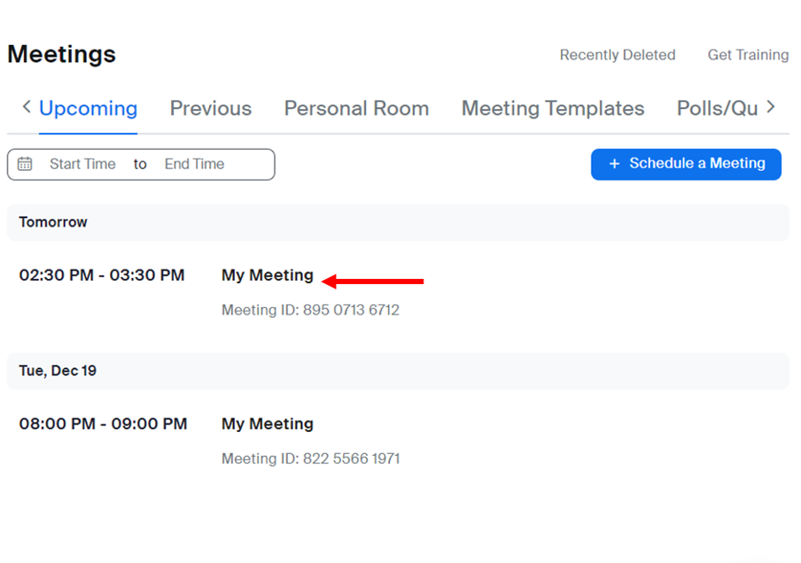{:.medium}
1. The meeting information will be displayed. You will see a row of tabs at the top, such as "Registration", "Email Settings", etc. Please select the "Registration" tab.
   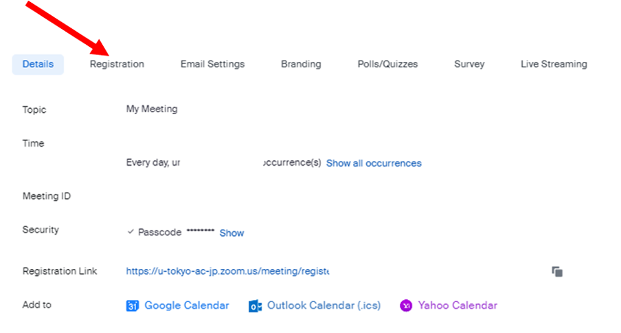{:.medium}
1. Click on the "Edit" button on the right of "Registration Options".
   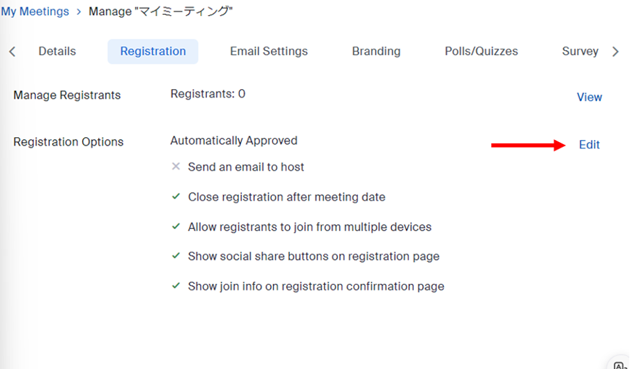{:.medium}
1. On the displayed screen, please select "Manually Approve". 
1. Click on the "Save All" button.

#### Participant Approval

Here, we will explain how to individually approve participants who have completed the registration procedure.

1. Please go to [Zoom meeting page](https://u-tokyo-ac-jp.zoom.us/meeting/) in your web browser.
1. Your scheduled meetings will be displayed as a list. Please click on the name of the meeting for which you want to check the registered prospective participants.
   {:.medium}
1. The meeting information will be displayed. You will see a row of tabs at the top, such as "Registration", "Email Settings", etc. Please select the "Registration" tab.
   {:.medium}
1. Please click on the "View" button on the right of the "Manage Registrants" section.
   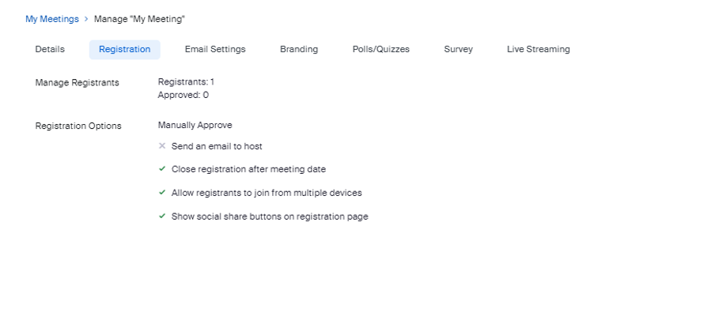{:.medium}
1. A list of prospective participants who have completed the registration procedure will be displayed in the "Pending Approval" list on the screen.
   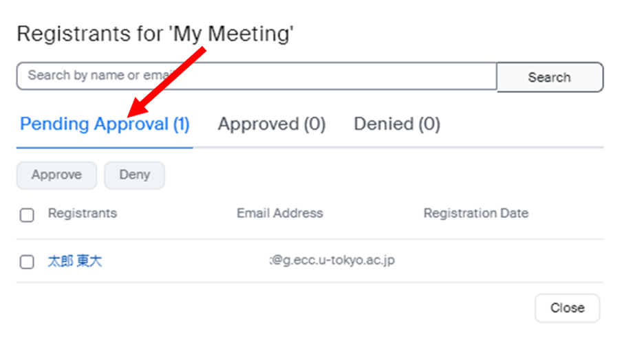{:.medium}
1. Click on the checkboxes on the left of the prospective participants you want to approve and click on the "Approve" button.
   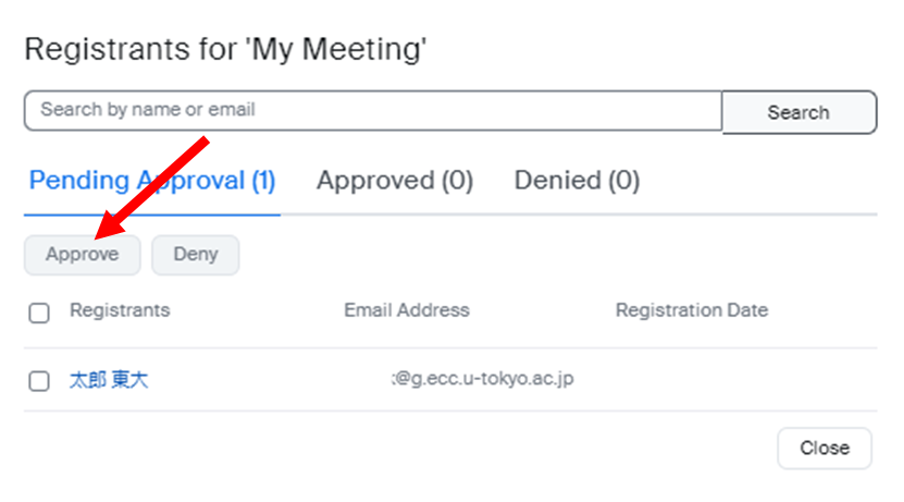{:.medium}

※The list of approved prospective participants can be viewed in the "Approved" list, which is located to the right of the "Pending Approval" list.

#### Participant Denial

Here, we will explain how a host can deny the participation of a prospective participant who has completed the registration procedure. 
The denied prospective participants will receive a "Registration Denial Email" indicating that their participation has been denied, rather than a confirmation email with the join link.

1. Please go to [Zoom meeting page](https://u-tokyo-ac-jp.zoom.us/meeting/) in your web browser.
1. Your scheduled meetings will be displayed as a list. Please click on the name of the meeting for which you want to check the registered prospective participants.
   {:.medium}
1. The meeting information will be displayed. You will see a row of tabs at the top, such as "Registration" and "Email Settings", etc. Please select the "Registration" tab.
   {:.medium}
1. Click on the "View" button on the right of the "Manage Registrants" section.
   {:.medium}
1. A list of prospective participants who have completed the registration procedure will be displayed in the "Pending Approval" list on the displayed screen.
   {:.medium}
1. Click on the checkbox on the left of the prospective participants you want to reject and click on the "Deny" button.
   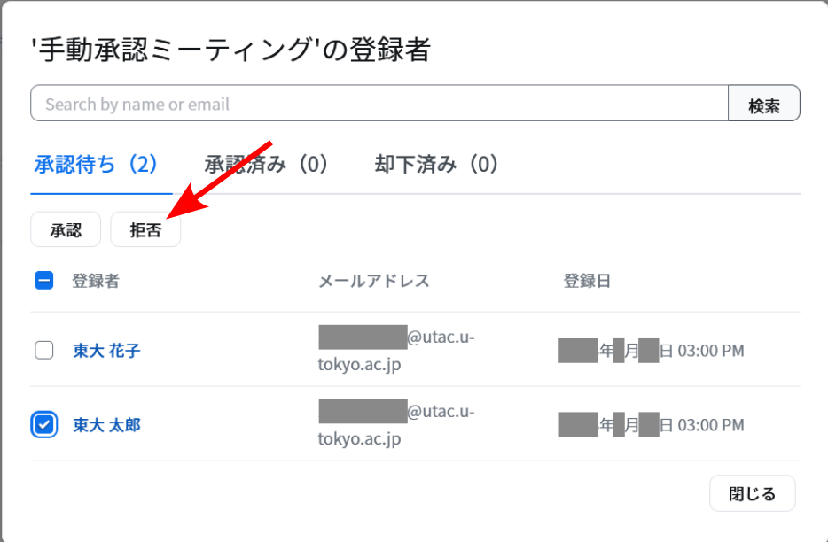{:.medium}
1. The screen for "Send Registration Refusal Email" will be displayed. Enter the message you want to convey to the rejected prospective participant, and click on "Send". The rejected prospective participant will receive the registration rejection email that contains what you enter here.
   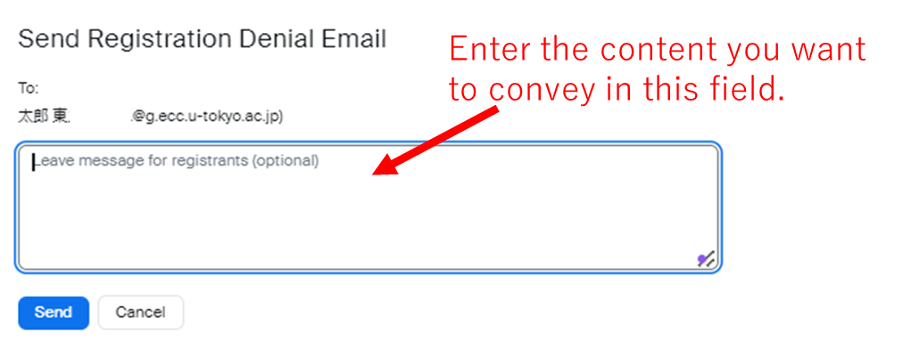{:.medium}

※The list of rejected prospective participants can be viewed in the "Denied" list.

If you accidentally refused a prospective participant whom you wished to approve, you can undo the denial procedure by following steps and approve their participation.

1. Please open the "Denied" list.
   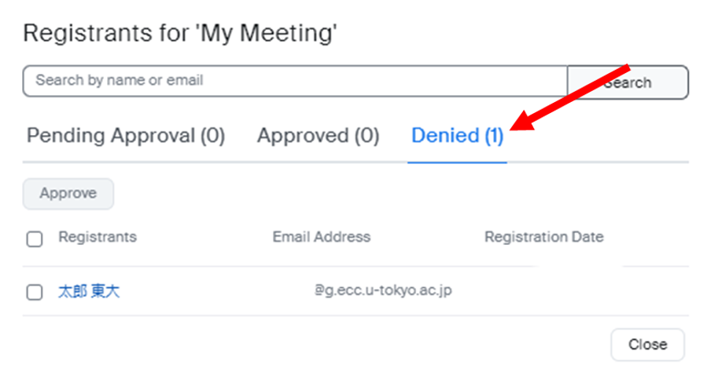{:.medium}
1. Click on the checkbox on the left of the prospective participant you wish to approve, and click on the "Approve" button.

### 参加希望者が登録用ページで記入するフォームの項目をカスタマイズする

ここでは，参加希望者が登録用ページで記入するフォームの項目をカスタマイズする方法について説明します．
参加希望者に事前にアンケートをとったり，「手動承認」オプションが有効の場合に承認の参考としたりするために役立ちます．

1. Web ブラウザで[Zoomのミーティングページ](https://u-tokyo-ac-jp.zoom.us/meeting/)へ移動してください．
1. 自分のスケジュールしたミーティングが，リストとして表示されます．フォームの項目をカスタマイズしたいミーティングの名前を押してください．
   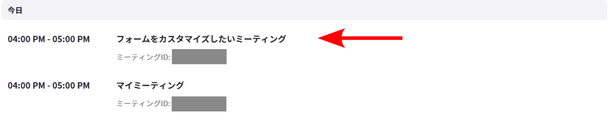{:.medium}
1. ミーティングの情報が表示されます．上の方に「登録」「メール設定」等のタブが並んでいます．「登録」タブを選択してください．
   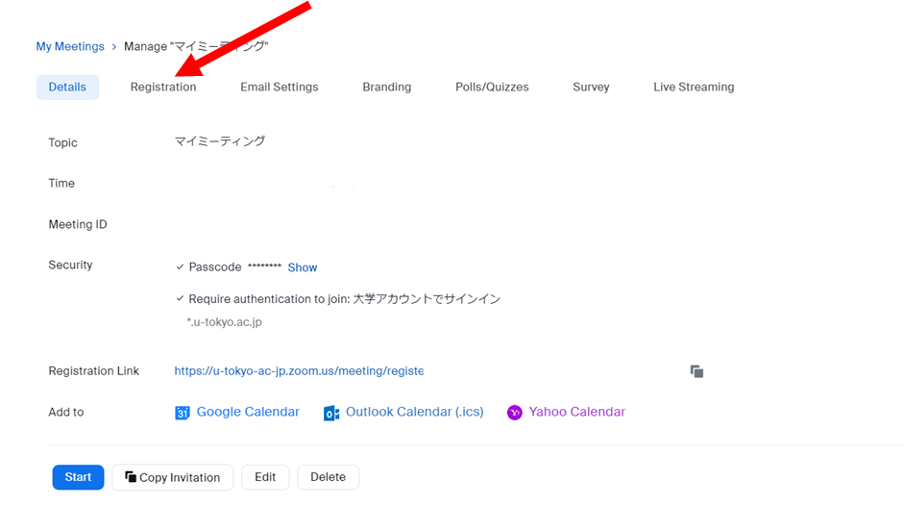{:.medium}
1. 「登録者を管理」欄の右側にある「編集」ボタンを押してください．
   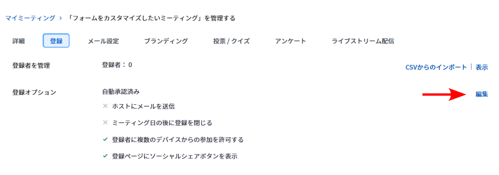{:.medium}
1. 以下の手順で，あらかじめ用意された質問をフォームに追加できます．

   1. 表示される画面で，「質問」タブを選択してください．
      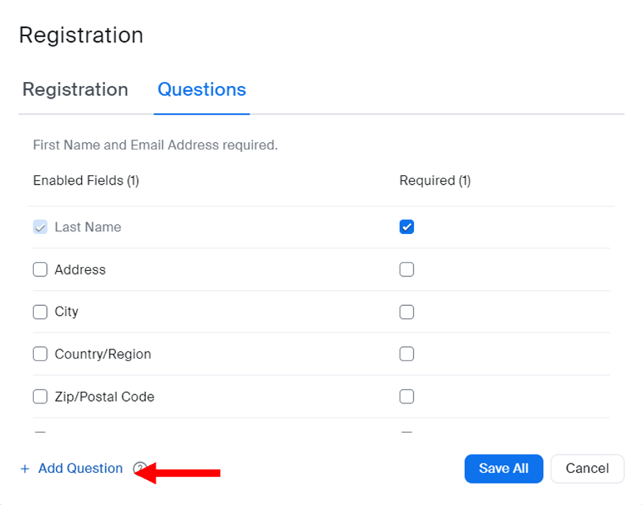{:.medium}
   1. 追加可能な質問（「国／地域」，「会社名／学校名」など）が一覧で表示されます．
   1. 追加したい質問の左にあるチェックボックスをオンにしてください． 
   1. 質問への回答を必須とするためには，右側の「必須」列のチェックボックスをオンにしてください．

1. 以下の手順で，オリジナルの質問をフォームに追加できます．

   1. 表示される画面で，「質問」タブを選択してください．
      {:.medium}
   1. 「質問の追加」を押してください．
      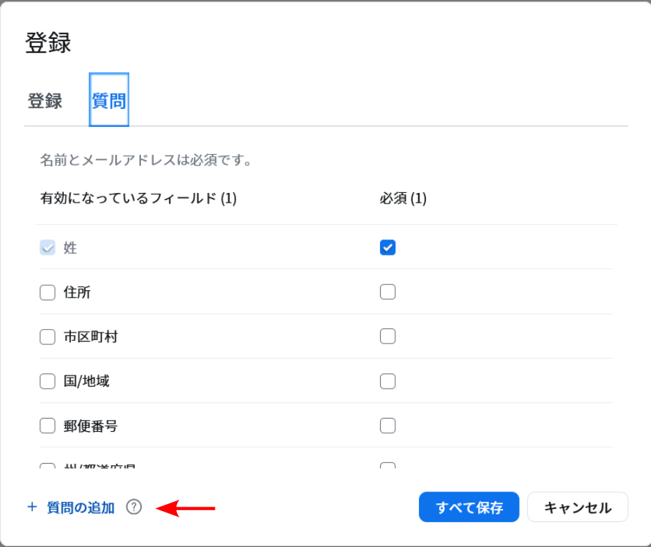{:.medium}
   1. オリジナルの質問を一番上のテキストボックスに入力してください．
      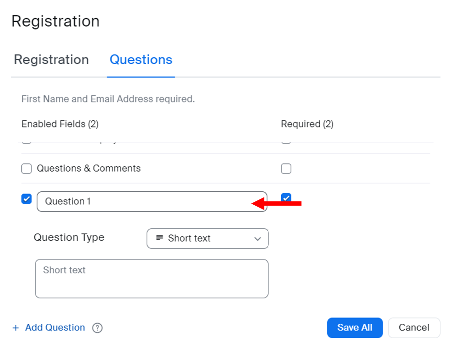{:.medium}
   1. Question Type横のメニューから，質問の形式を選んでください．「ショートテキスト」は自由記述，「単一選択」は選択問題の形式です．
   1. 追加したい質問への回答を必須とするためには，「必須」チェックボックスをオンにしてください．そうでないときは，「必須」チェックボックスをオフにしてください．
   1. 「保存」ボタンを押してください．
      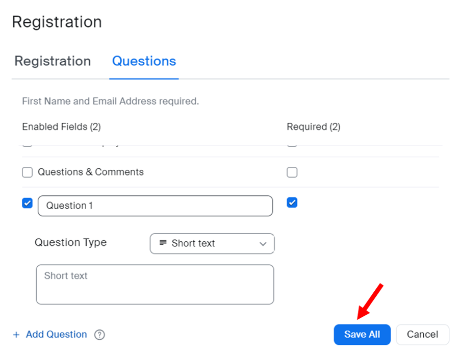{:.medium}
   1. 続けて表示される画面で，オリジナルの質問が表示されていることを確認してください．
      すでに作成したオリジナルの質問を編集したいときは，右に表示されているペンのアイコンを押してください．
      オリジナルの質問を削除したいときは，ゴミ箱のアイコンを押してください．
1. 「すべて保存」ボタンを押してください．

### 参加希望者が登録用ページでフォームに入力した内容を閲覧する

ここでは，参加希望者が登録用ページでフォームに入力した内容を確認する方法について説明します．

#### 登録した参加希望者ごとに回答を確認する方法

ここでは特定の参加者の回答を閲覧する方法について説明します．

1. Web ブラウザで[Zoomのミーティングページ](https://u-tokyo-ac-jp.zoom.us/meeting/)へ移動してください．
1. 自分のスケジュールしたミーティングが，リストとして表示されます．登録者の回答を閲覧したいミーティングの名前を押してください．
   {:.medium}
1. ミーティングの情報が表示されます．上の方に「登録」「メール設定」等のタブが並んでいます．「登録」タブを選択してください．
   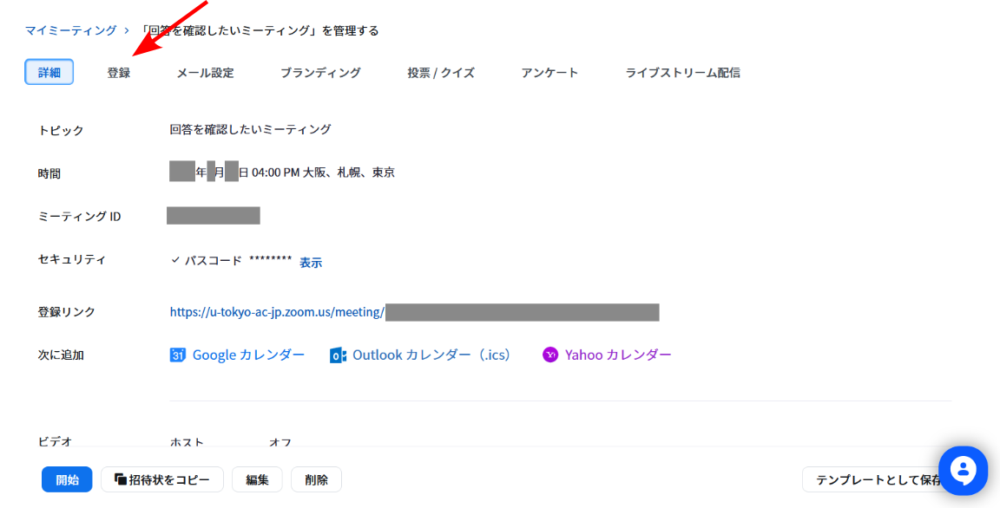{:.medium}
1. 「登録者を管理」欄の右側にある「表示」（手動承認を有効にしている場合は「編集」）ボタンを押してください．
   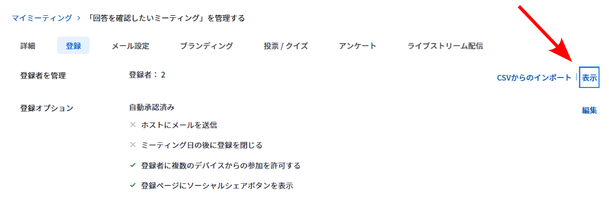{:.medium}
1. 登録手続きをした参加希望者の一覧が表示されます．
1. 回答の内容を確認したい参加希望者の名前を押してください．
1. 参加希望者が入力した内容が表示されます．

#### 回答の一覧を取得する方法

ここでは回答の一覧を取得する方法について説明します．

1. Web ブラウザで[Zoomのミーティングページ](https://u-tokyo-ac-jp.zoom.us/meeting/)へ移動してください．
1. メニューから「レポート」を選択してください．
   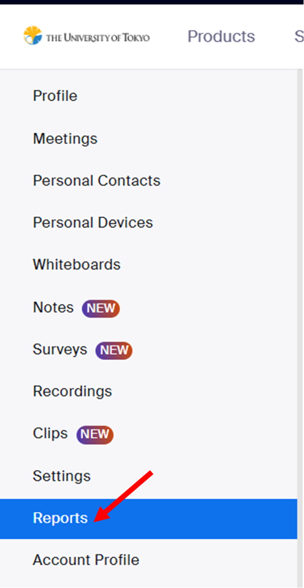{:.medium}
1. 「使用状況レポート」タブを選択してください．

    ※通常は，初めから「使用状況レポート」タブが選択されています．
   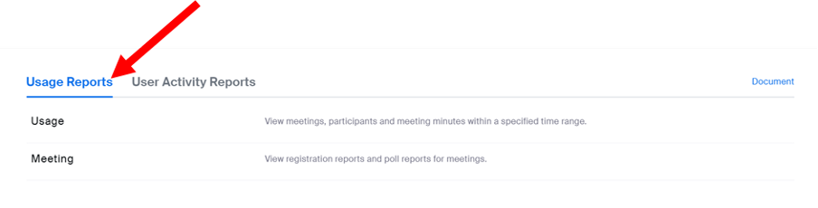{:.medium}
1. 「ミーティング」を押してください．
   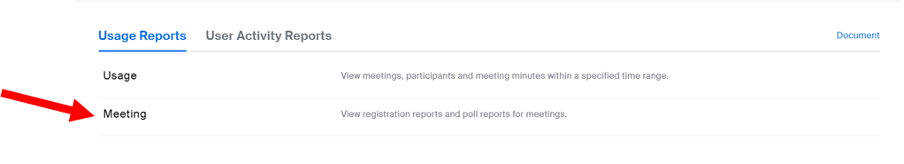{:.medium}
1. ミーティングの一覧が表示されます．集計結果を見たいミーティングを探し，右側にある「作成」ボタンを押してください．
   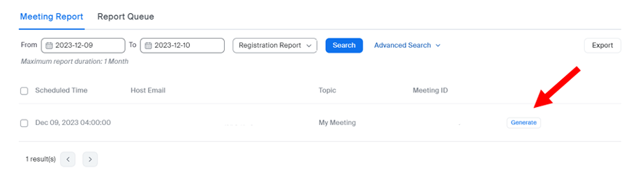{:.medium}
1. 続けて表示される画面で，集計の対象となる参加希望者を選択してください．「すべての登録者」，「承認済みの登録者」，「拒否された登録者」から選択し，「続行」ボタンを押してください．
   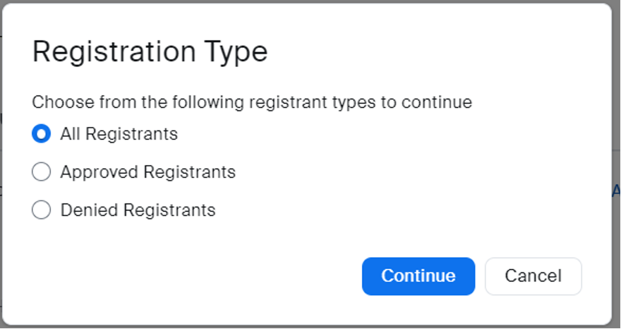{:.medium}
1. 自動的に「レポートキュー」の画面に移動します．
1. 集計結果を見たいミーティングを探し，右側にある「ダウンロード」ボタンを押してください．
   {:.medium}
1. 集計結果が出力されます．

### 定期的なミーティングで参加希望者に事前登録を求める

ここでは，定期的なミーティングで，事前登録機能を使用する方法について説明します．
既に作成された定期的なミーティングで事前登録機能を使用する場合は，手順1から操作をしてください．
新しく定期的なミーティングを作成する場合は，ミーティングを作成する画面のまま，手順5から操作してください．
定期的なミーティングを作成する方法は，[（Zoom 教員編）複数回利用できる URL が変わらない会議室を予約する](/zoom/create_room/date_and_time/)を確認してください．

1. Web ブラウザで[Zoomのミーティングページ](https://u-tokyo-ac-jp.zoom.us/meeting/)へ移動してください．
1. 自分のスケジュールしたミーティングが，リストとして表示されます．事前登録機能を有効にしたい定期ミーティングの名前を押してください．どの回の項目を押しても構いません．
   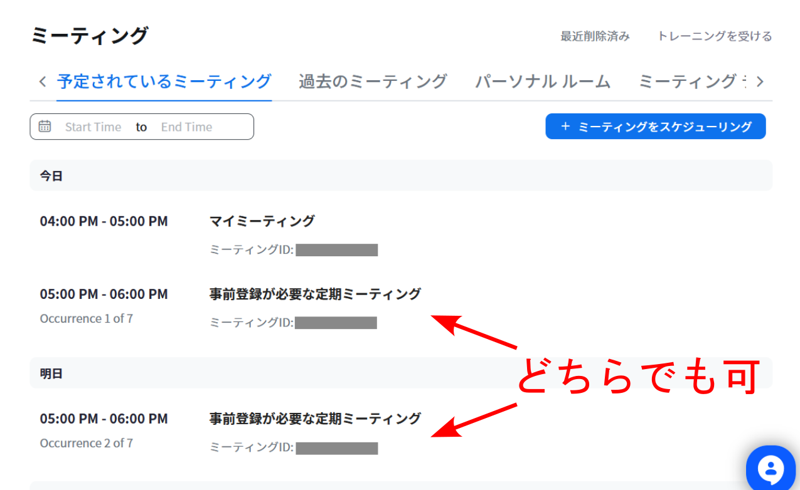{:.medium}
1. 「編集」ボタンを押してください．
   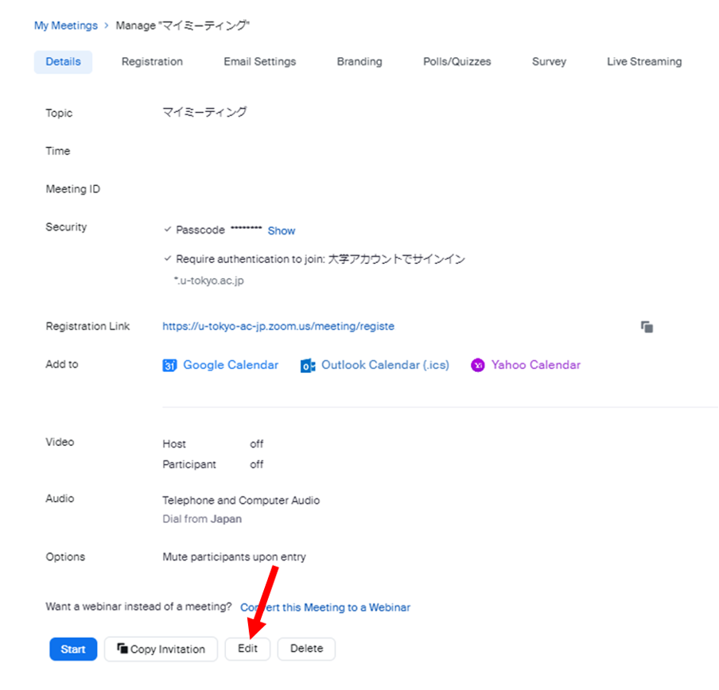{:.medium}
1. 「定期的なウェビナーを編集」という画面が表示されます．「すべての定期開催を編集」ボタンを押してください．
1. 「登録」の「必須」チェックボックスをオンにしてください．
   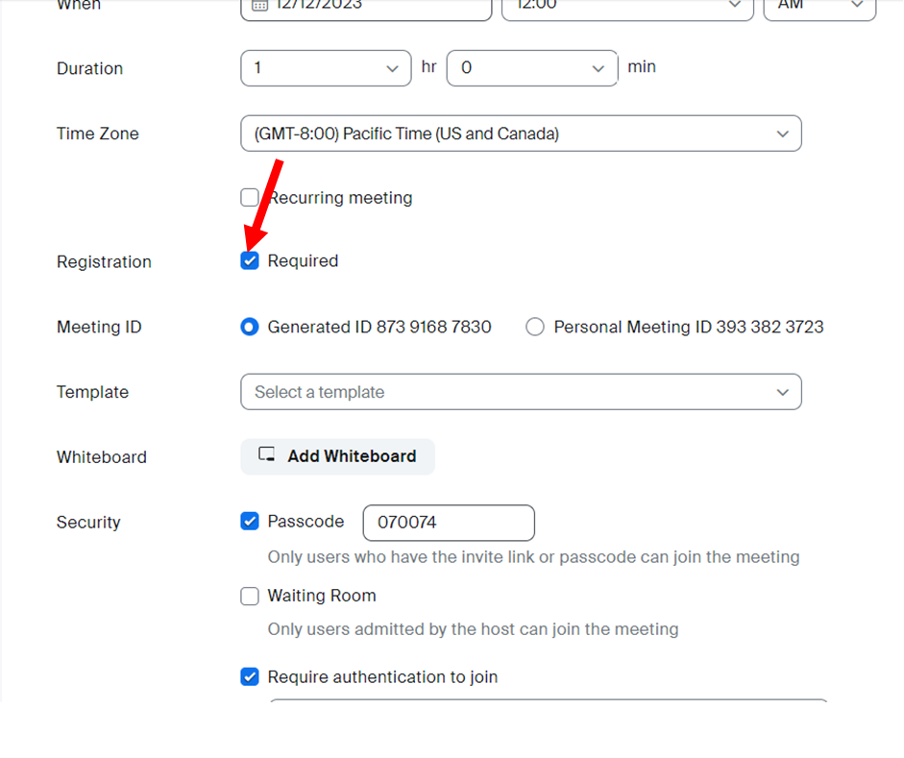{:.medium}
1. 「必須」チェックボックスをオンにすると下に三つの選択肢が表示されます．一つ選択してください．
   -  **出席者は一度登録するとすべての定期的なウェビナーに出席可能**：参加希望者は一度登録手続きをすれば，全ての回に参加できます．
   -  **出席者は出席する定期的なウェビナーごとに登録が必要**：参加希望者は，毎回登録手続きをする必要があります．
   -  **出席者は一度登録すると出席する定期的なウェビナーを 1 つ以上選択可能**：参加希望者は，どの回に参加登録をするか選べます．
1. 「保存」ボタンを押してください．

### 終了予定時刻を過ぎた時点で登録を締め切る

ここでは，終了予定時刻が過ぎた時点で登録手続きを受け付けないようにする方法について説明します．

1. Web ブラウザで[Zoomのミーティングページ](https://u-tokyo-ac-jp.zoom.us/meeting/)へ移動してください．
1. 自分のスケジュールしたミーティングが，リストとして表示されます．終了予定時刻が過ぎた時点で登録手続きを受け付けないようにしたいミーティングの名前を押してください．
   {:.medium}
1. ミーティングの情報が表示されます．上の方に「登録」「メール設定」等のタブが並んでいます．「登録」タブを選択してください．
   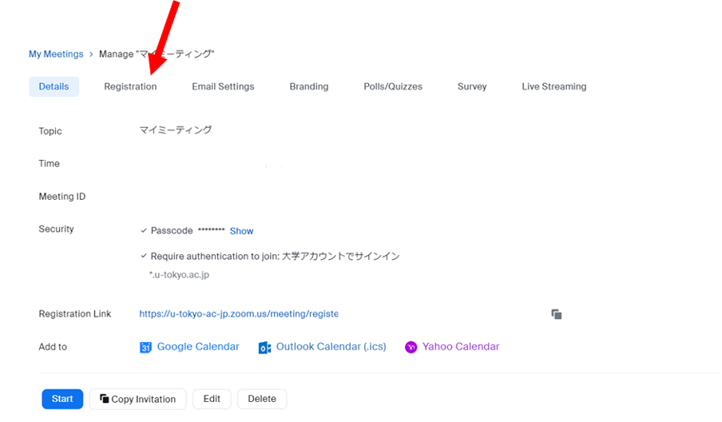{:.medium}
1. 「登録者を管理」欄の右側にある「編集」ボタンを押してください．
   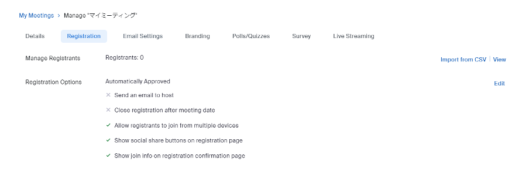{:.medium}
1. 「ミーティング日の後に登録を閉じる」チェックボックスをオンにしてください．
   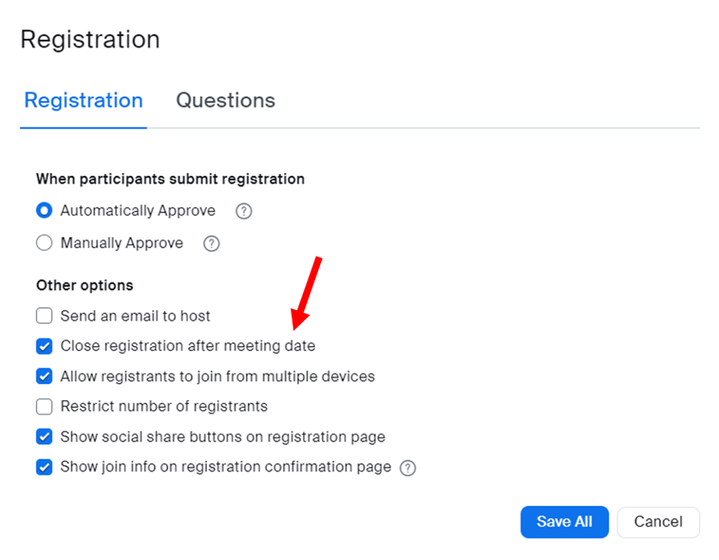{:.medium}
1. 「すべて保存」ボタンを押してください．

### 登録用のウェブサイトにオリジナルのバナーやロゴを表示する

ここでは，登録用ページにオリジナルのバナーやロゴを加える方法について説明します．

1. Web ブラウザで[Zoomのミーティングページ](https://u-tokyo-ac-jp.zoom.us/meeting/)へ移動してください．
1. 自分のスケジュールしたミーティングが，リストとして表示されます．バナーやロゴを登録用ページに追加したいミーティングの名前を押してください．
   {:.medium}
1. ミーティングの情報が表示されます．上の方に「登録」「メール設定」等のタブが並んでいます．「ブランディング」タブを選択してください． 
   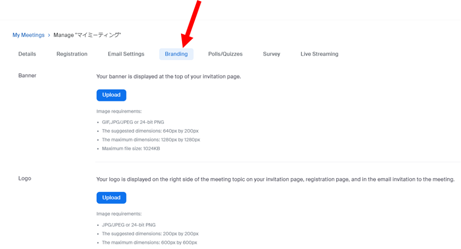{:.medium}
1. バナーやロゴの画像をアップロードしてください．正常にアップロードされると，バナーの画像が表示されます．
1. これで，登録用ページにバナーやロゴが表示されるようになります．
