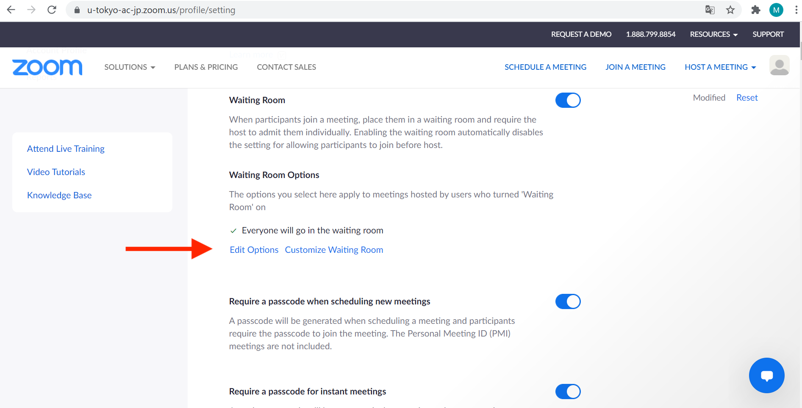
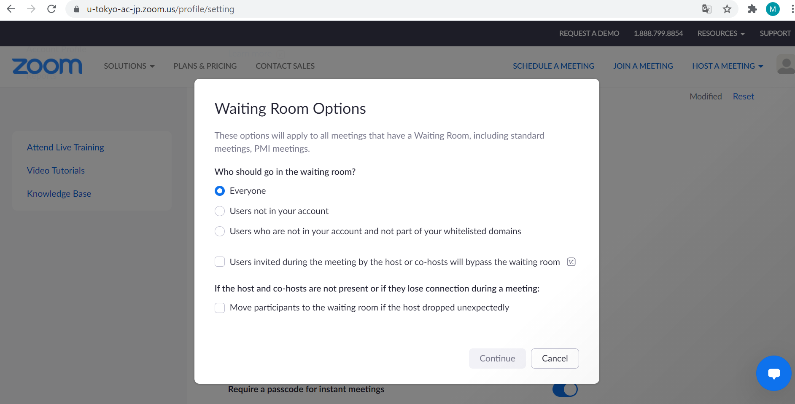
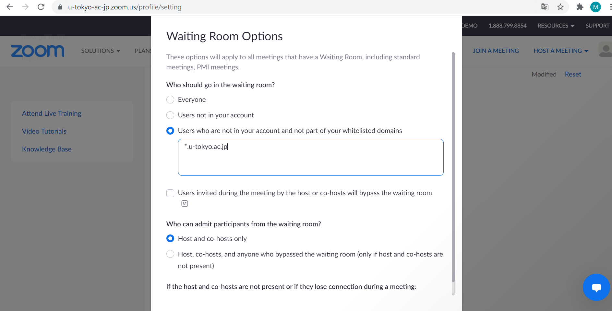

The Waiting Room feature enables hosts to first place meeting participants in a waiting room and then explicitly allow them to enter the meeting room.

The host can customize when a participant joins the meeting in the Zoom Settings page.
Below are some options.
* Admit all participants in the Waiting Room before entering the meeting room
* Allow participants with UTokyo Zoom Account domains to bypass the Waiting Room. Such settings are shared among all meetings. Please double check if the settings are in place before starting a meeting.

For details on how to set up a Zoom meeting, please refer to [Scheduling a Zoom Meeting (Web Portal)](..).
For recommendations on meeting room settings for online classes, please see [Restricting Access to Zoom Meeting Rooms for Online Classes](/en/faculty_members/zoom_access_control).

## Setup Procedure
1. In your web browser, go to the [Zoom Settings page](https://u-tokyo-ac-jp.zoom.us/profile/setting).
{:.medium}
2. In the “Waiting Room Options”, click “Edit Options”.
{:.medium}
3. Select the appropriate option for “Who should go into the waiting room?”
    * **”Everyone”**: All participants will be placed in the Waiting Room before entering the meeting room. This option is best for interviews, examinations, and one-on-one meetings.
    {:.medium}
    * **”Users not in your account”**: Participants signing into Zoom with their UTokyo Account (account using the email address <code>@utac.u-tokyo.ac.jp</code>) will be automatically admitted to the meeting room without entering the Waiting Room.
    * **”Users who are not in your account and not part of your whitelisted domains”**: Participants signing into Zoom with their UTokyo Account and participants signing in with email addresses of a specific domain will be automatically admitted to the meeting room without entering the Waiting Room. For online classes, it is recommended that you select this option and enter <code>*.u-tokyo.ac.jp</code>  as the whitelisted domain.
    {:.medium}
