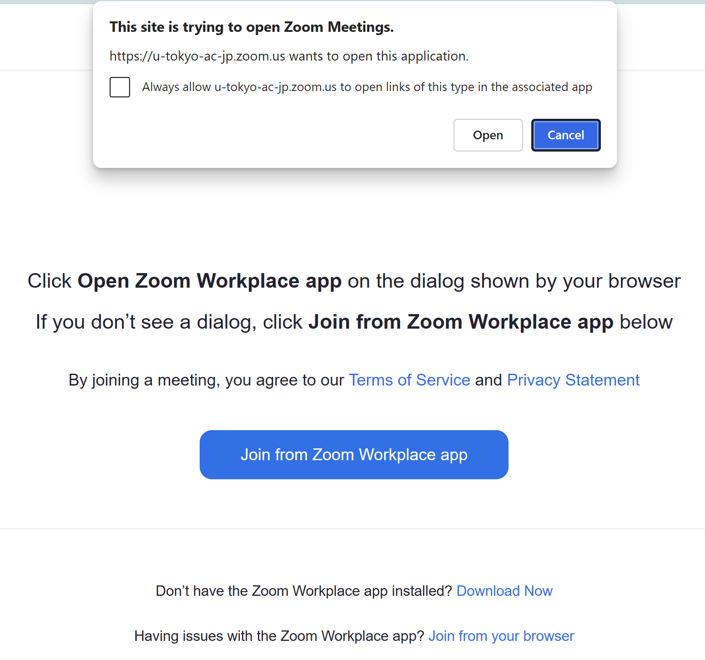
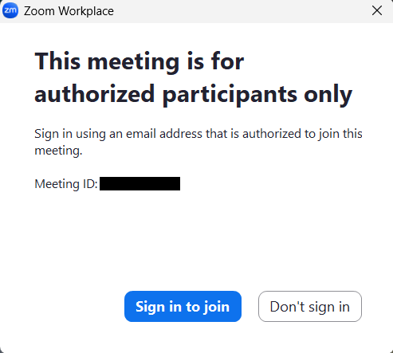
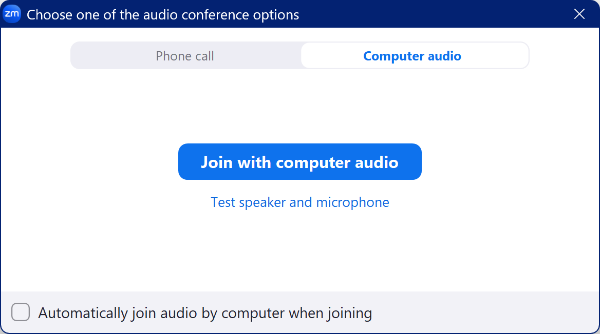
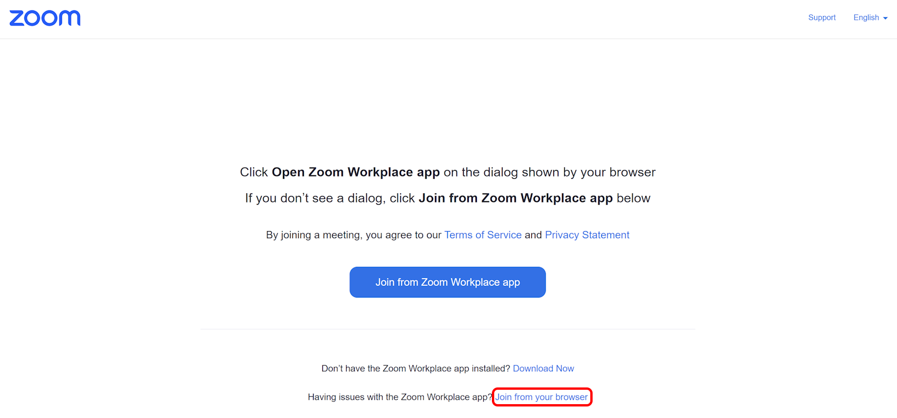
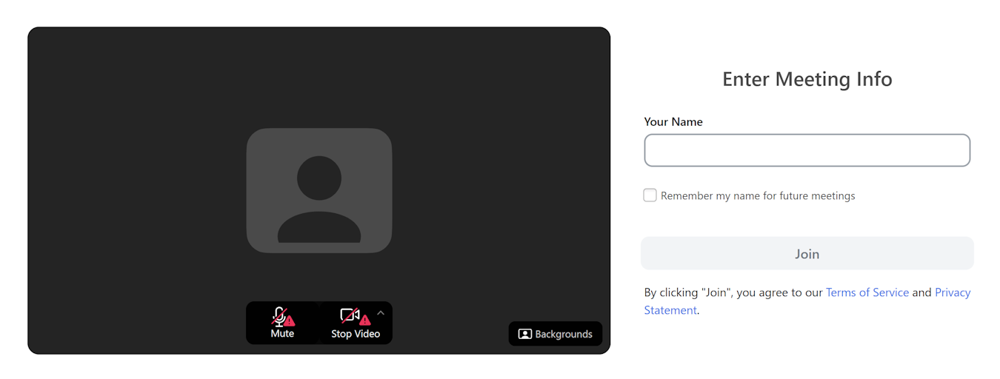
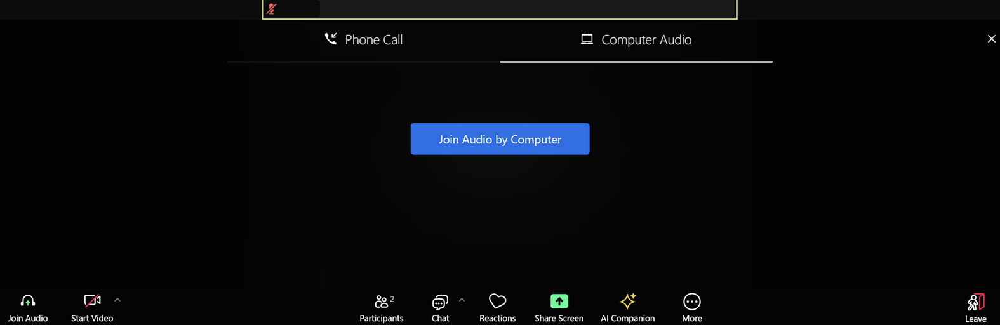
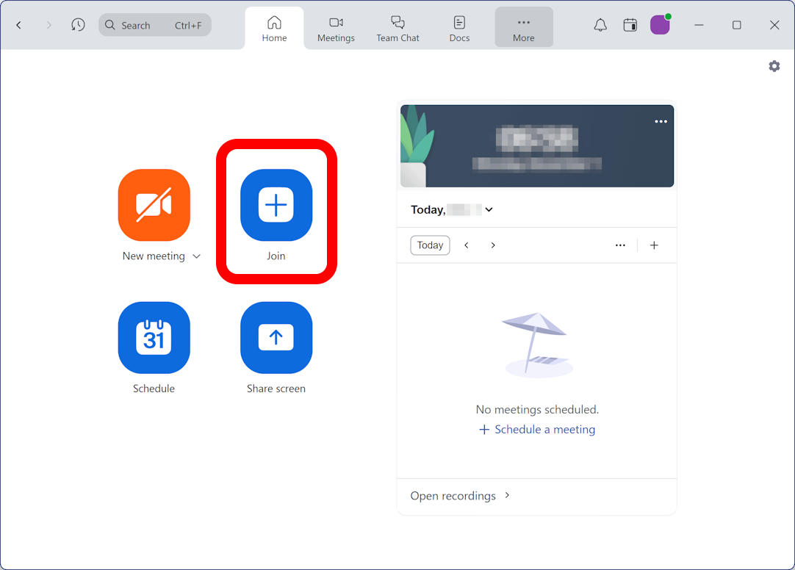
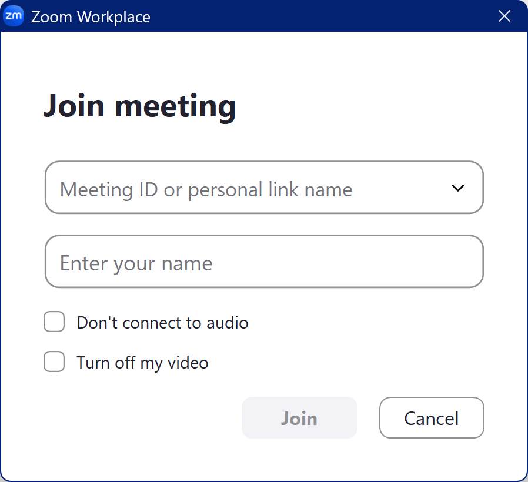
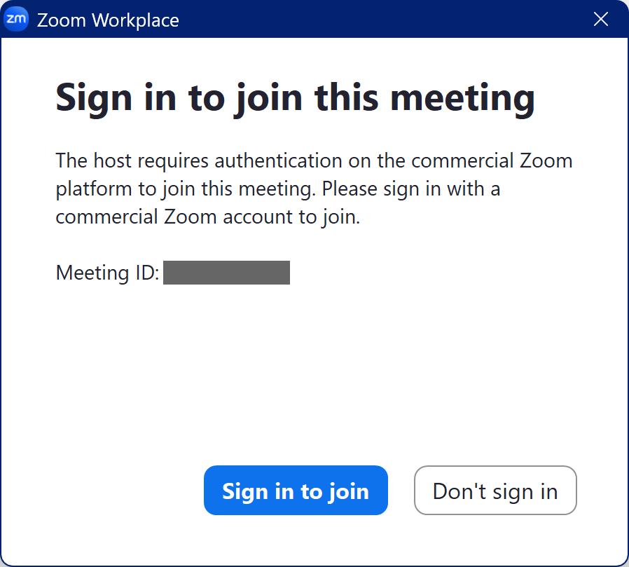
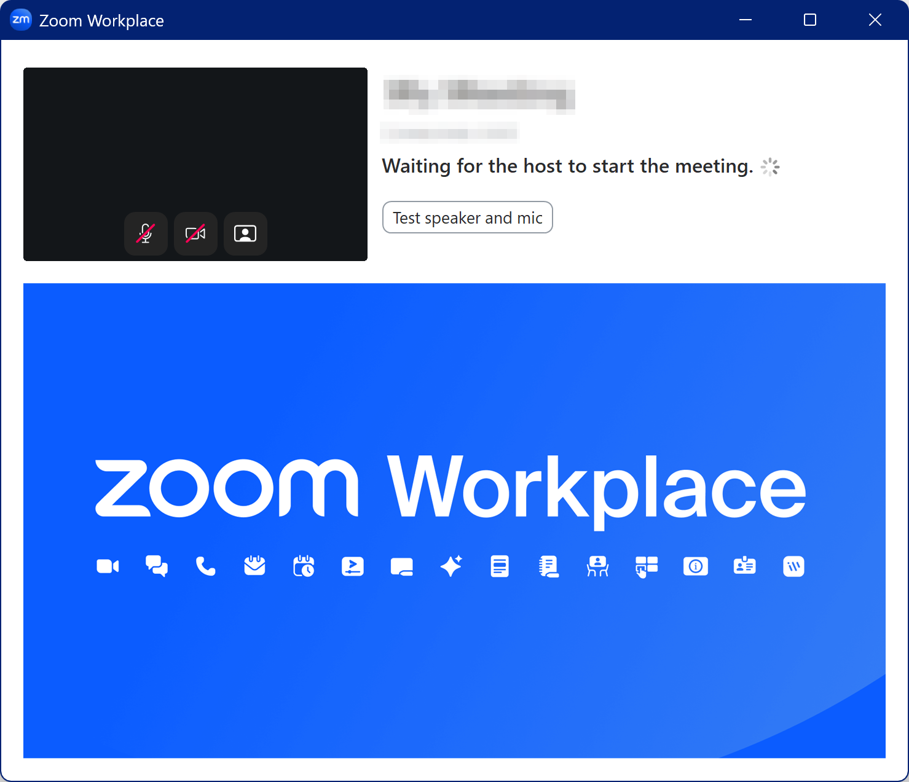

This page explains how to join a Zoom meeting. To join a Zoom meeting, you typically use either the meeting's "Meeting ID" or the invitation URL. The steps for joining differ depending on which method you use.

When joining a Zoom meeting, there are several cases where additional steps are required. Specifically, these include situations where you are prompted to enter a passcode or are required to sign in with your UTokyo Account when joining. This guide will cover these cases while explaining step-by-step how to join a Zoom meeting.

## How Meeting IDs, Passcodes, and URLs Work
{:#meeting-url}

Zoom meetings are identified by a number called the Meeting ID. To join a meeting, you generally need to know the Meeting ID and use it to access the meeting. Alternatively, Zoom provides invitation URLs that have the Meeting ID embedded within them. Using these URLs allows you to access the meeting directly without needing to know the Meeting ID itself.

At the same time, many meetings have additional security settings that make simply knowing the meeting ID insufficient to join. The most common example is requiring a passcode. However, when joining a meeting using a URL, the passcode information is often embedded within the URL itself. In such cases, you can skip entering both the meeting ID and the passcode. Because this "URL with embedded passcode information" is frequently used, you might not notice these security mechanisms in everyday use. Nevertheless, it's helpful to understand how this system operates.

## How to Join a Meeting
{:#procedure}

There are two main methods to join a Zoom meeting: [by accessing the invitation URL](.#procedure-url) or [by entering the meeting ID and passcode directly into the app](.#procedure-id-passward). This section explains the specific steps for each method.

Note: While the steps described here are primarily for joining from a PC, they are largely the same for smartphones and other devices. If you do not have the Zoom app installed, please install it. For app installation instructions, refer to "[Zoom App Features and Usage](/en/zoom/misc/app/#install)".

### Joining a Meeting by Accessing an Invitation URL
{:#procedure-url}

1. Open the invitation URL in your browser. For example, a Zoom meeting URL created with a UTokyo account typically looks like `https://u-tokyo-ac-jp.zoom.us/j/9999999999?pwd=xxx...`. The `9999999999` part represents the meeting ID, and the `xxx...` part represents the passcode.
1. A page titled "Launch Meeting" will appear in your browser.
    - If the Zoom app is installed, a dialog box stating "This site is trying to open Zoom Meetings". will appear at the top of your browser. Click the "Open" button at the bottom. For instructions after launching the app, see the "[Using the App](.#procedure-app)" section.
    {:.border}
    - If the Zoom app is not installed, the "This site is trying to open Zoom Meetings". dialog box will not appear. How to join a Zoom meeting without the app is detailed later in the "[Using the Browser](.#procedure-browser)" section.

#### Using the App
{:#procedure-app}

After launching the app, you may be able to join the meeting immediately, or additional steps may be required. This section explains the typical additional steps that may be required when joining, as well as actions you can take after joining.

- You may see a screen that states "This meeting is for authorized participants only". If this screen appears, click "Sign in to join" and sign in to Zoom with your UTokyo Account. For sign-in instructions, refer to "[Sign-in Methods for Zoom](/en/zoom/signin/)".
{:.border .small}
- If a screen prompting "Enter meeting passcode" appears, enter the passcode.
- If prompted to connect to audio after joining the meeting, adjust your audio settings and click "Join with computer audio".
{:.small}

#### Using the Browser
{:#procedure-browser}

If you haven't installed the app, or if the app is installed but won't open, consider joining the meeting from your browser using the steps below.

1. At the bottom of the screen shown below, click "Join from your browser".
{:.border}
    - You may see a screen that states "Sign in to join this meeting". If this screen appears, click "sign in" and sign in to Zoom with your UTokyo Account. For sign-in instructions, refer to "[Sign-in Methods for Zoom](/en/zoom/signin/)".
    {:.border}
    - If a screen prompting "Enter meeting passcode" appears, enter the passcode.
1. You will see a screen to configure your display name, audio, and video for the meeting. If you are not signed in, enter the name that you wish to be displayed to participants in the meeting. If you are signed in, your name will be entered automatically. Set your audio device and toggle the mute and video buttons on/off, then click "Join".
{:.border}
1. If the "Join Audio by Computer" screen appears when joining the meeting, click "Join Audio by Computer". You can then join Zoom with the audio settings configured in step 2.

  
### Joining a Meeting by Entering the Meeting ID and Passcode
{:#procedure-id-passward}

1. Launch the Zoom app and click the "Join" button.

1. A "Join Meeting" screen will appear. Enter the meeting ID in the "Meeting ID or personal link name" field. If you are not signed in, enter the name that you want displayed to participants in the meeting. When finished, click "Join".
{:.small}
1. After clicking "Join", you may enter the meeting immediately, or additional steps may be required. If you cannot enter the meeting directly, complete the following steps based on which screen appears.
    - You may see a screen that states "Sign in to join this meeting". If this screen appears, click "Sign in to join" and sign in to Zoom with your UTokyo Account. For sign-in instructions, refer to "[Sign-in Methods for Zoom](/en/zoom/signin/)".
    {:.small}
    - If a screen prompting "Enter meeting passcode" appears, enter the passcode.
    - If prompted to connect to audio after joining the meeting, adjust your audio settings and click "Join with computer audio".
    {:.small}

## Additional notes
{:#supplement}

### Important Notes When Joining a Meeting as a Host
{:#supplemet-as-host}

This section explains important considerations when joining a meeting as a host. As previously mentioned, you may be unable to join a meeting if you are not signed in with your UTokyo Account. Additionally, not being signed in to your Zoom account may disrupt the meeting's progress.

For example: When the meeting creator joins using the account they created the meeting with, they are automatically assigned the role of "host". Similarly, if someone was designated as an "alternative host" by the meeting creator, joining with the designated account will assign them either the "host" or "co-host" role. If not signed in, they will not be treated as a host when joining the meeting. Instead, the following screen may appear, and the meeting may not start.

{:.center .medium}

Additionally, if no one is signed in to the account that created the meeting or to an alternative host account, there will be no host or co-host, which may disrupt the meeting's progress. As such, please keep all this in mind when joining a meeting as a host or co-host.
