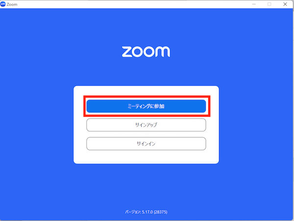

In this section we explain how to join a meeting room.  
There are two available ways: using a URL（`https://zoom.us/j/xxxxxxxxxx` x are numbers）provided by the host; or entering a 9-10 digits ID also provided by the host.

## Joining with a URL
1. Access the meeting room URL (`https://zoom.us/j/xxxxxxxxxx` x are numbers）
1. Press "Open Zoom Meetings" on the Web browser (if Zoom is yet not installed, you can download and install it from this screen)  

   
    
1. Set a name (in case you did not do it yet)

  
    
1. You can choose to join with or without video (in case you have a camera and the meeting is set to show the video preview dialog)  
  
  
1. Select "Join with Computer Audio" (if the audio settings are not set by the host)  
  
  
Congrats! You have joined the meeting!

## Using an ID
1. Start Zoom
1. Press "Join Meeting"
  
  
1. Enter the meeting ID (9-10 digits) in ①, enter you name in ②, and press "Join" (in case a password has been set, ask the host for it)

  
  
1. You can choose to join with or without video (in case you have a camera and the meeting is set to show the video preview dialog)    
  
1. Select "Join with Computer Audio" (if the audio settings are not set by the host)    
  
  
Congrats! You have joined the meeting!

