## Introduction
{:#overview} 
This page provides an introduction to the basic usage and useful features of the Zoom application. Zoom can be used from the browser as well as from the app, but when used from the browser, there are limitations in terms of functionality and usability. It is more comfortable to use the Zoom app. In this article, first, we explain how to install the desktop app for PC, and the basic operations, e.g., making and editing meetings. Then, we briefly explain the app for smartphones and other mobile devices and finally, we also show you how to switch meetings you are participating in between multiple devices.  

## How to install the app for PC
{:#install} 
To use the app, you first need to install it.
There are two ways to install the Zoom app: in advance, or when joining a meeting.

### Installing in advance
{:#install-before}
1. Please access the "[Download Center](https://zoom.us/download)” from the Zoom website.

2. Please press the "Download” button in "Zoom Workplace”. The Zoom Workplace installer will be downloaded ("Zoom Workplace” is the name of the app for using Zoom).
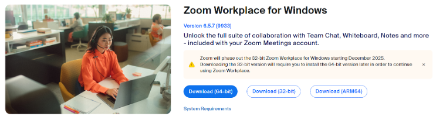{:.border .medium}
{:.border .medium}
4. Following steps vary depending on the situation. Sometimes the installation proceeds automatically to completion, while other times you may need to go through operations that require pressing of confirmation buttons or opening the downloaded files yourself. 
  
### Installing when you participate in a meeting
{:#install-on-join}
1. Please access the meeting URL.
2. When the Zoom app is not installed, the files you need are downloaded automatically. If it is not downloaded, the following screen appears and you can download them by pressing "Download Now”.
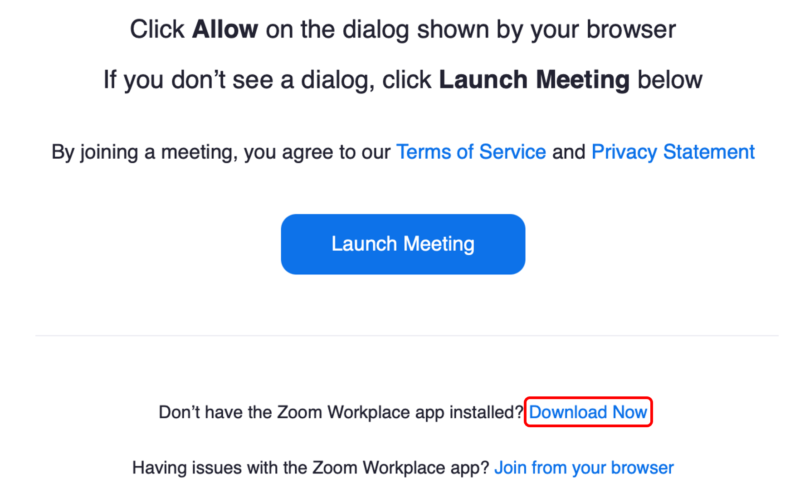{:.border .medium}
3. Please open the files you downloaded and install Zoom.

### Sign in using your UTokyo Account
{:#signin}
Once you have installed the Zoom app, please refer to the "[Sign-in Method for Zoom](/en/zoom/signin/#app)” and sign in using your UTokyo Account.

## How to create meetings on the app
{:#create}
When you hold a meeting, it is convenient to create the meeting using the app. Here, we explain how to create a meeting in advance and how to start it immediately using the app. Some settings, such as the whiteboard feature and pre-assigning breakout rooms, are not available. So, if you want to configure detailed settings, please create a Zoom meeting from your browser using the method described in “[Scheduling a Zoom Meeting](/en/zoom/create_room/)”.

### Create a meeting in advance
{:#create-schedule}
If the date and time of a meeting are already determined, you can create the meeting in advance.
1. Open the Zoom app.
2. Press "Schedule”．  
   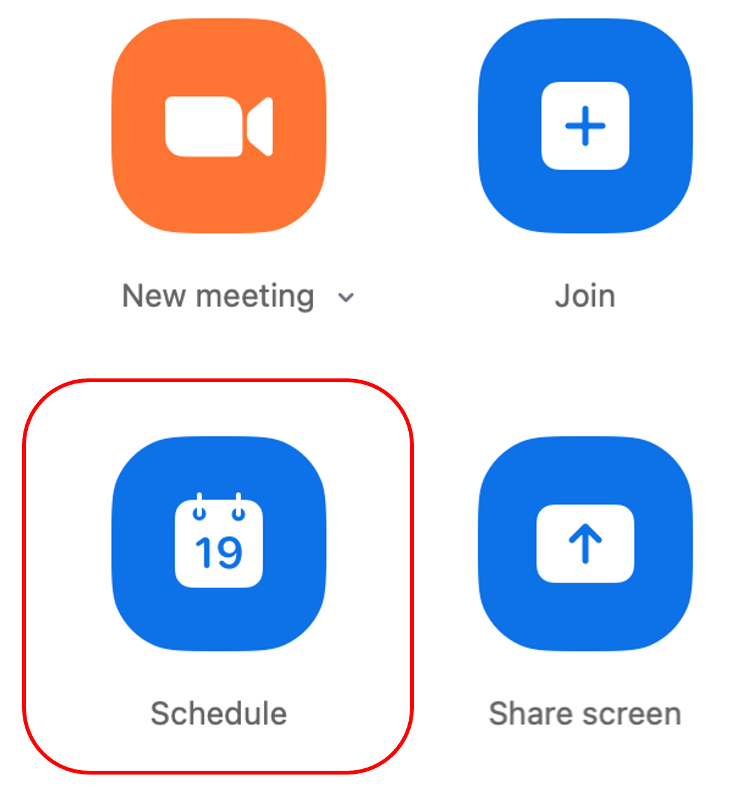{:.border .medium}
3. Please set up information for a meeting. Details of settings for a meeting are shown in the "[Scheduling a Zoom Meeting](/en/zoom/create_room/#settings)” pages.  
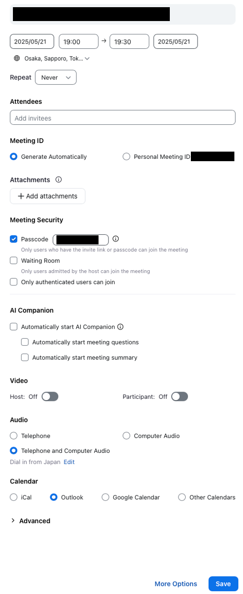{:.border}
4. Press "Save” in the lower right corner. In the previous screen, if you selected “Other calendars” for “Calendar”, a screen such as that shown below will appear. Select the meeting URL, meeting ID, passcode, e.g., listed under “Join Zoom Meeting” and notify the participants by e-mail.
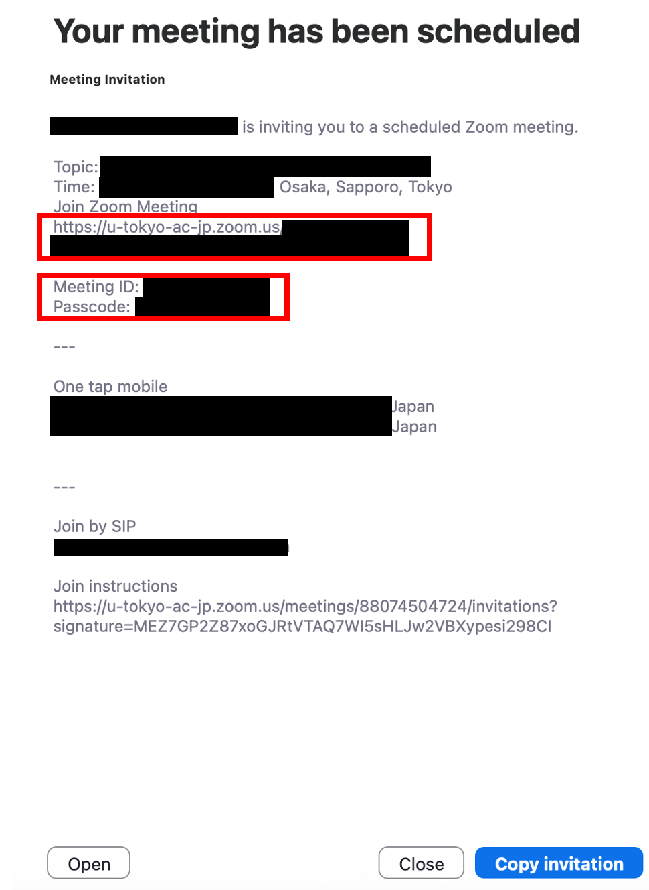{:.border}

### Start a meeting immediately
{:#create-now}
If you have an urgent meeting, you can set up a meeting immediately.

1. Open the Zoom app.
2. Press "New Meeting”. There are two types of meeting IDs used in this case: 
a random meeting ID (11 digits) and the “Personal Meeting ID” (10 digits). By default, a random meeting ID is newly generated each time and becomes invalid immediately after the meeting. On the other hand, if you want to use your personal meeting ID, please press the "∨” next to "New Meeting” and check "Use my personal meeting ID”.
  * The personal meeting ID is a meeting ID that is uniquely assigned to each user as meetings for personal use. One advantage is that you don’t need to send out an invitation if the other person already knows your personal meeting ID. However, if you do not set up a lock for the meeting, or use the waiting room feature, people who know your personal meeting ID can enter the room even when you are using a meeting for other purposes, so you need to be careful.
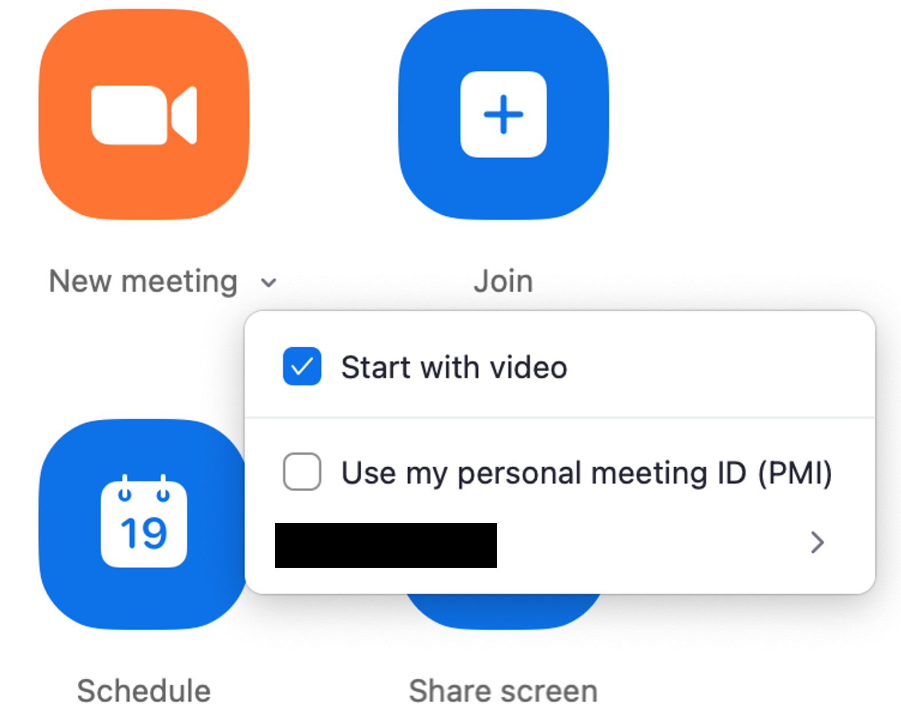{:.border}
3. When the meeting starts, notify the participants by pressing “^” next to “Participants” on the meeting screen and “Copy invite link” or by “Copy Link” from the green shield symbol at the top of the meeting screen and sending the link to the participants.
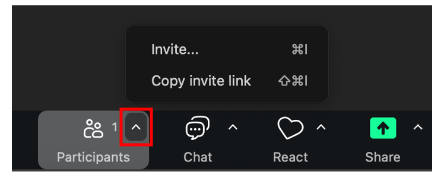{:.border}
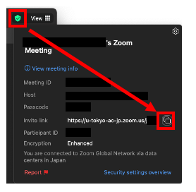{:.border}

## Confirmation and editing of a meeting on the app
{:#manage}
You can confirm the created meeting from “Meetings” at the top of the app screen, and copy the invitation link as well as edit the meeting.
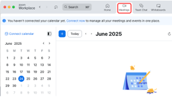{:.border}  
On the day of the meeting, a screen like the image below will appear in the “Home” page. You can copy the invitation link and edit the meeting from “...”.
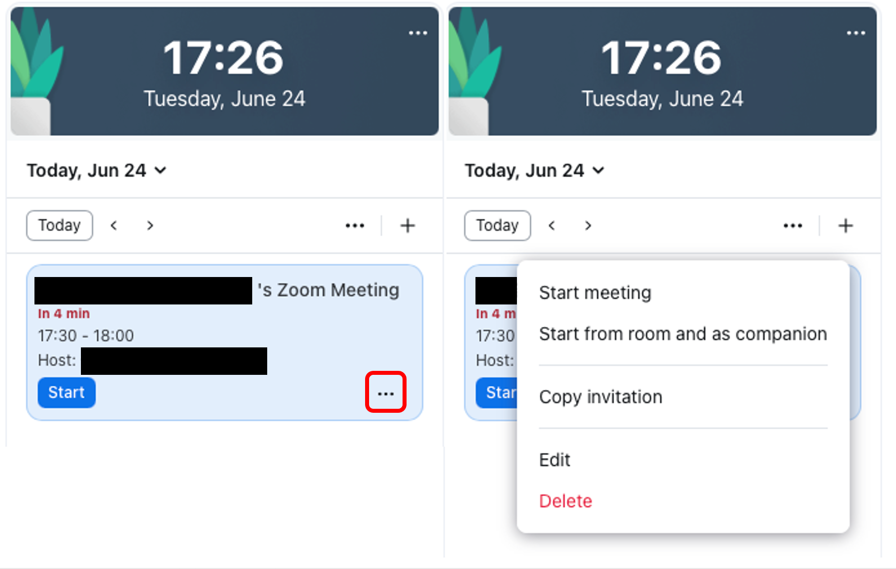{:.border}

## Recommended settings in the app
{:#settings}
Press the gear icon in the upper right corner of the home screen to display a window where you can set up each setting of the app. Here are some recommended settings that can improve your experience with the Zoom app.
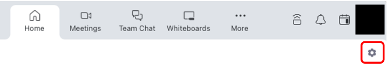{:.border}

### Video
{:#settings-video}
* **When you join, turn off your video**：by checking the box, your video is automatically turned off when you join a meeting.
* **When you join, always show video preview dialog**：by checking the box, you can confirm the video on/off and the image being displayed when you join a meeting.

### Audio
{:#settings-audio}
* **When you join, automatically connect to audio on your computer**：by checking the box, you can save yourself the trouble of confirming the dialog for the audio selection as shown in the image below when you enter a meeting.
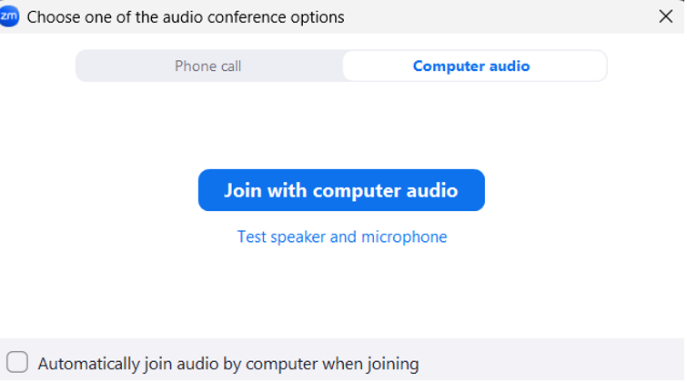{:.border}
* **When you join, mute the microphone**：by checking the box, your microphone will be automatically turned off when you join a meeting.

## Updating your version
{:#update}
The Zoom app is regularly updated with new versions, where new feature functions are added or bugs are fixed. In addition, Zoom applications older than a particular version sometimes become unavailable. To make your Zoom app safer and more comfortable to use, please update it regularly.

### Steps to update
{:#update-steps}
From the icon on the home screen, please press the “Check for updates”. Then, a check starts to confirm whether or not you have the latest version. When the latest version is already installed, the message "You are up to date” is displayed. When a newer version is available, the message“A newer version of Zoom is available” is displayed. Please press “Update Now” to install the latest version.
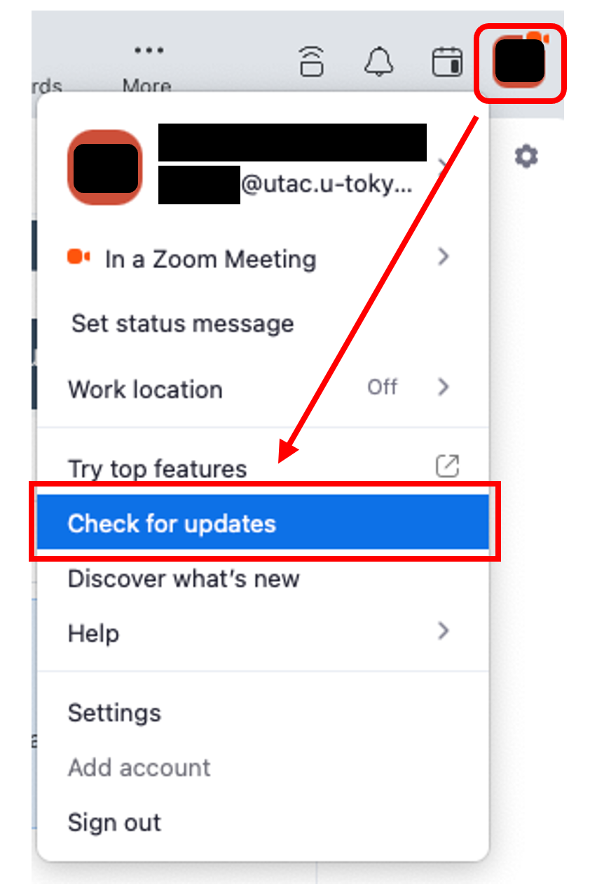{:.border}  
{:.border}

Also, it is useful to set your settings for automatic updates. Press the gear icon in the upper right corner of the home screen to open the settings window, and by checking the box for “Update app automatically” in the “General” section, automatic updates are enabled. In this way, when a newer version of Zoom becomes available, a message that prompts updating as shown in the image below is displayed.
{:.border .medium}  
When the message appears, if you press “Later” or close the window, when you next launch the application, the update program is automatically installed, and the following message is displayed.
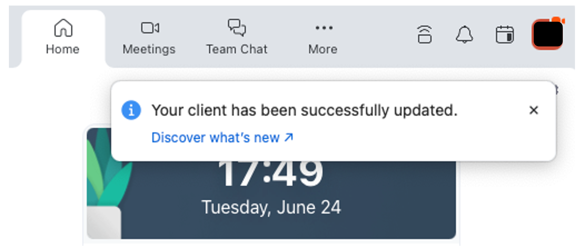{:.border}

## About the app for mobile devices
{:#mobile}
We have explained the desktop app until now, here, we will explain about the mobile app.
### Installation
{:#mobile-install}
You can download the mobile app "Zoom Workplace” from the application store.
1. Please open the “App Store” for the iOS version or “Google Play Store” for the Android version.
2. Please enter “zoom” in the search window and search.
3. Please download the app named “Zoom Workplace”. You should be careful that other apps with the name “Zoom” or similar fake apps may be displayed.

You can also open the app store from the “[Download Center](https://zoom.us/download)” on the official website. By going through the official website, you can avoid downloading the wrong apps.
{:.border}
You need to sign in when you start using the app. Please refer to the “[Sign-in Methods for Zoom](/en/zoom/signin/#app)” and sign in with your UTokyo Account similar to the desktop application.

### Differences between the mobile and desktop apps
{:#mobile-vs-desktop}
Among the differences in functionality between mobile and desktop apps, notable ones are listed below.

* **Polling Feature** (reference pages: [Polls in Zoom](/en/zoom/usage/poll/)): The desktop app allows you to create a poll/quiz on the app, but if you have not created a poll in advance, the mobile app will create the poll in the browser by pressing “Poll/Quiz” > “Create”.
* **Breakout room** (reference pages: [Using the Zoom breakout room function](/en/zoom/usage/breakout/)): It is not possible to create a breakout room from the mobile app. Therefore, if you want to create a breakout room, please use the desktop app. However, it is possible to participate in a breakout room via the mobile app.
* **The Recording Feature** (reference pages: [Recording Zoom Meeting](/en/zoom/usage/recording/)): computer recording is not available in the mobile app.

## Switching devices
{:#device-switch}
While participating in a Zoom meeting, you can switch devices without interrupting your participation in the meeting. You can smoothly switch between devices such as a smartphone and a PC, or a PC and another PC.

### Sign in on multiple devices
{:#multi-device-signin}
To switch devices, you need to sign in on the PC, smartphone, or other devices to which you are switching to using the same account with the original device before switching. You can sign in using up to 5 computers, 5 smartphones, and 5 tablets at the same time.

### Procedure for Switching Devices
{:#device-switch-steps}
1. Please launch the Zoom app on the device you are switching to during the meeting.
2. Please press the “Switch” button displayed on the screen. The device you were previously using will be automatically disconnected.
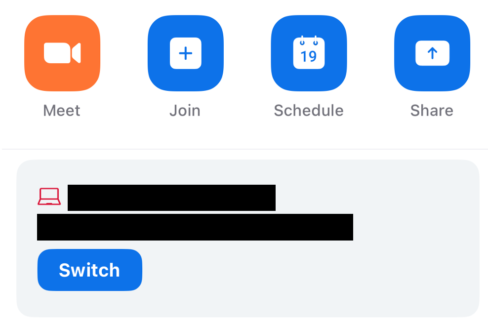{:.border}

Please be aware of the following features when switching devices.
- Chat Feature
  -	Contents of any chat before you switch devices will not be carried over.
-	Recording Feature
  - If anyone recording to the local device switches devices, the recording is stopped.
