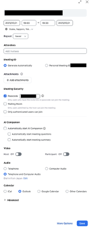
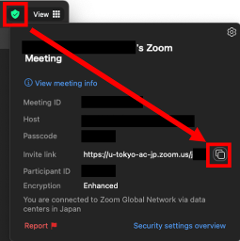
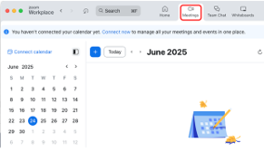
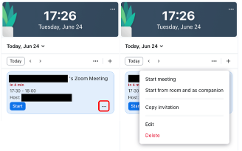
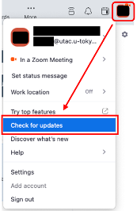
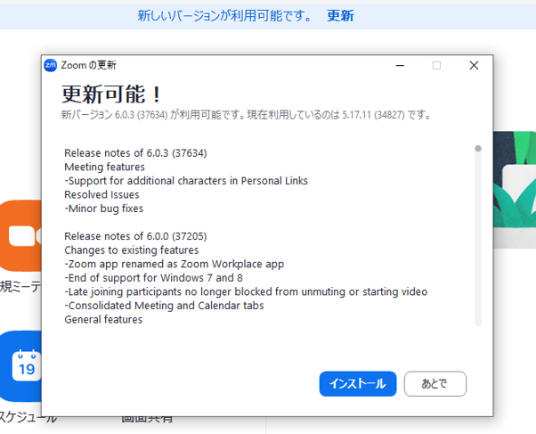

## Introduction
{:#overview} 
This page provides an introduction to the basic usage and useful features of the Zoom application. Zoom can be used from the browser as well as from the app, but when used from the browser, there are limitations in terms of functionality and usability. It is more comfortable to use the Zoom app. In this article, first, we explain how to install the desktop app for PC, and the basic operations, e.g. making and editing meetings. Then, we briefly explain the app for smartphones and other mobile devices and finally, we also show you how to switch meetings you are participating in between multiple devices. 

## How to install the app for PC
{:#install} 
To use the app, you first need to install it.  
There are two ways to install the Zoom app: in advance, or when joining a meeting.

### Installing in advance
{:#install-before}
1. Please access the "[Download Center](https://zoom.us/download)” from the Zoom website.

2. Please press the "Download” button in "Zoom Workplace”. The installer of Zoom Workplace will be downloaded ("Zoom Workplace” is the name of the app for using Zoom). 
{:.border .medium}
{:.border .medium}
3. Following steps vary depending on the case. Sometimes the installation proceeds automatically to completion, other times you may need operations that are pressing a confirmation button or opening the downloaded files yourself. 
  
### Install at the time you participate in a meeting
{:#install-on-join}
1. Please access the URL of a meeting.
2. When the Zoom app is not installed, the files you need are downloaded automatically, if not downloaded, the following screen appears and you can download them by pressing "Download Now”.
{:.border}
3. Please open files you downloaded and install Zoom.

### Sign in by UTokyo Account
{:#signin}
When you can install the Zoom app, please refer to "[Sign-in Method for Zoom](/zoom/signin/#app)” and sign in by UTokyo Account.

## How to create meetings by app
{:#create}
When you hold a meeting, it is convenient to create the meeting by app. Here, we explain how to create a meeting in advance and how to start it immediately by app. Some settings (such as the whiteboard function and pre-assigning breakout rooms) are not available, so if you want to configure detailed settings, please create a Zoom meeting from your browser using the method described in “[Scheduling a Zoom Meeting](/zoom/create_room/)”.

### Create a meeting in advance
{:#create-schedule}
If the date and time of the meeting are determined, you can create the meeting in advance.
1. Please open the Zoom app.
2. Please press "Schedule”．  
   {:.border .medium}
3. Please set up information for a meeting. We show the details of settings of the meeting in the "[Scheduling a Zoom Meeting](/zoom/create_room/#settings)” pages.  
{:.border}
4. Please press "Save” in the lower right corner. In the previous screen, if you selected “Other calendars” for “Calendar”, a screen such as the below image will appear. Select the meeting URL, meeting ID, passcode, e.g., listed under “Join Zoom Meeting” and notify the participants by e-mail e.g.  
{:.border}

### Start a meeting immediately
{:#create-now}
When you have an urgent meeting e.g., you can set up a meeting immediately.

1. Please open the Zoom app.
1. Please press "New Meeting”. There are two types of meeting IDs used in this case: 
a random meeting ID (11 digits) and “the Personal Meeting ID (10 digits)”. By default, a random meeting ID is newly generated each time and becomes invalid immediately after the meeting . On the other hand, when you want to use your personal meeting ID, please press "∨” next to "New Meeting” and check "Use my personal meeting ID”.
  * The personal meeting ID is a meeting ID that is uniquely assigned to each user as meetings for personal use. One advantage is that you don’t need to send out an invitation if the other person already knows your personal meeting ID.On the other hand, when you do not set up a lock of a meeting, or waiting room function, people who know your personal meeting ID can enter the room even when you are using a meeting for other purposes, so caution is required.  
{:.border}
3. When the meeting starts, by pressing “^” next to “Participants” on the meeting screen and “Copy invite link” or by “Copy Link” from the green shield symbol at the top of the meeting screen, please notify the participants.  
{:.border}  
{:.border .small}

## Confirmation and editing of a meeting on the app
{:#manage}
You can confirm the created meeting from “Meetings” at the top of the app screen, and copy the invitation link and edit the meeting.  
{:.border .medium}  
On the day of the meeting, a screen like the image below will appear in the “Home”. You can copy the invitation link and edit the meeting from “...”.  
{:.border .medium}

## Recommended settings in the app
{:#settings}
Press the gear icon in the upper right corner of the home screen to display a window where you can set up each setting of the app. Here are some recommended settings that can improve your experience with the Zoom app.  

{:.border}

### Video
{:#settings-video}
* **When you join, turn off your video**：by checking the box, when you join a meeting,  your video is automatically turned off.
* **When you join, always show video preview dialog**：by checking the box, when you join a meeting, you can confirm the video on/off and image.

### Audio
{:#settings-audio}
* **When you join, automatically connect to audio on your computer**：by checking the box, you can save yourself the trouble of confirming the dialog for selection of audio as shown in the image below when you enter a meeting.  
{:.border}
* **When you join, mute the microphone**：by checking the box, when you join a meeting, your microphone is automatically turned off.

## How to update your version
{:#update}
The Zoom app is regularly updated with new versions and new functions are added or bugs are fixed. In addition, the Zoom applications older than a particular version are sometimes unavailable. To make your Zoom app safer and more comfortable to use, please update it regularly.

### Update steps
{:#update-steps}
From the icon on the home screen, please press the “Check for updates”. Then, a check starts to confirm whether it is the latest version. When the latest version is already installed, "You are up to date” is displayed. When there is a latest version that can be installed, “A newer version of Zoom is available” is displayed. Please press “Update Now” to install the latest version.  
{:.border}  
{:.border}

Also, it is useful to set up settings for automatic updates once. Press the gear icon in the upper right corner of the Home screen to open the settings window, and by checking the box for “Update app automatically” in the “General” section, automatic updates are enabled. In this way, when a later version of Zoom is available, a message that prompts updating as shown in the image below is displayed.  
{:.border .medium}  
When the message appears, if you press “Later” or close the window, when you next launch the application, the update program is automatically installed and the following message is displayed.  
{:.border}

## About the app for mobile devices
{:#mobile}
We have explained the desktop app until now, here, we explain the mobile app.
### How to install
{:#mobile-install}
You can download the mobile app "Zoom Workplace” from the application store.
1. Please open “App Store” for the iOS version or “Google Play Store” for the Android version.
1. Please enter “zoom” in the search window and search.
1. Please download the app named “Zoom Workplace”. You should be careful that other apps with the name “Zoom” or similar fake apps may be displayed.

Also, You can open the app store from the “[Download Center](https://zoom.us/download)” on the official website. By going through the official website, you can prevent downloading the wrong apps
{:.border}
You need to sign in when you start using the app. Please refer to “[Sign-in Methods for Zoom](/zoom/signin/#app)” and sign in with your UTokyo Account as well as the desktop application.

### Differences between mobile and desktop apps
{:#mobile-vs-desktop}
Among the differences in functionality between mobile and desktop apps, we list notable ones.

* **Polling Function**(reference pages: [Polls in Zoom](/zoom/usage/poll/)): The desktop app allows you to create a poll/quiz on the app, but if you have not created a poll in advance, the mobile app will create the poll in the browser by pressing “Poll/Quiz” > “Create”.
* **Breakout room**(reference pages: [Using the Zoom breakout room function](/zoom/usage/breakout/)(in Japanese)): It is not possible to create a breakout room from the mobile app. Therefore, if you want to create a breakout room, please use the desktop app. It is possible to participate in a breakout room via the mobile app.
* **Recording Function**(reference pages: [Recording Zoom Meeting](/zoom/usage/recording/)): Local recording is not available in the mobile app.

## Device switch
{:#device-switch}
While participating in a Zoom meeting, you can switch devices without interruption of your participation in the meeting. You can smoothly switch between devices such as a smartphone and a PC, or a PC and another PC.

### Sign in on multiple devices
{:#multi-device-signin}
To switch devices, on the PC, smartphone, or other devices to which you are switching, you need to be signed in to the same account with the device before switching to. You can sign in to up to 5 computers, 5 smartphones, and 5 tablets at the same time.

### Device Switching Procedure
{:#device-switch-steps}
1. Please launch the Zoom app on the device you are switching to during the meeting.
1. Please press the “Switch” button displayed on the screen.The device you were previously using will be automatically disconnected.  
{:.border}

The following functions should be aware of when switching terminals.
- Chat Function
  - Chat contents before switching devices don't carry over.
- Recording Function
  - When the person doing the local recording switches devices, the local recording is stopped.
