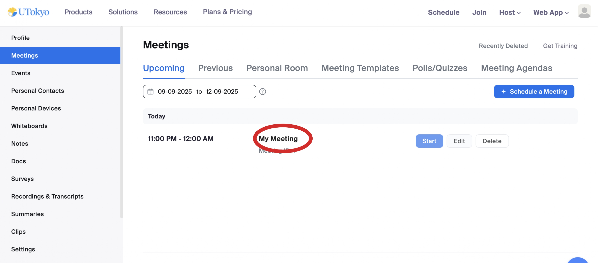
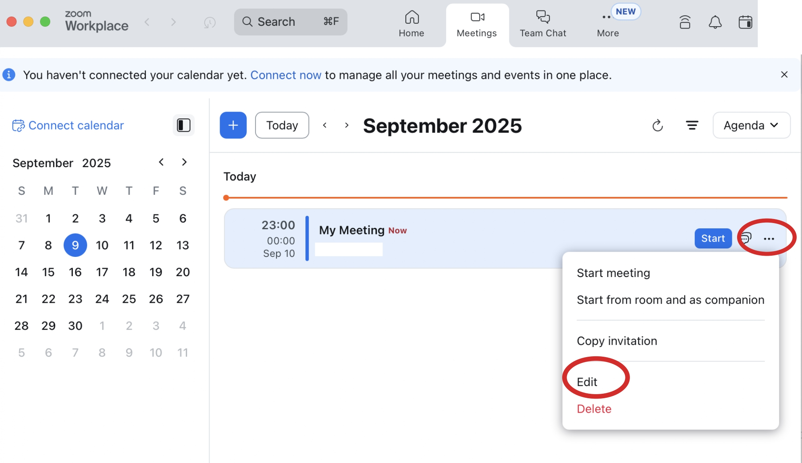
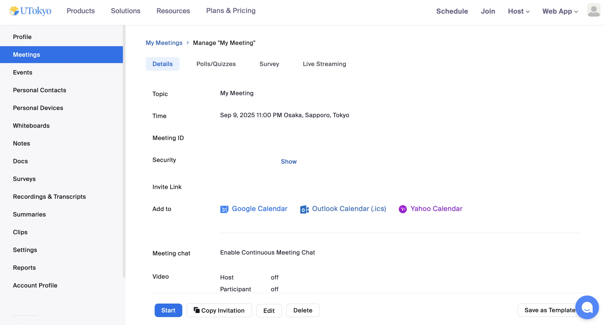
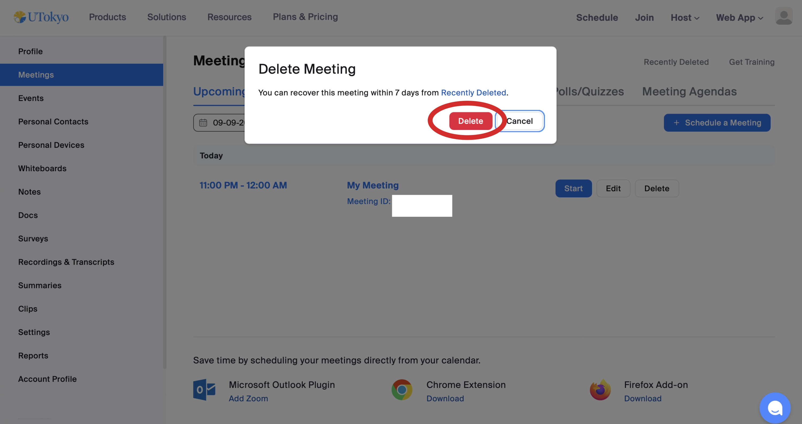

When scheduling a Zoom meeting, you can configure various items such as the meeting name and date/time. These settings can also be reviewed and changed after the meeting has been created. It is possble to even delete a meeting entirely. However, **the screen you use differs depending on whether you are reviewing, edeting,or,deleting a meeting.Since multiple screens that are similar exist**,it is important to be careful.

This page explains in detail how to review and change meeting settings and how to delete meetings. Some operations can also be performed through the Zoom app, but others require the web browser. Here, we primarily describe how to operate from the browser.

## The Difference Between the “Edit” Screen and the “Manage” Screen for Meetings
{:#edit-and-manage}
To edit or manage meetings on a browser, you must first sign in to the Zoom web portal. After you have signed in, open Meetings in the portal to view the meeting list.

You can open the screens for editing and managing meetings as follows.
- Hover over the meeting you want to operate on, and click the Edit button that appears. This opens the Edit "My Meeting(This is where the name of the meeting you scheduled will be inserted)" screen. 
  - In this article, we will call this the Meeting Edit screen.
{:.medium}
- On the other hand, if you click the meeting title itself, the Manage “My Meeting(This is where the name of the meeting you scheduled will be inserted)” screen appears. 
  - In this article, we call this the Meeting Management screen.
{:.medium}

As noted above, this article distinguishes between the**Meeting Edit screen**and the**Meeting Management screen**, so please keep this in mind when reading.

## Operations on the Meeting Edit Screen
{:#edit}

On the Meeting Edit screen, you can review and change the basic items that were set when creating the meeting, such as the meeting name (topic) and the date/time. For detailed explanations of these items, see [Scheduling a Zoom Meeting](/en/zoom/create_room/).
{:.medium}

For recurring meetings, selecting Edit All Occurrences allows you to review and change settings for all instances at once. Selecting Edit This Occurrence lets you edit only a specific instance, but the items that can be reviewed or changed are limited.
{:.medium}

These operations can be performed not only from the browser but also from the app. Select the Meetings tab, click the …icon for the relevant meeting, and then select Edit.
{:.medium}

## Operations on the Meeting Management Screen
{:#manage}

On the Meeting Management screen, you can review basic items such as the meeting name and date/time. Unlike on the Meeting Edit screen, you can only review these items but you cannot change them.
{:.medium}

On the other hand, for features such as polls/quizzes, surveys, live streaming, and Q&A, you can both review and change the settings. Each of these can be managed from its respective tab.

In addition, you can convert a meeting into a webinar [a separate additional license is required](/en/zoom/license/) or add it to a calendar. These operations can be performed from the More tab.

## Delete a Meeting
{:#delete}

You can delete a meeting from the [meeting list screen](https://u-tokyo-ac-jp.zoom.us/meeting) in the web portal or from the Meeting Management screen. Note that you cannot delete a meeting from the Meeting Edit screen.．

### How to Delete from the Meeting List Screen

1. On the meeting list screen, hover over the meeting you want to delete and click the Delete button that appears. A Delete Meeting dialog will be displayed.
    {:.medium}
2. Click Delete to delete the meeting.
    {:.medium}

### How to Delete from the Meeting Management Screen

1. On the Meeting Management screen, scroll to the bottom of the More tab and click Delete.
2. When the Delete Meeting dialog appears, click Delete again.

### How to Delete from the App

1. Select the Meetings tab at the top.
1. Click the relevant meeting, then select the … icon.
1. Click Delete.

### Restore Data Within 7 Days After Deletion

Even after a meeting has been deleted, the data is retained for 7 days and not permanently removed. In the Delete Meeting dialog, you can click Recently Deleted to view meetings deleted within the past 7 days.
{:.medium}

For meetings deleted within 7 days, you can perform the following actions.
- Click Restore next to the meeting name to restore the meeting.
- Click Delete next to the meeting name to permanently delete the meeting without waiting for the 7-day retention period.
  - Note that this action cannot be undone.

{:.medium}
