## Managing Zoom Meetings
{:#manage}
### Types of meeting-management functions
{:#functions}
The functions for managing Zoom meetings can be broadly divided into two categories: “functions for changing meeting settings and reviewing records” and “functions for moderating meetings.” This framework helps clarify the scope of functions that can be used by the roles involved in meeting management (such as the “[host](#host)” and “[co-host](#co-host)” described below). For example, hosts can use both types of functions, whereas co-hosts can use only the latter, “[functions for moderating meetings](#moderate).”

#### Functions for changing meeting settings and reviewing records
{:#settings_and_records}
Specific functions for changing meeting settings and reviewing records include the following:
- Use [Setting up a Zoom Waiting Room](/en/zoom/create_room/waiting_room/) to set up a waiting room.
- Use [Requiring Authentication to Join a Zoom Meeting](/en/zoom/create_room/auth/) to require authentication.
- Review [Getting started with Zoom reporting](https://support.zoom.com/hc/en/article?id=zm_kb&sysparm_article=KB0060623) for the meeting.
- Start the meeting.

#### Functions for moderating meetings
{:#moderate}
Specific functions for moderating meetings include the following:
- Use [How to use Breakout Rooms](/en/zoom/usage/breakout/) to create breakout rooms.
- Use [Polls in Zoom](/en/zoom/usage/poll/) to create polls.
- Mute participants.

### Ways to manage a meeting
{:#how_to_manage}
In principle,[^1] the person who creates a meeting is automatically assigned the role of “[host](#host)” and can use both types of management functions described above. In addition, you can assign people other than the creator roles such as “[co-host](#co-host)” or “[alternative host](#alt_host)” to help manage the meeting. The following sections explain these meeting-management roles.

## Host
{:#host}
### What is a host?
{:#host_desc}
A host is the role assigned to the person who created the meeting. There is only one host per meeting. To check who is currently the host during a meeting, select the “Participants” button at the bottom of the meeting window.
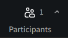
In the displayed participant list, the person who is the host has “Host” shown to the right of their name.
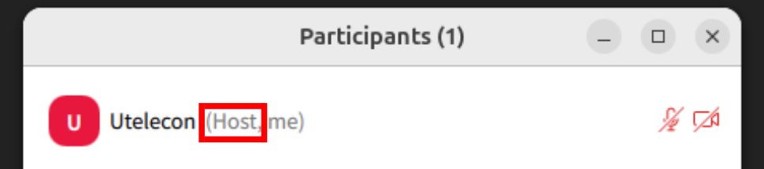

### What a host can do
{:#host_authority}
Hosts can use both [functions for changing meeting settings and reviewing records](#settings_and_records) and [functions for moderating meetings](#moderate). Of the roles involved in meeting management, hosts can use the widest range of functions.

### Transferring the host role
{:#transfer_host}
Of the [two types of functions](#functions) available to hosts, the authority to perform [functions for moderating meetings](#moderate) can be transferred to another participant while the meeting is in progress. [Functions for changing meeting settings and reviewing records](#settings_and_records) cannot be transferred.
- **However, when you want another participant to help with functions for moderating the meeting, assigning them as a “[co-host](#co-host),” described below, may be more convenient than transferring the host role.**
- **You can also grant a specific participant permission for individual functions, such as screen-sharing privileges, without transferring the host role itself.**
  **→ [Zoom Granting and limiting screen-sharing capabilities](/en/zoom/usage/screen_sharing/security/)**

**Transfer the host role when you want to relinquish your own host privileges and assign host privileges to another participant.** For example, this may be useful when you created a meeting on behalf of the person who should appear as the host, or when you do not want to make it clear to other participants that you are the host. If the meeting belongs to you,[^4] the host who transferred the role can become the host again by “[reclaiming the host role](#reclaim_host).” For the procedure, see [**Instructions for transferring the host role**](#transfer_host_instructions).

### Host key
{:#host_key}
By sharing a code called [Using your host key](https://support.zoom.com/hc/en/article?id=zm_kb&sysparm_article=KB0067063) with another user in advance, a host can have that user act as host in their place even if the host is absent when the meeting starts. This feature is useful, for example, when the host will join a meeting late[^2] and wants another user to act as host temporarily. In this case, when the original host joins the meeting, they are assigned as a “[co-host](#co-host),” but they can return to being the host by “[reclaiming the host role](#reclaim_host).”

**A host key is common to all meetings created by the host who issued it, so it must be handled carefully for security reasons. If the person who is to act as host temporarily uses a UTokyo Zoom account, assigning them as an “[alternative host](#alt_host)” described below may be more convenient.**
For instructions, see [**Instructions for using a host key**](#host_key_instructions).

### Leaving a meeting as the host
{:#host_leave}
When [passing host controls to leave the meeting](https://support.zoom.com/hc/en/article?id=zm_kb&sysparm_article=KB0067794), the following two options may be displayed: “End meeting for all” and “Leave meeting.”
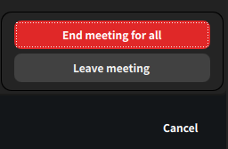
This is displayed because, in principle,[^3] one host must always be present for a meeting. Therefore, when the host leaves the meeting, they must either end the meeting itself or transfer the host role to another participant.

To end the meeting when the host leaves, select “End meeting for all.” To continue the meeting after the host leaves by transferring the host role to another participant, select “Leave meeting,” choose the participant to whom you want to transfer the host role, and then select “Assign and leave.”
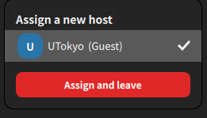

### When the host unintentionally leaves a meeting
{:#host_accidental_leave}
If the host unintentionally leaves a meeting, for example because their internet connection is disconnected, it has been confirmed that, after a certain period of time, the host role is transferred to another participant in the following order. The original host can automatically recover the host role by rejoining the meeting.
- When the meeting has a co-host  
  The host role is transferred to a co-host. If there are multiple co-hosts, it is transferred to the first participant in that meeting among them.
- When the meeting has no co-host  
  The host role is transferred to the first participant with a UTokyo Zoom account. If all participants other than the disconnected host are using accounts other than UTokyo Zoom accounts, it is transferred to the first participant in that meeting.

Under this behavior, if a host unintentionally leaves while the meeting has no co-host, the host role may be transferred to an unintended participant. **To reduce the possibility of the host role being transferred to a malicious participant, we recommend assigning a co-host for meetings open to an unspecified number of participants.**

### Reclaiming the host role
{:#reclaim_host}
After the host role has been transferred to another participant (for example, through [transferring the host role](#transfer_host), [using a host key](#host_key), [leaving the meeting as the host](#host_leave), or [the host unintentionally leaving a meeting](#host_accidental_leave)), the original host can reclaim the host role by following the procedure below. This function can be used only for meetings that you own. For example, you cannot use it when you are the host of someone else’s meeting because you were assigned as an “[alternative host](#alt_host_desc).”
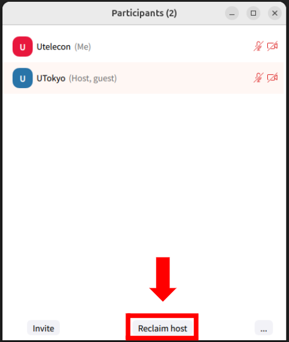
In the “Participants” panel during the meeting, hover over your name, click the displayed “More,” and select “Reclaim host” to become the host again.

## Co-host
{:#co-host}
### What is a co-host?
{:#co-host_desc}
A co-host is a role to which the host grants management privileges for [functions for moderating meetings](#moderate) in a meeting. Unlike the host, multiple co-hosts can exist in the same meeting. To check who is a co-host during a meeting, select the “Participants” button.

In the displayed participant list, a participant who is a co-host has “Co-host” shown to the right of their name.
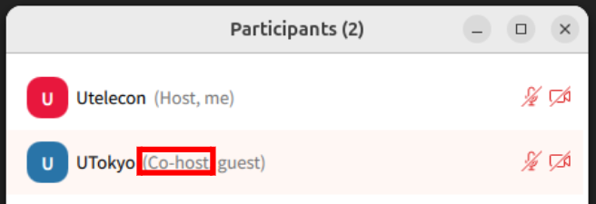

### What co-hosts can and cannot do
{:#co-host_authority}
- Co-hosts cannot use [functions for changing meeting settings and reviewing records](#settings_and_records).
- Co-hosts can use [functions for moderating meetings](#moderate) in almost the same way as the host. However, only the host can assign a participant as a co-host; a co-host cannot assign another participant as a co-host.

### When to use co-hosts
{:#co-host_usage}
Examples of situations in which co-hosts may be useful include the following:
- Assign TAs as co-hosts to help facilitate in-class exercises.
- Assign meeting organizers as co-hosts to share meeting moderation among several people.

### How to assign co-hosts
{:#assign_co-hosts}

#### Assigning other participants during a meeting
{:#assign_co-hosts_during_meeting}
The host can assign other participants as co-hosts while the meeting is in progress. The procedure is as follows:
1. Select the “Participants” button at the bottom of the meeting window.

1. In the “Participants” panel during the meeting, hover over the participant, other than yourself, whom you want to assign as a co-host.
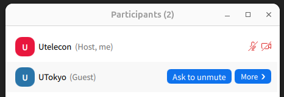
1. Click the displayed “More” and select “Make co-host.”
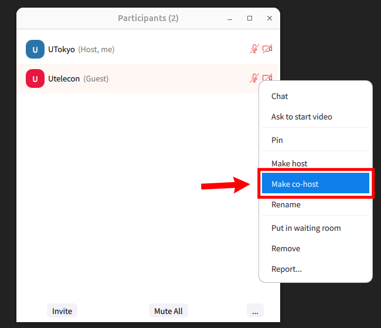
1. The participant has now been assigned as a co-host. You can [check that they are a co-host](#co-host_desc) as necessary.

To remove a co-host after their assistance is no longer needed, select “Revoke co-host permission.”
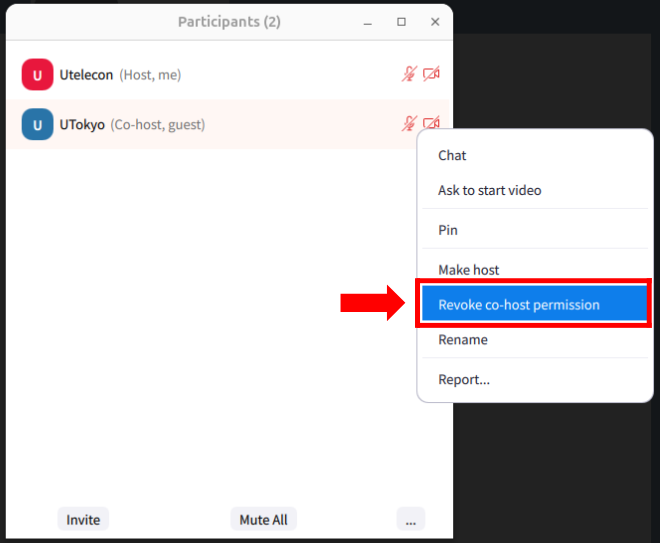

#### Assigning co-hosts in advance
{:#assign_co-hosts_before_meeting}
With the [method of assigning co-hosts during a meeting](#assign_co-hosts_during_meeting), you can assign co-hosts only while the meeting is in progress. To assign co-hosts in advance before the meeting starts, designate the intended UTokyo Zoom accounts as “[alternative hosts](#alt_host),” described below. This works because, when a user designated as an alternative host joins the meeting, they are assigned as either the host or a co-host. This method can save you the effort of assigning co-hosts each time for recurring meetings and similar situations.

## Alternative host
{:#alt_host}
### What is an alternative host?
{:#alt_host_desc}
An alternative host is a role to which the [host](#host) grants the privilege to start a meeting. Unlike the host, multiple alternative hosts can exist for the same meeting. A user designated as an alternative host is displayed as either the host or a [co-host](#co-host) in the actual meeting. Among the host and alternative hosts, the first user to join the meeting becomes the host, and the others are displayed as co-hosts. **Only UTokyo Zoom accounts can be designated as alternative hosts.**

### What alternative hosts can and cannot do
{:#alt_host_authority}
- With regard to [functions for changing meeting settings and reviewing records](#settings_and_records), alternative hosts can only “start the meeting”; they cannot use the other functions.
- Alternative hosts can use [functions for moderating meetings](#moderate) in almost the same way as [hosts](#host) and [co-hosts](#co-host).

### When to use alternative hosts
{:#alt_host_usage}
Examples of situations in which alternative hosts may be useful include the following:
- For an information session, designate members of the organizing side as alternative hosts in advance so that any of them can start the meeting.
- When you want TAs to help facilitate a class but assigning them as co-hosts manually every time is burdensome, designate them as alternative hosts in advance.

### How to assign alternative hosts
{:#assign_alt_hosts}
The following explains how to assign another user as an alternative host in a web browser. For procedures using apps or plugins, please see the official support page. → [**Using scheduling privilege**](https://support.zoom.com/hc/en/article?id=zm_kb&sysparm_article=KB0061749)

1. Open the “[Meetings](https://u-tokyo-ac-jp.zoom.us/meeting)” page in the Zoom web portal.
1. To assign alternative hosts to a newly scheduled meeting, select “Schedule a Meeting.”
To add alternative hosts to an existing meeting, select “Upcoming,” hover over the meeting shown in the list, and select the newly displayed “Edit.”
    - To assign alternative hosts to a newly scheduled meeting
    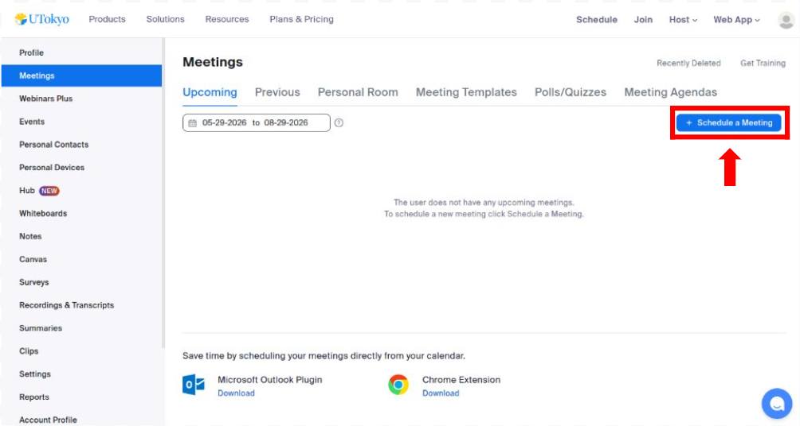{:.border}
    - To add alternative hosts to an existing meeting
    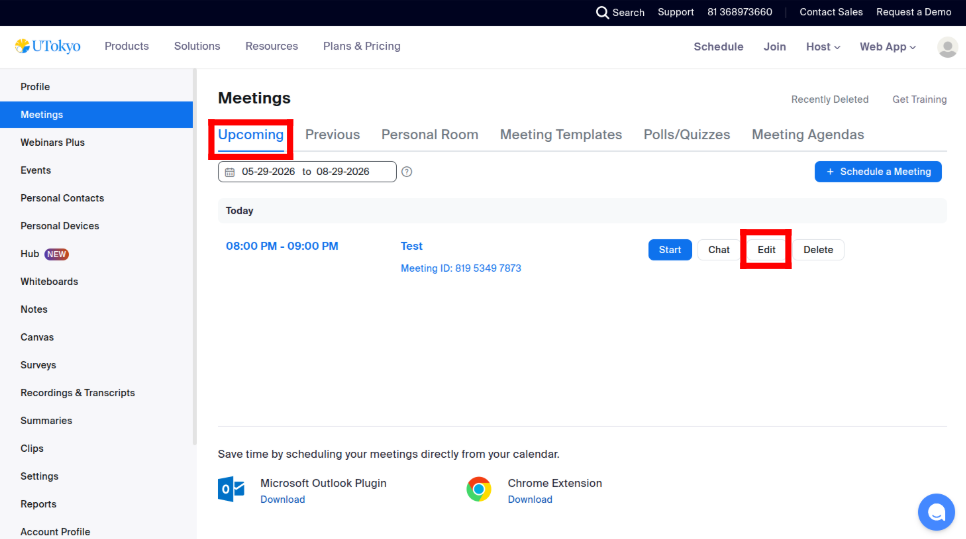{:.border}
1. On the meeting scheduling or editing screen, select [Show] in the “Options” section.
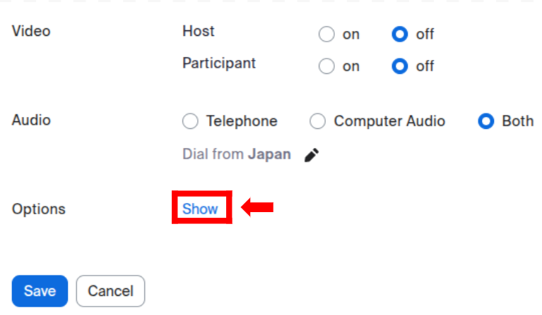{:.border}
1. In the “Alternative Hosts” field, enter the intended user’s UTokyo Account (a 10-digit Common ID + `@utac.u-tokyo.ac.jp`).
    - If you entered an account by mistake, you can remove it by selecting the × mark.
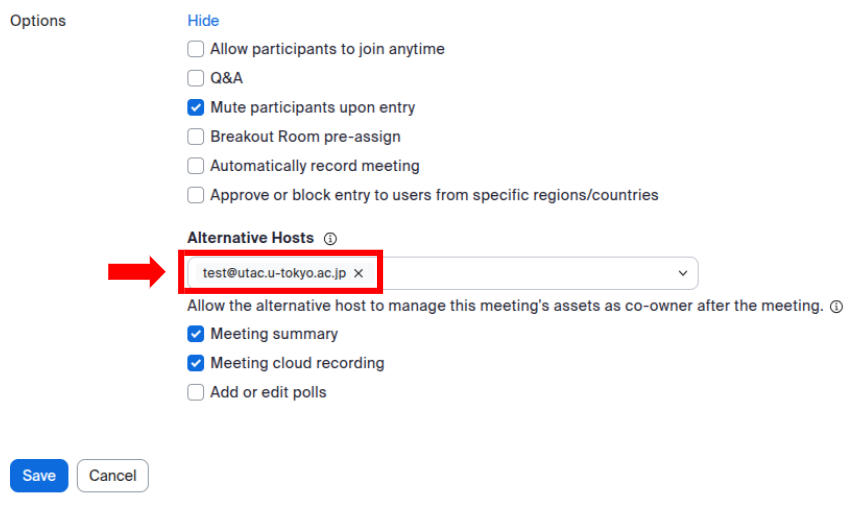{:.border}
1. Select “Save” to finish.

## Scheduling privilege
{:#scheduling_privilege}

### What is scheduling privilege?
{:#scheduling_privilege_desc}
Scheduling privilege is a feature that allows another user to create new meetings on your behalf and edit meetings that you have already created. **Because a user granted scheduling privilege (hereafter, the “child user”) is designated as an alternative host for all meetings of the user who granted the privilege (hereafter, the “parent user”), this feature must be handled carefully for security reasons. Only UTokyo Zoom accounts can be granted scheduling privilege.** Users granted scheduling privilege can also manage meetings from Outlook, Google Calendar, and similar services by using Zoom plugins, add-ins, or add-ons.
For instructions, see [**Instructions for using scheduling privilege**](#scheduling_privilege_instructions).

### What users can and cannot do with scheduling privilege
{:#scheduling_privilege_authority}
- With regard to [functions for changing meeting settings and reviewing records](#settings_and_records), the following apply:
  - Child users can schedule meetings on behalf of the parent user.
  - For meetings scheduled by the parent user, child users can freely start, edit, and delete the meeting.
    - Therefore, child users can make the following settings changes to the parent user’s existing meetings:
      - Use [Setting up a Zoom Waiting Room](/en/zoom/create_room/waiting_room/) to set up a waiting room.
      - Use [Requiring Authentication to Join a Zoom Meeting](/en/zoom/create_room/auth/) to require authentication.
    - **In addition, child users can make the parent user’s meeting their own. Once a meeting becomes the child user’s meeting, the parent user cannot make it their own again, unless the two users have granted scheduling privilege to each other.**
  - Child users cannot access recorded recordings or reports.
- Child users can use [functions for moderating meetings](#moderate) in almost the same way as [hosts](#host) and [co-hosts](#co-host).

### When to use scheduling privilege
{:#scheduling_privilege_usage}
An example of when scheduling privilege may be useful is the following:
- As an instructor, grant scheduling privilege to an assistant so that they can schedule meetings that you host in advance.

## Instructions for each operation
{:#instructions}
This section lists the specific procedures for using each function described above. Before following a procedure, please read the explanation of the relevant function above.

### Instructions for transferring the host role
{:#transfer_host_instructions}
1. Select the “Participants” button at the bottom of the meeting window.

1. In the “Participants” panel during the meeting, hover over the participant, other than yourself, whom you want to assign as the host.

1. Click the displayed “More” and select “Make host.”
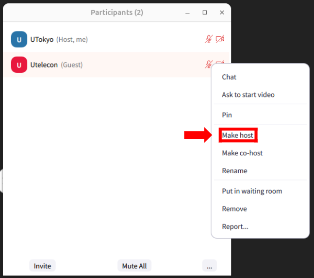

### Instructions for using a host key
{:#host_key_instructions}

#### Operations for the host
{:#host_key_instructions_hosts}
The host can obtain or edit their own host key as follows. Share the retrieved host key with the user who is to act as host.
1. Open the “[Profile](https://zoom.us/profile)” page in the Zoom web portal.
1. Scroll to the “Meeting” section and click the eye icon next to “Host Key.” The displayed six-digit number is the host key.
    - If you want to set a new host key, for example because the current key has become known to an unintended person, you can do so from \[Edit\] on the right.
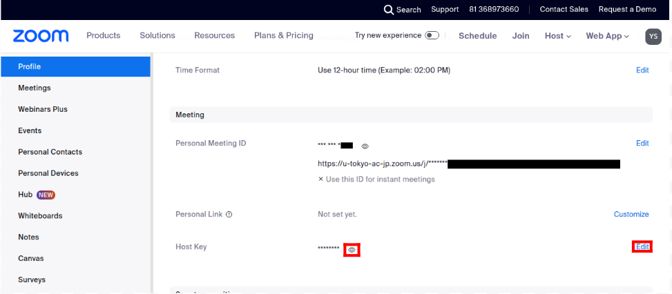{:.border}
1. Share the retrieved host key with the user who is to act as host.

#### Operations for the user using the host key
{:#host_key_instructions_participants}
A user who has received a host key from the host can become the host by following the procedure below.
1. Join a meeting in which the host is absent.
1. Select the “Participants” button.

1. Select “Claim host” at the bottom of the participant list.
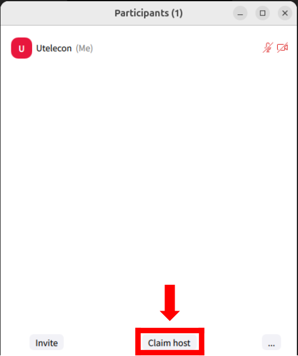
1. Enter the host key shared by the host.
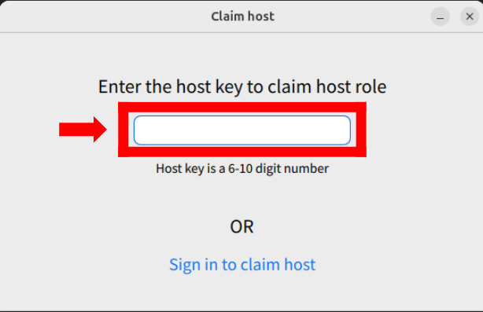
1. As you continue entering the key, “Claim host” is displayed. When you have finished entering the key, select it.
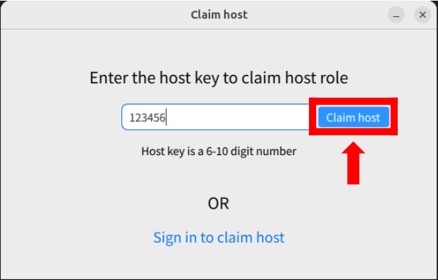
1. You have now claimed the host role. You can [check that you are the host](#host_desc) as necessary.

### Instructions for using scheduling privilege
{:#scheduling_privilege_instructions}

#### Granting scheduling privilege
{:#grant_scheduling_privilege}
The specific procedure for a parent user to grant scheduling privilege to a child user is as follows.
1. Open the “[Settings](https://zoom.us/profile/setting)” page in the Zoom web portal.
1. Select the “Meeting” tab, navigate to “Schedule Privilege” in the “Other” section, and select \[Add\].
1. In the “Users” field, enter the UTokyo Account of the person you want to designate as the child user (a 10-digit Common ID + `@utac.u-tokyo.ac.jp`).
    - If you entered an account by mistake, you can remove it by selecting the trash can icon.
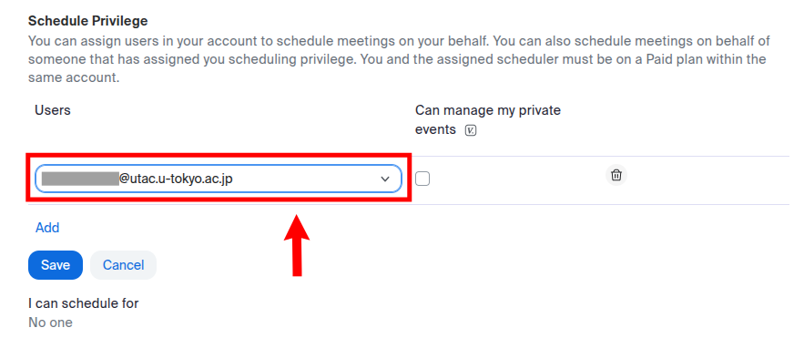{:.border}
1. Choose whether to allow the child user to manage private meetings.
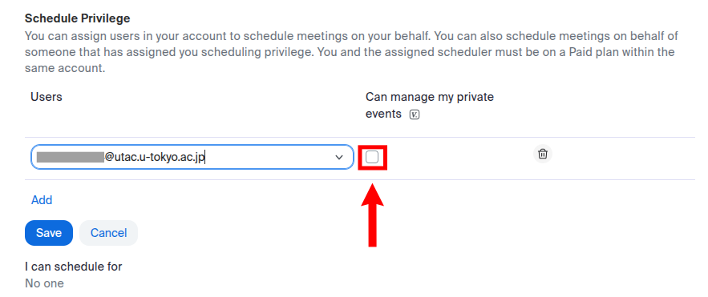{:.border}
    - What the child user sees when this option is enabled
    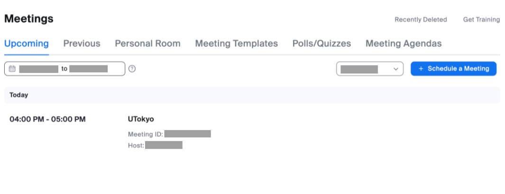{:.border}
    - What the child user sees when this option is disabled
    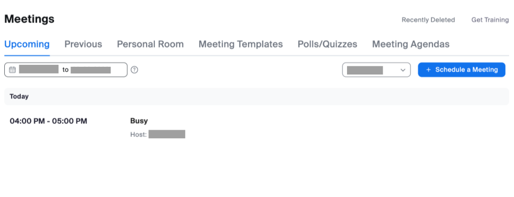{:.border}
6. Select “Save” to finish.

#### Scheduling or editing meetings using scheduling privilege
{:#schedule_meetings_using_privilege}
The following explains how to schedule and edit meetings using scheduling privilege in a web browser. For procedures using apps or plugins, please see the official support page. → [**Using scheduling privilege**](https://support.zoom.com/hc/en/article?id=zm_kb&sysparm_article=KB0061749)
- Procedure for scheduling a new meeting
  1. Open the [Meetings](https://u-tokyo-ac-jp.zoom.us/meeting) page in the Zoom web portal.
  1. Select “Schedule a Meeting.”
  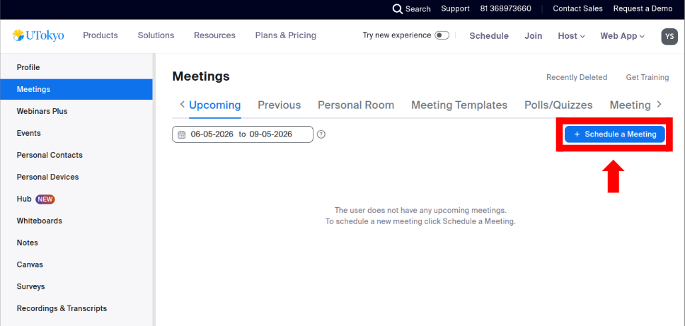{:.border}
  1. Select the parent user from the “Schedule for” drop-down menu.
  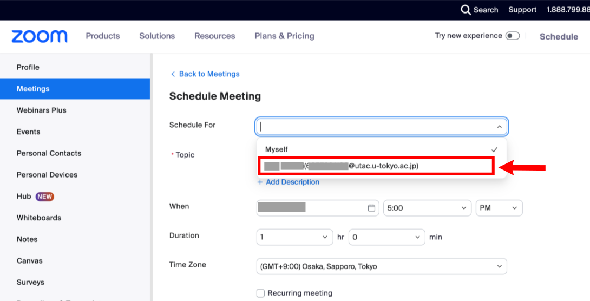{:.border}
  1. Then schedule the meeting as usual using [Scheduling a Zoom Meeting](/en/zoom/create_room/).

- Procedure for editing an existing meeting
  1. Open the [Meetings](https://u-tokyo-ac-jp.zoom.us/meeting) page in the Zoom web portal.
  1. From the drop-down menu to the left of “Schedule a Meeting,” select “All” or the parent user. Selecting “All” displays a list of both your own meetings and the parent user’s meetings. Selecting the parent user displays a list of the parent user’s meetings.
  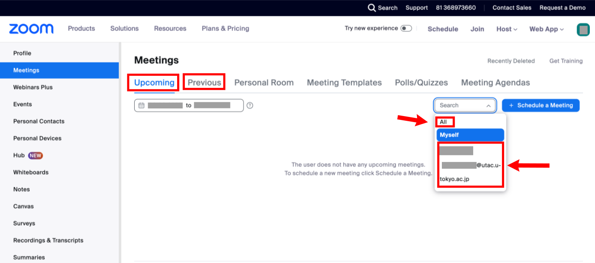{:.border}
  1. Hover over the meeting you want to edit. The newly displayed “Edit” will appear; select it.
  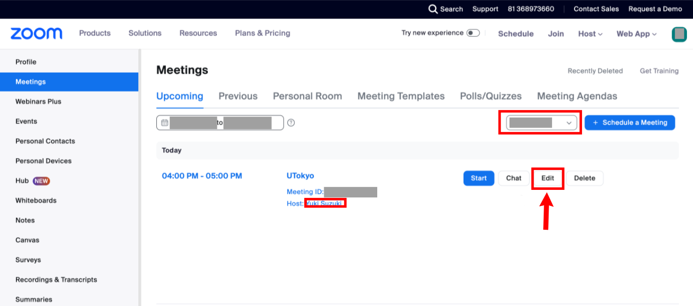{:.border}
  1. Then edit the meeting as usual using [Editing and managing Zoom meetings](/en/zoom/misc/edit_meeting/). Note that changing “Schedule for” to “Myself” on this editing screen makes it possible to transfer the meeting from the parent user to the child user.
  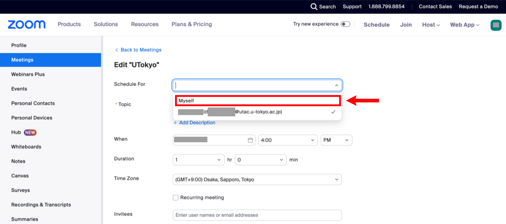{:.border}

[^1]: As an exception, the person who creates a meeting using the scheduling privilege described below is not assigned the host role.
[^2]: For participants to join a meeting before the host starts it, the detailed options [when creating the meeting](/zoom/create_room/#settings) must have “Allow participants to join anytime” enabled.
[^3]: If “Allow participants to join anytime” is enabled in the detailed options when creating the meeting, the meeting proceeds without a host until the host joins.
[^4]: There are cases in which you are the host in a meeting but it is not your own meeting, for example because you were designated as an “[alternative host](#alt_host_desc).”