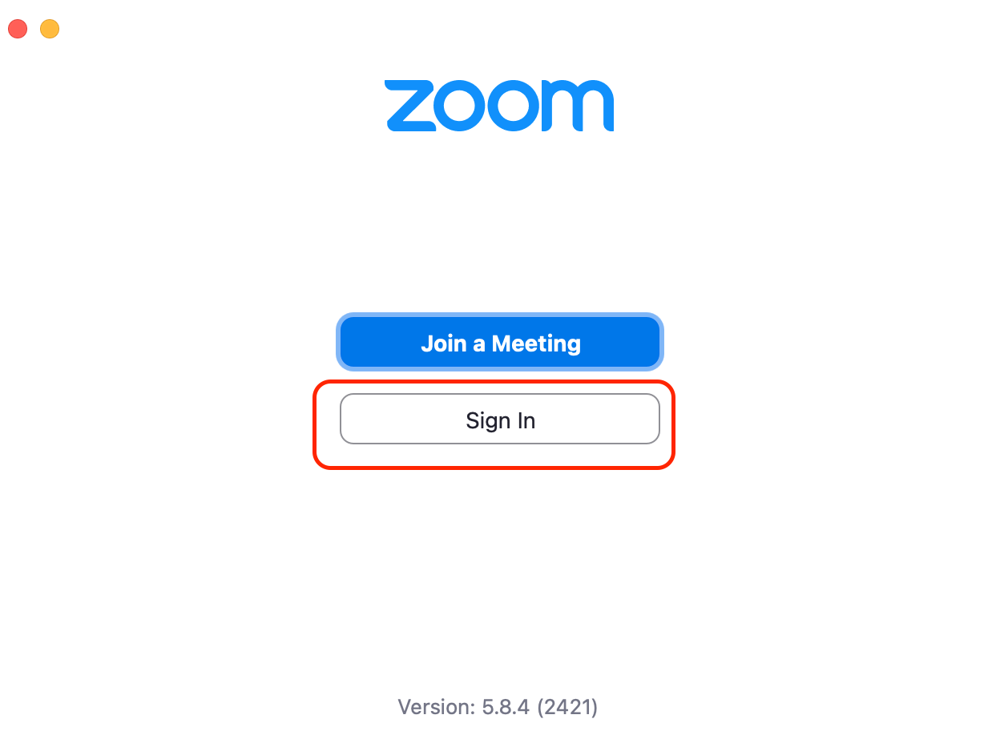
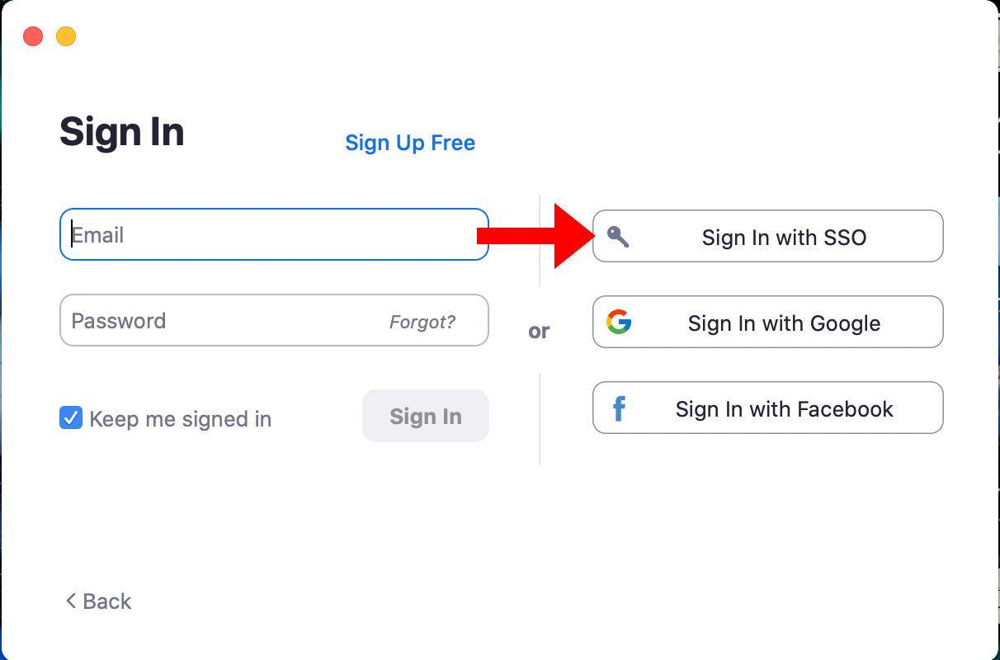

An [UTokyo Account](/en/utokyo_account/) is required to sign into Zoom. If you have not already set up your UTokyo account, please check “[Preparing for online classes at the University of Tokyo (for new students)](/en/oc/)” or “[Preparing for online classes at the University of Tokyo (for faculty members)](/en/faculty_members)” first.

The following instructions are for signing in with your <strong class="alert"> UTokyo email address starting with the 10-digit UTokyo ID </strong>.
To sign in with <strong class="alert"> alternative email addresses (e.g. ECCS Cloud Email addresses with usernames of your choice, <code> xxx@g.ecc.u-tokyo.ac.jp </code> ) </strong>, please refer to “<a href="/en/notice/zoom-address-new">Using Zoom with Non-UTokyo Account Sign-in</a> ”.

## Signing in from the UTokyo Zoom Webpage
{:#browser}



## Signing in from the Zoom App
{:#app}

1. Click “Sign In” on the Zoom app, and open the Zoom sign-in screen.
{:.medium}
1. On the Zoom sign-in screen, click “SSO” or “Sign in with SSO”. (You cannot sign in by entering your UTokyo Account email address and password.)
{:.medium}
{:.medium}
1. Enter “u-tokyo-ac-jp” as your “company domain”. (Note that the characters before and after “ac” are hyphens, not underscores.)
{:.medium}
1. The UTokyo Account sign-in page will be displayed in the browser. Please sign in. (The sign-in page will not show up if you are already signed in with your UTokyo Account.)
{:.medium}

If you have issues signing in, please reach out to <a href="/en/support/">Technical Support Desk</a> for assistance.

## Tutorial Video
{:#movie}

<iframe width="560" height="315" src="https://www.youtube.com/embed/5QIg6dU1cYI" title="YouTube video player" frameborder="0" allow="accelerometer; autoplay; clipboard-write; encrypted-media; gyroscope; picture-in-picture" allowfullscreen></iframe>

