## What are Breakout Rooms?
{:#overview}
The Breakout Room feature allows the host of the main Zoom meeting to divide participants into several smaller groups and assign them to separate rooms (breakout rooms). This enables simultaneous small-group sessions (breakout sessions) to take place. Participants in each breakout room can use the video, audio, chat, and screen sharing functions, just like in the main meeting. However, since each breakout room is independent, the contents of one room is not shared with the others. For example, this feature can be used for group work during a class or as a question room during a lab session.

To use the breakout room feature, the meeting host or co-host creates the rooms, assigns participants to them, and the participants enter their respective rooms.

In meetings created with a UTokyo Zoom account, a maximum of 100 breakout rooms can be created.

This page outlines how to conduct breakout sessions and related functions. First, it explains the conditions for using breakout rooms and how to create them within a meeting as the host. Then, it describes the functions that the hosts and participants can perform while a breakout session is in progress.

## Enable the Breakout Room Feature as a Host
{:#activation}
To create and manage breakout rooms as a host, you must first enable the breakout room feature on the Zoom web portal beforehand.

The steps required to enable the breakout room feature are as follows:

1. Sign in to the Zoom web portal. For details, refer to the ["Signing in from the UTokyo Zoom Webpage" section on the "Sign-in Methods for Zoom"](/en/zoom/signin/#browser) page.
2. Go to "Settings", then from the "Meeting" tab navigate to "In Meeting (Advanced)" and turn on the toggle for "Breakout room".
3. Turn on the necessary items for features related to the breakout rooms.
4. Click "Save" to save the changes.

{:.border}

Detailed explanations for each item are located in the following places:

* "Allow host to assign participants to breakout rooms when scheduling": See ["Load a Pre-assigned Allocation"](#start-assignment-preloading).
* "Broadcast message to participants" and "Broadcast voice to breakout rooms": See ["Broadcast a Message or Voice to All Participants"](#host-massage).
* "Allow host to create, rename, and delete breakout rooms": See ["Adjustments for Rooms"](#start-coordination-room).

## Start a Breakout Session as a Host
{:#start}
The host starts a breakout session by creating breakout rooms and assigning participants to them. Room options and names are also configured when starting the session.

This chapter explains how a host uses the breakout room feature in four steps: "Create Breakout Rooms", "Assign Participants to Breakout Rooms", "Set Options", and "Adjust Breakout Rooms".

### Create Breakout Rooms
{:#start-create-room}
To start a breakout session, first enter the number of breakout rooms needed and choose how to assign participants to each room. The number of rooms can be changed later.

The steps to create breakout rooms are as follows:

1. Select "Breakout Rooms" at the bottom of the screen (red box in the figure).
   
2. Next, select the number of breakout rooms to create and how to assign participants.
   * The assignment methods are explained in detail in ["Assign Participants to Breakout Rooms"](#start-assignment) below.

   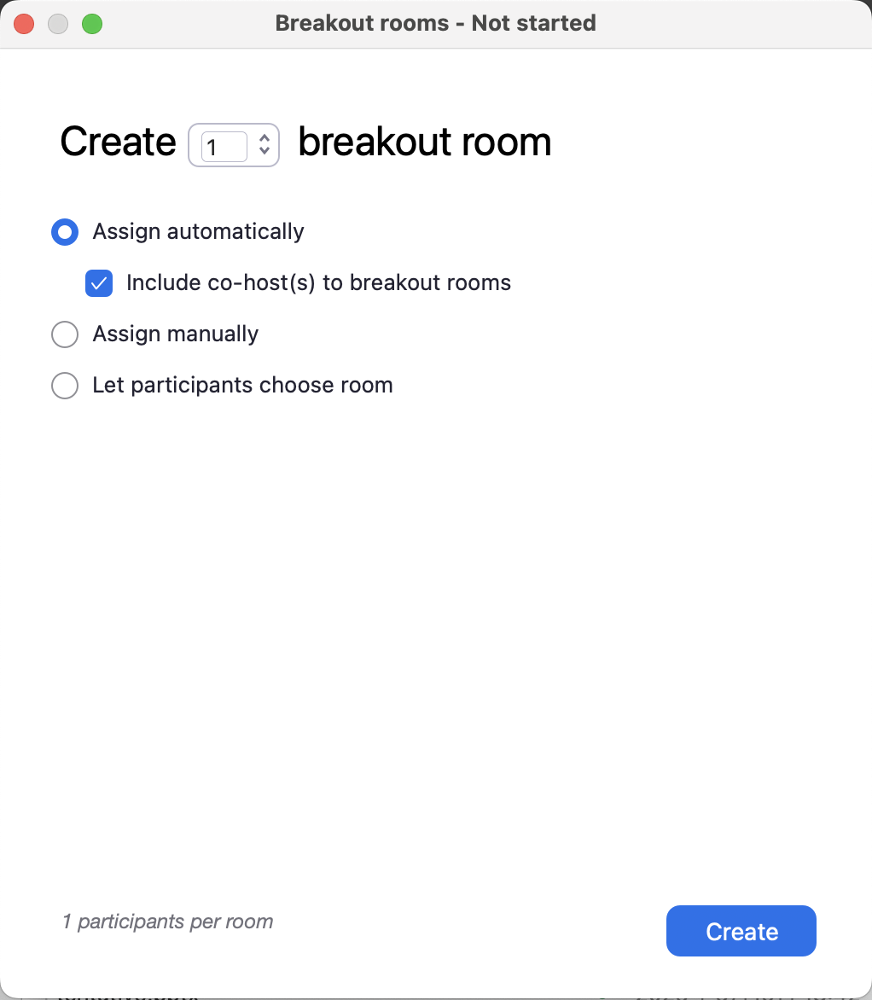{:.border .small}

3. Click "Create" in the bottom right to create the breakout rooms.

### Assign Participants to Breakout Rooms
{:#start-assignment}
When creating breakout rooms, choose how to assign participants. The three basic methods are "Assign automatically", "Assign manually", and "Let participants choose room". In addition, you can load a pre-assignment that was set up on the Zoom web portal before the meeting.

Regardless of the assignment method, you can move a specific participant to another room or swap them with someone else after the initial assignment.

Note that when a host makes the assignments, only the participants and co-hosts can be assigned; the host cannot assign themselves. When the co-host makes the assignments, they cannot assign themselves or the host.

#### Assign Automatically
{:#start-assignment-automatically}
If you choose this assignment method, the participants are automatically assigned randomly to the number of breakout rooms specified by the host, and the participants are divided as evenly as possible among the rooms. If you check "Include co-host(s) to breakout rooms", the co-hosts will also be assigned automatically like the other participants. This is primarily useful for group work with a one-time group of members.

<figure class="gallery">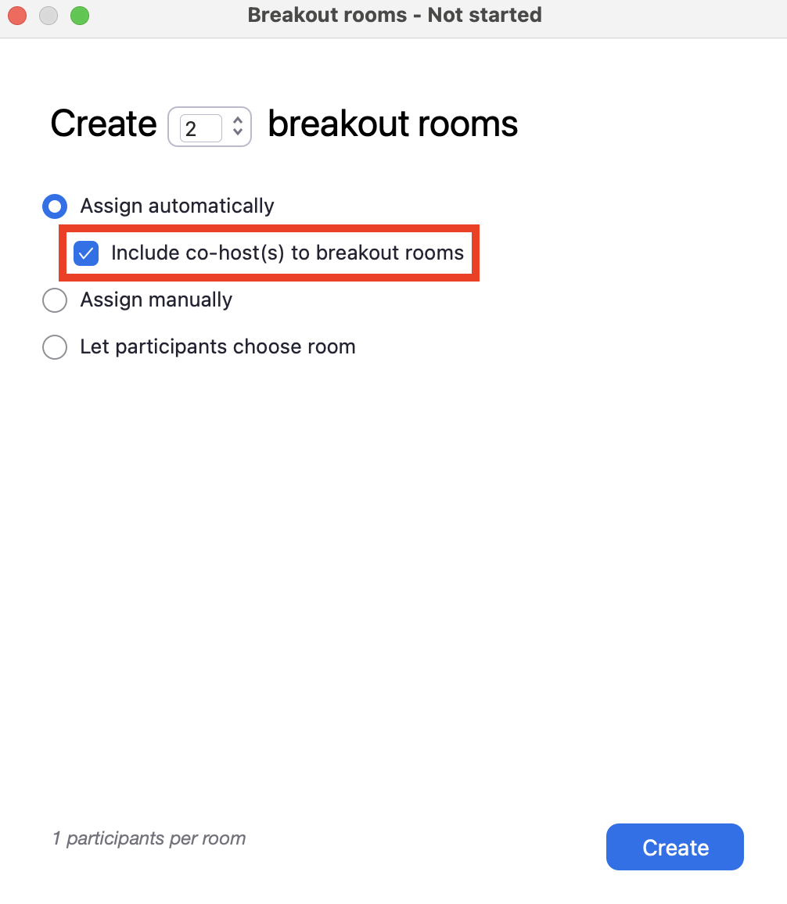{:.border .small}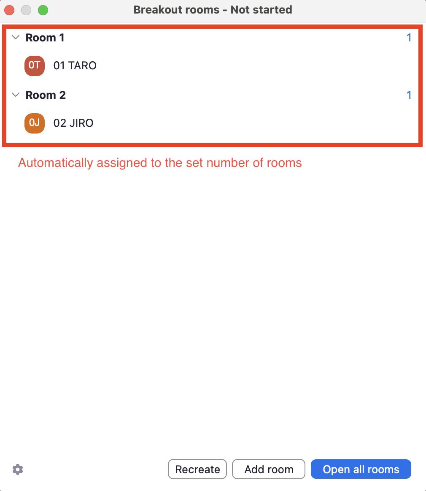{:.border .small}</figure>

#### Assign Manually / Let Participants Choose Room
{:#start-assignment-manually}
If you choose these assignment methods, the specified number of empty breakout rooms will be created. This is mainly useful for group work with fixed members.

With "Assign manually", the host or co-host assigns participants manually. With "Let participants choose room", the participants select the room they want to join themselves. However, as described later, even if you choose "Assign manually", you can also enable the "Let participants choose room" in the options, allowing the participants to select their own rooms after being assigned. Also, even if you choose "Let participants choose room", the host or co-host can still assign participants manually.

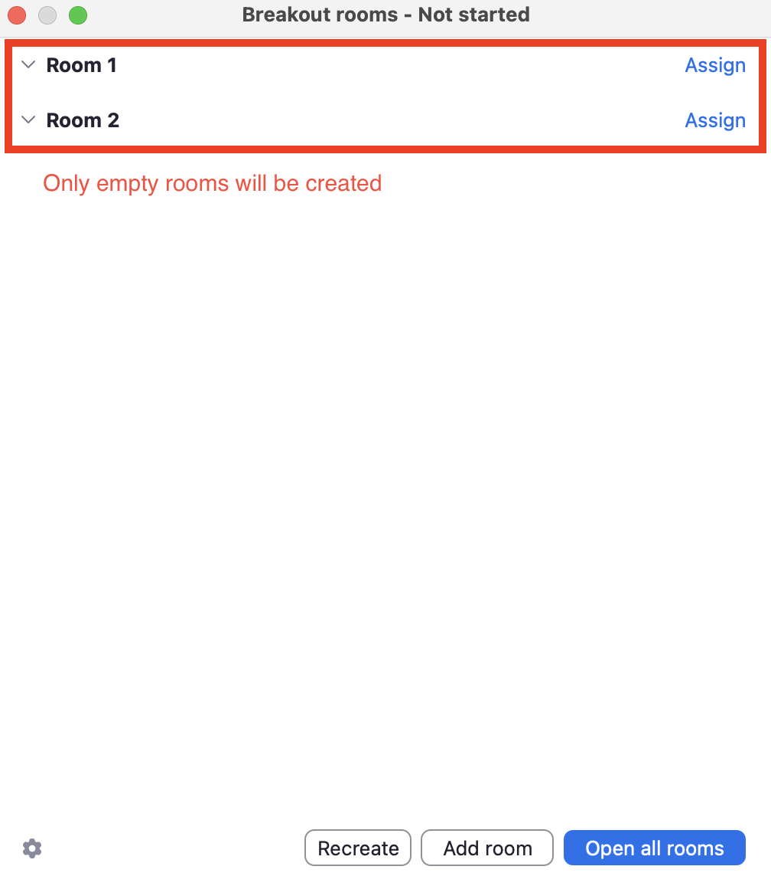{:.border .small}

The steps to manually assign participants to rooms are as follows. If you would like to keep specific participants in the main meeting, start the breakout session without assigning them to any room, leaving them as "Unassigned".

1. Hover over the target room and select "Assign".
2. A list of unassigned participants will appear on the side. Check the box next to the participants you want to assign to that room.
3. Repeat steps 1 and 2 for all rooms.
4. Confirm that all desired participants have been assigned to breakout rooms.
5. Click "Open all rooms" to start the breakout session.

{:.border .small}

Please note that after the breakout session starts, an "Unassigned" item may appear on the host's or co-host's screen. Participants whose names are here remain in the main meeting without being assigned to any room. To assign them, hover over their name, click the "Assign to" which appears, and select the room for the unassigned participant to join.

##### Tip 1 for Manual Assignment

The participant list for manual assignment is sorted by name. Therefore, having participants set their names according to their group (e.g.by adding a number or group name to the beginning of their name) can make it easier to find them. Participants can change their own names, or the host can change them. For details, see the ["Usages in Zoom Meeting"](/en/zoom/usage/) page.

{:.border .small}

##### Tip 2 for Manual Assignment

If you create the exact number of rooms needed, you have to sum up the participant count next to each room to check if everyone has been assigned. By creating one extra room, you can more easily prevent omissions. After completing the assignments, if you try to assign someone to the extra room, a message will appear stating, "All participants have been assigned to breakout rooms.", making confirmation easy.

{:.border}

#### Loading a Pre-assigned Allocation
{:#start-assignment-preloading}
Participant assignments for breakout rooms must be done for each meeting. However, if the participants are known in advance, you can create a meeting with pre-assigned rooms from the Zoom web portal, either by assigning them manually or by importing a CSV file with the assignments. This feature allows you, for example, to prepare breakout rooms based on pre-determined student groups before a class.

To use this assignment method, "Allow host to assign participants to breakout rooms when scheduling" must be enabled along with the breakout room feature on the Zoom web portal. The steps to enable it are as follows:

1. Sign in to the Zoom web portal. For details, refer to the ["Signing in from the UTokyo Zoom Webpage" section on the "Sign-in Methods for Zoom"](/en/zoom/signin/#browser) page.
2. Go to "Settings" and then to "In Meeting (Advanced)".
3. Under "Breakout room", turn on "Assign participants to breakout rooms when scheduling".

The steps to create a meeting with a pre-set assignment on the Zoom web portal are as follows:

1. Sign in to the Zoom web portal. For details, refer to the ["Signing in from the UTokyo Zoom Webpage" section on the "Sign-in Methods for Zoom"](/en/zoom/signin/#browser) page.
2. Open "Upcoming" in the "Meetings" section.
3. Click "Schedule a Meeting" to create a new meeting with pre-set assignments, or click "Edit" for an already scheduled meeting to load assignments into it.

{:.border}

4. In "Options" click "Show" to display the options list. From there, enable "Breakout Room pre-assign" This will make "Create Rooms" and "Import from CSV" available. Choose "Create Rooms" for manual assignment or "Import from CSV" to use a CSV file with assignments.
  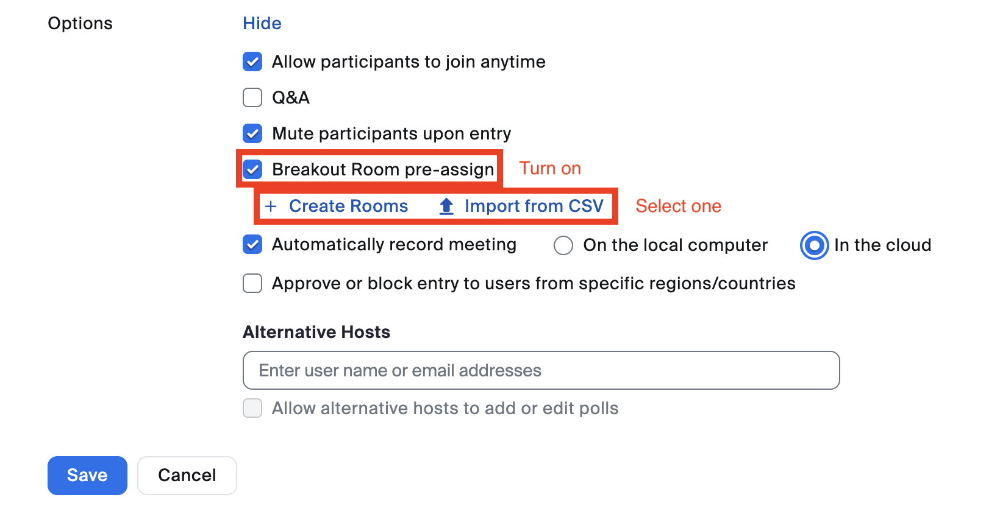{:.border .small}

The CSV file must contain the email address of the Zoom account the participant will use that day and the name of the breakout room they are assigned to. When using a UTokyo Zoom account, use the UTokyo Account (10-digit Common ID @utac.u-tokyo.ac.jp) as an email address. For details, see ["Pre-assigning participants to breakout rooms using a CSV file (in Japanese)"](https://www.sodan.ecc.u-tokyo.ac.jp/hack/zoom-pre-assign-breakout-rooms-with-csv/).

For recurring meetings, in addition to "Create Rooms" and "Import from CSV", you can also pre-assign participants to breakout rooms using an assignment saved from a previous meeting. This method is explained later in ["Saving Participant Assignments"](#host-save-allocation)

### Setting Options
{:#start-option-settings}
After creating breakout rooms and assigning participants, you can set the options for the entire upcoming breakout session. You can configure settings such as allowing participants to move between rooms and setting a time for the rooms to be open.

Click "Options" (Windows) or the gear icon (macOS) in the bottom left of the participant assignment window to display the breakout room options.

{:.border .small}
{:.border .small}

Set and enable the necessary functions from the displayed options.

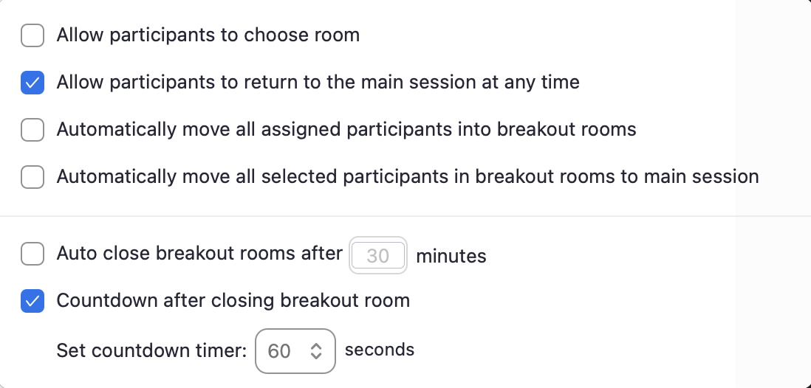{:.border .small}

Each option is explained below, categorized by when it takes effect during the meeting and its purpose. Please note that after the rooms are opened, only the "Allow participants to choose room" option can be changed.

#### Settings at the Start of a Breakout Session
{:#start-option-opning}
##### Move participants to breakout rooms automatically
{:#start-option-opning-aut-move}
This section explains "Automatically move all assigned participants into breakout rooms". This feature allows you to control when participants move into the rooms after you open them.

If the "Automatically move all assigned participants into breakout rooms" is off, the participants must click "Join" to enter the rooms once the host opens the breakout rooms. This can cause delays and disruptions when the participants move to the rooms.

If the "Automatically move all assigned participants into breakout rooms" is on, all participants are automatically moved to their assigned rooms as soon as the host clicks the "Open all rooms" to start the session. This is useful when you want to prevent participants from failing to move or when conducting group work.

##### Set the session end time
{:#start-option-opning-time}
This section explains the "Auto close breakout rooms after () minutes". This feature allows you to set the duration of the breakout session from start to finish.

If no end time is set, the only way to end the session is for the host or co-host to close the breakout rooms manually; once opened, the rooms remain open until closed.

If you want the rooms to be open only for a specific amount of time, turn on the "Auto close breakout rooms after () minutes" and enter the duration. The breakout session will end automatically after the set time has passed.

If you set an end time but may need to extend it, turn on the "Notify me when the time is up". When the session time expires, the host and co-hosts will receive a notification. At that point, they can choose to "Keep breakout rooms open" or "Close now". This prevents the rooms from closing unexpectedly and allows for extensions.

#### Settings During a Breakout Session
{:#start-option-ongoing}
##### Allow participants to move to another room or the main meeting
{:#start-option-ongoing-move}
Normally, when a breakout session starts, participants move to the room assigned by the host and cannot move to another room until the session ends. Similarly, they cannot return to the main meeting while the session is in progress.

Turning on the "Allow participants to choose room" allows participants to select and join a breakout room themselves. This is automatically turned on if you selected "Allow participants to choose room" as the assignment method when creating the rooms. For example, if you create a breakout room for questions during a lab session, enabling this allows students to freely move into that room. However, this option alone does not allow participants to freely return to the main meeting.

Turning on the "Allow participants to return to the main session at any time" allows participants to leave their breakout room and return to the main meeting at any time. For example, this allows participants to freely return to the main meeting once their group work is finished. However, this option alone does not allow participants to move freely between rooms.

##### Forcibly recall specific participants to the main meeting
{:#start-option-ongoing-call-back}
The host can request any participant in a breakout room to return to the main meeting. In this case, the participant can choose "Later" or "Join", which may cause a time lag.

By selecting "Automatically move all selected participants in breakout rooms to main session", you can forcibly recall the selected participants to the main meeting. This is useful, for example, when you want to call participants one by one into the main meeting where the host is, to provide feedback on their submissions during group work.

#### Settings at the End of a Breakout Session
{:#start-option-closing}
##### Provide a grace period before being forced back to the main meeting
{:#start-option-closing-auto}
If no setting is configured, participants are immediately returned to the main meeting as soon as the breakout rooms are closed by the host or the scheduled end time is reached.

By turning on the "Countdown after closing breakout room" and entering a time, you can create a grace period between the end time and when the breakout rooms actually close. This can be used, for example, as time to summarize opinions in group work.

### Adjusting Breakout Rooms
{:#start-coordination}
After configuring participant assignments and options for the breakout rooms, you can make final adjustments before opening them. You can change the name and number of breakout rooms and reassign participants.

#### Adjustments for Rooms
{:#start-coordination-room}
For assigned breakout rooms, you can rename or delete rooms, add new empty rooms, or recreate all rooms from scratch.

To use this function, "Create, rename, or delete breakout rooms when rooms are open" must be enabled along with the breakout room feature on the Zoom web portal. The steps to enable it are as follows:

1. Sign in to the Zoom web portal. For details, refer to the ["Signing in from the UTokyo Zoom Webpage" section on the "Sign-in Methods for Zoom"](/en/zoom/signin/#browser) page.
2. Go to "Settings" and then to "In Meeting (Advanced)".
3. Under "Breakout room," turn on "Create, rename, or delete breakout rooms when rooms are open".

The methods for adjusting rooms are as follows:

* To rename or delete a room: Hover over the target room and click either "Rename" or "Delete room" that appears, then make the change or delete the room.
* To add an empty room: Click "Add room" at the bottom of the window. You have to manually assign participants to the newly created room.
* To recreate all rooms: Click on the "Recreate". The same screen as in the "Create Breakout Rooms" chapter will appear. Then, follow the steps from "Create Breakout Rooms" onward ("Create Breakout Rooms", "Assign Participants to Breakout Rooms", "Setting Options").
  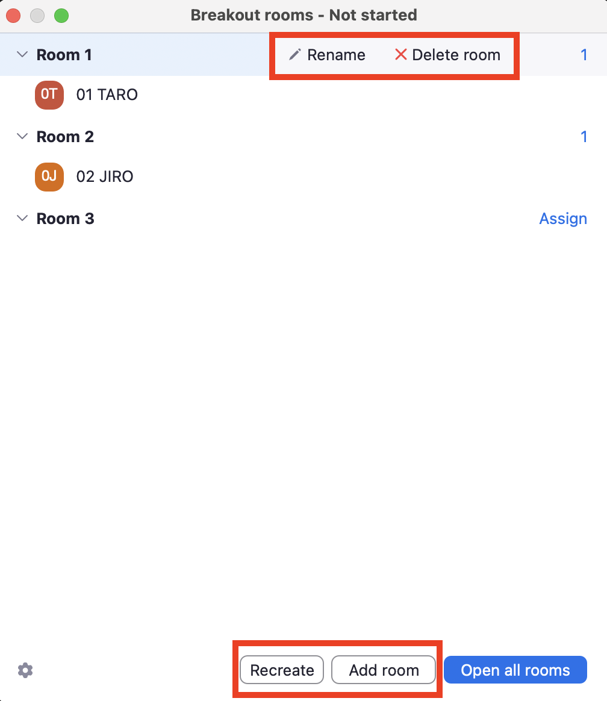{:.border .small}

#### Adjustments for Participants
{:#start-coordination-participants}
You can move a participant to another room or exchange them with another participant. Hover over the target participant's name, and "Move to" and "Exchange" will appear. Click one of them and select the destination or the person to swap with to execute the move or exchange.

{:.border .small}
{:.border .small}

### Start the Breakout Session
{:#start-running}
Once the final adjustments for rooms and participants are complete and everything for the breakout rooms is set up, open them to start the session. Click "Open all rooms" in the bottom right. Participants will then enter their respective breakout rooms and can begin their meetings.

{:.border .small}

## Host Actions During a Breakout Session
{:#host}
Next, we will explain the actions a host can take while the breakout session is in progress. After the session starts, the host can perform operations to facilitate the meeting, such as moving to each breakout room and sharing messages with participants.

Co-hosts can use most of the same functions as the host during a breakout session, as described below. However, only the host can respond to help requests from participants. The co-hosts do not receive help requests.

### Join/Leave Each Breakout Room
{:#host-participate}
The host (including co-hosts) can freely join any breakout room. Since breakout rooms are independent and their content is not shared with the main meeting, it's a good idea to join the rooms directly to accurately grasp each group's progress.

The steps for a host to join a breakout room directly are as follows. The same procedure applies when moving from one breakout room to another.

1. Click "Breakout Rooms" at the bottom of the meeting screen (if not visible, click "More" to display it).
2. In the window that appears, click "Join" next to the room you want to join, then click "Yes".
   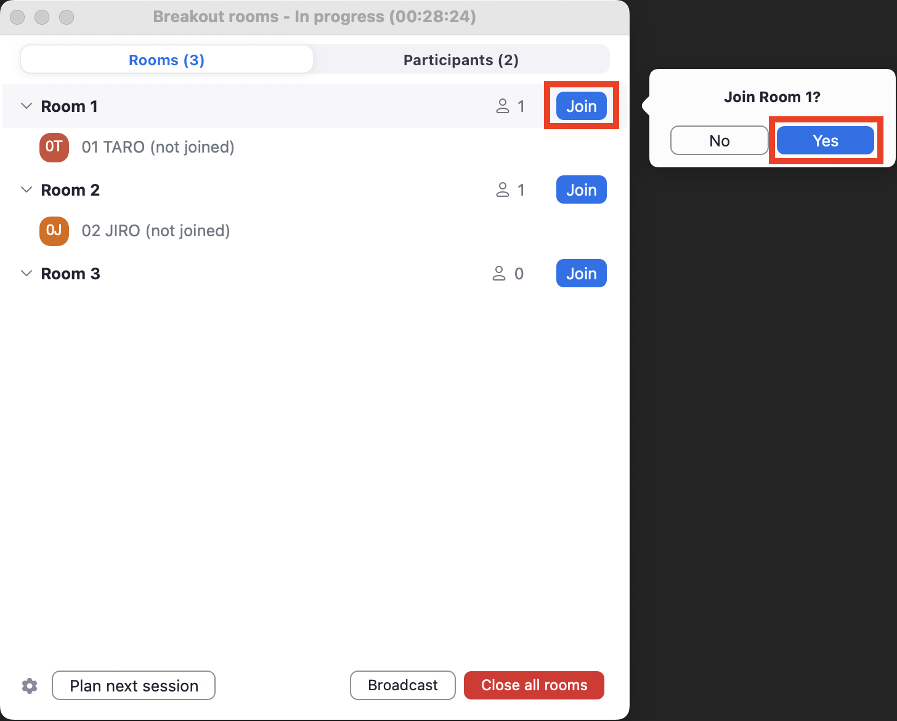{:.border}

To return to the main meeting, click "Leave Room" in the bottom right of the meeting screen, then "Leave breakout room".

#### Respond to Help Requests
{:#host-participate-help}
If any issues arise in a breakout room, participants can ask the host for help by joining their room. The host can then respond to that request and join the breakout room.

When the host receives a help request, a screen like the one below will appear, showing who is asking for help and from which breakout room. To respond to the request, click "Join breakout room" to enter that room.

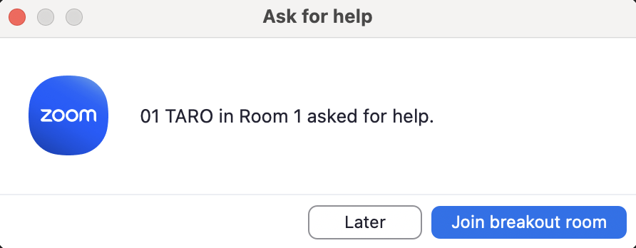{:.border}

### Broadcasting a Message or Voice to All Participants
{:#host-massage}
The meetings in each breakout room are independent of each other. Therefore, you cannot send messages using the chat function or broadcast audio to the participants in the breakout rooms. Instead, a broadcast function allows the host to send instructions to all participants either in a text or voice format. For example, you can use this to remind everyone of the end time. Note that the broadcasted audio is what your microphone picks up; if you want to broadcast audio playing from your computer, use the screen sharing feature described later.

To use this feature, "Broadcast message to participants" and "Broadcast voice to breakout rooms" must be enabled along with the breakout room feature in your Zoom web portal settings. The steps to enable them are as follows:

1. Sign in to the Zoom web portal. For details, refer to the ["Signing in from the UTokyo Zoom Webpage" section on the "Sign-in Methods for Zoom"](/en/zoom/signin/#browser) page.
2. Go to "Settings" and then to "In Meeting (Advanced)".
3. Under "Breakout room", turn on "Broadcast message to participants" and "Broadcast voice to breakout rooms".

The steps to broadcast a message or voice are as follows:

1. Click "Breakout Rooms".
2. In the window that appears, click "Broadcast" and then choose either "Broadcast a message" or "Broadcast voice".
3. Follow the steps for your choice:
   * To broadcast a message: Type the message you want to send and then click the broadcast icon (the icon in the red box in the figure). The sent message will be displayed in each breakout room for 10 seconds and then disappear.
    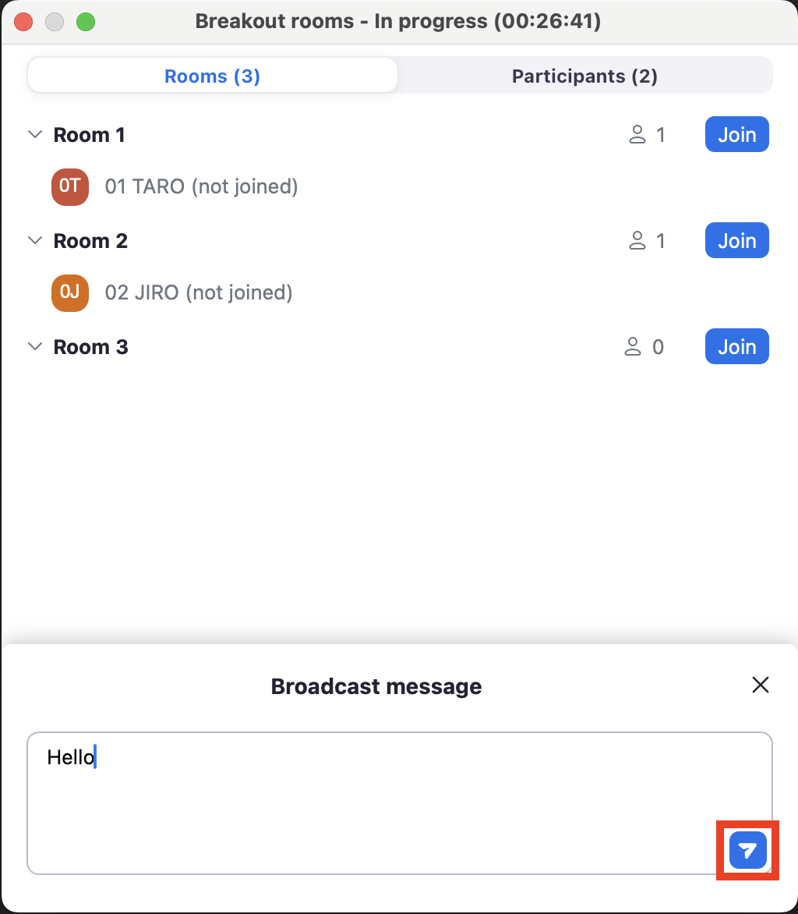{:.border .small}
   * To broadcast voice: After confirming you are unmuted, click the broadcast voice icon (the icon in the left red box in the figure). When "Currently broadcasting to all rooms" is displayed, you are broadcasting correctly. To stop broadcasting, click the stop icon (in the blue box).
    {:.border .small}

### Sharing Screen to the Breakout Rooms
{:#host-screenshare}
The host can share their screen and computer audio to all breakout rooms similar to a regular meeting. When sharing your screen to breakout rooms, the audio from the host's microphone is not shared. For detailed methods and settings for screen sharing, please refer to the ["Screen Sharing in Zoom"](/en/zoom/usage/screen_sharing/) page.

The steps to share your screen to the breakout rooms are as follows:

1. Similar to the regular screen share, click "Share" at the bottom of the meeting screen and select the screen you want to share.
2. In the window's "Layouts and options" section, check "Share to breakout rooms". If you also want to share computer audio, check "Share sound".
    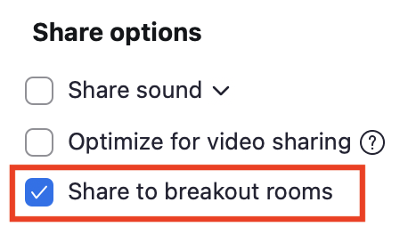{:.border .small}
3. Finally, click "Share" The screen share will begin.

### Assigning Additional Participants
{:#host-additional-allocation}
If someone joins the meeting after the breakout session has started, they remains in the main meeting as "Unassigned". To add them to a breakout room, you must assign them manually.

If participants join the main meeting late, their number is displayed in red text at the top right of the "Breakout rooms" button at the bottom of the meeting screen (if the button isn't visible, click on "More" to display it). During a breakout session, be careful to check if latecomers remain unassigned.

{:.middle}

When you select "Breakout rooms" at the bottom of the meeting screen while there are unassigned participants, a screen like the one below will appear. Hover over the unassigned participant's name and click "Assign to". A list of the currently open breakout rooms will be displayed. Select the room you want the participant to join to complete the assignment.
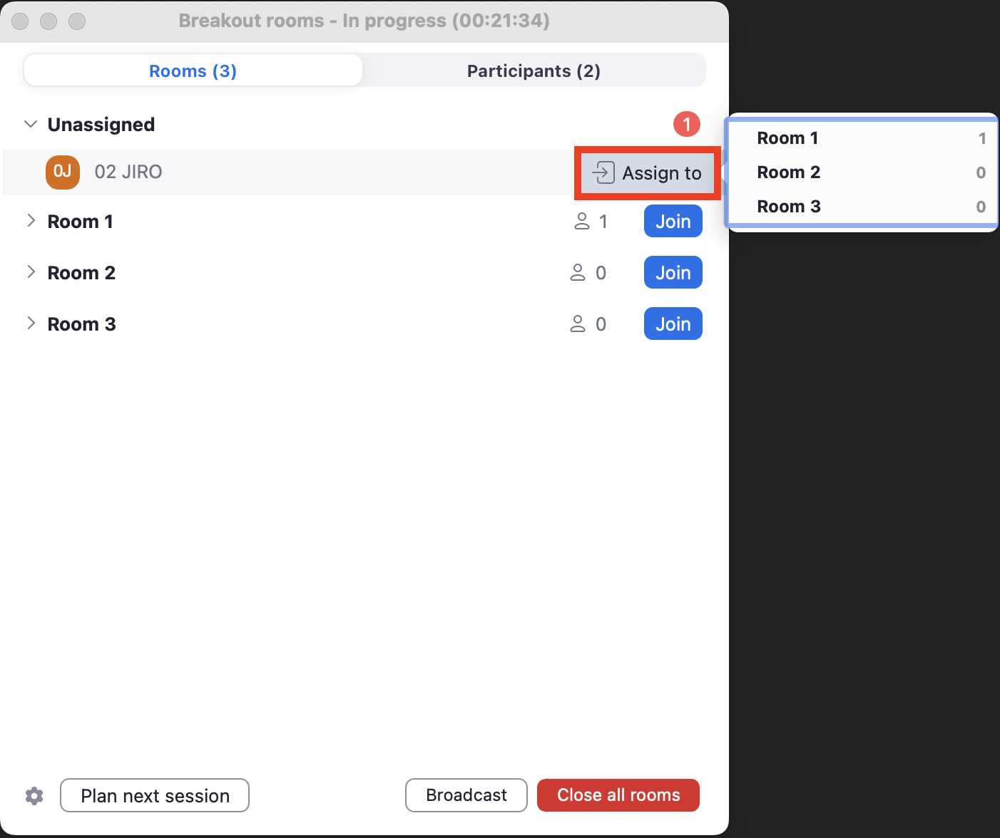{:.border}

### Save Participant Assignments
{:#host-save-allocation}
In a standard meeting, you need to assign participants to breakout rooms every time. However, for recurring meetings, you can save the current breakout room assignment for future use. Up to 10 different assignments can be saved per user. The steps to save a participant assignment are as follows:

1. Select "Breakout rooms" at the bottom of the meeting screen.
2. From the "..." at the bottom of the window that is displayed, click "Save Breakout Rooms".
   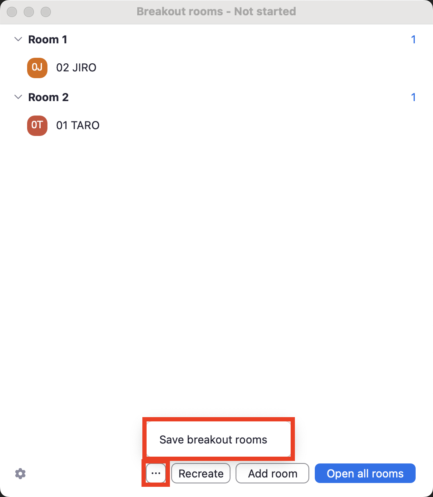{:.border}
   * If "..." is not displayed, check to see if the meeting is a recurring meeting and not a recurring meeting with "No Fixed Time".
3. Give the current assignment a name and click "Save".
   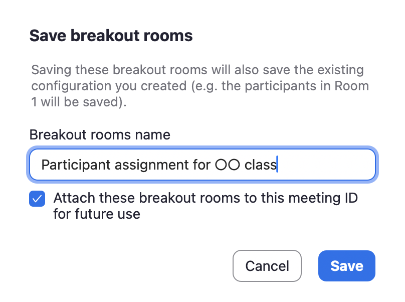{:.border}
   * You cannot save if the name is a duplicate.

Previously saved breakout room assignments can be reused when creating a new meeting. To do this, "Allow host to assign participants to breakout rooms when scheduling" must be enabled on the Zoom web portal. For how to enable this, see ["Loading a Pre-assigned Allocation"](#start-assignment-preloading).

The steps to pre-assign using a previously saved assignment are as follows:

1. Sign in to the Zoom web portal. For details, refer to the ["Signing in from the UTokyo Zoom Webpage" section on the "Sign-in Methods for Zoom"](/zoom/signin/#browser) page.
2. Open "Upcoming" in the "Meetings" section. Schedule a new meeting by clicking "Schedule a Meeting", or for an existing meeting, hover over it and click "Edit", then "Edit Entire Series".
3. Under the "Time Zone" item, ensure "Recurring meeting" is checked.
4. Click "Show" next to "Options" to display the options list. From there, check "Breakout Room pre-assign". In addition to "Create Rooms" and "Import from CSV", your saved assignments will be selectable.

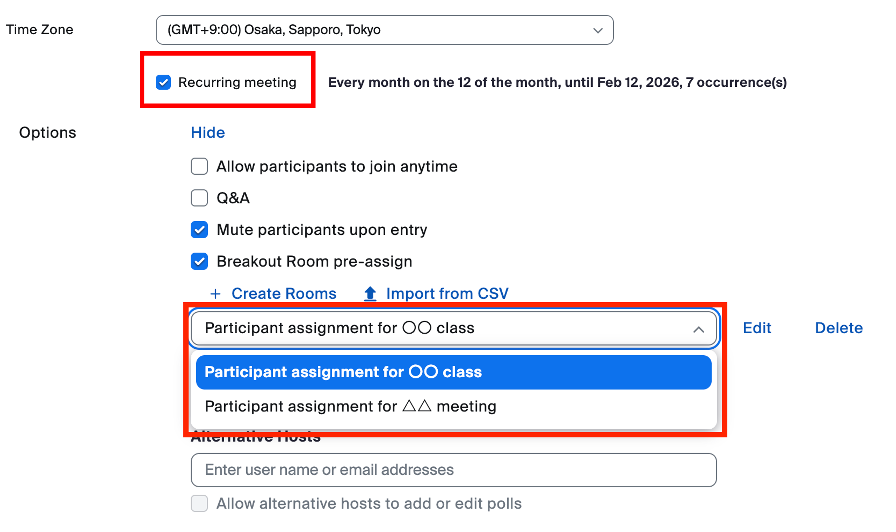{:.border}

5. Select the saved assignment you want to use. If you checked "Attach these breakout rooms to this meeting ID for future use" when you saved the assignment, it will be automatically selected.
6. Click "Save" to save the changes.

The saved assignment can be edited or deleted after being selected in step 5.
{:.border}

### Manually Stopping Breakout Sessions
{:#host-stop}
A host can stop the breakout session at any time, even before the end time set in the options. The steps to stop the breakout rooms are as follows:

1. Select "Breakout rooms" at the bottom of the meeting screen.
2. Click "Close all rooms" in the bottom right of the window that appears.
3. A confirmation screen will appear asking if you really want to close the rooms. Click "Close all rooms" again.

When the breakout rooms are closed, all participants will be returned to the main meeting after the time set in "Countdown after closing breakout room" has elapsed.

## Participant Actions During a Breakout Session
{:#participants}
### Join a Breakout Room
{:#participants-join}
When the host starts a breakout session, participants join the breakout room they were assigned to (or one of their choice).

When joining a host-assigned breakout room, you will either be forcibly moved to that room, or a window will appear asking if you want to join the breakout room. Click "Join" to enter.

In addition, if the host has enabled "Let participants choose rooms," you can move to a breakout room with the following steps:

1. From the bottom of the meeting screen, select "Breakout Rooms".
2. A list of currently open breakout rooms will be displayed. Select "Join" next to the room you want to join, and then click "Yes".
   {:.border .small}

### Recording in a Breakout Room
{:#participants-recording}
During a breakout session, the host's cloud recording (saving the recording to the Zoom cloud) only records the main meeting. However, with local recording (saving the recording to an individual's PC, etc.), the breakout room where a participant that is recording is located becomes the recording target. Therefore, if you want to record a meeting within a breakout room, you must use local recording. To do this, someone from the participant in each breakout room must be designated as the recorder, and the host must either make those people co-hosts or give them permission to record. Recording breakout rooms is useful if you want to review the discussion later. For details on how to give participants recording permission and recording procedures, see ["Recording Zoom Meeting"](/en/zoom/usage/recording/).

{:.border}

1. (Actions for the participant in charge of recording) After joining each breakout room, select "Record" at the bottom of the meeting screen (if not visible, click "More" to display it). Local recording will start automatically.

### Asking for Help
{:#participants-help}
If a problem occurs in a breakout room, a participant can ask the host for help and request that they join the breakout room. It is also possible to send a chat message to the host, but this might be missed. Therefore, when you want to call the host, it is better to send a help request.

The way to ask for help is as follows:

1. From the bottom of the meeting screen, click "Ask for help" (if not visible, select "More" to display it).
    
2. A window like the one below will appear. Click "Invite host". A notification will then be sent to the host to join the breakout room from which the request was sent.
    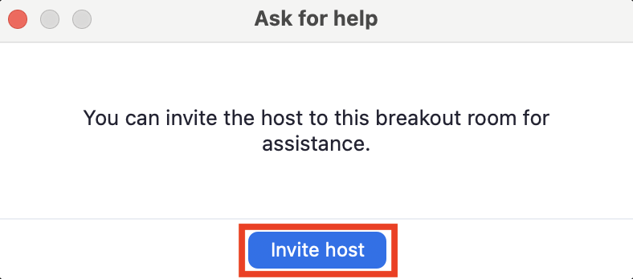{:.border}

## Important Points During Breakout Sessions
{:#notes}
### Grasp the Progress of Each Group
{:#notes-track-progress}
During a breakout session, it is difficult for the host to grasp the progress of each breakout room's meeting, as they cannot monitor all rooms at once. Therefore, using a shared document separate from the meeting is an effective method. By using Google Docs, Google Slides, or a whiteboard tool for participants to record meeting minutes and outcomes in real time, the host can indirectly grasp the progress. For specific practical examples, refer to ["Utilizing Worksheets in Online Group Discussions"](/en/articles/group-discussion-worksheet/). If the meetings in the breakout rooms are not functioning well, refer to ["Problems That Tend to Arise in Online Group Discussions and Suggested Solutions"](/en/articles/group-discussion/) and implement necessary adjustments as needed.

### Chat History
{:#notes-chat-history}
During a breakout session, if you send a chat message to "Everyone", the message will only reach participants in the same breakout room. The participants in other rooms will not receive it. Note that chat history saves only the messages you send and receive. Therefore, chats sent during a breakout room will not be known to participants who were in other breakout rooms after returning to the main meeting.

