The chat feature in Zoom allows hosts and participants to exchange text and files during a meeting. This feature allows you to conduct Q&A sessions and share class material files.

This page introduces the features and operating procedures, dividing them into basic and advanced uses of the chat feature.

Note that some features require configuration in advance. For such features, changing the settings while a meeting is in progress does not apply the changes to that meeting. If you wish to apply the changes to an ongoing meeting, end the meeting once and start it again.

## Understanding Basic Operations
{:#basic-operation}

This section introduces the procedures for activating the chat feature in Zoom meetings and its basic usage.

### Activating and Configuring the Chat Feature
{:#activate-setting}

To use the chat feature yourself and allow participants to use it in a meeting where you are the host, the chat feature must be activated. At this time, you can also configure the scope of the chat feature. Note that the chat feature is enabled by default.

#### Activating the Chat Feature
{:#activate}

The procedure for activating the chat feature is as follows.

1. Access the Zoom web portal in your browser by referring to "[Sign-in Methods for Zoom](../../signin/)", and open "Settings".
   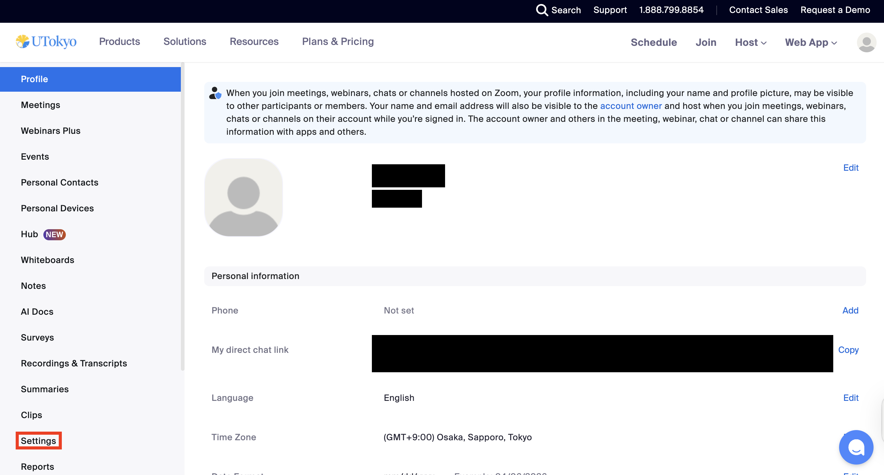
2. Select the "Meeting" tab.
   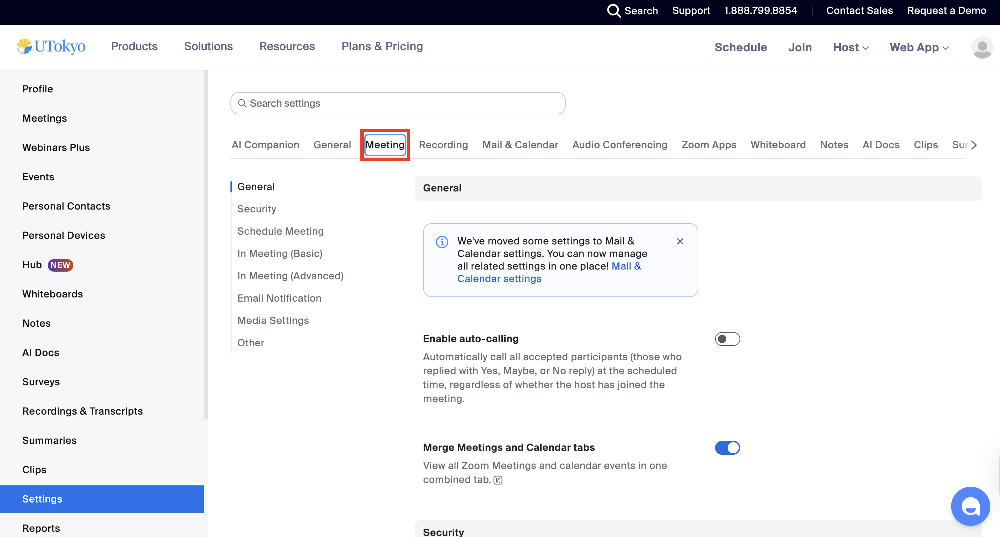
3. Turn on the "Meeting chat" item in "In Meeting (Basic)".
   {:.border}

#### Setting the Scope of the Chat Feature
{:#scope}

As shown in the image below, you can restrict the recipients to whom participants can send chats from the pull-down menu on the same screen as "[Activating the Chat Feature](#activate)". Regardless of the pull-down menu setting, the host and co-hosts can send chats to all participants as long as the chat feature is enabled. This restriction can also be changed during a meeting from the pull-down menu at the top of the chat panel.
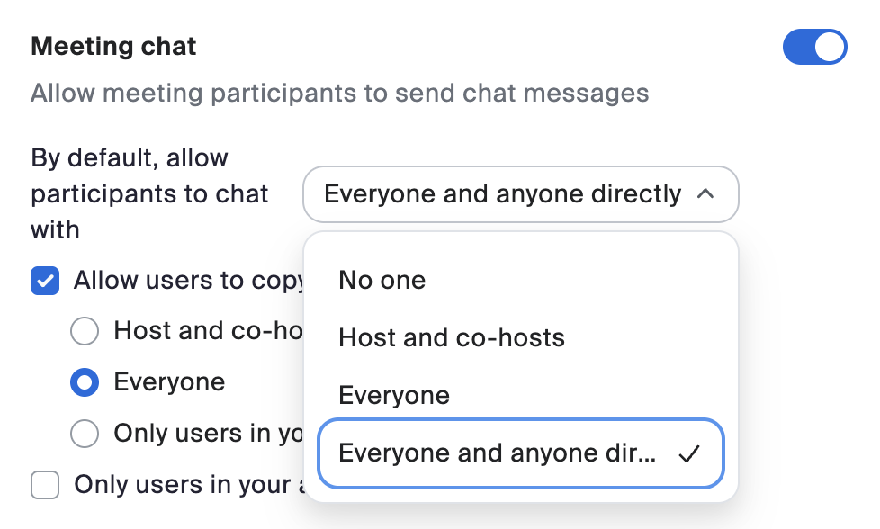{:.small}{:.border}

* No one: Prevents participants from sending chats.
* Host and co-hosts: Allows participants to send chats only to the host and co-hosts.
* Everyone: Allows participants to send chats to everyone in the meeting.
* Everyone and anyone directly: Allows participants to send private messages individually to any participant.
  * This option appears when you enable "[Selecting Recipients](#select)" introduced below.

#### Allowing the Copying or Manual Saving of Chats
{:#copy}

Enabling the "Allow users to copy or save chats from the meeting" item on the same screen as "[Activating the Chat Feature](#activate)" allows meeting participants to copy or manually save chats. The host can also select the scope of permission for copying and manually saving chats from "Host and co-hosts", "Everyone", or "Only users in your account".

Refer to "[Saving Chats Locally Manually](#manual-save)" for the actual operating procedure.

### Using the Chat Feature
{:#usage}

The chat feature allows you not only to send messages but also to change the format, reply to other messages, and save exchanges. The basic chat features are introduced below.

#### Viewing and Sending Chats
{:#view-send}
The procedure for viewing and sending chats is as follows.

1. Click the **Chat** icon at the bottom of the screen during a meeting. The chat panel opens, and allows you to view and send chats from this screen.
   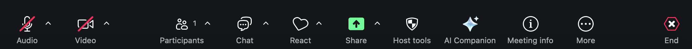
   * If the "Chat" icon is not on the screen, click the "More" button in the bottom right to reveal the "Chat" item.
   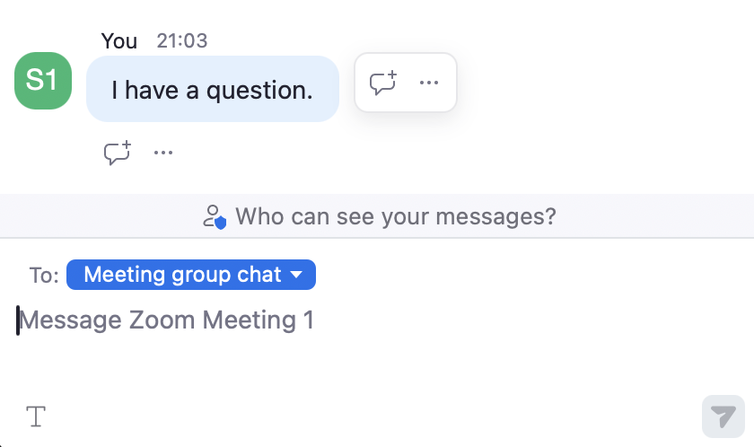{:.border .small}
   * You cannot view chats sent before you joined the meeting.

2. Specify the recipient when sending a chat. By default, it is configured to send to everyone participating in the meeting.
   * Refer to "[Selecting Recipients](#select)" for how to specify a recipient and send messages individually.
3. Enter your message and click the send icon (paper plane icon) to send it.
   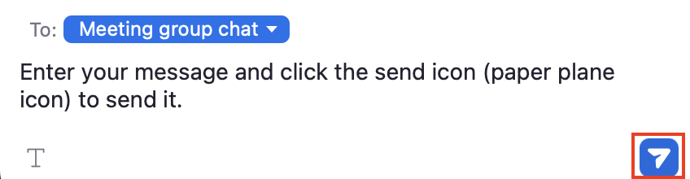{:.border .small}

#### Changing the Format
{:#format}
Allows you to change the format of the chat you send. Specifically, you can make the text bold, add underlines, or create bulleted lists.

##### Following the Procedure

1. Click the "Chat" icon at the bottom of the screen during a meeting to open the chat input field.
   * If the "Chat" icon is not on the screen, click the "More" button in the bottom right to reveal the "Chat" item.
2. Click the "Format" icon at the bottom.
   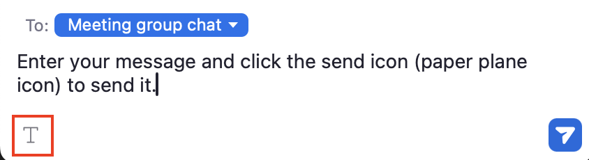{:.border .small}
3. Select the format you wish to apply. The image below shows an example of changing the format.
   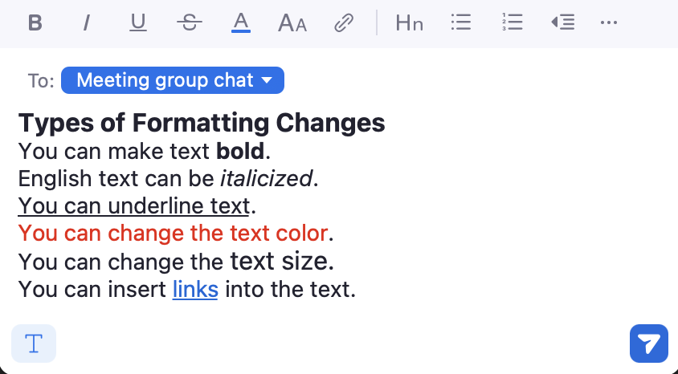{:.border .small}

#### Replying to Messages
{:#reply}
Allows you to reply to messages sent by yourself or other participants. Replying also automatically creates a thread below the original message, which allows you to organize the chat field by topic.

##### Following the Procedure

1. Click the "Chat" icon at the bottom of the screen during a meeting to open the chat list.
   * If the "Chat" icon is not on the screen, click the "More" button in the bottom right to reveal the "Chat" item.
2. Hover your cursor over the message you wish to reply to.
3. Click the reply icon.
4. Enter your text and send it.
   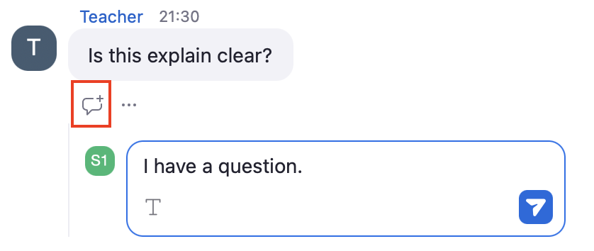{:.border .small}
5. Creates a thread and displays the reply at the bottom right of the original message.
   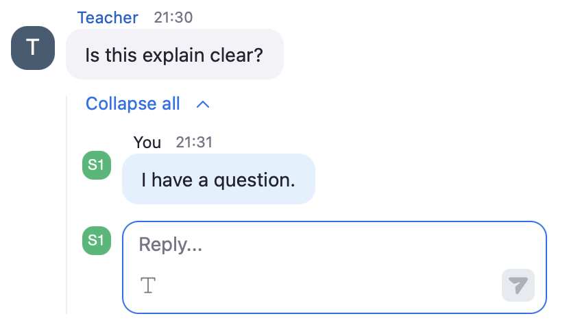{:.border .small}

#### Saving Chats Locally Manually 
{:#manual-save}
Allows you to save the contents of the chat panel as a text file. However, to copy or manually save chats, the host must enable the "Allow users to save chats from the meeting" item on the Zoom web portal. Note that chats in meetings you host can be saved automatically without manually saving them every time. Refer to "[Saving Chats Locally Automatically](#auto-save)" for details on automatic saving. Also, refer to "[Saving Chats Automatically to the Cloud](#cloud-save)" if you wish to save them to the cloud.

##### Following the Procedure

1. Click "..." at the top of the chat screen and select "Save chat".
   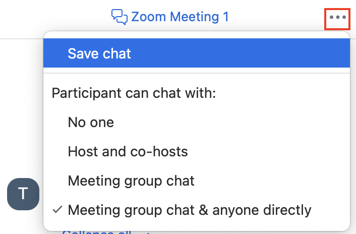{:.border .small}
2. Creates a destination folder and a .txt file recording the chat, and saves them locally (e.g., on your PC). The save location is the same as for local recording. You can check it from "Settings" → "Recording" → "Local recording storage" in the Zoom app.
   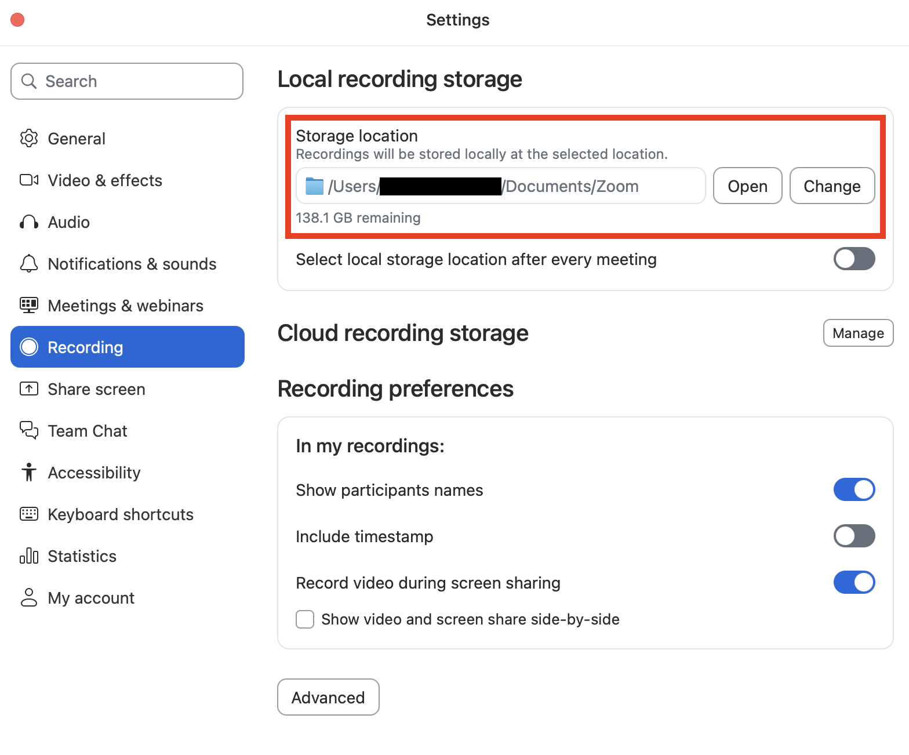

## Using Advanced Features
{:#applied-functions}
This section explains the configuration methods and operating procedures for various features to utilize the chat feature in Zoom.

Note that if you change settings during a meeting, the changes will not be applied unless you end the meeting and start it again. Also, some features may not be available if the version of your Zoom app is outdated. Update Zoom to the latest version regularly.

### Using Features Configurable in In Meeting (Basic)
{:#meeting-basic}
The activation of most chat-related features can be configured from the "In Meeting (Basic)" item on the web portal. This section explains the basic configuration procedures and operating procedures for chat-related features that can be configured from "In Meeting (Basic)".

#### Configuring Basic Settings
{:#basic-setting}
1. Access the Zoom web portal in your browser by referring to "[Sign-in Methods for Zoom](../../signin/)", and open "Settings".
   {:.border}
2. Select the "Meetings" tab.
   {:.border}
3. Toggle the ON/OFF switch for the feature you wish to configure in "In Meeting (Basic)".
   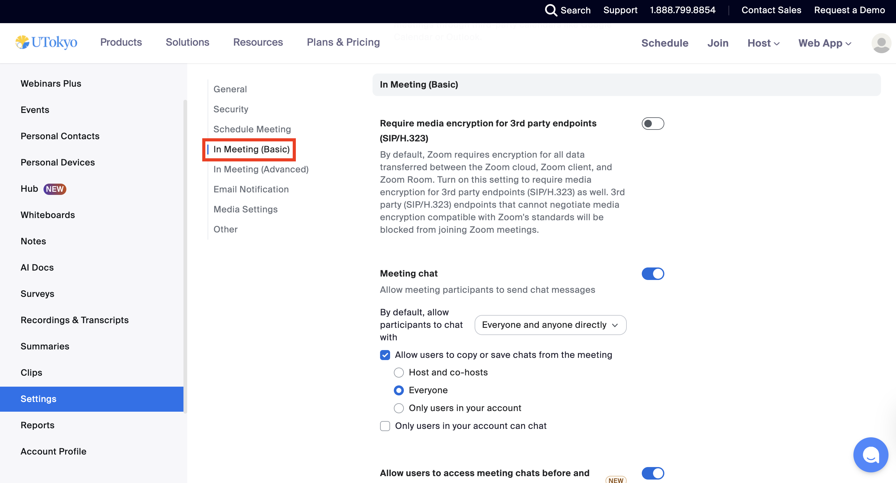{:.border}

#### Deleting Chats
{:#delete}
If the host enables "Allow participants to delete messages in meeting chat", it allows participants in the meeting to delete chats they have sent. Also, if this feature is enabled, it allows the host and co-hosts to delete chats sent by any participant.

##### Following the Procedure
{:#delete-usage}
1. Click the "..." icon below your sent message on the chat screen.
2. Select "Delete".
3. Click "Delete" again when the confirmation screen asking if you want to delete the message appears.

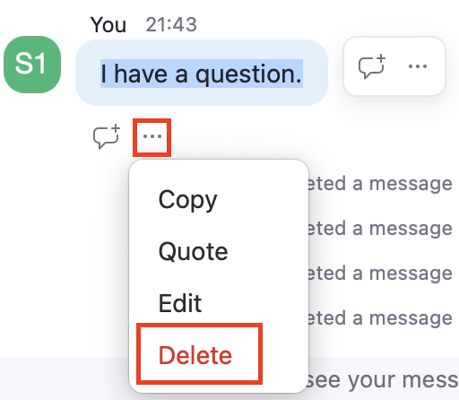{:.small .border}

#### Editing Messages
{:#edit}
If the host enables "Allow participants to edit messages in meeting chat", it allows participants to edit their own messages sent during the meeting. It allows you to add or modify messages, or change the format after sending the message.

##### Following the Procedure
{:#delete-usage}
1. Click the "..." icon below your sent message on the chat screen.
2. Select "Edit".
3. Edit the message.
4. Click the check button to finish when editing is complete.
     
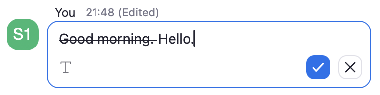{:.border .middle}

#### Sending Screenshots
{:#screenshot}
If the host enables "Enable the Screenshot feature meeting chat", it allows participants to send screenshots of an entire window or a selected area of their screen in the chat during a meeting.

##### Following the Procedure
{:#screenshot-usage}
1. Click the "Chat" icon at the bottom of the screen during a meeting to open the chat list.
   * If the "Chat" icon is not on the screen, click the "More" button in the bottom right to reveal the "Chat" item.
2. Click the "Screenshot" icon at the bottom of the chat screen.
   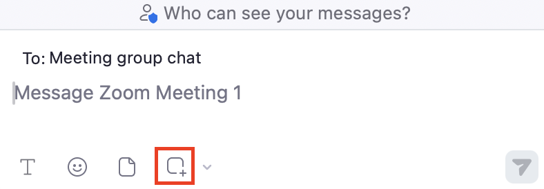{:.border .small}
3. Select the window to take a screenshot of, or drag to select the area to capture.
   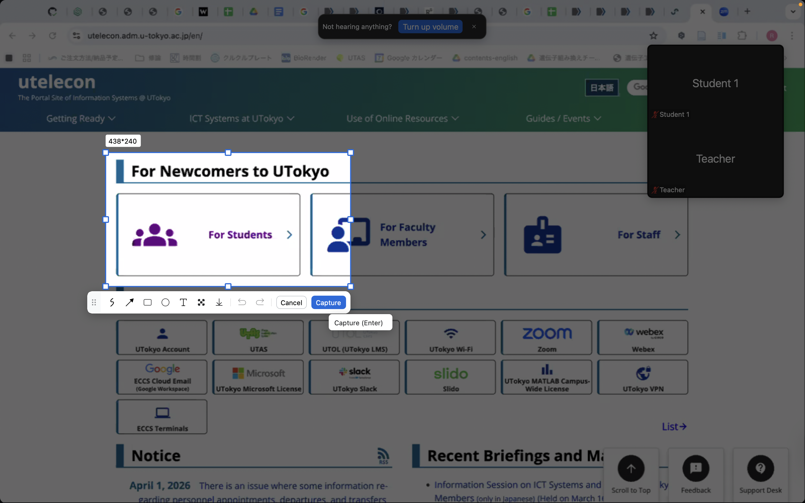{:.middle}
5. Add emojis or text as needed, and click "Capture".
6. Return to the chat screen and click the send button.
   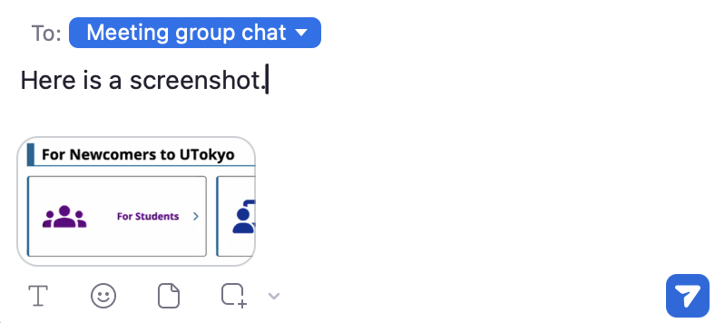{:.border .middle}

#### Using Emojis in Chat
{:#emoji}
If the host enables "Allow participants to use emojis in meeting chat", it allows meeting participants to send emojis directly in the chat. The host can select the emojis that participants can send from "All emojis" or "Selected emojis".

Using this feature enables you to express your intentions more easily than typing text.

##### Following the Procedure
{:#emoji-usage}
1. Click the emoji icon at the bottom of the chat screen.
   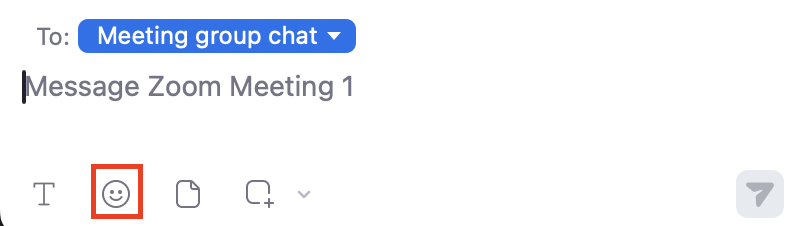{:.border}
3. Select the emoji you wish to send.
   * At this time, you can change the skin tone of the emoji to be sent in the "Skin tone" section at the bottom right of the emoji list.
4. Click the send icon. Sends the emoji as shown in the image below.
   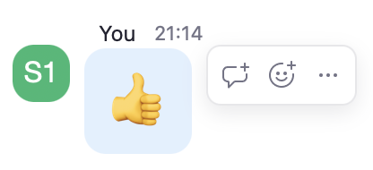{:.border}

#### Selecting Recipients 
{:#select}
Enabling "Meeting chat - Direct messages" allows the host to select the option that permits direct messages between participants in the pull-down menu for restricting chat recipients, which was explained in "[Activating the Chat Feature](#activate)".

Even with the default settings (where "Meeting chat - Direct messages" is disabled), direct messages can be sent between the host/co-hosts and participants. Enabling direct messages allows participants to send direct messages to each other regardless of whether the recipient is a host or co-host.

##### Following the Procedure
{:#select-usage}
Select the destination for the direct message from "To" at the top of the chat input screen. Selecting "Meeting group chat" makes the chat visible to everyone.
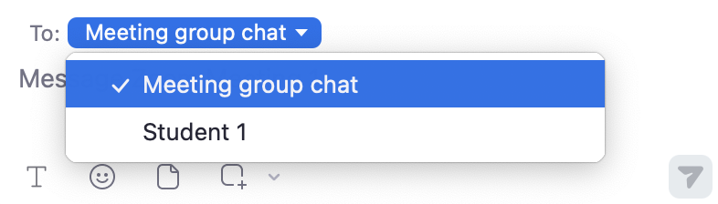{:.border}

Note that if you receive a direct message from a participant, the destination of your next chat automatically changes to that participant.

#### Saving Chats Locally Automatically
{:#auto-save}
Enabling "Meeting chat - Auto-save" automatically saves the chats of the meetings you participated in as a host (or co-host) locally after the meeting ends. It saves only the chats you exchanged, and does not save direct messages between other participants. Also, note that the creator of the meeting is not always the host.
Refer to "[Saving Chats Automatically to the Cloud](#cloud-save)" if you wish to save them to the cloud.

#### Sending Files
{:#file}
Enabling "Send files via meeting chat" allows you to send files such as class materials directly in the chat. It allows you to configure settings for permitted file formats and maximum file sizes from the Zoom web portal as well.

##### Following the Procedure
{:#file-usage}
1. Click the file icon at the bottom of the chat screen.
2. Select the file you wish to send from your computer and click the send icon.

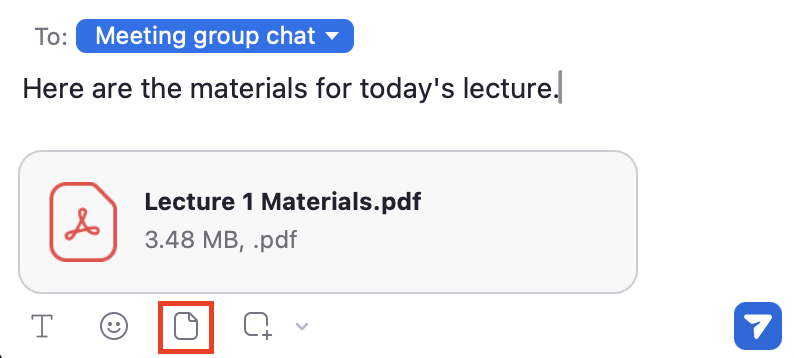{:.border .small}

### Using Features Configurable Outside of In Meeting (Basic)
{:#not-meeting-basic}

There are also chat-related items on other settings screens of the Zoom web portal.

#### Saving Chats Automatically to the Cloud
{:#cloud-save}
Using the [Recording Zoom Meeting](../recording/) feature of Zoom meetings allows you to save chat contents not only locally (e.g., on your PC) but also to the Zoom cloud. It allows access to the saved chats only from the account of the room creator. Please be aware that you may not be able to access them even for meetings where you were the host, such as when the room creator and the host are different.

##### Configuring the Settings
{:#cloud-setting}
1. Access the Zoom web portal in your browser by referring to "[Sign-in Methods for Zoom](../../signin/)", and open "Settings".
2. Select the "Recording" tab from the bar at the top of the screen.
   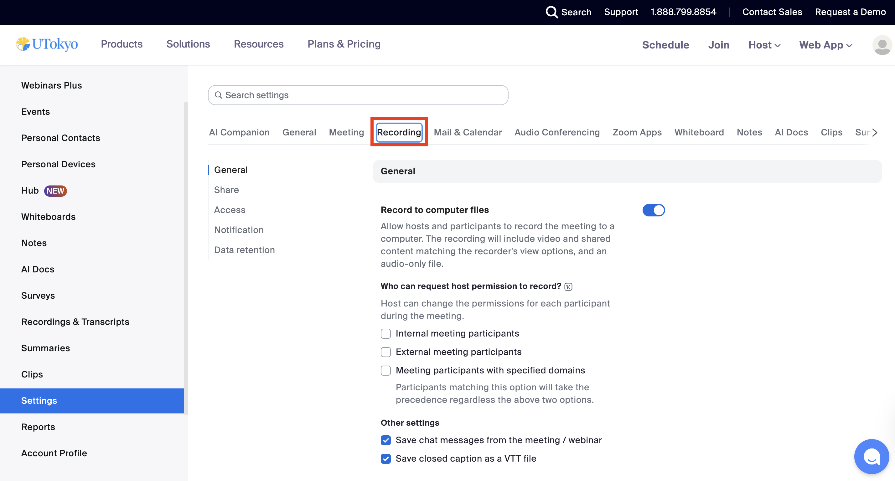
3. Turn on the "Cloud recording" toggle in the "General" section, and check "Save chat messages from the meeting / webinar". When you start cloud recording after this, it automatically saves the chat contents to the cloud.
   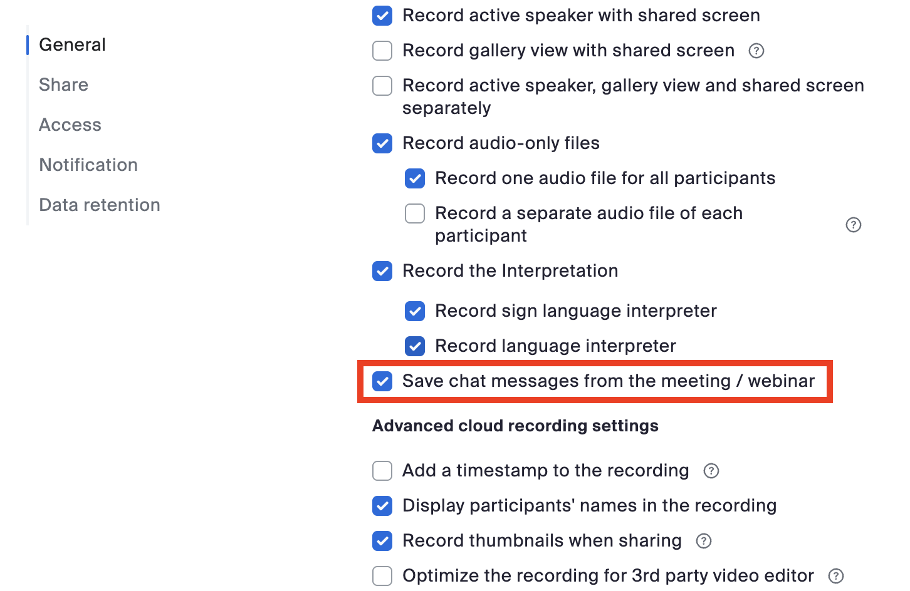

##### Checking Chats Saved to the Cloud
{:#cloud-view}
The following procedure allows you to download chat files saved to the cloud.

1. Access the Zoom web portal in your browser by referring to "[Sign-in Methods for Zoom](../../signin/)", and open "Recordings & Transcripts".
2. Open the "Cloud recordings" screen, select the relevant recording, and download the "Chat file".
   * Refer to the "[Recording Zoom Meeting](../recording/)" article for details on cloud recording.
   * It allows you to share chat files saved via cloud recording with a link.

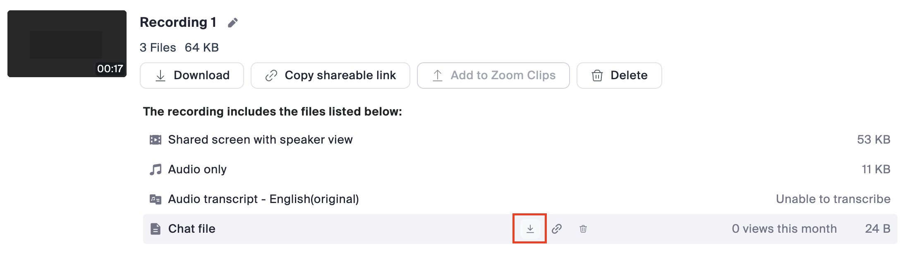{:.border}
