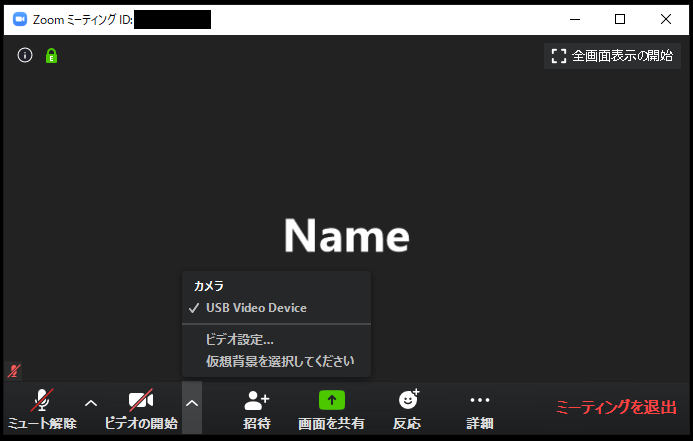
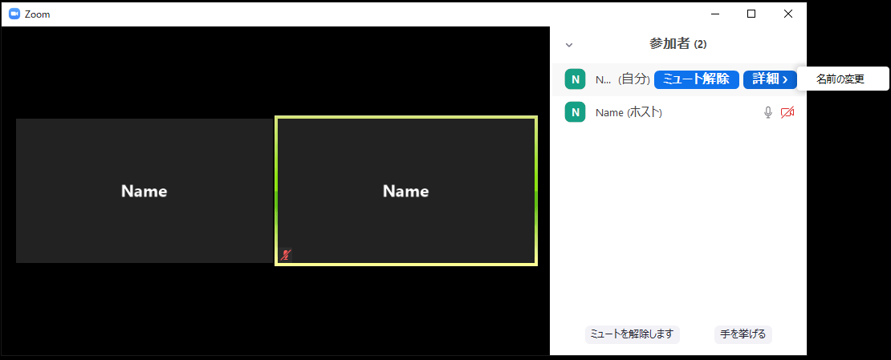

In this section we give concrete directions on how to use Zoom.  

The following screen is displayed when entering a meeting room(this screenshot shows a meeting room with only 1 participant).
If you move the mouse cursor over the Zoom screen, the menu bar shown in the figure below will pop up.
    
The menu buttons are explained from left to right (some version may not display all the buttons as here)．
  1. **Microphone mark** : Press this to mute (mute) or unmute (the screen shows "mute off" because it is currently muted). Pressing the arrow mark next to it enables you to make settings related to the microphone.
  1. **Video mark** : Press to turn the video on or off (the screen shows "Start Video" because the camera is currently off). Pressing the up mark next to it will allow you to make video settings.
  1. **Invitation** : You can send an invitation by e-mail. Since the organizer and participants already know the URL of the conference room, they can invite others by sharing the meeting URL.
  1. **Screen Share** : You can share screens in your device.
  1. **Reactions** : You can express reactions by sending "applause" or "agree" emoji.
  1. **Details** : Menus that could not fit on the screen are included here (If the screen width is large enough, all menus will be displayed on the screen and "Details" may not be displayed).
  * **Participants** : Displays a list of participants.  
  * **Chat** : text chat.  
  * **Record on this computer** : You can record if your host allows it. This button is often not used by anyone other than the organizer.  
  1. **Leave meeting** : Leave the meeting. A confirmation screen appears after you press it, so you do not exit immediately when you press the button.
  
  
The following describes the details of the menu items mostly used.

## Advanced microphone settings
  
  
  
If you press the upper mark next to the microphone mark, an additional menu will appear. Below is a brief description of each command.
  * **Microphone** : You can select the microphone you want to use (if you have a separate microphone, you will have multiple choices, so choose the one you wish to use).
  * **Speaker** : You can select the speaker you want to use (if you have a separate speaker, you will have multiple choices, please select the one you wish to use)
  
For details, please refer to [Using microphone and camera](mic_cam/).
  
## Advanced video settings
  
  
  
If you press the upper mark next to the video mark, an additional menu will appear. Below is a brief description of each option. 
  * **Camera** : You can select the camera you want to use (if you have a separate camera, you will have multiple choices, please select the one you wish to use).

For details, please refer to [Using microphone and camera](mic_cam/).

## Participants

Pressing the menu "Participants" will bring up a screen where you can see a list of participants.
  

  * Hover the mouse cursor over your name to turn mute on / off and change the name displayed by clicking on "details"

In addition to this, the host can:
  * Mute a participant, or mute all participants
  * Prevent participants from unmuting themselves
  * Lock a meeting so that there are no more participants

## Screen sharing
  
When you press the menu "Share screen", the options of screens to be shared appear. Select the desired one and press "Share" to start sharing the screen.
  
  
  
  * When "Screen" is selected, the screen of the person sharing the image itself is shared with everyone (If there are multiple screens such as a multi-monitor like an image, screen 1 and screen 2 have more options).
  * If you select "Whiteboard", a whiteboard in which you can draw freely will be shared with everyone.
  * Selecting "iPhone / iPad" will allow you to share your iPhone / iPad screen (plug-in required). You can share via AirPlay from devices in the same WiFi network.
  * The currently open window is also displayed as an option. You can also share the screen in window units. If you don't want others to see all of your computer windows, we recommend that you select the window unity you want to share.
  
  <!--About Sharing audio-->
  
For details, please refer to [Screen Sharing](screen_sharing/).

## Chat
  
If you press the menu "Chat", text chat will be available. It is important to note that if you log in from the middle of a meeting, you will not be able to see past text chats. Therefore, it is important to wait and send texts after every member has joined the meeting.
    
  
  * By clicking the "Send to" button, you can change the destination of the message from "Everyone" to an individual. By default, messages are sent to everyone.
  * By selecting "File", you can send files from your computer or files from an online drive.

<!--
## Reactions
-->

## Organizer-specific menu
  
Here is a brief description of the menus specific to the organizer. 
  
  1. **Polls(setting required)** : Allows participants to respond to polls. The questions themselves need to be created with a web browser, and you can create a question by pressing "Edit" or "Add question", when you are creating a question for the first time.
  1. **Breakout(setting required)** : Participants can be divided into subgroups. You can decide the number of people and assign them automatically, or you can assign them manually.
  1. **Recording** : You can record the state of the meeting.
     * For detalis, please refer to [Cloud Recording](recording/).
  