## Introduction
This page explains how to change the screen in a Zoom meeting when there are screen sharing and when there are no screen sharing, separately. It also explains advanced usages for hosts at the end.

## When there is no screen sharing
This section explains how to configure the screen display settings when there is no screen sharing.

### Expand the speaker's video (Speaker view)
When there is no screen sharing, the default video layout is the Speaker view, which displays the speaking participant in a larger size. Under the Speaker view, the expanded participant will automatically switch according to the change in speaker.
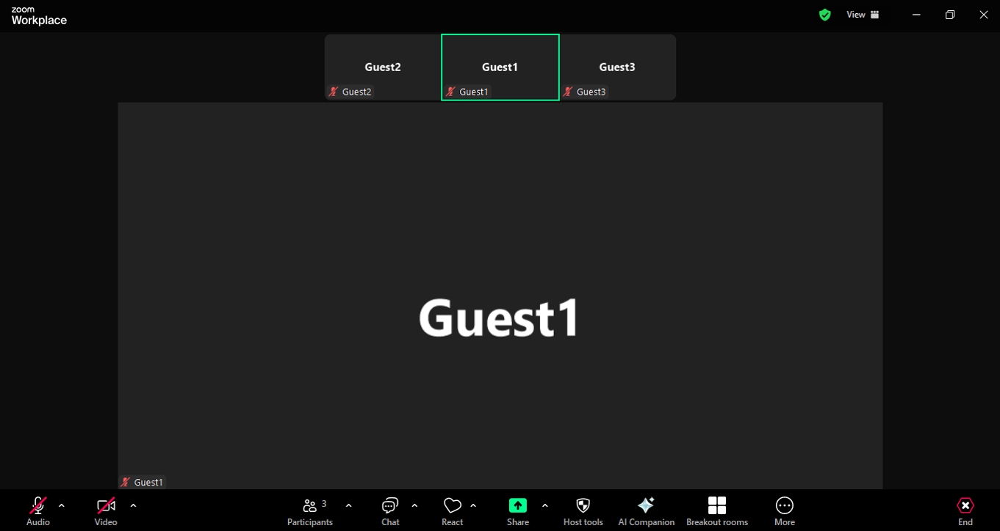

#### Expand the specific participant's video (Pinning)
Pinning a video is a feature that allows you to keep a specific participant's video displayed without automatic switching under the speaker view. To pin videos, follow these steps:

1. Hover over the video of the participant you want to pin and press "..." located at the upper right.
2. Press "Pin" in the menu.
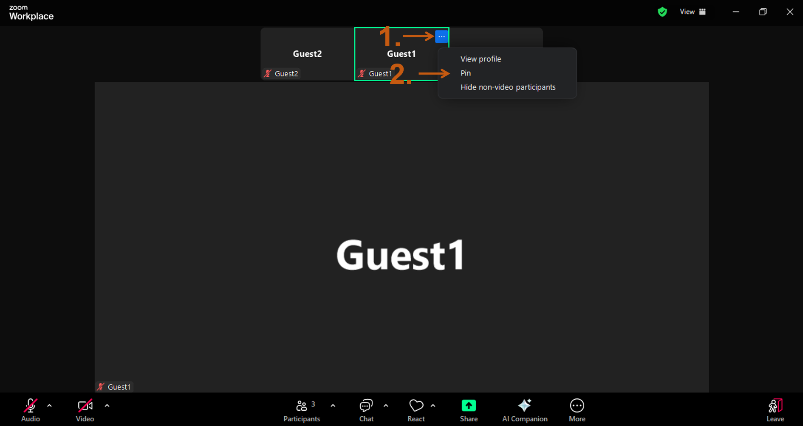

If you wish to remove the pin, click "Remove Pin" in the upper left of the screen.
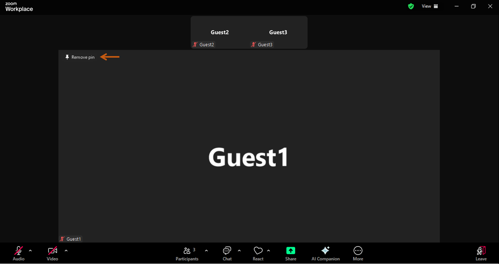

### Display multiple participants (Gallery view)
If you wish to display multiple participants' videos on a single screen, you can use the feature called Gallery view. Gallery view is a feature which displays up to 25 (or even 49) participants' videos in a grid pattern. The size of the participants' videos will be automatically adjusted until the number of participants reaches the maximum that can be displayed on the screen, and participants exceeding the maximum capacity will be placed on new pages. Additionally, the speaking participant will automatically be moved to the page you are currently viewing.

#### Steps
Press the "View" in the upper right of the screen and select the "Gallery view" or "Speaker view" from the pop-up window to switch between Speaker view and Gallery view.
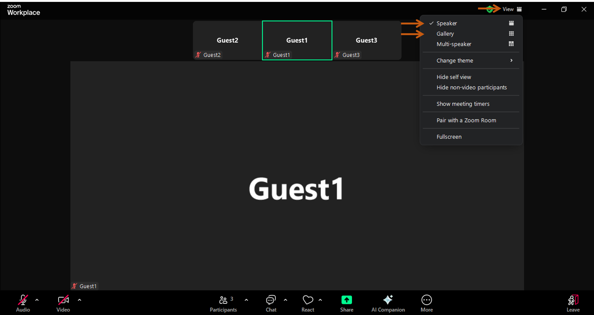

#### Setting the maximum limit.
In the Gallery view, you can set the maximum number of participants displayed on a single screen to 25 or 49. Following are the setting procedures:

* Please note that you may not be able to select displaying 49 participants due to your CPU performance. Please refer to "[Adjusting your video layout during a virtual meeting](https://support.zoom.com/hc/en/article?id=zm_kb&sysparm_article=KB0063672)" for details.

1. Press the gear icon (Settings) on the upper right of the screen.
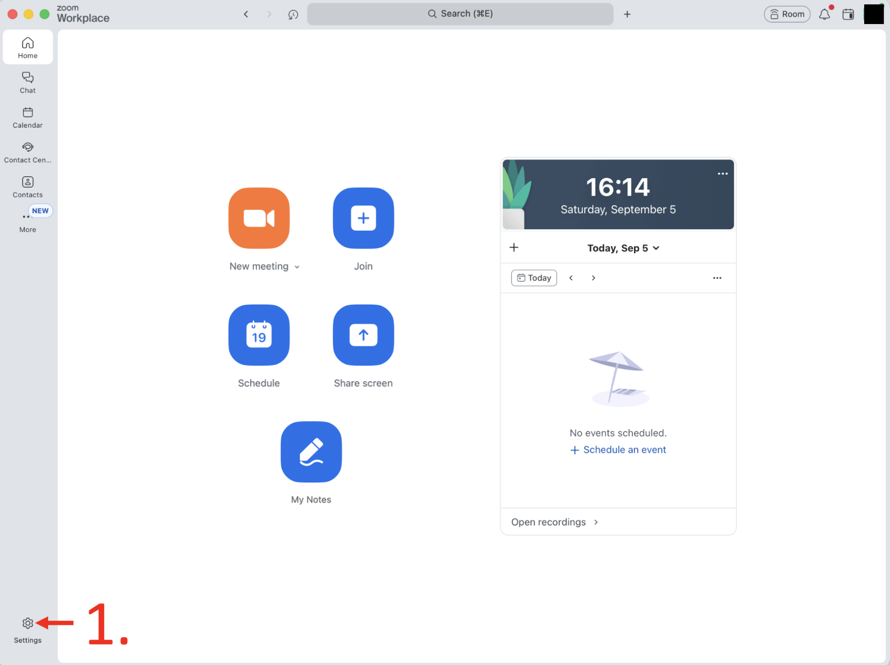
2. Press the "Video" on the left side of the setting window.
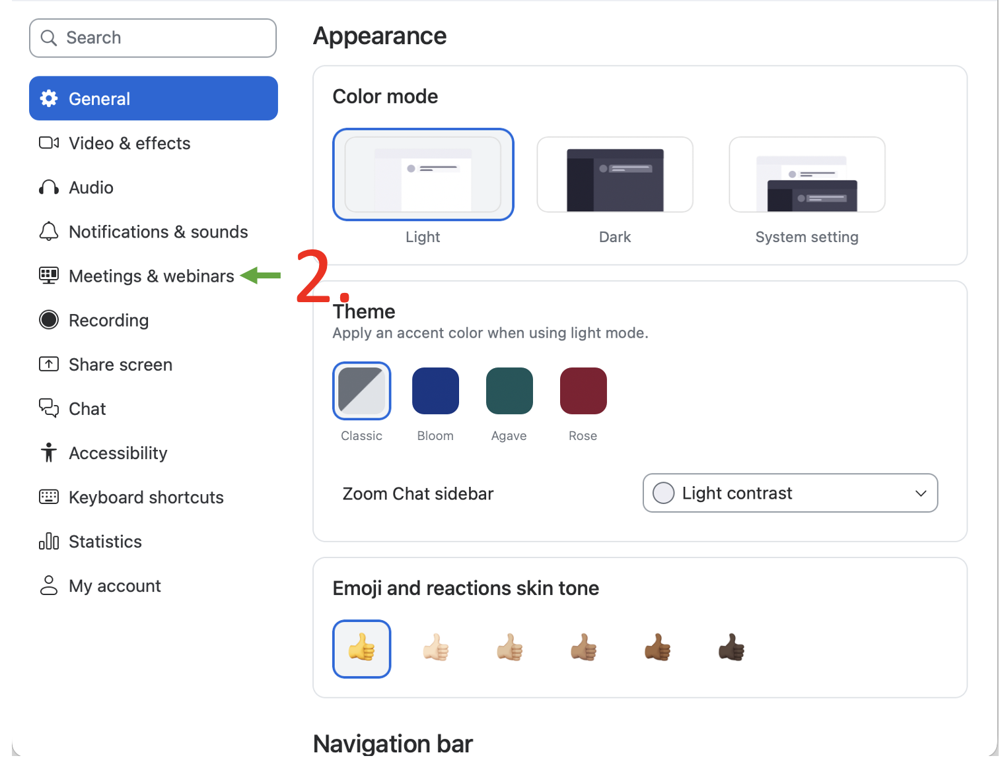
3. Select the maximum number of participants from "Maximum participants displayed per screen in gallery view"
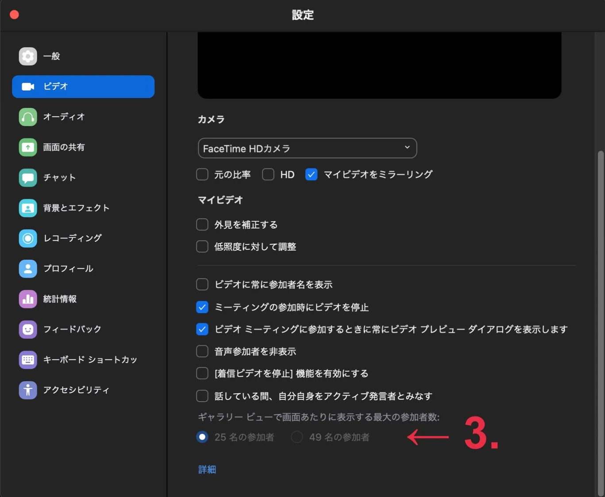

#### Customize the video layout
In Gallery view, you can customize the video layout of the participants according to your preference. If you want to change the layout, drag the video tile of the participant to your desired location on the screen.
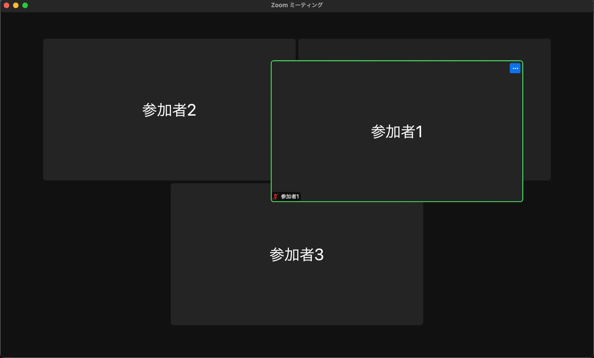
When you want to end the customization and revert to the automatic order, press "View" in the upper right corner and then click "Release Video Order".
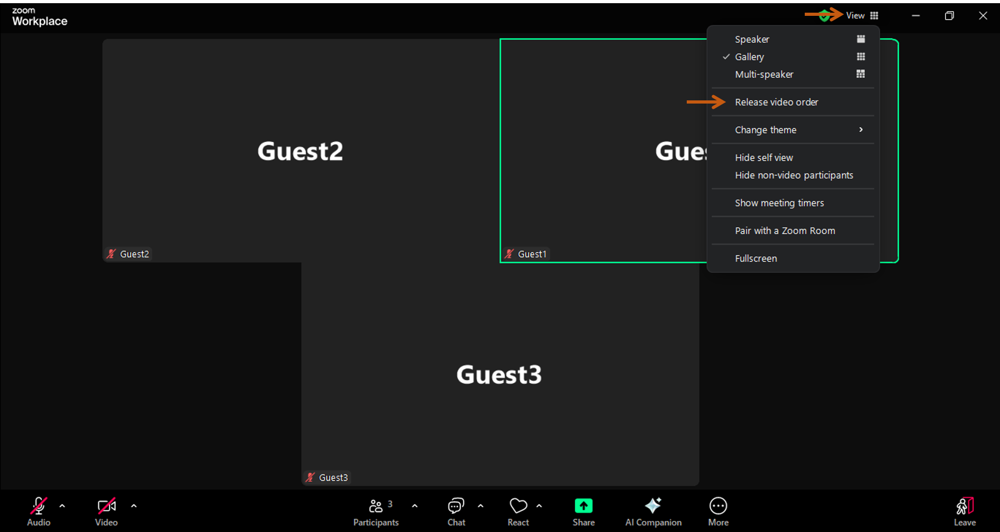

## When sharing the screen
This part explains how to configure the screen display settings when you are sharing a screen.

### Tile video of participant side-by-side during screen sharing (Side-by-side mode)
The shared screen will enter the full screen mode automatically by default when a screen is shared. If you exit from displaying full screen, the shared screen will be shown large, while the video tiles of the participants will be constrained to the top. However, there are also situations where you would want to display the participants' videos larger than the shared screen. The "Side-by-side mode" is useful in that case. 
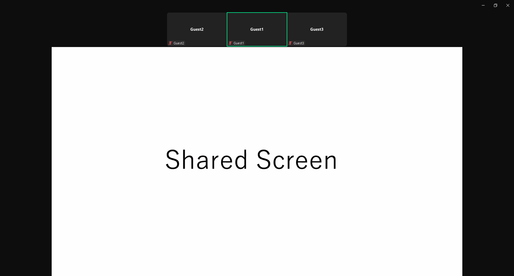
The Side-by-side mode is a feature that displays the shared screen on the left and the video of participants on the right during the screen sharing. Additionally, the videos of participants can be switched between Speaker view and Gallery view.

#### Steps
Following are the setting procedures for starting the Side-by-side mode.

1. Press "View options" on the top of the screen.
2. Press "Side-by-side mode".
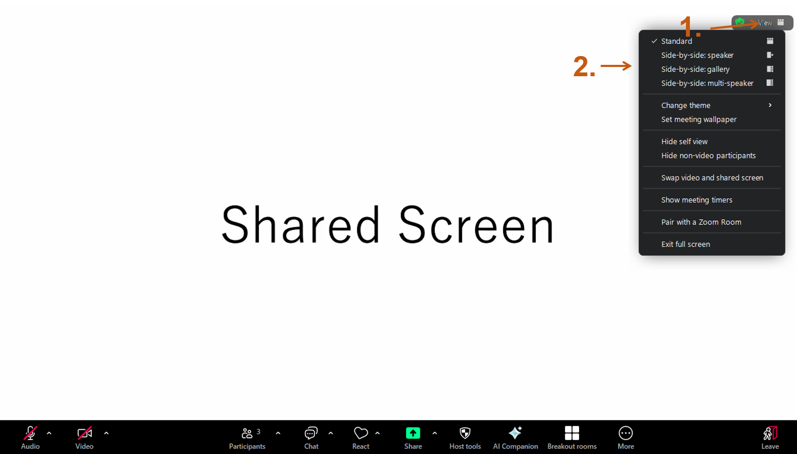

If you want to exit the side-by-side display, press the check mark of "Side-by-Side Mode" in Step 2. Additionally, you can switch between the Speaker view and Gallery view for the participants on the right side by pressing on "Display" in the top right corner of the screen.
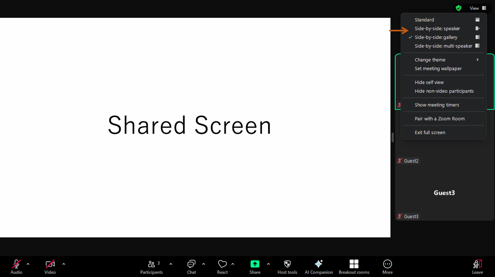

#### Change the displayed ratio between shared screen and participants' videos.
In the Side-by-side mode, the display ratio between the shared screen and participants' videos can be adjusted using a separator that divides the shared screen and the participants' videos.
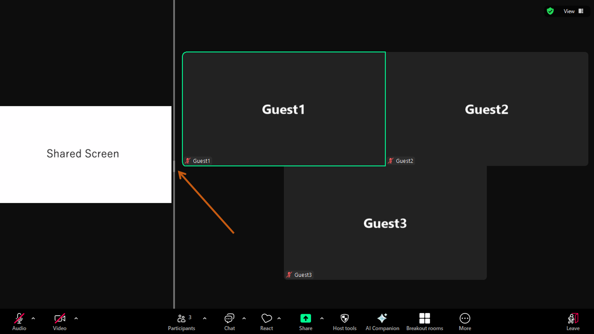
#### Set the Side-by-side mode as default.
Setting the Side-by-side mode as default would be very convenient if you wish to use a Side-by-side mode every time. Here are the steps to enable this setting:

1. Press the gear icon (Settings) at the upper right of the screen.
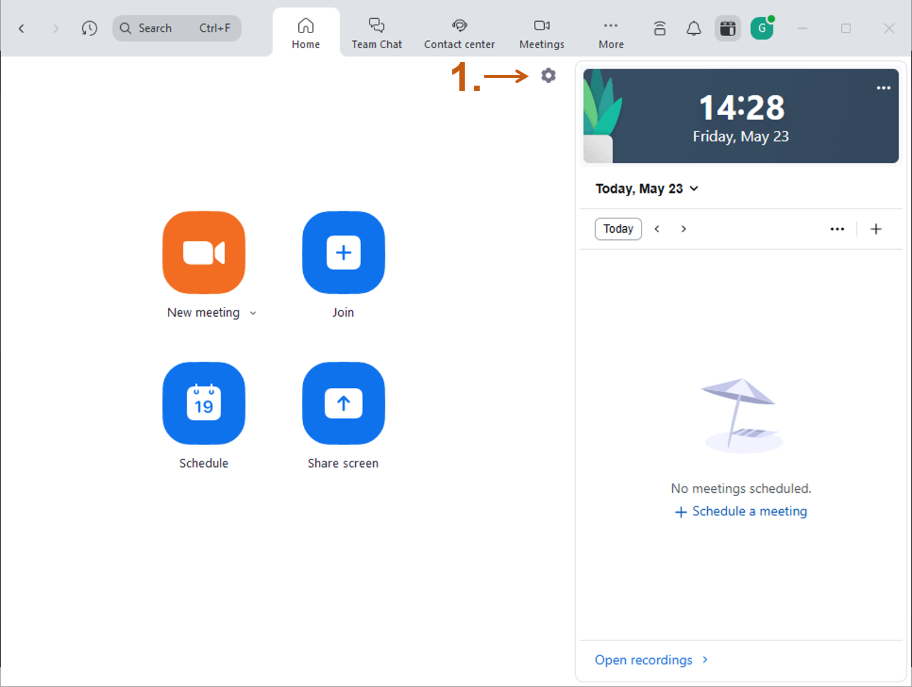
2. Press "Share screen"
3. Press the box of "Side-by-side mode" to turn it on.
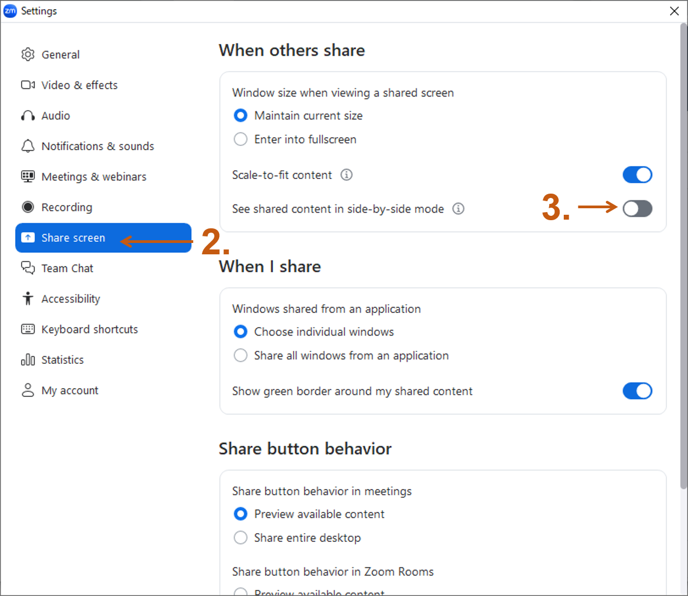

### (Supplement) Switch shared screen with a participant's video (Swap)
There is also a feature called "swap" that switches the shared screen with a participant's video, allowing for the expansion of the participant's video to be larger than the shared screen. When you press "..." at the upper right of the participant's video and set the pin, you can temporarily switch the shared screen and the participant's video.
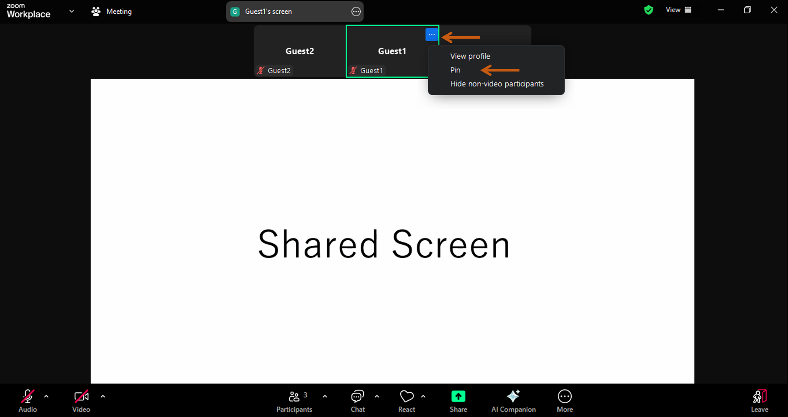
To finish the swap, press "switch to share content" at the upper left of the screen to go back to the original layout.
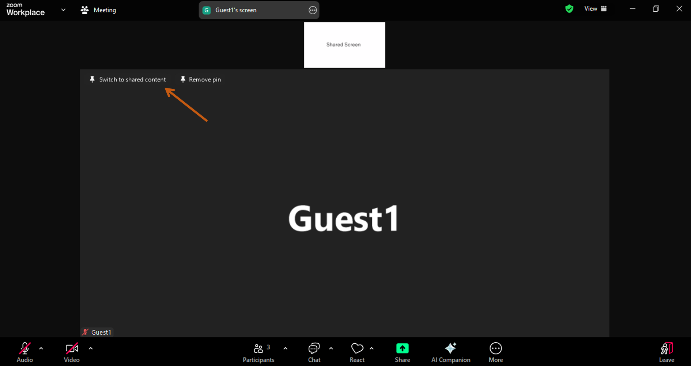
If you want to swap again, you need to remove the pin and repeat the same steps. Side-by-side mode would be more convenient in this case if there are no special requirements.

## Advanced usages available for the host
This section introduces useful features available to the host.
### Pin the displayed video to other participants (Spotlight)
There is a feature called "spotlight" that allows the host to set the video on the screens of all participants. This feature becomes available when three or more participants have their videos turned on and prevents unintended switching when, for example, a non-faculty member makes a voice or noise. It is possible to spotlight videos of up to 9 participants. Following explains the setting steps.

* This feature affects not only the hosts' own screen but also that of all participants. Additionally, participants cannot pin a video when the spotlight is on. 

1. Hover your cursor over the video of the participant you wish to spotlight and press the "..." at the upper right.
2. Press "Spotlight for Everyone" from the menu.
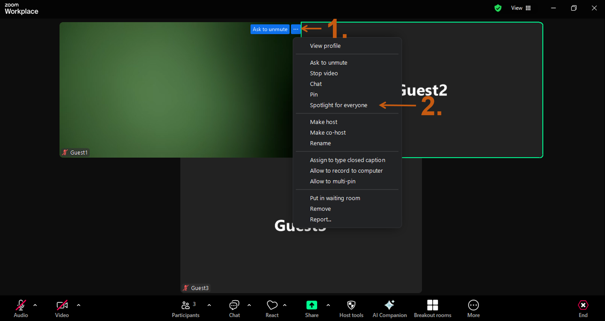

If you want to set the spotlight for more than two people, hover your cursor over another participant's video, press "..." again, and then press "Add Spotlight" from the menu.
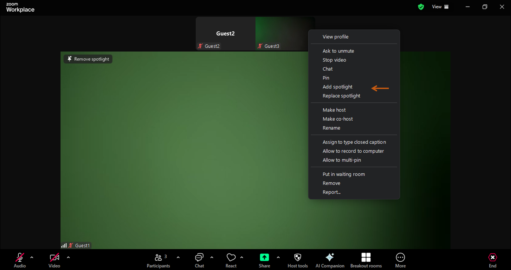
If you want to end the spotlight, press "Remove Spotlight" at the top left of the screen.
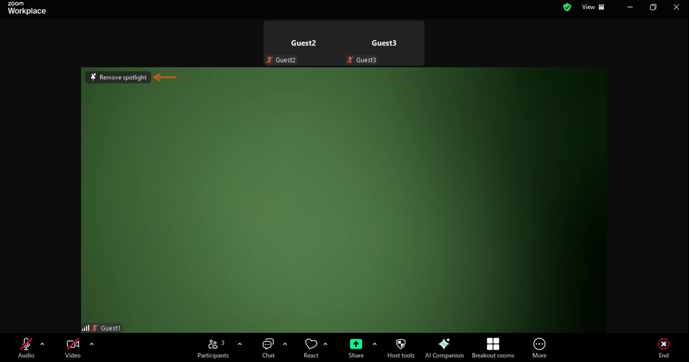

### Give the view of participants' videos only to host (Focus mode)
Focus Mode is a feature that allows the host and co-host to see all participants' videos and shared screens, while the participants can only see the video and shared screen of themselves, host and co-host. This feature is useful when only faculty members need to check the students' facial expressions, such as when conducting an exam.

#### Steps
To start Focus Mode, follow the steps below.

1. Press "More" in the meeting toolbar at the bottom of the screen.
2. Press "Start Focus Mode" in the menu.

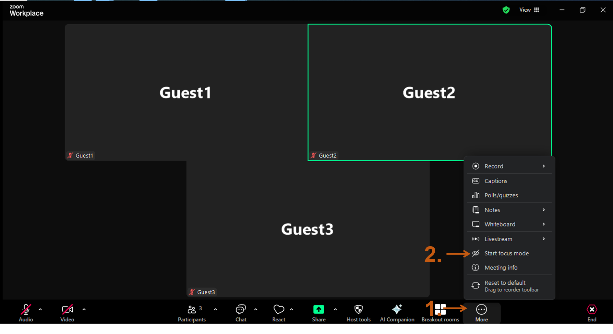
3. When the message "Start Focus mode?" appears, press "Start" to confirm or check the box labeled "Don't ask me again" to skip this confirmation process in the future.
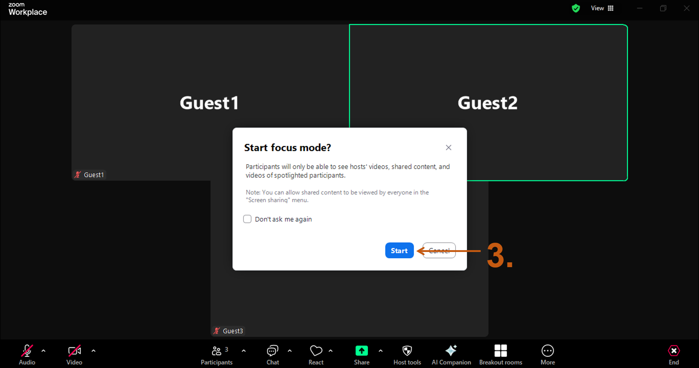
4. If a notification appears at the top of the screen stating "Participants can only see the host, co-hosts, and spotlighted users", then focus mode has been correctly enabled.
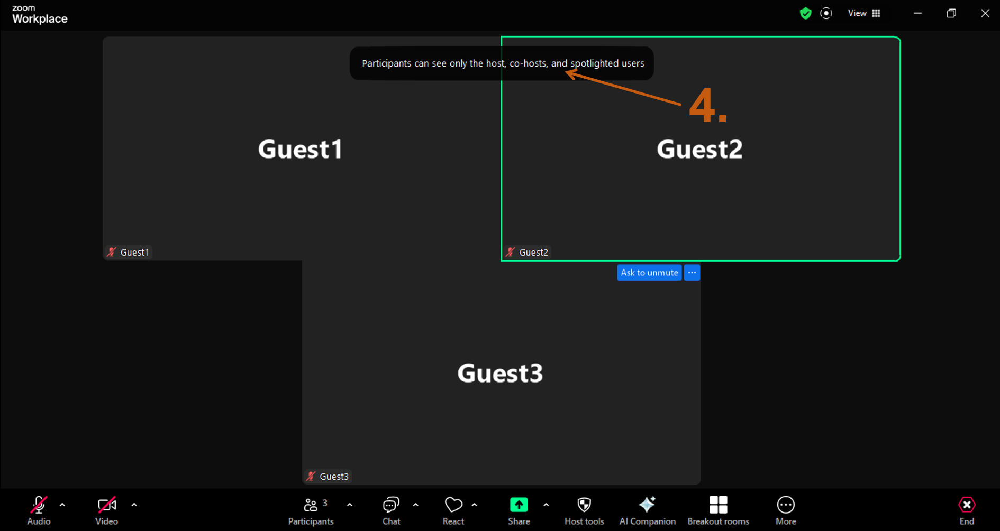

To end focus mode, press "Stop Focus Mode" in the menu that appeared after step1.
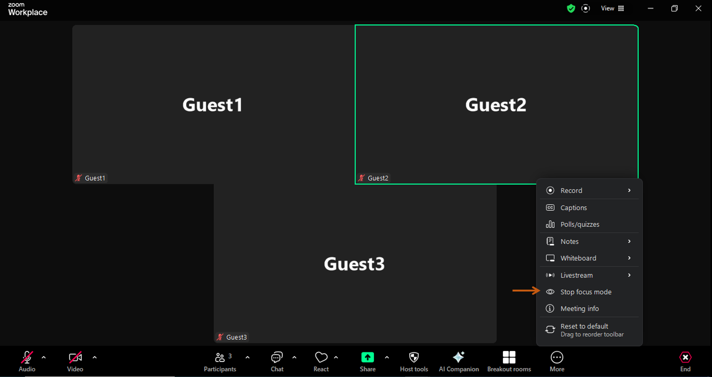

#### Spotlight during the focus mode
Setting a spotlight while in the focus mode allows you to display the videos of the spotlighted participants to other participants. This feature is convenient if you want to show only the presenter's video during a presentation and other similar cases. The setting method of spotlight is the same as [pinning the video of other participants (Spotlight)](#pin-the-displayed-video-to-other-participants-spotlight).

Additionally, the shared screens of spotlighted students are only visible to the host by default, but the host can change settings to make it visible to other participants. Following are the setting procedures.

1. Press the upward arrow "^" located at the right of the shared screen from the meeting toolbar at the bottom of the screen.
2. Press "All participants"
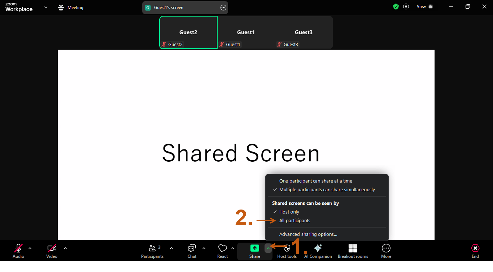

If you wish to stop sharing the videos of the spotlighted participants with other participants, press "Host only" from the screen above.
