## Introduction

This page mainly explains how to use Zoom's audio (voice function) and video features. 
As this page is quite long, please refer to the table of contents to find the sections you are interested in rather than reading the entire page. 
The overall flow is as follows.

* [How to use the audio](#audio-usage)
* [How to use the video](#video-usage)
* [About the test function](#test)
* [Troubleshooting](#troubleshooting)

First, we will explain how to use the audio and video functions in Zoom, dividing it into during the meetings and outside of meetings.
Then, we will explain the test function, which allows you to check whether or not you are using each function properly. 
If a problem occurs, you can use the test function to identify the cause of the problem. 
If you encounter a problem while using Zoom on your PC, please try the test function. 
Finally, we will explain how to solve problems in the troubleshooting section.

## How to use the audio
{:#audio-usage}

In this section, we explain how to use the Zoom audio, separating it by usage situation.

### Operating the audio when joining a meeting

#### PC

When joining a meeting, a screen may appear asking you to select how you want to connect your audio. 
If the following screen appears, click the “Join with computer audio” button. 
If you check the box at the bottom of the screen that says “Automatically join audio by computer when joining,” this screen will no longer appear. 
Therefore, if this screen does not appear, audio will be connected automatically.

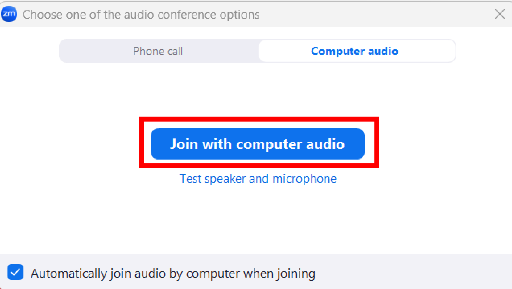{:.small.center}

#### Smartphones

When joining a meeting, a screen may appear asking you to select how you want to connect your audio. 
If the following screen appears, press the “WiFi or cellular data” button. 
If this screen does not appear, audio is connected automatically.

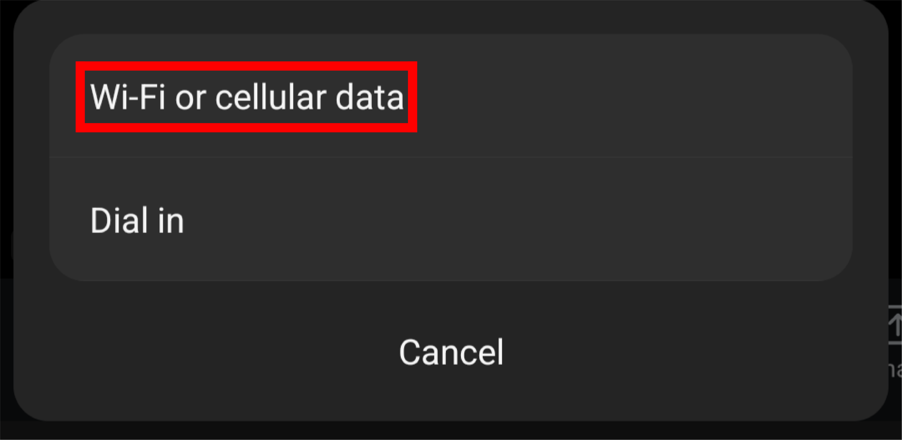{:.small.center}

### Operating the audio during a meeting

#### Mute/Unmute
{:#mute-unmute}

You can mute or unmute your microphone by clicking on the microphone icon labeled “Audio” in the lower-left corner of the window. 
When muted, a red slash will appear on the microphone icon.

If the headphone icon appears with the words “Connect to audio” instead of the microphone icon, the audio is not enabled and the audio function cannot be used. 
To use audio, press the headphone icon and select “Join with computer audio” on a PC or “WiFi or cellular data” on a smartphone from the screen that appears.

#### Switching between microphone and speakers

In the Zoom app for PC, if there are multiple speakers and microphones connected to your PC, such as built-in and external ones, you can select the ones you want to use. 
The following explains how to configure the settings.

Press the upward arrow to the right of the microphone icon in the lower left corner of the window and a list of connected microphones will be displayed under the “Select a microphone” item. 
Select the microphone you wish to use. The same applies for speakers. 
If you select “Same as system”, the same microphone as the computer settings will be used. 
Therefore, changing the computer settings will also change the settings in Zoom. Basically, selecting the default setting “Same as system” will suffice.

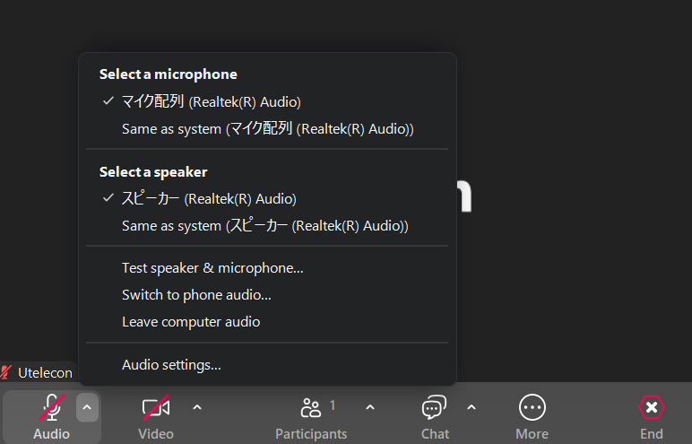{:.center.border}

#### Disconnecting the audio

If you are joining a Zoom meeting but do not need to communicate by voice, you can leave the audio and turn off the audio function. 
For example, when you disconnect the audio, your voice will no longer be heard by other participants, and you will also be unable to hear the voices of other participants. 
The following explains how to operate each device.

##### PC
Press the upward arrow to the right of the microphone icon to display a menu, then select “Leave computer audio”.

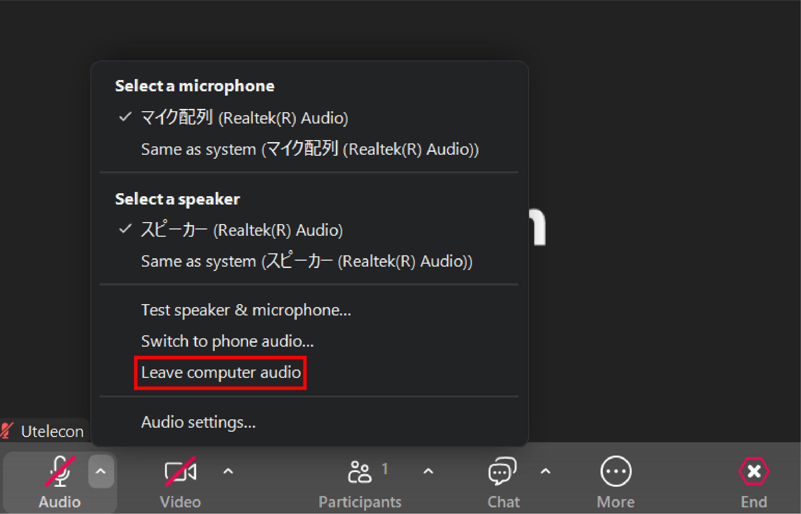{:center.border}

To reconnect to the audio, press the headphone icon at the bottom left and select “Join with computer audio”.
##### Smartphones

Press the “Disconnect audio” button at the bottom of the menu that appears when you press the “More” button.

<figure class="gallery">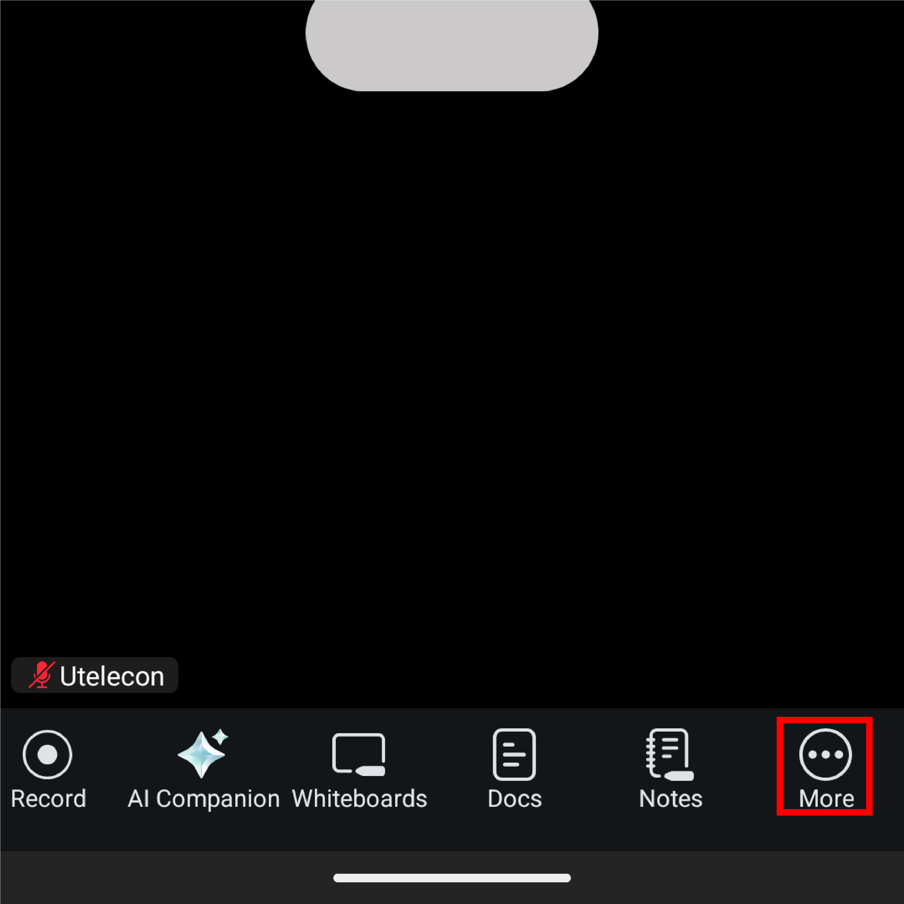{:.small.center.border}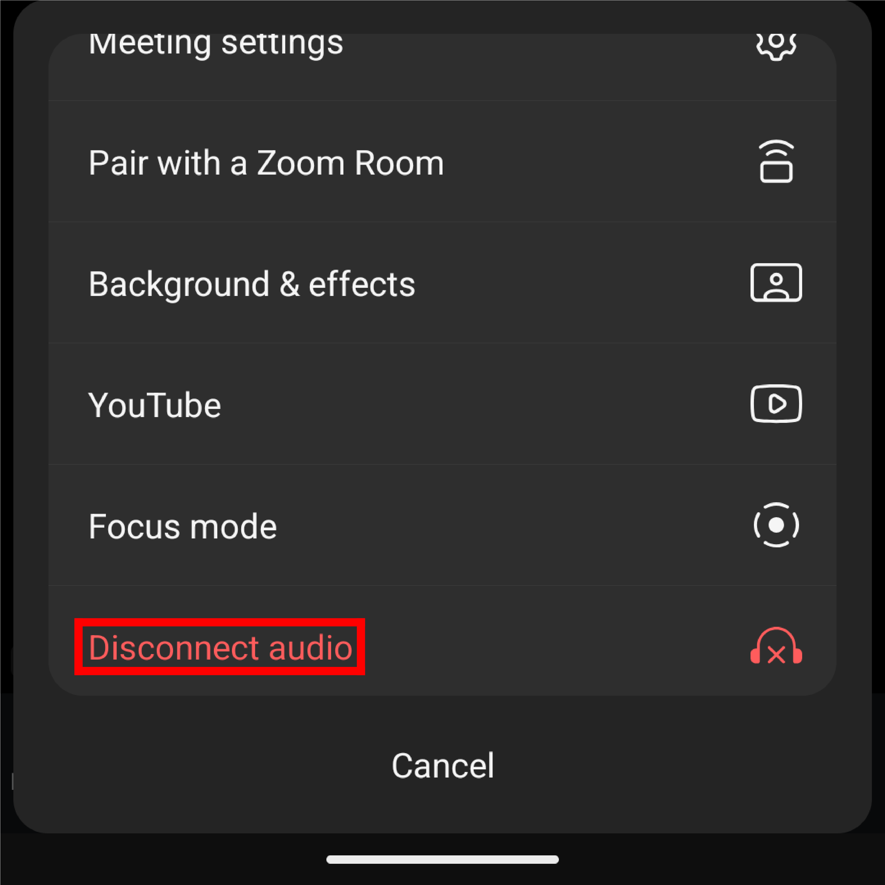{:.small.center.border}</figure>

To reconnect to the audio, press the headphone icon at the bottom left and select “Join audio”.

#### Testing microphones and speakers

This feature is only available on PCs. For details, please refer to “[About the test feature](#test)”.

#### Operations that can only be performed by the host or co-host

If you are the host or co-host of a meeting, you can mute other participants during the meeting or unmute them.

* **Muting other participants**：To mute a specific participant, click on the icon labeled “Participants” on your PC, select the name of the participant you want to mute from the list of participants that appears, and click “Mute”.
  * For smartphones, press the name of the participant you want to mute, then press “Mute” in the display that appears.
* **Unmuting other participants**：To unmute a specific participant, click the “Participants” tab on your PC, place the cursor over the name of the participant you want to unmute, and click “Ask to unmute”. When you ask to a participant to unmute, a screen will appear on the participant’s screen asking them to choose whether to unmute or remain muted.
  * For smartphones, tap the name of the participant you want to unmute, then tap “Ask to unmute” in the display that appears.

You can also use the host tool to set whether or not to allow participants to use the video function or to be able to unmute themselves. 
The host tools icon is displayed at the bottom of the screen on a PC, and on a smartphone, you can access it by tapping “More” ➝ “Host tools” at the bottom of the screen.

### Setting up the audio
{:#setup-for-meeting}

Here, we explain the audio settings that are considered useful.

#### Settings when joining a meeting

##### PC

You can configure your audio settings in the “Meetings & webinars” and “Audio” tab of the settings screen that appears when you tap the gear icon in the upper right corner of the application’s Home tab. 
Here, we will explain these settings.

{:.center.border}
{:.small.center.border}

* **Automatically connect to computer audio when joining (Meetings & Webinars tab)**：Checking this option will prevent you from being prompted to connect to audio each time you join a meeting.
  * On macOS, “Automatically connect to Computer Audio when joining” will be displayed.
* **Mute microphone when joining (Meeting & Webinar tab)**：Checking this option will mute your microphone from the start when you join a meeting. This reduces the chance of accidentally speaking during the meeting.
* **Background noise suppression (Audio tab)**：This feature suppresses sounds other than participants' voices. There are four options: “Auto”, “Low”, “Medium”, and “High”. Generally, the default “Auto” setting is sufficient. If voices become difficult to hear with “Auto,” adjust the setting.

##### Smartphones

Tap the profile icon in the upper-left corner of the application’s Home tab, then tap “Settings” within it. 
Then, tap “Meeting” to configure audio and video settings during the meeting.

* Auto-connect to audio: Enabling this feature prevents the system from asking you to connect audio each time you join a meeting. Selecting “WiFi or cellular data” is sufficient.

<figure class="gallery">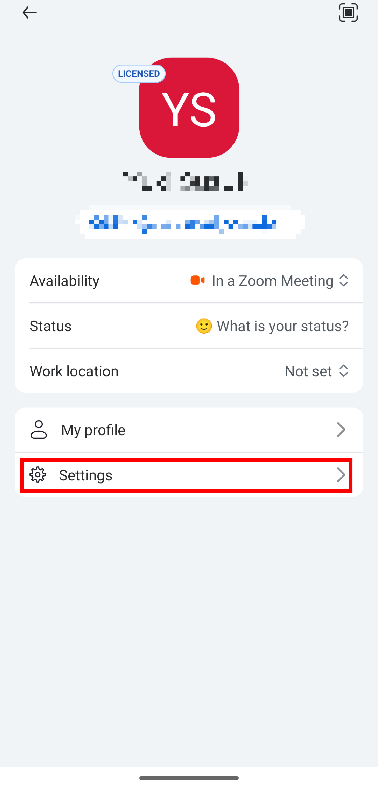</figure>
<figure class="gallery">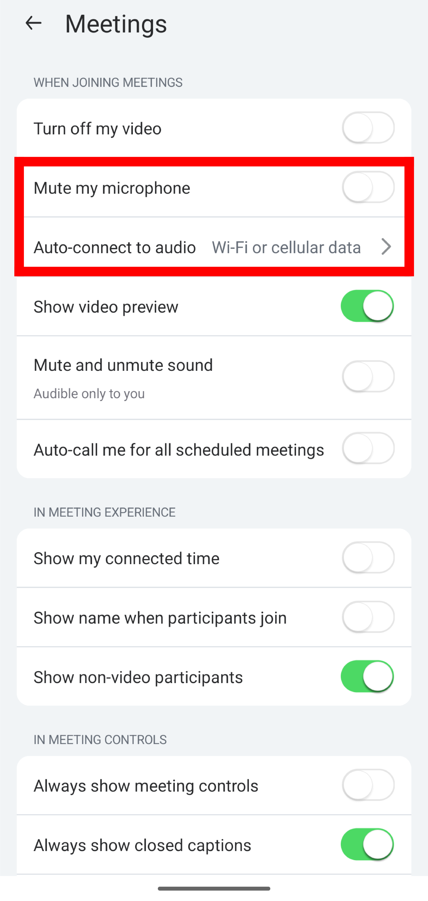</figure>

#### Settings when creating a meeting

Next, we will explain some useful settings that you can configure when creating meetings. 
To access these settings, go to your [Zoom account page](https://u-tokyo-ac-jp.zoom.us/profile/setting) and open the “Meeting” tab under “Settings.”

* **Mute all participants when they join a meeting**：When enabled, all participants will be automatically muted when joining the meeting. This prevents participants' audio from accidentally leaking.

## How to use the video
{:#video-usage}
Here, we will explain how to use the Zoom video based on different usage scenarios.

### Toggling the video on/off

Press the icon labeled “Video” in the lower left corner to toggle the video on or off. When the video is paused, a red slash will appear on the video icon.

### Switching cameras

In the Zoom app for PC, if multiple cameras are connected to your PC, you can select the camera you want to use within the app. 
The following explains how to configure this setting.

Press the upward arrow to the right of the video icon to display the “**Select a camera**” option. 
Below this option, a list of connected cameras will appear. Select the camera you wish to use.

### Setting the background and other elements

In Zoom, you can set video backgrounds or avatars. 
For details on each feature, please refer to the “[Set up a virtual background to hide the background from the camera](/en/zoom/usage/mic_cam/virtual_background/)” page.

### Operations available only to the host and co-hosts
{:#video-host-operations}
If you are the host or co-host of a meeting, you can perform actions such as toggling other participants' video on or off during the meeting.

* **Ask for video on**：You can ask participants to turn on their video. Press the “Participants” tab, hover your cursor over the name of the participant you want to have their video switched on. Then press the three-dot menu that appears and select “Start video request” or “Ask to start video”. When requested, the following screen will appear on the participant’s screen. Pressing “Start my video” will turn their video on, while pressing “Later” will keep it off.
  * For a smartphone, tap the name of the participant you wish to request to have their video switched on. Then, tap “Ask to start video” in the menu that appears.

{:.small.center.border}

* **Stopping video**：You can switch off the video of participants who have their video on. Press the “Participants” tab, hover your cursor over the name of the participant whose video you want to stop. Then press the three-dot menu that appears and select “Stop video”. If the stopped participant is not the host or co-host, they will not be able to start their video themselves. To start it, the host must perform the “Ask video on” operation described above.
  * For a smartphone, tap the name of the participant whose video you want to stop. Then, tap “Stop video” in the menu that appears.

Additionally, using the “Host tools” feature allows you to set whether or not to permit video functionality and unmute for all participants. 
On a PC, click the icon labeled “Host tools” displayed at the bottom of the screen. 
On a smartphone, tap “More” ➝ “Host Tools” displayed at the bottom of the screen.

### Setting up the video

Here, we will explain the particularly useful settings for each device, grouped by category.

#### Settings when joining a meeting

This explains the settings you can configure when joining a meeting.

##### PC

You can configure the video settings in the “Video & effects” and “Meetings & webinar” tabs of the settings window, which appears when you click the gear icon in the upper-right corner of the application’s Home tab. 
Here, we explain some of the particularly useful settings among these options. 
Please note that if a camera is connected, you can preview the video in the ‘Video & effects’ tab.

{:.border}
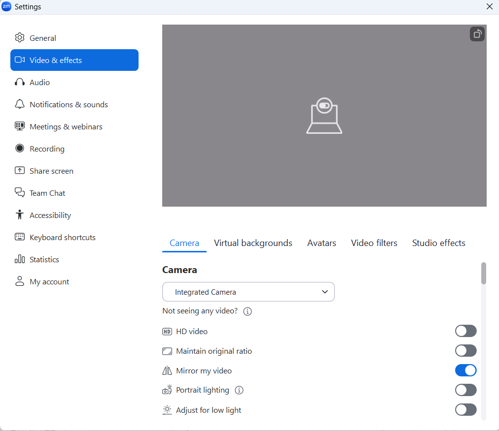{:.small.center.border}

* **Keep the camera off (Meetings and Webinars: Join experience)**：Checking this option will ensure that your video will be off when you join a meeting. This may prevent you from accidentally showing other participants something you don't want them to see.

##### Smartphones

Press “More” in the lower-right corner, then press “Meeting settings” under Settings. 
In the Meeting Settings that appear, you can configure various settings. Here, we explain some of the most useful settings among these options.

* **Touch up my appearance**：Touch up my appearance: Enabling this feature allows you to blur your skin.

<figure class="gallery">{:.small.border}{:.border}</figure>

#### Settings when creating a meeting
Next, we will explain the settings you can configure when creating a meeting. 
To access these settings, go to your [Zoom account page](https://u-tokyo-ac-jp.zoom.us/profile/setting?tab=meeting) and open the “Meeting” tab under “Settings.” 
The following options are available under the “In Meeting (Advanced)” section.

* **Meeting-HD Video Quality**：Enabling this option allows you to use higher-quality video than standard. However, at UTokyo this feature is locked by the administrator and cannot be enabled by default. If you wish to use it, please contact us via [the support email form](リンク必要？）.
* **Immersive View**：A feature that consolidates participants' video feeds onto a single screen. This allows you to instantly see the expressions of multiple participants.
  * Before creating a meeting, you must configure the settings under “Settings” → “In Meeting (Advanced)” in your Zoom account.
  * The maximum number of people that can be displayed on a single screen using this feature is 25.

## About the test function
{:#test}

Zoom has a “Test” feature that allows you to check how the audio and video can be used and configured in a meeting before joining. 
We recommend using the Test feature in the following situations:

* If you are unfamiliar with Zoom operations
* If you are familiar with Zoom operations but want to double-check to ensure important meetings proceed smoothly
* If you experience issues with your audio or video and wish to investigate the cause of the problems

Please note that the test function is available only on PCs.

### Testing the Audio
{:#audio-test}

We will explain the audio test procedures and verification methods separately for each situation.

#### Before joining the meeting

##### Opening the test function screen

Tap the gear-shaped button in the upper-right corner of the application’s home screen to open the settings screen, then select the “Audio” tab.

  {:.border}

##### Conducting a test
{:#doing-audio-test}

* **Testing the speakers**：Press the “Test Speaker” button to play an audio clip. Simultaneously, a bar will move according to the volume. The further the bar moves to the right, the louder the sound. Verify that the volume changes audibly based on the bar's position.
* **Test microphone**：Press the “Test microphone” button to display “Recording” and begin recording an audio. A bar will move in response to the volume of the recorded sound. The further the bar moves to the right, the louder the sound. Press the ‘Recording’ button again to display “Playing” and listen to the recorded audio. Please verify that your voice is being recorded.

  {:.medium.center}

#### When joining a meeting

##### Open the test function screen

If the [“Automatically connect to computer audio when joining” setting](#setup-for-meeting) is turned off, 
please click “Test speaker and microphone” in the window that appears when you join the meeting.

  {:.small.center}

##### Conduct a test
Here's how to check your microphone and speakers.

1. Pressing the “Test speaker and microphone” button will first initiate the speaker test. An audio will play, and the volume will be displayed in the “Output level” section. The number of black squares displayed indicates the volume level, with more squares representing higher volume. Please verify that the volume changes based on the number of black squares displayed.
2. If there are no issues, press “Yes”. If there are issues, press the “No, try another speaker” button or select another speaker and verify in the same manner.

   {:.small.center}

3. Next, a microphone test will be performed. When you make a sound yourself, please confirm that the number of black squares displayed in the section labeled “Input level” increases according to the volume of that sound.
4. If there are no issues, press “Yes”. If there are issues, press the “No, try another microphone” button or select another microphone and verify in the same manner.

   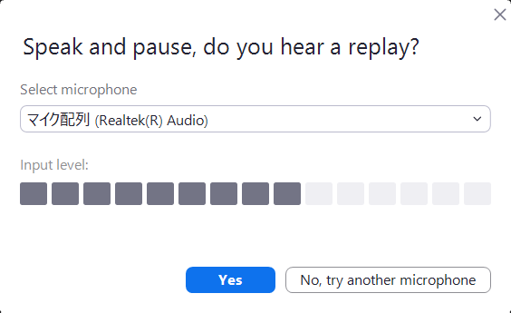{:.small.center}

#### During the meeting

##### Opening the test function screen
Press the upward arrow to the right of the microphone icon to display an additional menu. 
Press the “Test speaker & microphone” button to open the test function screen.

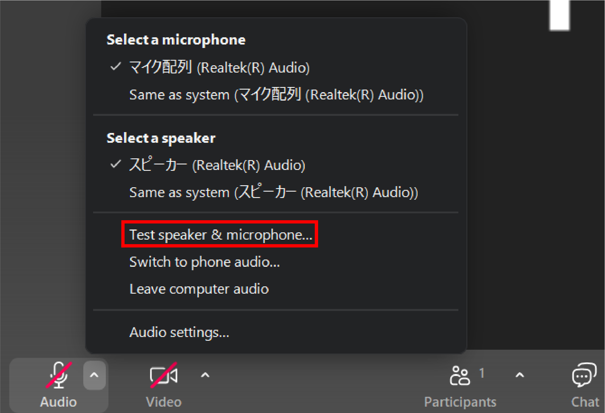

##### Conduct a test
The testing procedure in this case is the same as before the meeting, so please refer to [this](#doing-audio-test).

### Testing the video
{:#video-test}

#### Open the test function screen

* **Before joining a meeting**：Tap the gear-shaped button in the upper-right corner of the application's home screen to open the settings screen, then select the “Video & effects” tab.

{:.border}

* **During the meeting**：Press the arrow icon displayed in the upper right corner of the video icon, then press “Video settings...”.

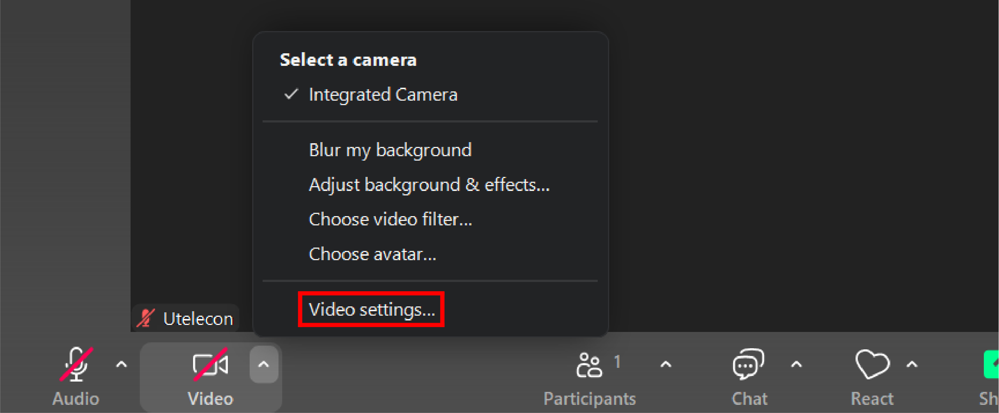{:.border}

#### Conduct a test
When you open the test function screen, if a camera is connected, the video will be displayed as shown in the image below. 
Please verify that the video is displayed as expected.

{:.border}

If you encounter issues with the audio (microphone/speakers) or video during the above tests, 
please check the “[Troubleshooting](#troubleshooting)” section below.

## Troubleshooting
{:#troubleshooting}

This section explains how to resolve issues with the Zoom audio and video. Please identify which feature is experiencing problems.
* [Audio](#troubleshooting-audio)
  * [Problem with the speakers (cannot hear the other party)](#speaker-trouble)
    * [Only specific speakers are not audible.](#specific-speaker-trouble)
    * [The speakers are fine, but I can't hear anything.](#audio-trouble-other-than-speakers)
  * [Problem with the microphone (my voice isn't reaching the other party)](#mic-trouble)
    * [Only specific microphones cannot be used.](#specific-mic-trouble)
    * [The microphone itself is fine, but the audio isn't being recognized.](#audio-trouble-other-than-mic)
* [Video](#video-trouble)
  * [I am the only one where other participants' videos are not being displayed](#other-video-trouble)
  * [My video is not visible to other participants.](#my-video-trouble)
    * [Only specific cameras cannot be used.](#specific-camera-trouble)
    * [The camera itself is fine, but it's not displaying anything.](#video-trouble-other-than-camera)

### Audio
{:#troubleshooting-audio}
For a PC, first perform an audio test following the “[Audio test](#audio-test)” procedure, then refer to the applicable items below. 
For a smartphone, check all troubleshooting steps that closely match your symptoms.

If you are experiencing issues beyond just speakers or microphones, or if the problem persists after following the steps below, 
please refer to the “[General troubleshooting methods for audio and video issues](#general-troubleshooting)”.

#### Problem with the speakers (cannot hear the other party)
{:#speaker-trouble}

##### Only specific speakers are not audible
{:#specific-speaker-trouble}

If you can hear the voices when switching to different speakers, 
or if you cannot hear any voices even when a specific speaker is selected, 
there may be an issue with the speakers you are using. Please check that the speakers are turned on and properly connected. 
If you still cannot hear any sound even after changing speakers, or if the speaker test shows no issues, 
please refer to the section below titled “[The speakers are fine, but I can't hear anything](#audio-trouble-other-than-speakers)”.

##### The speakers are fine, but I can't hear anything
{:#audio-trouble-other-than-speakers}

Please check if the following issues are occurring.
* **The device volume is set to 0.**
* **Microphone permission has not been granted to Zoom**：To grant microphone access, please follow the steps below.
  * For Windows: Go to Start > Settings > Privacy or Privacy & Security > Microphone, then allow access for Zoom.
  * For macOS: Go to System Settings → Privacy & Security → Microphone, then turn on Zoom.
  * For iOS: Go to Settings → Privacy and Security → Microphone, then turn on Zoom.
  * For Android: Go to Settings → Apps → Zoom. Next, go to Permissions → Microphone and turn on Zoom.
* **Multiple applications using speakers are running simultaneously, causing interference**：If you have multiple applications using speakers running at the same time, they may interfere with each other. Therefore, if you wish to use speakers in Zoom, please close any other applications using speakers.
* **Audio is disabled**：If the headphone icon appears in the bottom left corner of the meeting screen instead of the microphone icon, the audio functionality is not enabled. Press “Connect to Audio” (headphone icon), then press “Join with computer audio” on a PC or “WiFi or cellular data” on a smartphone.

If the above methods do not resolve the issue, please refer to the “[General troubleshooting methods for audio and video issues](#general-troubleshooting)”.

#### Problem with the microphone (my voice isn't reaching the other party)
{:#mic-trouble}

If the sound you're making isn't reaching the other party, there's a high chance that your microphone is malfunctioning. 
Please check if any of the following issues apply:

##### Only specific microphones cannot be used.
{:#specific-mic-trouble}

If switching to a different microphone allows your voice to be transmitted, or if a specific microphone does not transmit when selected, 
there may be an issue with the microphone you are using. 
Please check that the microphone is turned on and properly connected. 
If no sound is transmitted even after changing microphones, or if a microphone test shows no issues, 
please refer to the section below titled “[The microphone itself is fine, but the audio isn't being transmitted](#audio-trouble-other-than-mic)”.

##### The microphone itself is fine, but the audio isn't being recognized.
{:#audio-trouble-other-than-mic}

Please check if the following issues are occurring.

* **Microphone permission has not been granted to Zoom**：To grant microphone access, please follow the steps below.
  * For Windows: Go to Start > Settings > Privacy or Privacy & Security > Microphone, then allow access for Zoom.
  * For macOS: Go to System Settings → Privacy & Security → Microphone, then turn on Zoom.
  * For iOS: Go to Settings → Privacy and Security → Microphone, then turn on Zoom.
  * For Android: Go to Settings → Apps → Zoom. Next, go to Permissions → Microphone and turn on Zoom.
* **Multiple applications using microphones are running simultaneously, causing interference**：If you have multiple applications that use microphones running at the same time, they may interfere with each other. Therefore, if you wish to use microphones in Zoom, please close any other applications using microphones.
* **Audio is disabled**：If a headphone icon appears in the bottom left corner of the meeting screen instead of a microphone icon, the audio functionality is not enabled. Press “Connect to Audio” (headphone icon), then press “Join with computer audio” on a PC or “WiFi or cellular data” on a smartphone.

If the above methods do not resolve the issue, please refer to the “[General troubleshooting methods for audio and video issues](#general-troubleshooting)”.

### Video
{:#video-trouble}

For a PC, first perform a video test following the procedures in the “[Testing the Video](#video-test)”, then check the applicable items below. 
For smartphones, check all countermeasures closest to the symptoms you are experiencing.

If you are experiencing issues beyond video playback, or if the problem persists after following the steps below, 
please refer to the “[General troubleshooting methods for audio and video issues](#general-troubleshooting)”.

#### I am the only one where other participants' videos are not being displayed
{:#other-video-trouble}
Network issues may be the cause. Try the “[General troubleshooting methods for audio and video issues](#general-troubleshooting)”.

#### My video is not visible to other participants
{:#my-video-trouble}

##### Only specific cameras cannot be used
{:#specific-camera-trouble}
If the video is displayed when switching to a different camera, the camera you are using may be malfunctioning. 
Please verify that the camera is powered on and properly connected. If the video test shows no issues, proceed to the next item.

##### The camera itself is fine, but it's not displaying anything
{:#video-trouble-other-than-camera}
If changing the camera does not resolve the issue, the following causes may be possible.

* **The video has not started**：Press the video icon in the lower left corner to start the video.
* **The host has stopped the video**：If you cannot start the video, the host may have stopped it. Therefore, please ask the host to press “[Ask to start video](#video-host-operations)”.
* **Zoom does not have access permissions for the device**：To grant access permissions, follow the steps below.
  * For Windows：Go to Settings → Privacy or Privacy & Security → Camera, then turn on “Allow this device to access the camera” and “Allow desktop apps to access the camera.”
  * For macOS：Go to System Settings → Privacy & Security → Camera and turn on Zoom.
  * For iOS：Go to Settings → Privacy and Security → Microphone, then turn on Zoom.
  * For Android (confirmed on Pixel 6a running Android 13)：Go to Settings → Apps → Zoom, then navigate to Permissions → Camera and grant camera permission.
* **Multiple applications using the same camera are running simultaneously, causing interference**：If you have multiple applications using the same camera running at the same time, they may interfere with each other. Please close any other applications using the same camera.
* **The driver is not the latest version (for non-macOS systems)**：The camera driver version may not be up to date. For instructions on how to check the version, please refer to “[Troubleshooting issues with Zoom video crashing or freezing](https://support.zoom.com/hc/en/article?id=zm_kb&sysparm_article=KB0062684)”.

### General troubleshooting methods for audio and video issues
{:#general-troubleshooting}
Here, we provide solutions for audio or video issues that persist even after trying the methods above, as well as solutions for other problems that may arise. 
Please try the following troubleshooting steps.

* **Change the network.**
  * There may be an issue with your network connection. Please check your connected devices or use another network. If you are connected to Wi-Fi, try moving to a different location.
* **Restart the Zoom app.**
  * Click the × button displayed in the upper-right corner of the Zoom app to close it, then restart the application.
* **Restart the PC itself, external speakers, and so on.**
* **Use the latest version of Zoom.**
  * Updating may resolve bugs that occurred in older versions. For instructions on how to update, please refer to the “[Updating Zoom to the latest version](https://support.zoom.com/hc/en/article?id=zm_kb&sysparm_article=KB0060716)” page.
* **Uninstall the Zoom app, then reinstall it.**
  * For uninstallation instructions, please refer to “[Uninstalling and reinstalling the Zoom application](https://support.zoom.com/hc/en/article?id=zm_kb&sysparm_article=KB0065146)”.
* **Update the operating system and drivers to the latest versions.**
  * A driver is software that enables specific hardware devices to function on a PC. Updating the drivers can resolve bugs and issues that occurred in older versions.
  * Please visit the support page or download page for your device and update the driver to the latest version.
* **Clear Zoom's cache and cookies.**
  * Cache and cookies are files that temporarily store frequently used data to enable faster access. Deleting them can sometimes resolve various issues.
  * For Windows
    1. Please open Explorer.
    2. Navigate to `C:/Users/Username/AppData/Roaming/Zoom` and delete the `data` folder located there.
  * For Mac
    1. Please open Finder.
    2. Click \[Go\] in the menu bar at the top of the screen, then select \[Go to Folder\].
    3. After entering `/Library/Application Support/zoom.us` in the window that appears, double-click to open the Zoom folder.
    4. Please delete the `data` folder.
  * For Android (confirmed on a Pixel 6a running Android 13)
    1. Press “Settings” → “Apps” on your device.
    2. Scroll down, select “Zoom” from the list of apps, then tap “Storage & Cache” → “Clear Data” → “Clear Cache”.
  * For iOS
    1. Tap Settings → General → iPhone Storage in sequence.
    2. Scroll down, select “Zoom” from the list of apps, and tap “Delete App.”
    3. Please reinstall the app from the App Store.
  
If the problem persists even after trying the above solutions, please contact our [**Technical Support Desk**](/en/support/).
