## What is a virtual background

The virtual background feature allows you to project an image or video of your choice as a background during a Zoom meeting. By setting up a virtual background, you can prevent privacy-related images, such as those of your own room, from being shown during a camera-on meeting, or create a suitable environment for a meeting. If you set up a virtual background before the meeting, the virtual background will automatically appear when you turn on the camera during the meeting. It can also be activated during the meeting, even if it is not set before the meeting.

This page introduces the basic operation procedures for the Windows Zoom application. However, the macOS application can be used in almost the same way. The virtual background is also available on smartphones and tablets, but the operation procedures are different.

## How to set a virtual background

### Setting up before a meeting

1. Launch the Zoom application, open “Settings” and select “Background & effects”.
  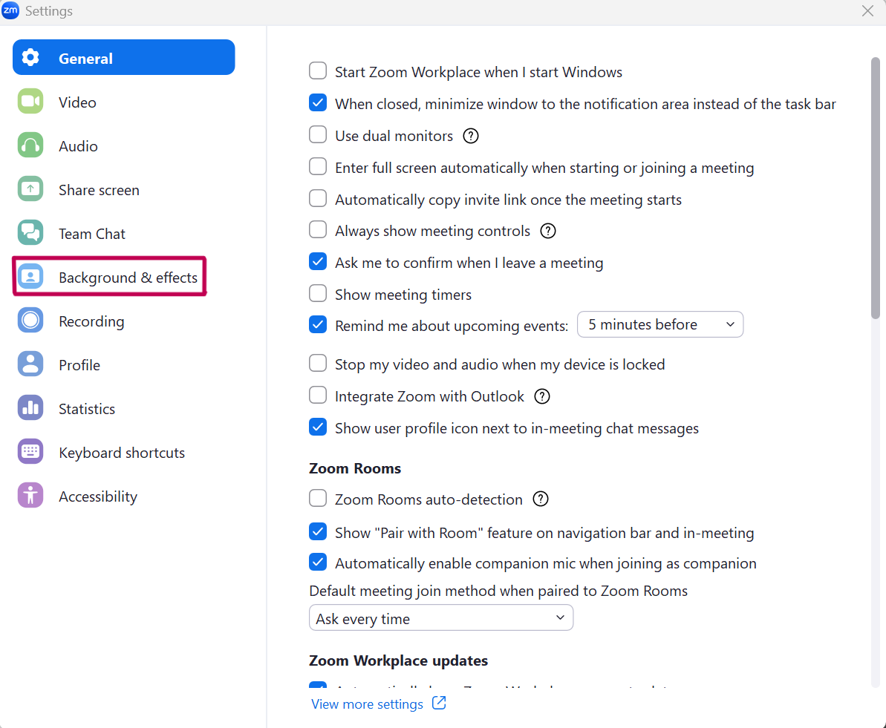

2. Select the virtual background of your choice. (If you select “None”, no virtual background will be set. Select “Blur” to simply blur the background instead of replacing it with an image or a movie).
  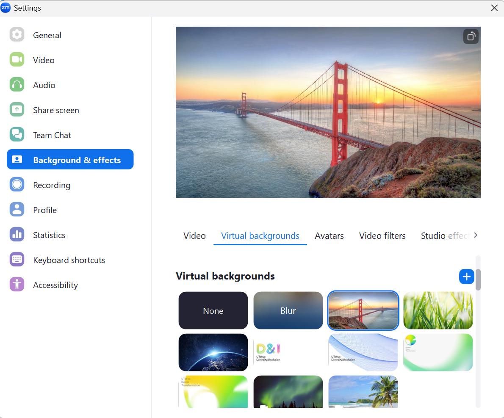

   * Select the “+” to upload an original image as a virtual background.
     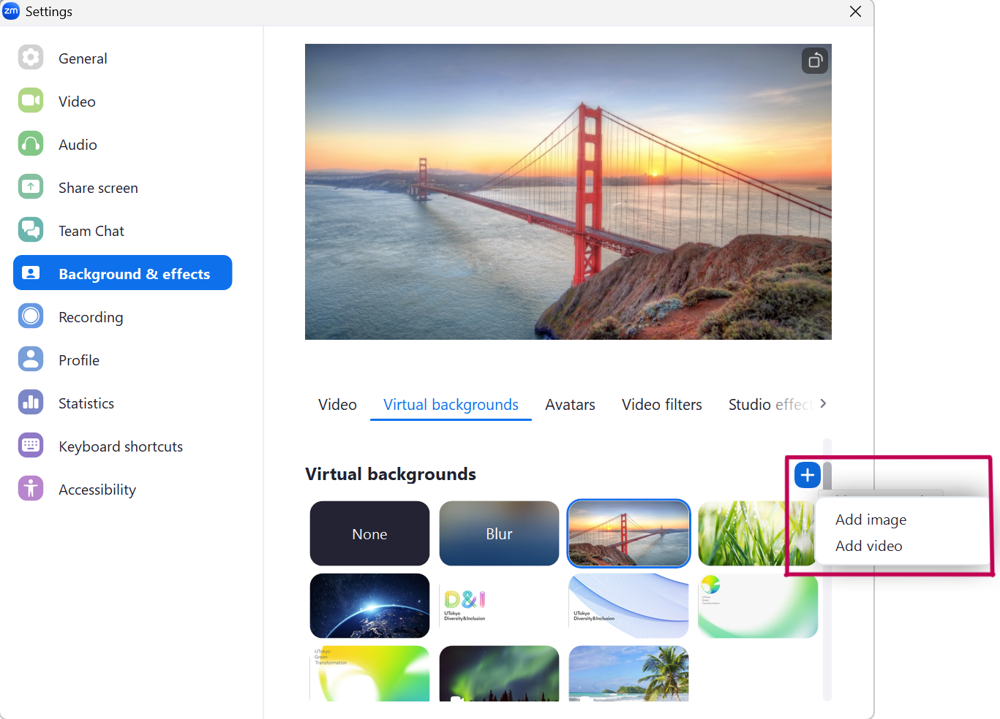

### Enabling virtual background during a meeting

1. Press the up button next to the “Start Video (or Stop Video)” button displayed at the bottom of the meeting screen.
  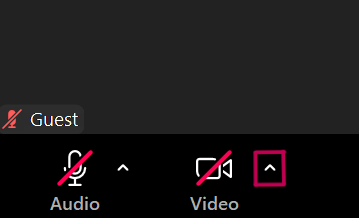

2. Select “Adjust background & effects…” from the menu. If you want to blur the background, select “Blur my background”. 
  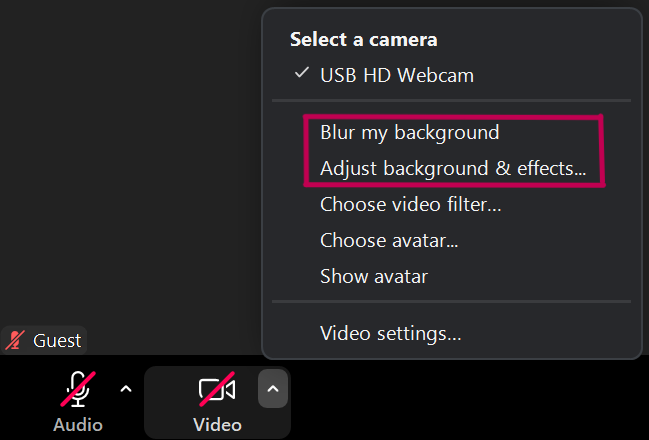

3. 	Select the virtual background of your choice. (If you select “None”, no virtual background will be set.)
   * Select the “+” to upload an original image as a virtual background.
     
       
     

## Tips for setting up

* You can successfully replace the background with a virtual one by making the background behind you as plain as possible.
    * The color of the background should be distinctly different from the color of the skin or clothing. If they are too close to the color of the background, your face and clothing may disappear on the screen.
* The background blur function naturally hides people or objects behind you without significantly changing the mood of the image.
* If you add text to the virtual background image, your name and title can always be clearly displayed during a meeting.
    * Depending on the settings, the left and right sides of the video may be inverted, and the text in the background may be mirrored. If necessary, turn on/off the “Mirror my video” checkbox in the “Backgrounds & effects” section of the settings.

## (Reference) Using video filters and avatars

Zoom offers features such as video filters and avatars, which are similar to virtual backgrounds.
The video filter function allows you to change the color of your video or to decorate the video and faces with frames, etc. The avatar function displays an animated human or animal figure in place of the user’s face or body when the video is turned on during a meeting.
When used appropriately in closed areas such as seminars and clubs, both functions may change the atmosphere of a meeting and facilitate interaction among participants.

### Setting up the video filter

#### Setting up before a meeting

1. 	Launch the Zoom application, open “Settings”, and select “Background & effects”.
  

2. Select “Video filters”.
  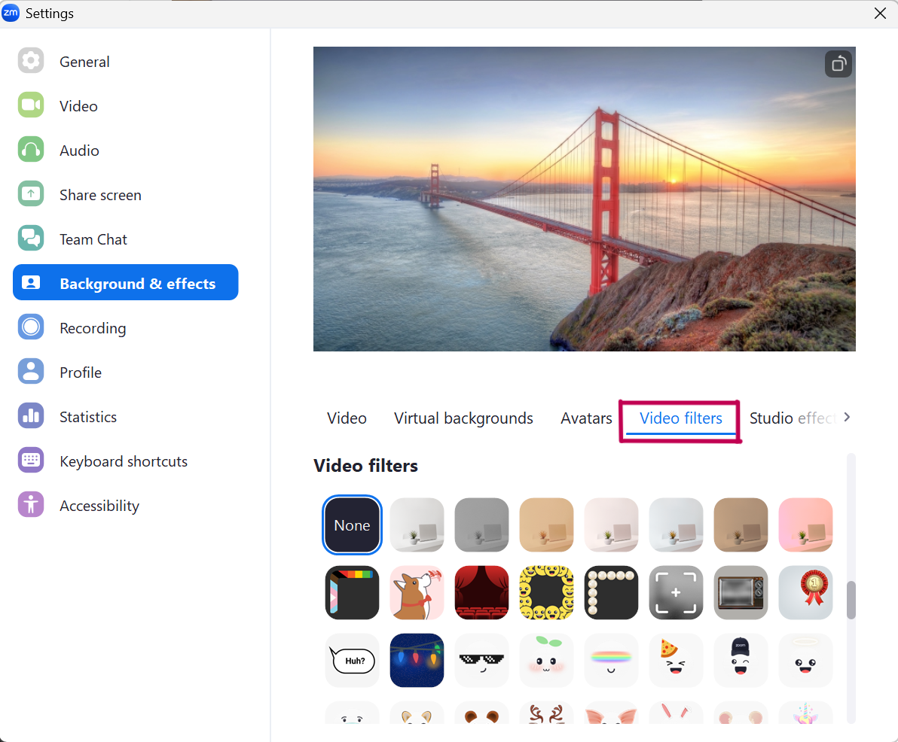

3. Select the video filter of your choice. (Unlike virtual backgrounds, the video filters do not allow you to upload original images, etc.)

#### Enabling the video filter during a meeting

1. Press the up button next to the “Start Video (or Stop Video)” button displayed at the bottom of the meeting screen.
  

2. Select “Choose video filter” from the menu.
  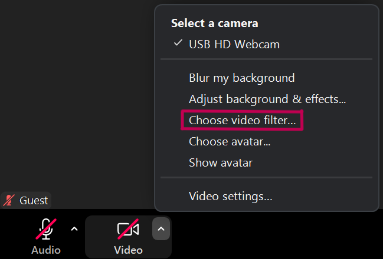

3. Select the video filter of your choice. (The video filter does not allow you to upload original images.) 

### Setting up an avatar

#### Setting up before a meeting

1. Launch the Zoom application, open “Settings”, and select “Background & effects”.
  

2. Select “Avatars”.
  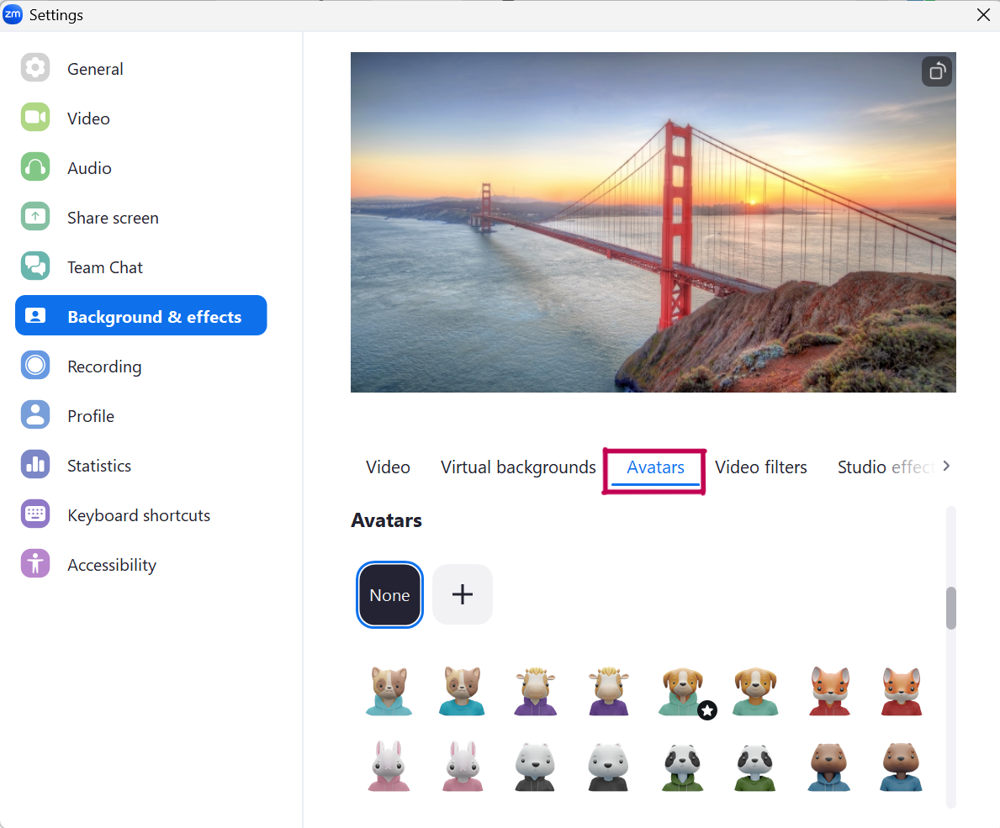

3. Select the avatar of your choice. (When an avatar is set, the camera background will disappear, and only the avatar will be displayed. If a virtual background is set, the set image will be displayed behind the avatar.)
  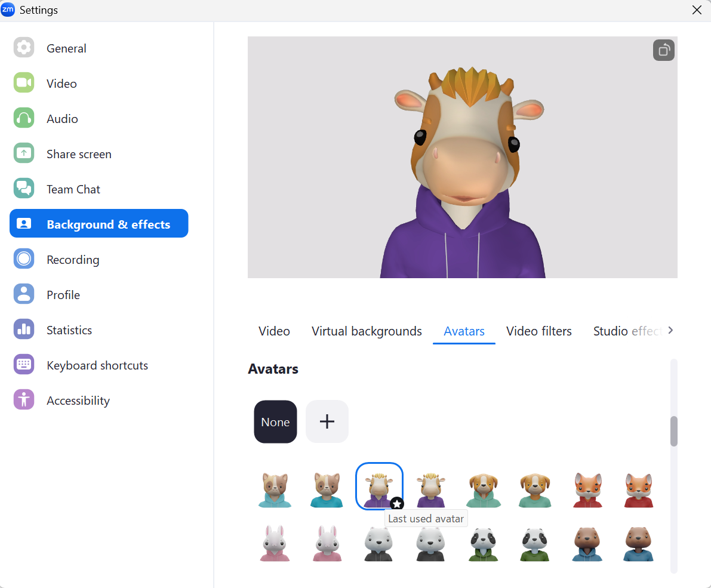
   ※ When the virtual background is set
    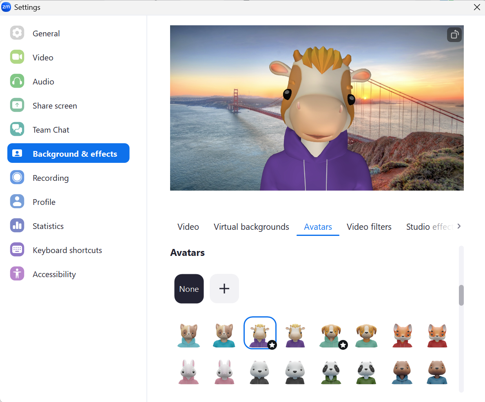

   * Click on the “+” to create your original avatar.
    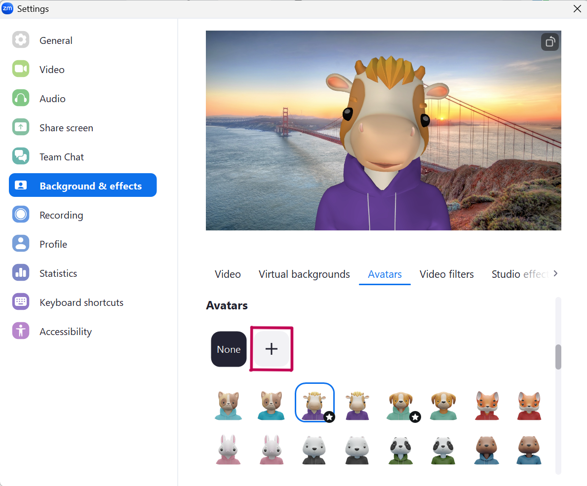

#### Enabling the avatar during a meeting

1. Press the up button next to the “Start Video (or Stop Video)” button displayed at the bottom of the meeting screen.
  

2. 	Select “Choose avatar” from the menu. (Select “Show avatar” to display the preconfigured avatar.)
  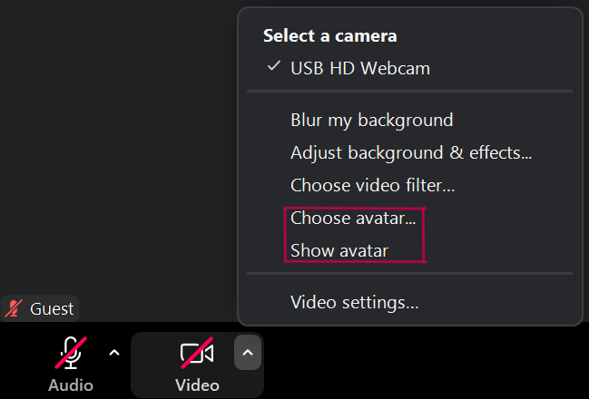

3. 	Select the avatar of your choice. (When an avatar is set, the camera background will disappear, and only the avatar will be displayed. If a virtual background has been set, the image will be displayed behind the avatar.)
  

   * Click on the “+” to create your original avatar.
  

