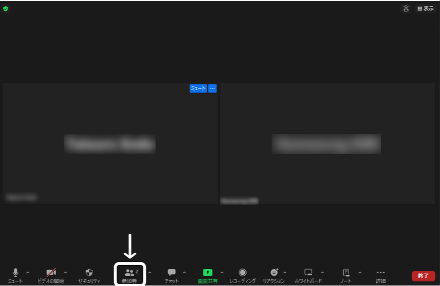
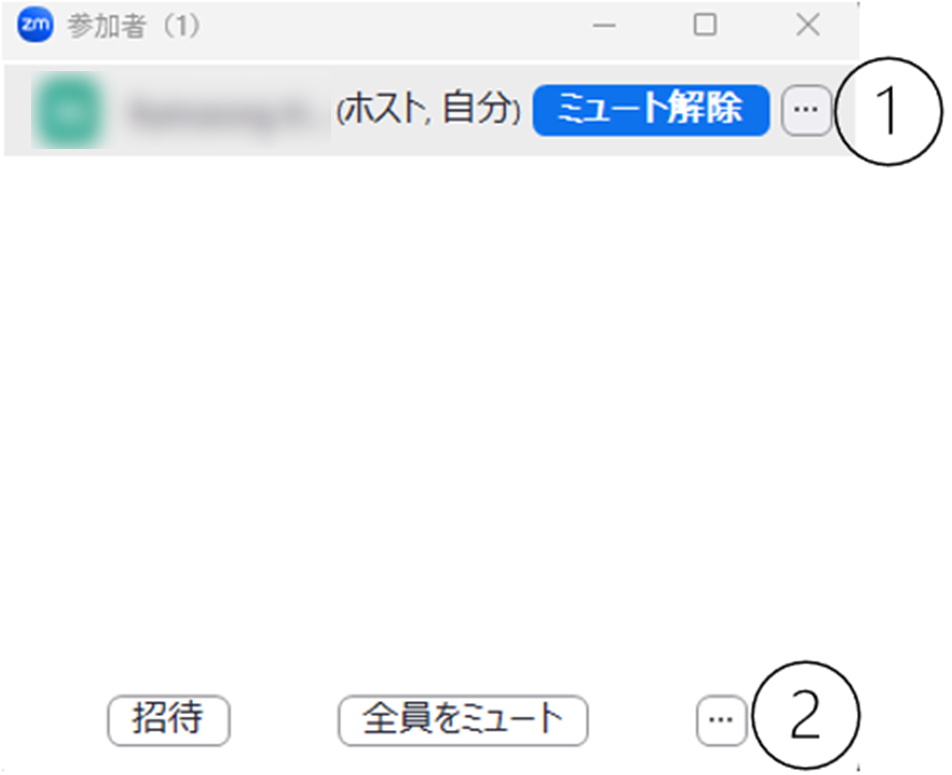

Zoomには，ビデオ会議に参加している参加者のリストを表示する機能があります．ホストや共同ホストは，この機能を利用して参加者を確認・管理できます．

In Zoom, there is a feature that allows you to display a list of participants in a video conference. Hosts and co-hosts can use this feature to check and manage participants.

このための画面を，「参加者パネル」と呼びます．参加者パネルは，Zoomのミーティングコントロールバーの「参加者」（下図の白枠で囲っている部分）を押すことで表示されます．

We call the panel for this the "Participants Panel". The Participants Panel can be displayed by clicking "Participants" (the part enclosed in the white frame in the figure below) on the Zoom meeting control bar.

{:.small}

参加者パネルはポップアップウィンドウとして表示されることもありますが，参加者パネルの右下にある 「・・・」から，「ミーティング ウィンドウに統合」を押すことでZoomのミーティングウィンドウと一体化できます．

The Participants Panel may be displayed as a pop-up window, but you can integrate it with the Zoom meeting window by clicking "..." at the bottom right of the Participants Panel and selecting "Integrate into Meeting Window".

この記事では，Zoomの参加者パネルから利用できる機能について紹介します．

In this article, we will introduce the features available from the Zoom Participants Panel.

参加者パネルから実行できる操作は，次の方法で利用できます．
- ①参加者にカーソルを合わせたときに現れる「・・・」
- ②（ホスト・共同ホストの場合は）参加者パネルの右下にある「・・・」

We can access the operations that can be performed from the Participants Panel in the following ways:
- ① "..." that appears when you hover over a participant
- ② (For hosts and co-hosts) "More" at the bottom right of the Participants Panel

これらのいずれかを押すと表示されるオプションから，適切なオプションを選択してください．以降，この①，②の記号を使って具体的な操作手順について説明します．

From the options that appear when you click either of these, select the appropriate one. From now on, we will use the symbols ① and ② to explain the specific operation procedures.

{:.border .small}

## ミュート状態に関する操作

## Mute Status Controls

ミーティングの参加者は，参加者パネルから自分のミュート状態を解除したり，再びミュート状態に戻したりできます．またホスト・共同ホストは，ある参加者，もしくはすべての参加者のマイクをミュートすることもできます．

Participants in a meeting can unmute themselves or mute themselves again from the Participants Panel. Hosts and co-hosts can also mute the microphone of a participant or all participants.

- **自分のマイクをミュート・ミュート解除する**：自分のミュート状態を解除したり，再びミュート状態に戻したりできます．たとえば授業中に発言を求められた際に，この機能を使い，自分のマイクをオンにして自分の音声を聞こえるように設定できます．自分にカーソルを合わせた時に出てくる「ミュート」または「ミュート解除」を押すか，参加者パネルの下側の「ミュート」または「ミュート解除」を押してください．ミュートのオン，オフは「オーディオ」（コントロールパネルのマイクのアイコン）から変更することもできます．詳しくは「[Zoom マイクとカメラの使い方](../mic_cam/)」を参照してください．
- **特定の参加者のマイクを個別にミュートする**：この機能は，ホスト・共同ホストのみが利用できます．ホスト側から参加者のマイクをミュートすることでミーティングに不必要な音声が入らないようにできます．たとえば参加者が意図せずマイクをオンにしている場合などに利用できます．参加者にカーソルを合わせた時に出てくる「ミュート」を押してください．
- **参加者全員のマイクを一斉にミュートする**：この機能は，ホスト・共同ホストのみが利用できます．マイクがオンになっている参加者が複数いる場合，参加者全員のマイクを一斉にミュートできます．参加者パネルの下側の「全員をミュート」を押してください．その際表示されるウィンドウにある，「参加者に自分のミュートの解除を許可する」のチェックボックスを外すことで，今後参加者が自由にミュート状態を解除できないように設定することもできます．
- **参加者が入室時にミュート状態で入室するように設定する**：この機能は，ホスト・共同ホストのみが利用できます．参加者がミーティングに入室する時に，ミュート状態で入室するように設定できます．たとえば授業や説明会のような特定の参加者のみが発言するようなミーティングの場合，この機能を利用すると便利です．②を押して，「入室時に参加者をミュートにする」を押してください．
- **特定の参加者にミュート解除を依頼する**：この機能は，ホスト・共同ホストのみが利用できます．ある特定の参加者の画面にミュート解除を求めるメッセージを表示します．参加者にカーソルを合わせた時に出てくる「ミュート解除を要請」を押してください．
- **参加者全員に一斉にミュート解除を依頼する**：この機能は，ホスト・共同ホストのみが利用できます．参加者全員の画面にミュート解除を求めるメッセージを表示します．②を押して，「全員にミュート解除を要請」を押してください．

- **Mute/Unmute Your Microphone**: You can unmute or mute yourself from the Participants Panel. For example, when you are asked to speak during a class, you can use this feature to turn on your microphone and make your voice audible. Click "Mute" or "Unmute" that appears when you hover over yourself, or click "Mute" or "Unmute" at the bottom of the Participants Panel. You can also change the mute status from "Audio" (the microphone icon on the control panel). For more details, please refer to "[How to use the audio and video on Zoom](../mic_cam/)".
- **Mute a Specific Participant's Microphone Individually**: This feature is only available to hosts and co-hosts. By muting a participant's microphone from the host side, you can prevent unnecessary noise from entering the meeting. For example, you can use this when a participant has unintentionally left their microphone on. Click "Mute" that appears when you hover over the participant.
- **Mute All Participants' Microphones at Once**: This feature is only available to hosts and co-hosts. If there are multiple participants with their microphones on, you can mute all participants' microphones at once. Click "Mute All" at the bottom of the Participants Panel. By unchecking the checkbox "Allow participants to unmute themselves" in the window that appears, you can also set it so that participants cannot freely unmute themselves in the future.
- **Set Participants to Join Muted**: This feature is only available to hosts and co-hosts. You can set it so that participants join the meeting in a muted state. For example, this feature is useful for meetings where only specific participants are expected to speak, such as classes or briefings. Click ② and then "Mute all upon entry".
- **Request a Specific Participant to Unmute**: This feature is only available to hosts and co-hosts. It displays a message on a specific participant's screen requesting them to unmute. Click "Ask to unmute" that appears when you hover over the participant.
- **Request All Participants to Unmute**: This feature is only available to hosts and co-hosts. It displays a message on all participants' screens requesting them to unmute. Click ② and then "Ask all to unmute".

## プロフィールの表示に関する操作

## Profile Display Controls

ミーティングの参加者は，参加者パネルから自分の表示名やプロフィール画像を変更できます．またホスト・共同ホストは，参加者の表示名を変更したり，参加者が自分の名前を変更できないように設定できます．

Participants in a meeting can change their display name and profile picture from the Participants Panel. Hosts and co-hosts can also change participants' display names and set it so that participants cannot change their own display names.

- **自分の表示名を変更する**：ミーティング中に自分の名前を変更できます．たとえば学生の方であれば，授業時に名前をわかりやすく変更するなどの操作を求められることがあるかもしれません．自分の名前を隠す，イニシャルだけに設定するなどのこともできます．①を押して，「名前を変更する」を押してください．
- **プロフィール画像を変更する**：他の参加者からみえる自分のプロフィール画像を変更できます．たとえば顔写真を非表示にしたい場合や，状況に応じて見た目を変更したい場合に利用できます．①を押して，「プロフィール画像を追加する」を押してください．
- **参加者の表示名を変更する**：この機能は，ホスト・共同ホストのみが利用できます．他の参加者の表示名を変更できます．名前を変更したい参加者の①を押して，「名前を変更する」を押してください．
- **参加者が自分の表示名を変更できないように設定する**：この機能は，ホスト・共同ホストのみが利用できます．参加者が自由に自分の表示名を変更できないように設定できます．②を押して，「参加者に名前の変更を許可する」を押してください．

- **Change Your Display Name**: You can change your display name during the meeting. For example, students may be asked to change their display names to something easily identifiable during class. You can also choose to hide your name or set it to initials only. Click ① and then "Rename".
- **Change Your Profile Picture**: You can change your profile picture that is visible to other participants. This can be useful if you want to hide your face or change your appearance according to the situation. Click ① and then "Edit profile picture".
- **Change a Participant's Display Name**: This feature is only available to hosts and co-hosts. You can change the display name of other participants. Click ① on the participant whose name you want to change, and then click "Rename".
- **Set It So That Participants Cannot Change Their Own Display Names**: This feature is only available to hosts and co-hosts. You can set it so that participants cannot freely change their own display names. Click ②, then "More" and uncheck "Allow participants to: Rename themselves".

## ピン留めに関する操作

## Pinning Controls

Zoomでは，特定の参加者を，自分の画面上で目立たせて表示するように設定できます．これを「ピン留め」と呼びます．ミーティングの参加者は，参加者パネルからピン留めの操作を実行できます．またホスト・共同ホストは，複数人をピン留めできるようにしたり，特定の参加者を，自分一人ではなく全員の画面で目立たせて表示するような「スポットライト」の操作を実行できます．ピン留めとスポットライトについては，「[Zoom ミーティング画面のレイアウト](../layout/)」も参考にしてください．

In Zoom, you can set a specific participant to be prominently displayed on your screen. This is called "pinning". Participants in a meeting can perform pinning operations from the Participants Panel. Hosts and co-hosts can also enable multiple participants to be pinned or perform "spotlight" operations that make specific participants prominently displayed on everyone's screen instead of just their own. For more information about pinning and spotlighting, please also refer to "[Zoom Meeting Screen Layout](/zoom/usage/layout/) (in Japanese)".

- **ピン留め**：特定の参加者を画面上の目立つところに固定できます．ピン留めは参加者全員が利用できます．①を押して，「ピン」を押してください．
- **マルチピンの許可**：この機能は，ホスト・共同ホストのみが利用できます．参加者が複数人をピン留めできるように設定できます．ピン留めは，初期設定だと一人の参加者にしか適用できませんが，ホスト・共同ホストがマルチピンの許可をすることで，参加者は複数人をピン留めできるようになります．①を押して，「マルチピンを許可」を押してください．マルチピンが許可されている場合は，①を押したときに「マルチピン権限を削除」が表示されます．
- **「全員に対してスポットライト」**：この機能は，ホスト・共同ホストのみが利用できます．参加者全員のZoom上の画面で，ホストが指定した参加者を目立つところに固定できます．ピン留めと似た機能ですが，ピン留めは自分の画面において固定されるだけで他の参加者の画面には影響しないのに対し，スポットライトは参加者全員の画面に影響を及ぼします．①を押して，「全員に対してスポットライト」を押してください．

- **Pinning**: You can pin a specific participant to a prominent place on your screen. Pinning is available to all participants. Click ① and then "Pin".
- **Allow to Multi-Pin**: This feature is only available to hosts and co-hosts. You can set it so that participants can pin multiple people. By default, pinning can only be applied to one participant, but by allowing multiple pinning, hosts and co-hosts can enable participants to pin multiple people. Click ① and then "Allow to multi-pin". If multiple pinning is allowed, "Remove permission to multi-pin" will be displayed when you click ①.
- **Spotlight for Everyone**: This feature is only available to hosts and co-hosts. You can pin a specified participant to a prominent place on everyone's Zoom screen. It is similar to pinning, but while pinning only affects your own screen, spotlighting affects everyone's screen. Click ① and then "Spotlight for Everyone".

## ホスト権限の割り当てに関する操作

## Host Permission Controls

ホストは，ある参加者にホスト権限の一部または全部を割り当てることができます．ホストの権限についての詳細は，「[Zoom ミーティングの管理とそれに関わる役割（ホスト・共同ホスト・代替ホストなど）について](../../misc/management_roles/)」を参照してください．

Hosts can assign some or all of their host permissions to a participant. For more details about host permissions, please refer to "[Host and Co-host Controls in a Zoom Meeting)](../../misc/management_roles/)".

- **ホストの設定**：この機能は，ホストのみが利用できます．他の参加者をホストに指定できます．例えば，ホストがミーティングを先に退出しなければならないときに，事前にホスト権限を割り当てる参加者を指定することで，意図しない参加者にホスト権限が渡るのを防止できます．①を押して，「ホストに指定」を押してください．
- **共同ホストの設定**：この機能は，ホストのみが利用できます．他の参加者を共同ホストに指定できます．共同ホストはホスト権限の一部を共同で持ち，ミーティングの進行に関する機能を使うことができます．たとえば授業や演習の進行の一部をTAに補助してもらう際などに利用すると役立つ機能です．①を押して，「共同ホストに指定」を押してください．

- **Assign Host**: This feature is only available to hosts. You can designate another participant as the host. For example, if the host needs to leave the meeting early, designating a participant to assign host permissions in advance can prevent unintended participants from receiving host permissions. Click ① and then "Make host".
- **Assign Co-host**: This feature is only available to hosts. You can designate another participant as a co-host. Co-hosts share some of the host permissions and can use features related to meeting management. This feature is useful, for example, when you want a TA to assist with part of the progress of a class or exercise. Click ① and then "Make co-host".

## ビデオに関する操作

## Video Controls

この機能は，ホスト・共同ホストのみが利用できます．ホスト・共同ホストは，ビデオがオンになっている参加者のビデオを強制的にオフに設定できます．またある参加者にビデオを開始するよう要請することもできます．①を押して，「ビデオをオフにする」または「ビデオオンを要請」を押してください．

This feature is only available to hosts and co-hosts. Hosts and co-hosts can forcefully stop the video of participants whose video is on. They can also request a participant to start their video. Click ① and then "Stop video" or "Ask to start video".

## 参加者の入退室の管理に関する操作

## Participant Join and Leave Controls

ホスト・共同ホストは，ミーティングを円滑に進行するために，様々な機能を用いて，参加者の入退室を管理できます．

Hosts and co-hosts can use various features to manage participant join and leave in order to keep the meeting running smoothly.

- **これ以上Zoomミーティングへの参加者が増えないように設定する**：この機能は，ホスト・共同ホストのみが利用できます．参加すべき参加者が全員参加したときや，これ以上参加者を増やしたくないときにこの機能を利用できます．②を押して，「ミーティングをロックする」を押してください．
- **参加者が入退室した際に，サウンドを再生する**：この機能は，ホスト・共同ホストのみが利用できます．ある参加者が入退室したときに音が鳴るので，入退室に気づくことができます．たとえば出席管理など，参加者の管理に役立ちます．②を押して，「参加または退出時にサウンドを再生する」を押してください．
- **待機室**：参加者がZoomミーティングに参加する際に，直接入室するのではなく，一度待機室に入り，ミーティングへの参加を保留にし，ホストが許可することで入室するように設定できます．既にミーティングに参加している参加者に関しても，待機室に送り，ミーティングへの参加を保留にできます．待機室の開始はホストのみが，待機室にいる参加者がミーティングに参加することを許可したり，参加者を待機室に送ったりする機能はホスト・共同ホストのみが，それぞれ利用できます．②を押して，「待機室を有効にする」を押してください．「待機室」機能に関する詳細は，「[Zoomミーティングで待機室を設定する](../../create_room/waiting_room/)」を参照してください．
- **参加者を強制的に退出させる**：この機能は，ホスト・共同ホストのみが利用できます．参加者を強制的にミーティングから退室させられます．ミーティングに参加すべきでない参加者がいる場合に利用できます．①を押して，「削除」を押してください．

- **Set It So That No More Participants Can Join the Zoom Meeting**: This feature is only available to hosts and co-hosts. You can use this feature when all the participants who should join have already joined or when you do not want to increase the number of participants anymore. Click "Host tools" on the Zoom meeting control bar and then "Lock meeting".
- **Play Sound When Participants Join or Leave**: This feature is only available to hosts and co-hosts. A sound will play when a participant joins or leaves, so you can be aware of the join and leave. This can be useful for managing participants, such as attendance management. Click ② and then "Play join and leave sound".
- **Waiting Room**: You can set it so that when participants join a Zoom meeting, they enter a waiting room instead of directly entering the meeting, and they can join the meeting by being allowed by the host. You can also send participants who are already in the meeting to the waiting room and put their participation in the meeting on hold. The host can start the waiting room, and hosts and co-hosts can allow participants in the waiting room to join the meeting or send participants to the waiting room. Click "Host tools" on the Zoom meeting control bar and then "Enable waiting room". For more details about the "Waiting Room" feature, please refer to "[Setting up a Zoom Waiting Room](../../create_room/waiting_room/)".

## 字幕入力の割り当てに関する操作

## Caption Assignment Controls

この機能は，ホストのみが利用できます．ホストは，ある参加者にミーティングの字幕を手動で入力してもらうように，字幕入力の役割を割り当てることができます．字幕入力を割り当てることができる参加者は一人です．割り当てたい参加者の①を押して，「字幕入力の割り当て」を押してください．割り当てられている参加者の場合は①を押したときに「字幕入力の権限を削除」が表示されます．なお，この項目はZoomで手動字幕機能を使っている場合にのみ表示されます．

## ミーティングのレコーディングに関する操作

## Meeting Recording Controls

この機能は，ホストのみが利用できます．ホストは，すべての参加者に対し，ミーティングのローカルレコーディングを許可できます．レコーディングされた動画はそれぞれの参加者のコンピューターのデフォルトのZoomレコーディングフォルダに保存されます．①を押して，「ローカル ファイルのレコーディングを許可」を押してください．

## 招待に関する操作

## Invitation Controls

ミーティングの参加者は，参加者パネルから，他のユーザーをミーティングに招待するために招待リンクを作成したり，指定した連絡先に招待を送信したりできます．またミーティングIDとパスコードを入手することもできます．参加者パネルの下側の「招待」を押してください．

Participants in a meeting can create an invitation link to invite other users to the meeting or send invitations to specified contacts from the Participants Panel. They can also obtain the meeting ID and passcode. Click "Invite" at the bottom of the Participants Panel.
