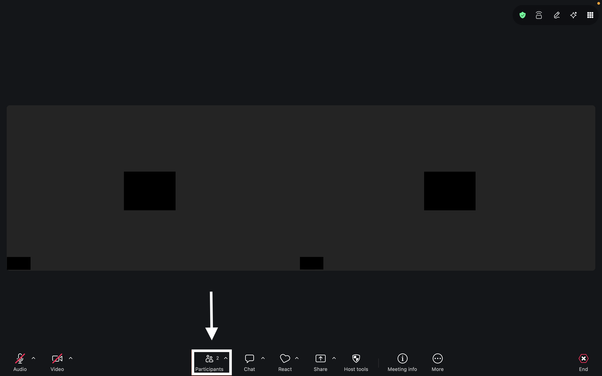
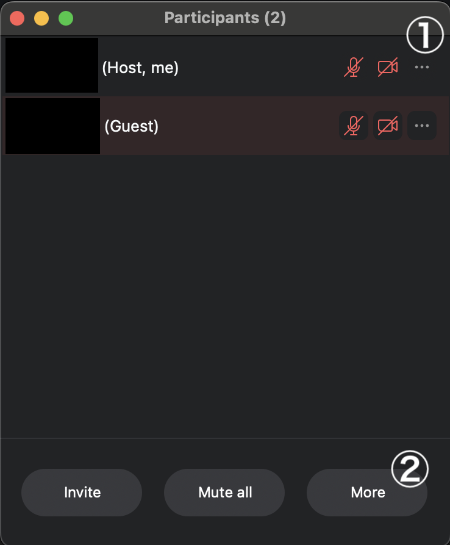
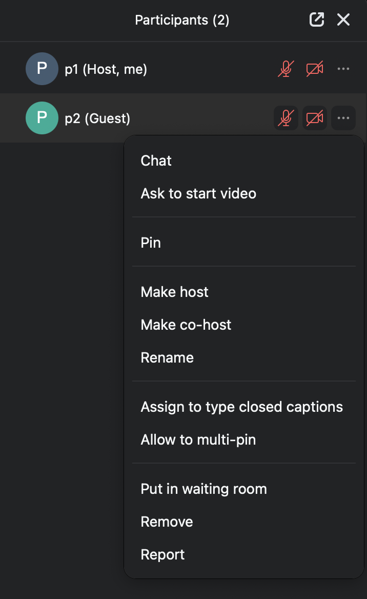
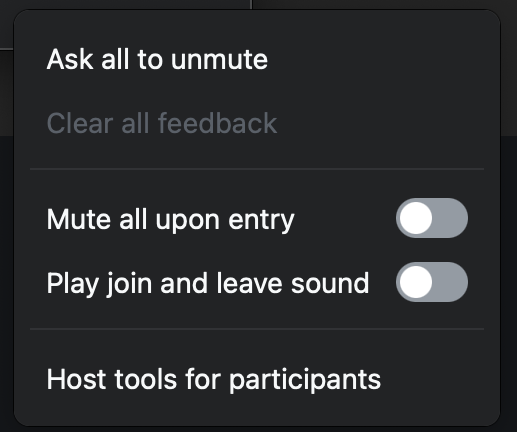
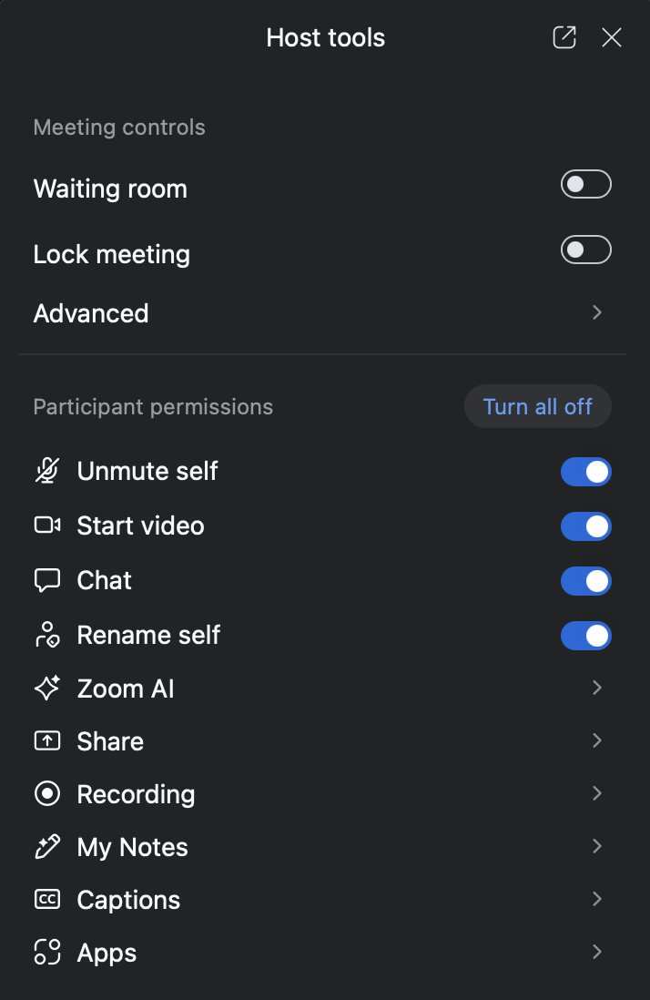

Zoom has a feature that displays a list of the participants in a meeting. Hosts and co-hosts can use this feature to check and manage participants.

The screen for this is called the "Participants panel". You can open the Participants panel by clicking "Participants" (the part outlined in white in the figure below) on the Zoom meeting control bar.

{:.small}

The Participants panel may be displayed as a pop-up window. In that case, you can integrate it into the Zoom meeting window by clicking the "Pop in" icon at the top right of the Participants panel. Note that in full-screen mode, the Participants panel is displayed as a pop-up window and cannot be integrated into the Zoom meeting window.

This article introduces the features available from the Zoom Participants panel.

The operations available from the Participants panel can be accessed from the menus that appear when you click either ① or ② below. From now on, we will use the symbols ① and ② to explain the specific operation procedures.
{:.small}

- ① "..." at the right end of a participant's name
  - When you click ①, a menu like the one below is displayed (the items displayed vary depending on the participant's status).
{:.small}

- ② (For hosts and co-hosts) "More" at the bottom right of the Participants panel
  - When you click ②, the menu shown in the image below is displayed.
{:.small}
  - When you click "Host tools for participants", the menu shown in the image below is displayed.
{:.small}

Note that the specific operation procedures described below are for the Zoom desktop app. They may differ for the Zoom web app and the Zoom mobile app.

## Mute Status Controls

Participants in a meeting can unmute themselves or mute themselves again from the Participants panel. Hosts and co-hosts can also mute the microphone of a specific participant or of all participants.

- **Mute/Unmute Your Microphone**: You can unmute yourself or mute yourself again. For example, when you are asked to speak during a class, you can use this feature to turn on your microphone so that others can hear you. Hover over your name and click "Mute" or "Unmute", or click the microphone icon to the right of your name. You can also mute or unmute yourself from "Audio" (the microphone icon on the control bar). For more details, please refer to "[How to use the audio and video on Zoom](../mic_cam/)".
- **Mute a Specific Participant's Microphone**: This feature is only available to hosts and co-hosts. By muting a participant's microphone from the host side, you can prevent unnecessary sound from entering the meeting. For example, you can use this when a participant has unintentionally left their microphone on. ... Hover over the participant and click "Mute", or click the microphone icon to the right of the participant's name.
- **Mute All Participants' Microphones at Once**: This feature is only available to hosts and co-hosts. If multiple participants have their microphones on, you can mute all participants' microphones at once. Click "Mute all" at the bottom of the Participants panel. By unchecking "Allow participants to unmute themselves" in the window that appears, you can also prevent participants from freely unmuting themselves afterwards.
- **Mute Participants upon Entry**: This feature is only available to hosts and co-hosts. You can set participants to be muted when they join the meeting. For example, this feature is useful for meetings where only specific participants speak, such as classes or briefings. Click ② and turn on "Mute all upon entry".
- **Ask a Specific Participant to Unmute**: This feature is only available to hosts and co-hosts. A message asking the participant to unmute is displayed on their screen. Hover over the video of the participant you want to ask, right-click, and then click "Ask to unmute", or click the microphone icon to the right of the participant's name.
- **Ask All Participants to Unmute**: This feature is only available to hosts and co-hosts. A message asking participants to unmute is displayed on all participants' screens. Click ② and then "Ask all to unmute".

## Profile Display Controls
Participants in a meeting can change their display name and profile picture from the Participants panel. Hosts and co-hosts can also change participants' display names and prevent participants from changing their own names.

- **Change Your Display Name**: You can change your name during a meeting. For example, students may be asked to change their names to something easily identifiable in class. You can also hide your name or show only your initials. Click ① and then "Rename".
- **Change Your Profile Picture**: You can change the profile picture that other participants see. This is useful, for example, when you want to hide your photo or change your appearance depending on the situation. Click ① and then "Add profile picture".
- **Change a Participant's Display Name**: This feature is only available to hosts and co-hosts. You can change the display names of other participants. Click ① on the participant whose name you want to change, and then click "Rename".
- **Prevent Participants from Changing Their Own Display Names**: This feature is only available to hosts and co-hosts. You can prevent participants from freely changing their own display names. Click ② and then "Host tools for participants". Then turn off "Rename self" under "Participant permissions".

## Pinning Controls
In Zoom, you can display a specific participant prominently on your own screen. This is called "pinning". Participants in a meeting can pin participants from the Participants panel. Hosts and co-hosts can also allow participants to pin multiple people, or "spotlight" a specific participant so that the participant is displayed prominently on everyone's screen, not just their own. For more information about pinning and spotlighting, please also refer to "[Adjust layout in Zoom meetings](../layout/)".

- **Pinning**: You can fix a specific participant in a prominent place on your screen. Pinning is available to all participants. Click ① and then "Pin" or "Add pin". If you have already pinned a participant, you can change the pinned participant by clicking "Replace pin".
- **Allow to Multi-pin**: This feature is only available to hosts and co-hosts. You can allow participants to pin multiple people. By default, participants can pin only one participant, but when hosts and co-hosts allow multi-pin, participants can pin multiple people. Click ① and then "Allow to multi-pin". If multi-pin is already allowed, "Remove permission to multi-pin" is displayed when you click ①.
- **"Spotlight for everyone"**: This feature is only available to hosts and co-hosts. You can fix a specified participant in a prominent place on every participant's Zoom screen. It is similar to pinning, but while pinning only affects your own screen, spotlighting affects everyone's screen. Click ① and then "Spotlight for everyone".

## Host Permission Controls
The host can assign some or all of the host permissions to a participant. For more details about host permissions, please refer to "[Host and Co-host Controls in a Zoom Meeting](../../misc/management_roles/)".

- **Make Host**: This feature is only available to the host. You can make another participant the host. For example, if the host has to leave the meeting early, designating in advance the participant who will receive host permissions prevents them from passing to an unintended participant. Click ① and then "Make host".
- **Make Co-host**: This feature is only available to the host. You can make another participant a co-host. Co-hosts share some of the host permissions and can use features for running the meeting. This is useful, for example, when a TA helps run part of a class or exercise. Click ① and then "Make co-host".

## Video Controls
This feature is only available to hosts and co-hosts. Hosts and co-hosts can turn off the video of a participant whose video is on. They can also ask a participant to start their video. Click ① and then "Stop video" or "Ask to start video".
## Participant Join and Leave Controls
Hosts and co-hosts can use various features to manage participants joining and leaving so that the meeting runs smoothly.

- **Prevent More Participants from Joining the Zoom Meeting**: This feature is only available to hosts and co-hosts. You can use this feature when everyone who should attend has joined, or when you do not want any more participants. Click ② and then "Host tools for participants". Then turn on "Lock meeting" under "Meeting controls".
- **Play a Sound When Participants Join or Leave**: This feature is only available to hosts and co-hosts. A sound plays when a participant joins or leaves, so you can notice it. This is useful for managing participants, for example, for taking attendance. Click ② and turn on "Play join and leave sound".
- **Waiting Room**: You can set it so that participants joining a Zoom meeting first enter a waiting room instead of joining the meeting directly, and are admitted when the host allows them. You can also move participants who are already in the meeting to the waiting room. Only the host can enable the waiting room, while hosts and co-hosts can admit participants from the waiting room and move participants to the waiting room. Click ② and then "Host tools for participants". Then turn on "Waiting room" under "Meeting controls". For more details about the "Waiting Room" feature, please refer to "[Setting up a Zoom Waiting Room](../../create_room/waiting_room/)".
- **Remove a Participant**: This feature is only available to hosts and co-hosts. You can forcibly remove a participant from the meeting. This is useful when someone who should not be in the meeting is present. Click ① and then "Remove".

## Caption Assignment Controls
This feature is only available to the host. The host can assign a participant to type captions for the meeting manually. Only one participant can be assigned. Click ① on the participant you want to assign, and then click "Assign to type closed captions". For a participant who has already been assigned, "Remove permission to type closed captions" is displayed when you click ①. Note that this item is displayed only when manual captioning is enabled in Zoom.
## Meeting Recording Controls
This feature is only available to the host. The host can allow all participants to record the meeting locally. The recordings are saved in the default Zoom recording folder on each participant's computer. Click ② and then "Host tools for participants". Then click "Recording" under "Participant permissions", and turn on "Record to computer".
## Invitation Controls
Participants in a meeting can create an invitation link or send invitations to specified contacts from the Participants panel to invite other users to the meeting. They can also get the meeting ID and passcode. Click "Invite" at the bottom of the Participants panel.
