## What is the “Reaction” feature

In Zoom, there are various methods other than speaking or sending chat messages when responding to the hosts or speakers.
There are three methods: “Raised hand”, “Emoji”, and “Non-verbal feedback”.

## Using the Reaction Feature

### Raised hand

- This is used as an alternative way to physically “raising your hand” in the face-to-face classroom.
- Similar to actually raising your hand in a face-to-face classroom, you can check to see if there is someone wants to ask a question, or simply ask if people understood your explanation, etc.

### Emoji

- Emojis are used for expressing feelings such as “Interesting” or “Happy”.
- Since it will automatically disappear in 10 seconds after it appears, high real-time response can be expected.
- Participants can easily send reactions to enliven the atmosphere without using video or chat.

### Non-verbal feedback

- This is used to provide feedback to speakers, such as “Yes”, “No”, “Slower” and “Faster”.
- 『意思表示アイコン』と呼ばれることもあります．It is also called “Intention Indicating Icon.”

## [For Participants] How to send reactions

### On PC

1. Select “Reactions” from the toolbar at the bottom of the screen (if the “Reactions” button is not visible on the screen, click on the “More” button at the bottom right corner to find the items of "Reactions").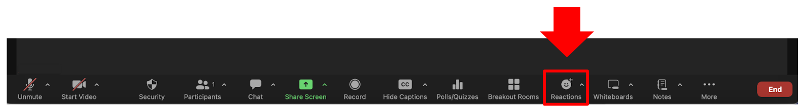
2. Choose the reaction you want from the menu displayed at the top of the toolbar.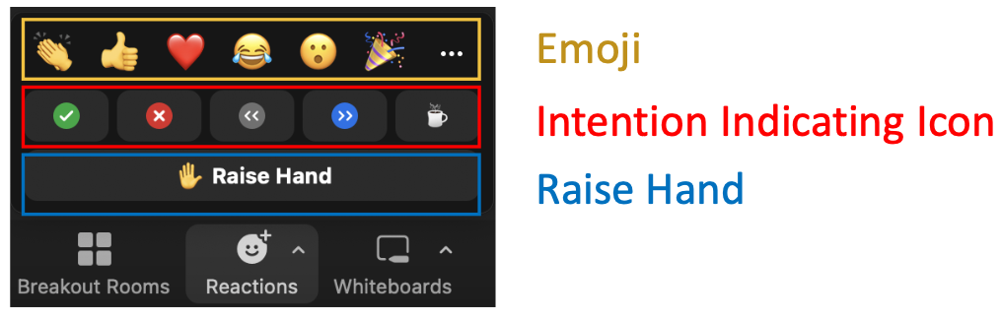

### On smartphones or tablets

1. Select “More” from the toolbar at the bottom of the screen.
2. Choose the reaction you want from the menu displayed above the toolbar.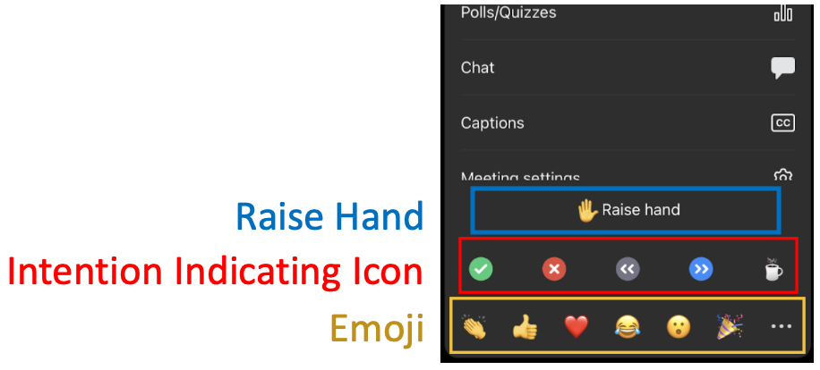

## [For participants] How to remove the Reaction

You can remove the Reaction by clicking on the current displayed reaction (e.g., Lower Hand) button located above the toolbar at the bottom of the screen.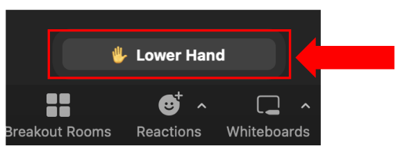  
However, emojis cannot be manually removed (they will disappear automatically in 10 seconds after it first appears).

### Differences in Behavior between “Raised hand”, “Non-verbal feedback” and “Emoji”

The “Raised hand” and the “Non-verbal feedback” will not disappear unless the participants or host removes them manually. In contrast, the “emoji” will disappear automatically after 10 seconds.

## [For all] How to Check the Reaction

Select the “Participants” from the toolbar at the bottom of screen, the reaction will be displayed next to the listed participant’s name.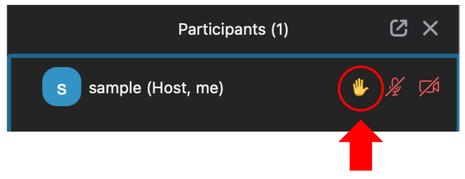  
Additionally, it will also appear in the upper left corner of the participants’ video screen section.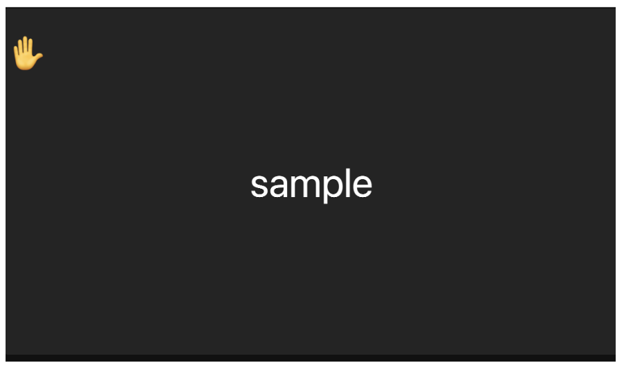

## [For hosts] More Detailed Information

### Managing the Reactions as hosts

- Hosts can remove the reactions of specific participants and all participants all at once.
  -  If a participant uses the “Raised Hand”, you can lower their hand by selecting “Participants” from the toolbar at the bottom of the screen, hovering over their name and clicking “Lower Hand”.
  - To clear the reactions of all participants at once, click on “Participants” followed by “Clear All Feedback” in this order.
- The number above each reaction icon shows how many participants have clicked on that icon.

### Enabling Reactions in Hosted Meetings

- In meetings that you host, you can choose whether or not to enable each of the “emoji” and “Non-verbal feedback” among the reactions. By default, both are enabled.
- You can select the types of emojis from either “All emojis” or “Selected emojis”. If you choose “Selected emojis”, the participants will be able to express their reactions using only the six standard emojis.
- How to enable or disable:
  1. Sign in Zoom following the steps of [“Sign-in Methods for Zoom (in Japanese)”](https://utelecon.adm.u-tokyo.ac.jp/zoom/).
  1. Click on “Config” and then click “Settings ([https://u-tokyo-ac-jp.zoom.us/profile/setting](https://u-tokyo-ac-jp.zoom.us/profile/setting)).”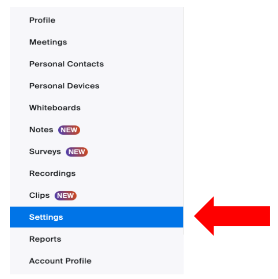
  1. Click on “Meeting” and then click “In Meeting (Basic)”.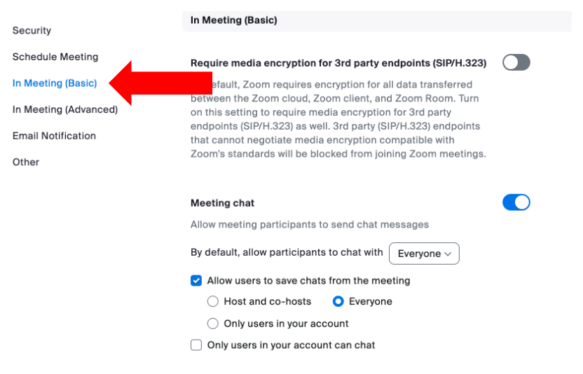
  1. Choose to enable “Non-verbal feedback” and “Meeting reactions” respectively (Note: the “emoji” feature may be referred to as “Meeting reactions” or “Reactions in meetings” etc.).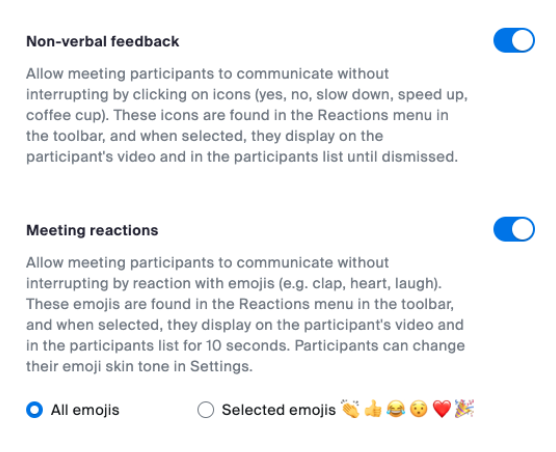

## [For participants] More detailed information

### Setting of the Skin Tone for Reactions

You can set up skin tone that you desire for your Reactions in Zoom.

#### On pc

1. Sign in to Zoom following the steps of “[Signing in in from the Zoom App (in Japanese)](https://utelecon.adm.u-tokyo.ac.jp/zoom/)”.
2. Click “Settings” after you click on the picture of your profile in the upper right.
3. Select the “General” tab and then select your preferred skin tone from the “Skin tone” of “Reactions”.

#### On smartphones or tablets

1. Open the Zoom app.
2. Select the “More” tab and then tap “Meetings”.
3. Select your preferred skin tone from the “Reaction - Skin Tone” in “GENERAL”.

### Gesture Recognition Feature

- In Zoom, there is a feature that recognizes when a participant makes a hand gesture continuously for more than a certain amount of time and then automatically displays the reactions of “Raised hand” / “Lower Hand” and “Yes” (👍).
- Hand gesture recognition feature is available when you are a Zoom client on a computer, and you have enabled the hand gesture recognition feature and have your video turned on.
- Enable / disable can be set up by each participant in one of the following ways.
  - Enable from the upper right button of “Reactions” in the toolbar at the bottom.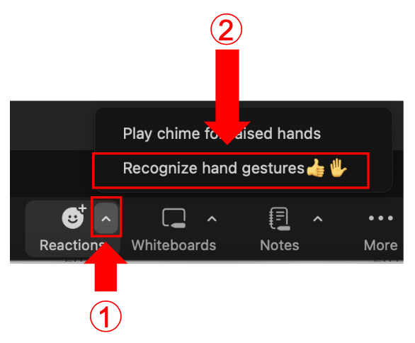
  - Click on the profile picture at the top right and then click “Settings”. Then select the “General” tab and then turn on “Hand gesture recognition”.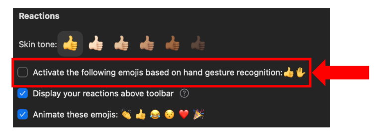
