## Overview of the Recording Feature
{:#overview}
Zoom has a recording feature that allows you to record and save both the audio and video (including webcam video and screen sharing) from lectures or meetings held on the platform. By sharing the recorded videos afterward, even those who were unable to attend these sessions at that time can review their content. This page explains how to record, and how to review and share the recorded audio and video.

### Local Computer Recording and Cloud Recording
{:#overview-local-and-cloud}
Zoom offers two types of recording options: Local **Computer Recording**, which saves the video to your own computer, and **Cloud Recording**, which saves the video to Zoom’s servers. While Cloud Recording is only available with a paid license, the University of Tokyo provides such licenses to all students, faculty, and staff. Therefore, you can use the Cloud Recording feature for meetings you create while signed in with your UTokyo Account. The Local Computer Recording, on the other hand, is only available through the desktop application and cannot be used from the mobile app or web browsers.

## How to record
{:#procedure}
### Recording Permission
{:#procedure-authority}
In order to operate the recording feature during a meeting, you must be granted the appropriate permissions within that meeting. In other words, **not all participants are necessarily allowed to use the recording feature**. This section explains who can record during a meeting, categorized into three roles: **Host/Co-host**, **Participants**, and **the user who created the meeting**.
* Host/Co-host
  * The **host and co-host** can start, pause, and stop the recording.
  * However, for local **computer recording**, the host and co-host can grant permission to start, pause, and stop the recording to general participants as well.
    * To do so, hover over the participant's name in the “**Participants” panel**, press the "..." icon that appears, and select **"Allow to record to computer"**.
    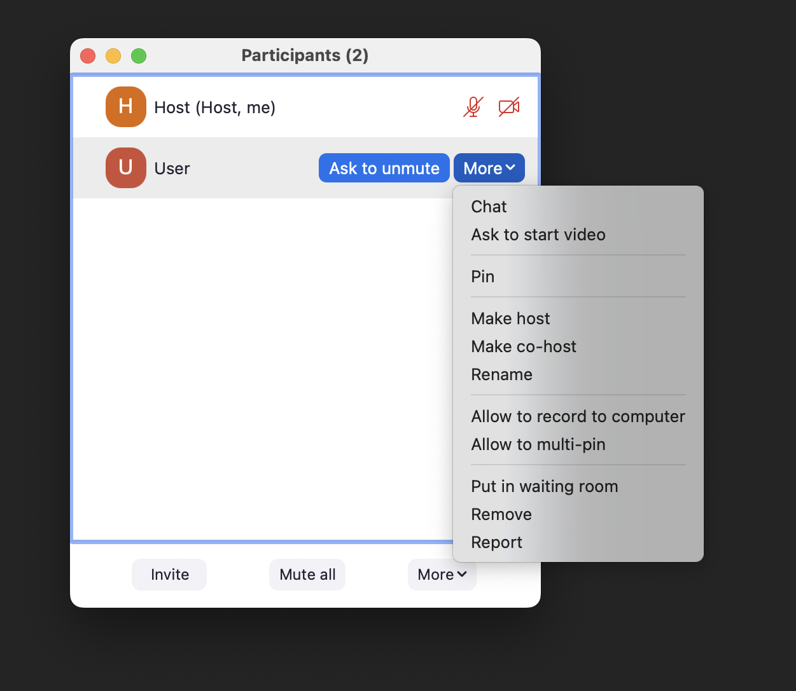{:.border}
* Participants
  * Participants (those who are not the host or co-host) do not have recording permissions unless granted by the host or co-host.
  * Participants without recording permissions can request them from the host or co-host.
    * For cloud recording, the host or co-host must start the recording.
    * For computer recording, if the host or co-host grants permission, participants can start the recording by themselves.
  * A computer recording made by a participant is saved on that participant's own PC.
* The user who created the meeting
  * The user who created the meeting can set it up in advance so that the recording starts automatically once the meeting begins.
  * In cloud recording, only the user who created the meeting can manage the recorded files and change the sharing settings.
 
### **Starting, pausing, and stopping the recording during a meeting**.
{:#procedure-start-and-stop}
This explains the steps for participants with recording permissions to start, pause, and stop the recording during a meeting.
1. Please press the "Record" button located at the bottom of the Zoom screen during the meeting.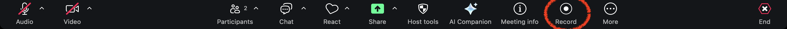
   * Please note that if the window is small, the "Record" option may be grouped under the "More" menu. 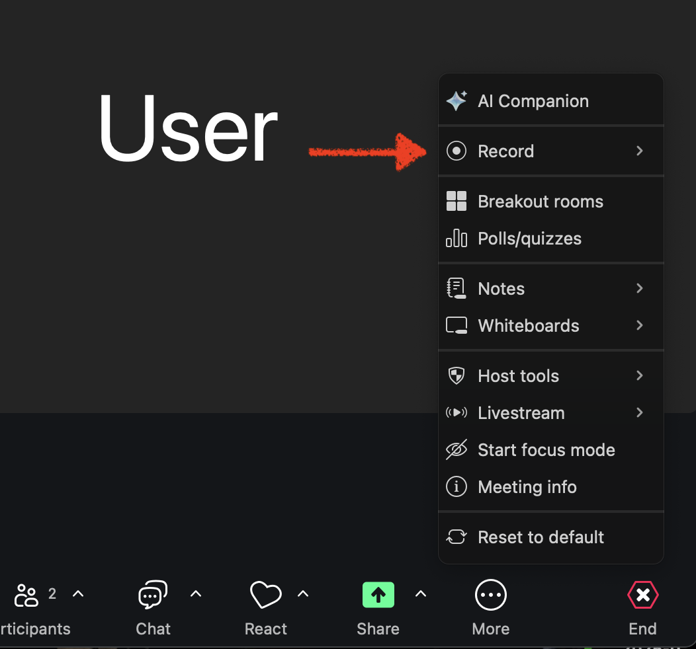
1. Select either **"Record to this computer"** or **"Record to the cloud"**, depending on which option you want to use, and the recording will begin.
   * If you want to use “Computer recording”, select the former; if you want to use “Cloud recording”, select the latter. 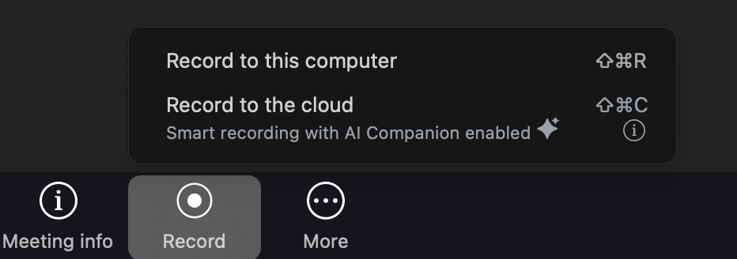
1. Clicking **"Pause Recording"** will pause the recording, and clicking **"Resume Recording"** will resume it.
   * If you pause and then resume the recording, the segments before the pause and after the resume will be saved as a single continuous video.
4. The recording will stop either when you press the **"Stop Recording"** button or when the meeting ends.
   * If you press the recording button again after stopping it, the video recorded after restarting will be saved  as a separate file from the one recorded before the stop. 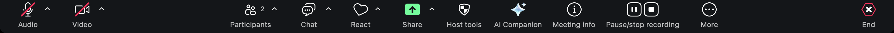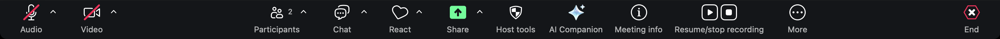

### Request to record
{:#procedure-request}
Participants without recording permissions can request the host or co-host to grant them permission to record.
* When a participant without recording permissio ns pushes the "Record" button, the options **"Request to record to this computer**" and **"Request host to record to the cloud"** will appear.  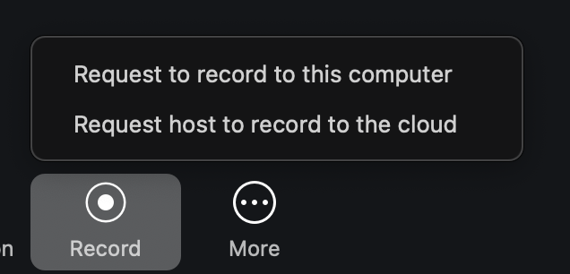
  * When participants click **"Request to record to this computer"** and send the request, a dialog box like the one shown below will appear on the host's screen. If the host selects **"Approve"**, the participant who sent the request will be granted permission to record locally.  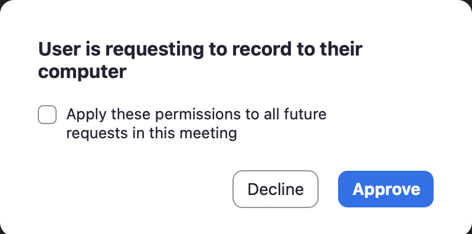
  * If cloud recording is not already in progress and the participant clicks "Request host to record to the cloud", a dialog box like the one below will appear on the host's screen.If the host selects **"Start Recording"**, cloud recording will begin. 
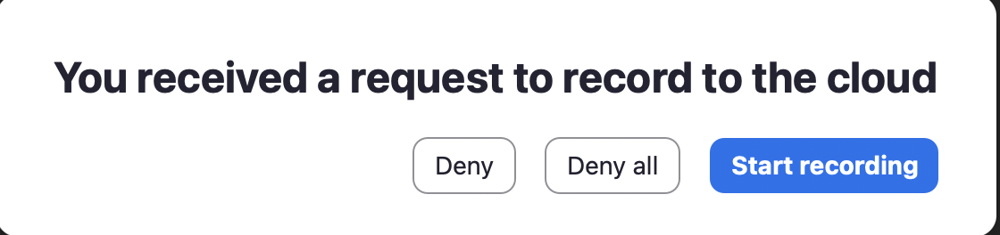

### Automatically Starting a Recording
{:#procedure-autorecord}
The user who creates the meeting can set it up in advance so that recording starts automatically when the meeting begins. Using this feature can help eliminate the need to manually start recording and prevent you from forgetting to record. Make use of it as needed. You can configure this setting from the **"Schedule"** or **"Edit"** section in the Zoom app by following the steps below.For more information on creating or editing meetings, please refer to the article "[Scheduling a Zoom Meeting](/en/zoom/create_room/)"
1. In the meeting creation or editing screen, scroll down to open the **"Advanced"** section.
2. Check the box for **"Automatically record meeting"**, then select whether “**locally”** or “In **the cloud”**, and push **"Save"**.
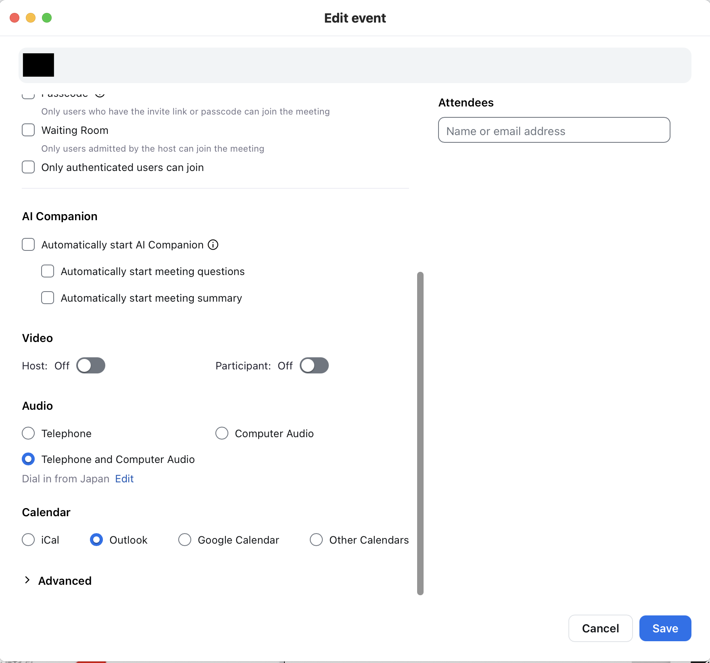{:.border}
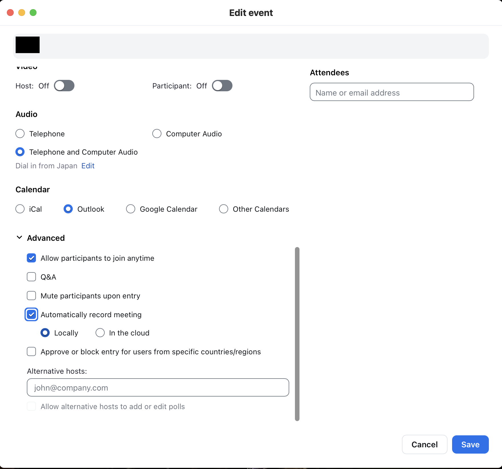{:.border}
  * Additionally, if you go to **"Settings"** in the Zoom web portal, open the **"Recording"** section, and enable the toggle for **"Automatic recording"**, all meetings created by you will automatically start recording without the need to configure the setting for each individual meeting.
  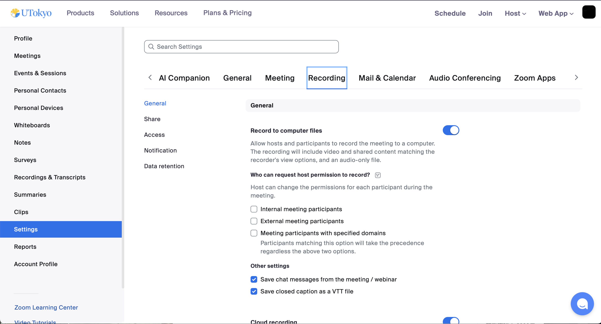{:.border}
  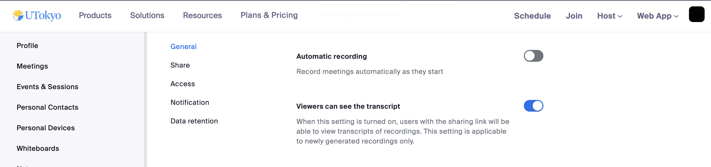{:.border}

## Managing and Sharing a Recording
{:#manage}
To review, manage, or share a recorded video, please follow the appropriate steps below for each action.

### Reviewing a Recording
{:#manage-check}
In the Zoom web portal, under the **"Recordings"** section, you can check both **"Cloud recordings"** and **"Computer recordings"**, which list the recordings saved to the cloud and your local computer, respectively. Please note that immediately after stopping a recording, it may take some time for the video to become available due to processing and conversion.
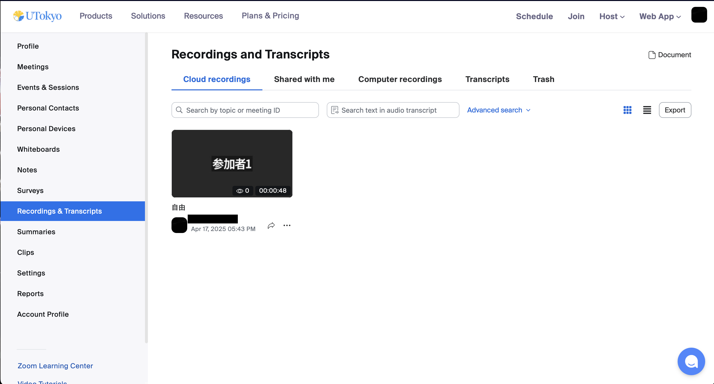{:.border}
* Videos saved locally are stored in a designated location on the computer (or device) of the person who performed the recording.
  * If you’re not sure where the recording is saved, you can check it by opening the Zoom app, going to **"Settings"**, then **"Recording"**, and clicking the **"Open"** button next to **"Store my recording at:"**. This will open the folder on your computer where the video is stored.
  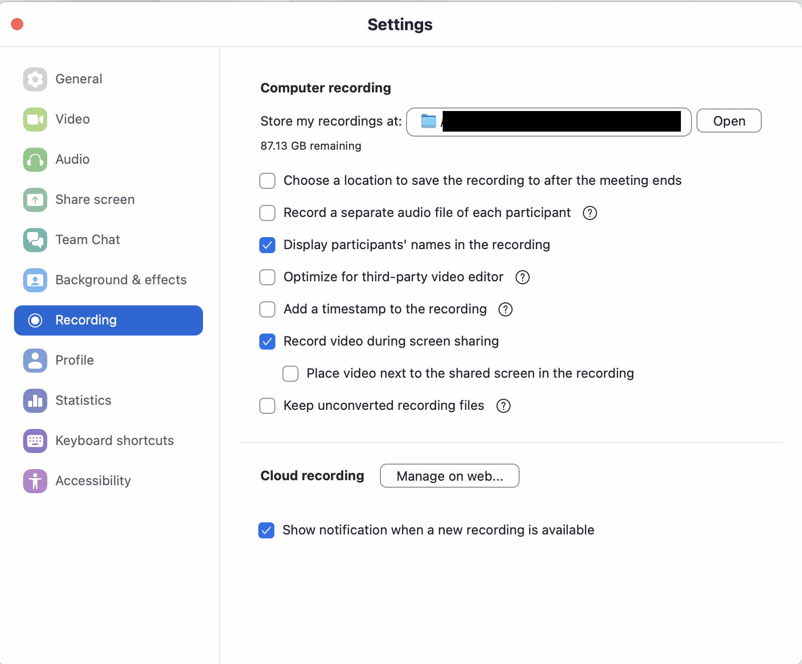{:.border}
* For cloud recordings, by default, an email with a link to access the recorded video will be sent to you once the recording is ready. 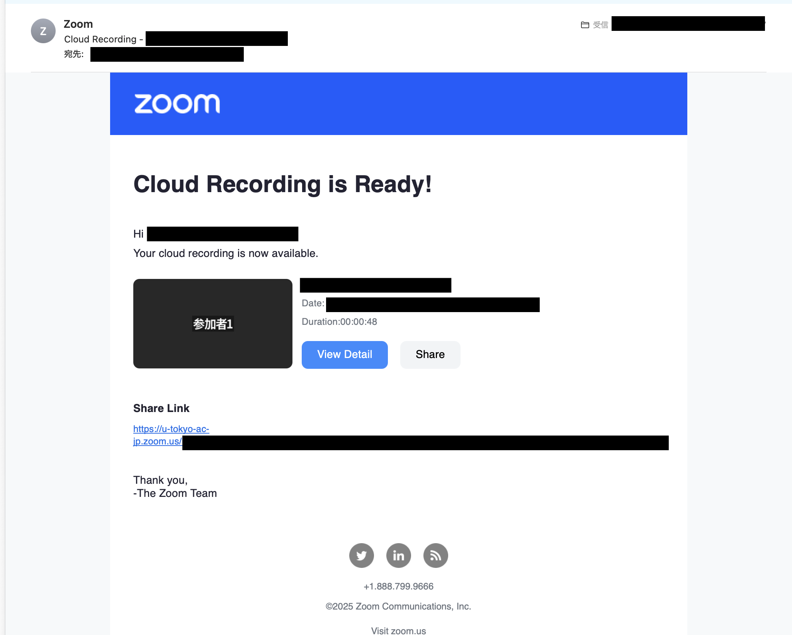
  * If you want to turn off email notifications, go to the **"Settings"** section in the Zoom web portal, then navigate to **"Email Notification"** and disable the option **"When a cloud recording is available"**.
  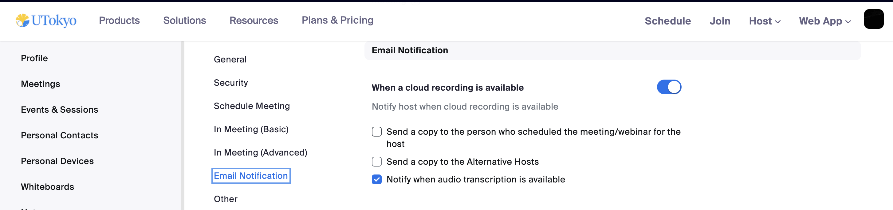{:.border}

### Uploading and Sharing Recordings via Cloud Storage
{:#manage-share-upload}
If you want to share a **computer recording** with others, it’s convenient to upload it to a cloud storage service such as **Google Drive** or **OneDrive**.For **cloud recordings**, you can also download the video from Zoom’s cloud and then upload it to a cloud storage service like Google Drive or OneDrive for sharing.
For detailed instructions on how to use Google Drive or OneDrive, please refer to the articles linked below.
* [Sharing Files on Google Drive (in Japanese)](/google/drive/share/)
* [Share Files on OneDrive (in Japanese)](/microsoft/onedrive/share/)

### Sharing Cloud Recordings via URL
{:#manage-share-url}
For cloud recordings, you can share the recording by providing a shareable URL. In the Zoom web portal, go to **"Recordings and Transcripts"** and open **"Cloud Recordings".** Select the recording you want to share to view its details. There, you will find a button labeled **"Copy shareable link."** Click this button to copy the sharing URL, and then share it with the people who need access.
{:.border}
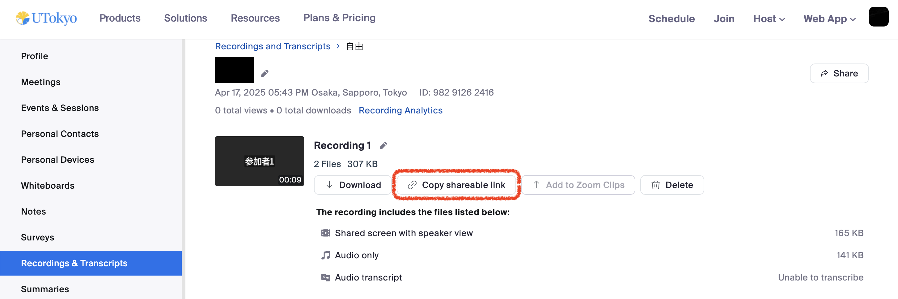{:.border}
However, viewers may not be able to watch the recording just by having the link.  This is because Zoom includes features to prevent unauthorized viewing if a link is leaked. To use this feature and adjust the settings to control who can view the recording via the shared URL, please follow these steps:
* On the recording details page (as shown in the image above), click the **"Share"** button to open the **"Share recording"** window. In this window, adjust the settings for **"Who can view"** and **"Share with specific people"** as needed.
* By appropriately setting the **"Who can view"** section, you can broadly specify who is allowed to watch the recording. The available options include:
	* **Everyone with the recording link**
	* **大学アカウントでサインイン**（which means **“Users signed in with a university account”**)
		* If you select **"Everyone with the recording link"**, then anyone who has the URL will be able to view the recording.
  		* If you select **"大学アカウントでサインイン"**, only users signed in with a UTokyo Account will be able to view the recording. This is the default setting.
		* If you select **"Only people you shared with below"** or **"Nobody else can view",** you are choosing a restrictive sharing option rather than making the data broadly accessible.
* By properly setting the **"Share with specific people"** section, you can individually specify who is allowed to view the recording.
  * If you enter the email addresses of the people you want to share with in the **"Share with specific people"** field and click **"Send,"** those recipients will receive an email containing a link to the recording and will be able to watch the video. Recipients do **not** need to have a Zoom account registered to that email address to view the recording.
* You can also use both broad settings and individual sharing settings at the same time.
  * For example, if you select **"Sign in with a university account"** and also specify external users in the **"Share with specific people"** section, then both users signed in with a UTokyo Account and the specified external individuals will be able to view the recording.
  * If you want to restrict access to only the individuals you specify, select **"Only people you shared with below"** in the **"Who can view"** section, and then specify the individuals in the **"Share with specific people"** field.
  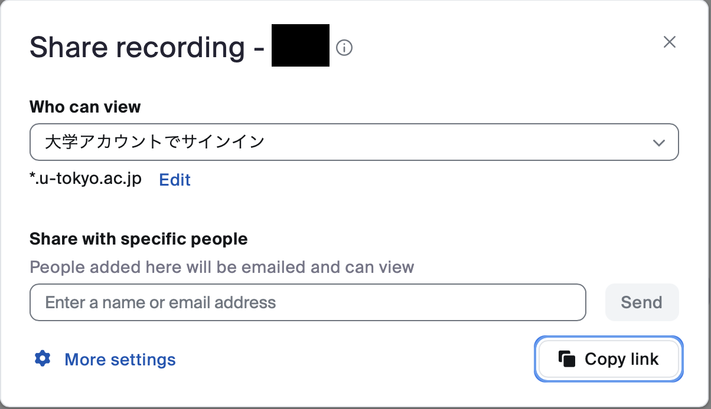{:.border .small}
* Additionally, by clicking **"More settings"** at the bottom of the **"Share Recording"** window (as shown in the image above), you can configure the following options:
  * By checking **"Set expiration date"** and selecting the number of days, you can limit how long shared recipients can view the recording.
  * By checking **"Viewers can download"** the people you share the recording with will be able to download the video and watch it offline, in addition to viewing it in their browser.
  * By checking **"Viewers can see chat",** the people you share the recording with will be able to view the chat history that took place during the meeting.
  * By checking **"Viewers need to register to watch",** viewers will be required to enter their name and email address before they access the recording.
  * By checking **"Passcode"** and entering a passcode, viewers will not be able to watch the recording just by accessing the shared URL—they will also be required to enter the specified passcode.
  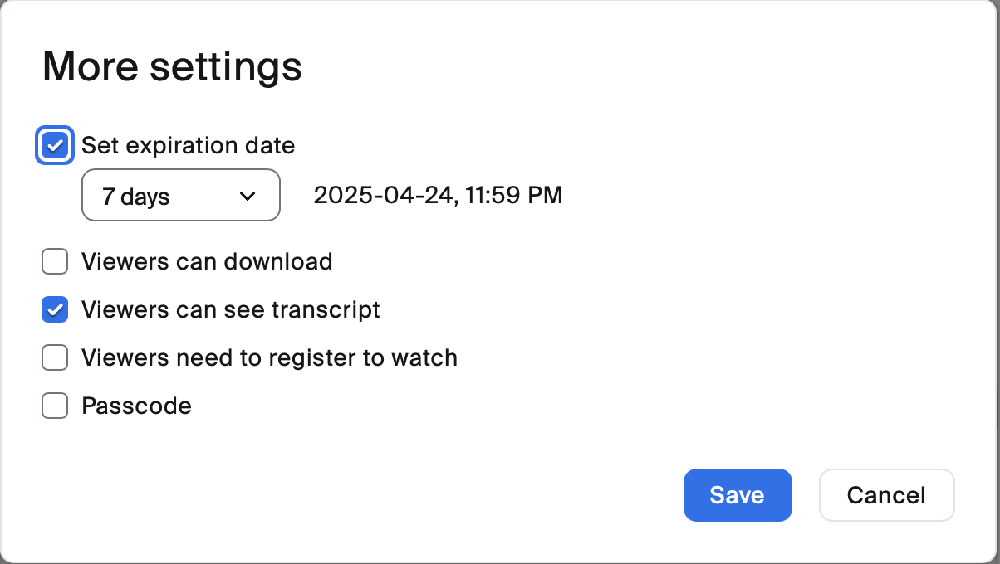{:.border}

Additionally, you can copy the shareable URL and adjust sharing settings from the email notification introduced in the "Review a recording" section.

## Delete a Cloud Recording
{:#delete}
Videos saved to the cloud can be deleted by following the steps below.
1. Please open **"Cloud recordings"** from the **"Recordings and Transcripts"** section in the Zoom web portal.
2. Click the **"…"** icon on the right side of the row for the recording you want to delete, and select **"Delete"**. 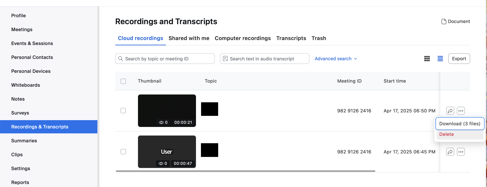
3. If you want to delete multiple recordings at once, check the square checkboxes on the left side of the recordings, then press the **"Delete"** button.
4. A confirmation dialog saying **"Move Cloud Recording to Trash"** will appear. Please click the **"Move to Trash"** button. Note that after performing the delete operation, **"Deleting..."** will be displayed on the recordings list screen for a while, but it will disappear shortly, so you can safely ignore it.

You can also delete individual files within a single meeting’s recording. For example, if the speaker view and the shared screen are recorded separately, you can delete only the speaker view recording.
1. From the "Recordings and Transcripts" section in the Zoom web portal, open "Cloud recordings”.
2. From the list of recordings, find the recording that contains the file you want to delete, and click on the meeting topic to go to the details page.
3. On the recording details page, hover your mouse pointer over the file you want to delete and click the trash icon. 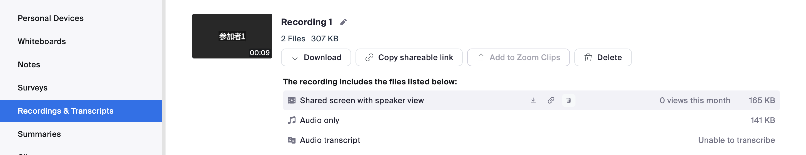{:.border}
4. A confirmation dialog saying "Move This File to Trash" will appear. Please click the "Move to Trash" button.

Additionally, you can set cloud recordings to be automatically deleted after a certain period of time.
1. From the Zoom web portal, go to **"Settings"**, then open the **"Recording"** tab.
2. Enable the toggle for the option **"Delete cloud recordings and transcripts after a specified number of days"** to activate this setting.
3. A field will appear allowing you to set the number of days after which the recording will be automatically deleted. Enter the desired number of days and click **"Save"**. 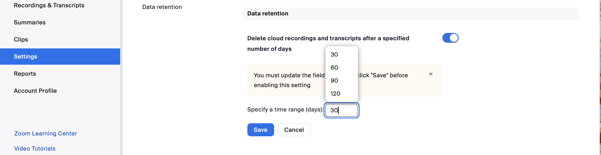{:.border}

There is a limit to the amount of cloud recording data that can be stored on Zoom, and the Zoom license contracted by the University of Tokyo incurs significant costs. Therefore, we kindly ask for your cooperation in deleting unnecessary cloud recordings. For more details, please refer to the page titled “[Request for Deletion of Unnecessary Data in Zoom Cloud Recording](/en/notice/2023/12-zoom-cloud-recording/)”.

## Recording Layout
{:#layout}
In Zoom recordings, you can configure the layout settings to determine how elements like shared screens and participants are arranged in the final video. The available recording layouts vary depending on the recording method used.

For detailed information on recording layouts, please refer to the article "[Zoom Recording Layout](layout/)"
