## Introduction
In Zoom, you can configure how various elements, such as participants' videos and shared screens, are displayed, which is referred to as a "layout". Layouts for displaying participants' videos include Speaker View and Gallery View. In addition, there are layouts for shared content only and layouts that combine shared content with participants' videos. This article explains the layouts used for recording. For information on using layouts during a meeting, please refer to "[Zoom Meeting Layout (in Japanese)](../../../../../zoom/usage/layout/)".

The layout used for recording differs slightly between local recordings and cloud recordings. For local recordings, the layout is generally determined by the settings on the participant's own screen during the meeting. However, for recording shared content, additional settings are required. In contrast, for cloud recordings, the desired layout is selected through additional settings. This article explains the main configuration settings for both cases. For details about local and cloud recordings, please refer to "[Recording Zoom Meeting](../../recording/)".

## Layout in local recordings
For local recordings, the recorded participant's video layout is the same as what appears on the recorder's screen during the meeting. For example, if the recorder's display setting for the participant's videos during the meeting is set to Speaker View, the recording will be made in Speaker View; if it is set to Gallery View, the recording will be made in Gallery View. If the video view is switched during the meeting, the recording will reflect those changes accordingly. For information on how to configure these views, please refer to "[Zoom Meeting Layout (in Japanese)](../../../../../zoom/usage/layout/)".

In addition, when a participant shares their screen during the meeting, the shared content is also recorded. In the layout, including the shared content, the presence or absence of participants' video views, and their placement, follow the layout that is configured in advance by the recorder.

### Layout settings
#### When no screen sharing is used
When screen sharing is not in use and only participants' videos are displayed, the layout shown on the recorder's screen during the meeting is recorded as is.

#### When screen sharing is used
When a participant shares their screen during the meeting, the shared content is also recorded. The layout of recordings that include shared content varies depending on the settings configured in advance by the recorder, and can be broadly categorized into the following two types. Note that the layout of participants' videos in the recording follows the recorder's display settings for the participants' videos during the meeting.

##### Types of layouts
* Record shared content only: Only shared content is recorded, and participants' videos are not included.
  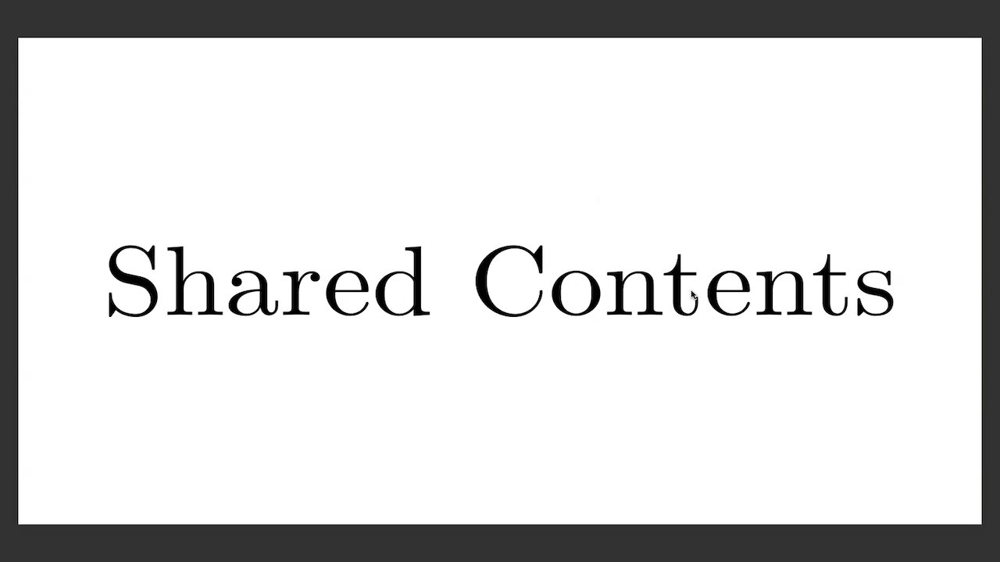{:.border .small}
* Record shared content and participants' videos: Both the shared content and participants' videos are recorded together as a single video.
  * Place shared content and videos without overlapping
    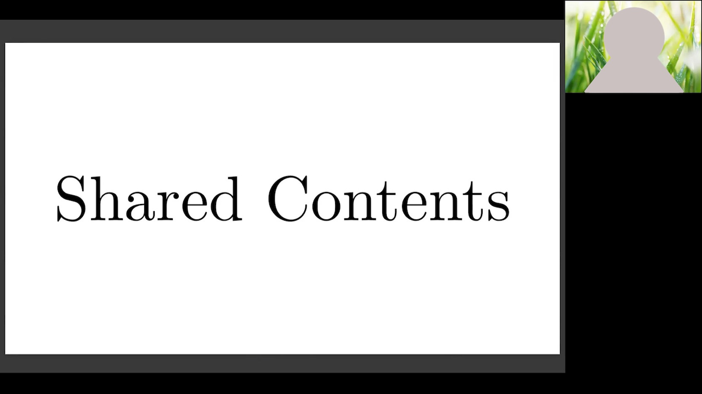{:.border .small}
  * Overlay videos on shared content
    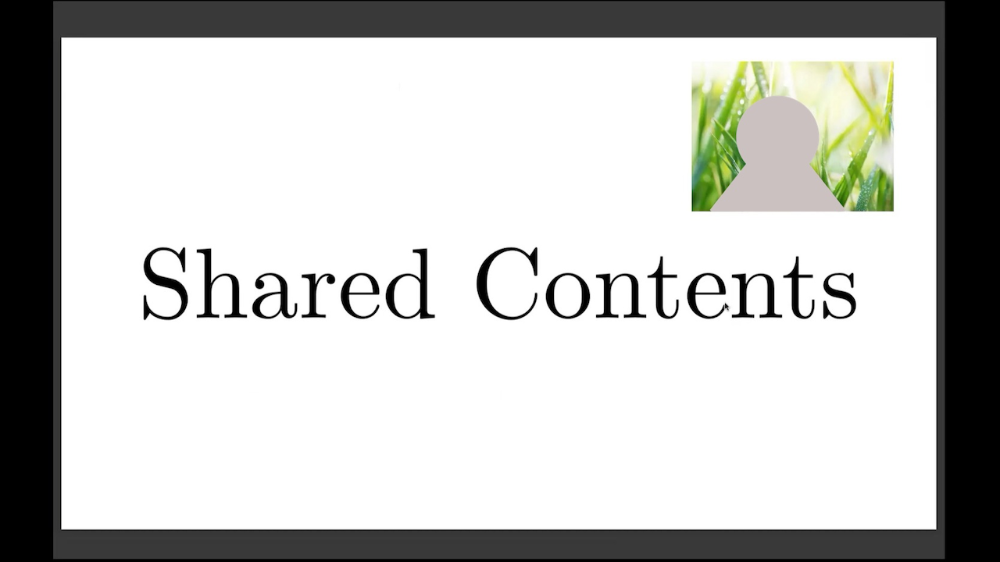{:.border .small}

##### Layout configuration procedure
The layout of local recordings, including shared content, must be configured in advance. The configuration procedure is as follows.

###### Record shared content only
1. Click the icon in the upper-right corner of the Zoom app window and select "Settings".
  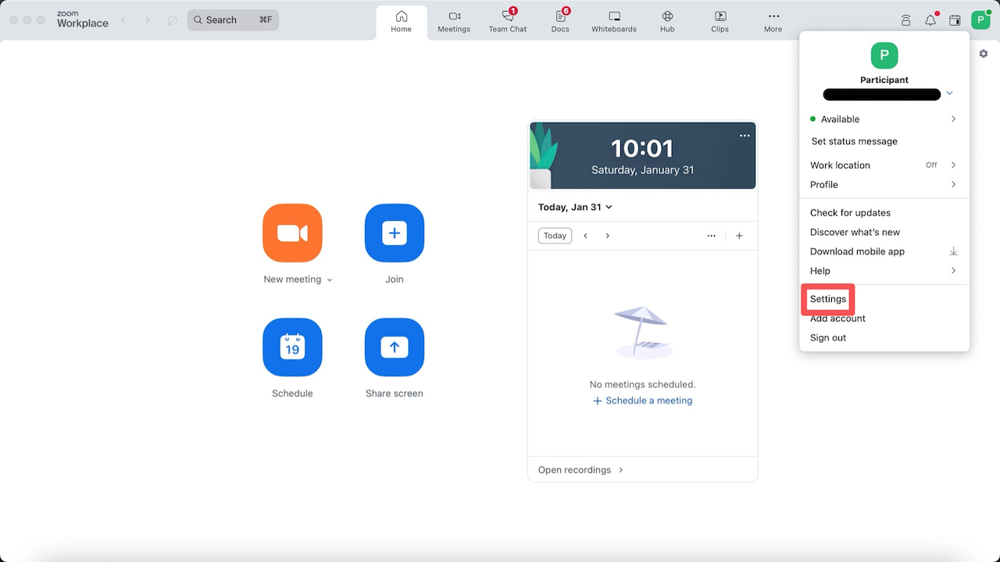{:.border .small}
2. Open the "Recording" tab on the left side of the screen.
  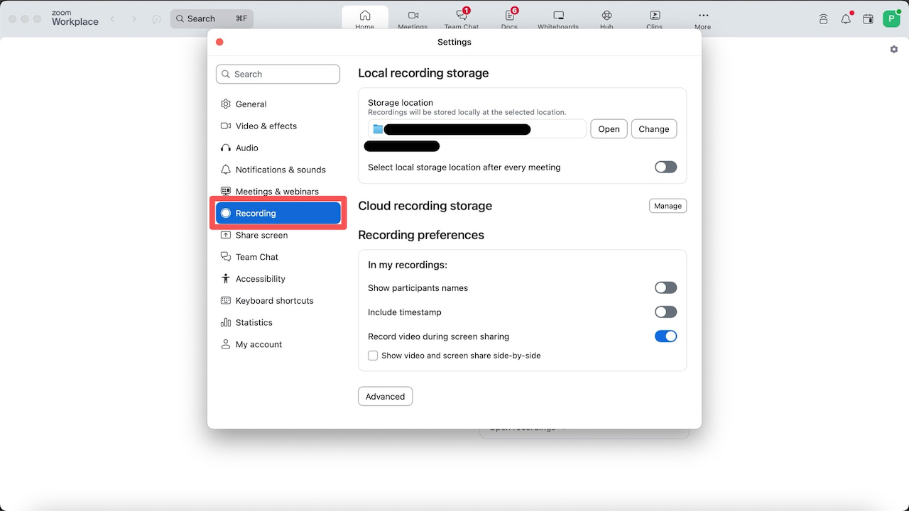{:.border .small}
3. Enable "Record video during screen sharing".
  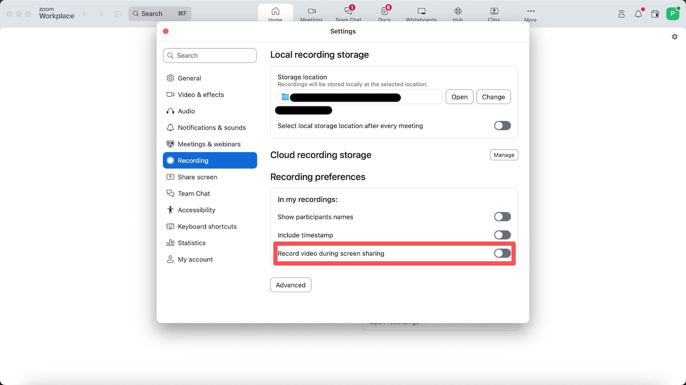{:.border .small}

##### Record shared content and participants' videos
1. Click the icon in the upper-right corner of the Zoom app window and select "Settings".
  {:.border .small}
2. Open the "Recording" tab on the left side of the screen.
  {:.border .small}
3. Disable "Record video during screen sharing".
  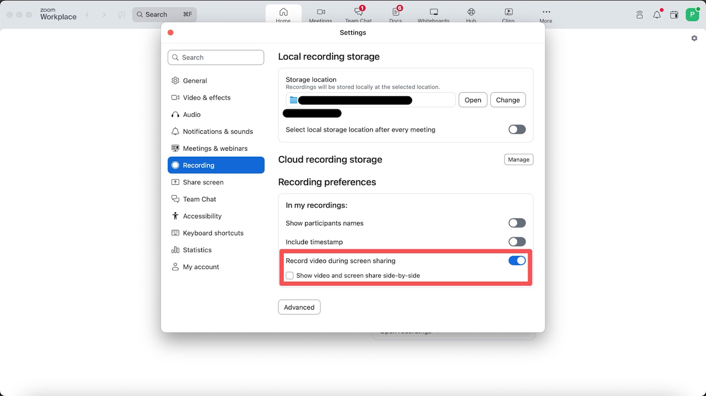{:.border .small}
4. Then, follow the steps below according to the desired video placement.
  * To place shared content and videos without overlapping: Check "Show video and screen share side-by-side".
  * To overlay videos on shared content: Uncheck "Show video and screen share side-by-side".

#### Other settings
Layout settings applied during a meeting -- such as pinning or spotlighting participants -- are reflected in the recording layout. For detailed configuration steps, please refer to "[Zoom Meeting Layout (in Japanese)](../../../../../zoom/usage/layout/)".

## Cloud recording layout
For cloud recordings, the layout is determined by the settings configured in advance by the person who scheduled the meeting, regardless of the screens displayed on individual participants' PC, smartphones, or other devices during the meeting. Even if the recording layout settings are changed during the meeting using the procedures described below, those changes will not be reflected in the recording layout for that meeting.

### Types of Layouts
Cloud recording layouts can be broadly categorized into three types: participants' videos only, shared content only, and a combination of participants' videos and shared content. The layouts are listed below.

* Participants' videos only
  * Speaker View (active speaker)
    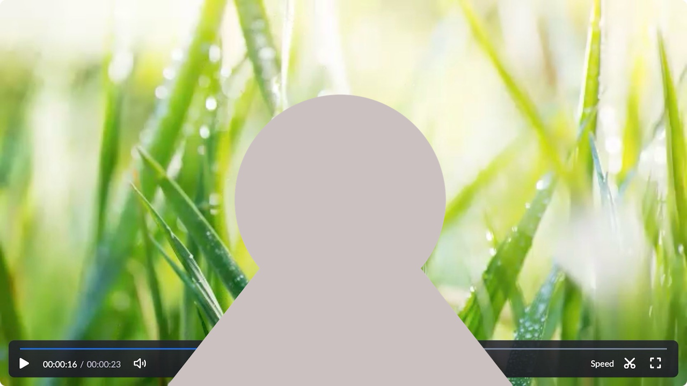{:.border .small}
  * Gallery View
    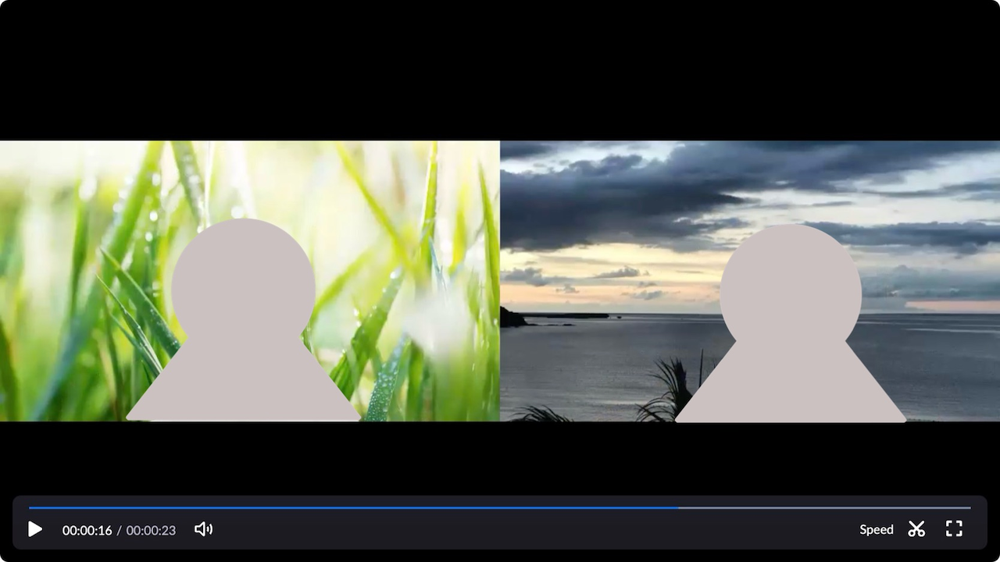{:.border .small}
* Shared content only
  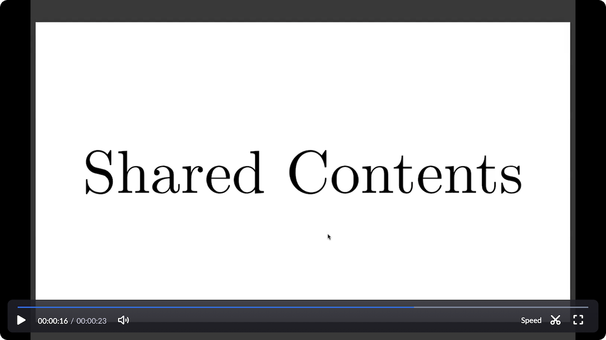{:.border .small}
* Combination of participants' videos and shared content (shared content with active speaker)
  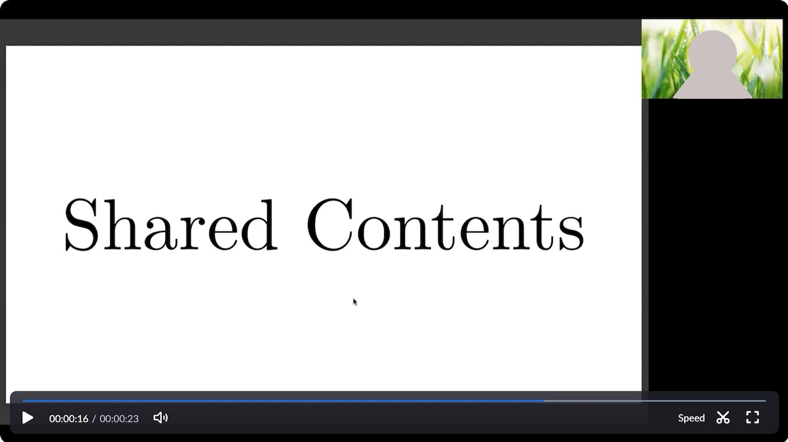{:.border .small}

### Layout configuration procedure
The procedure for configuring the cloud recording layout in advance is as follows.

1. Sign in to the Zoom web portal by following the steps in "[Sign-in Methods for Zoom](../../../signin/#browser)".
2. Open "Recording" from "Settings" in the web portal.
  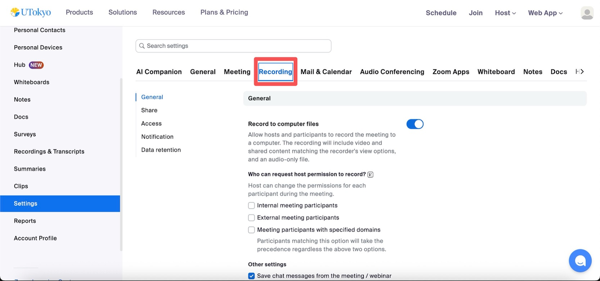{:.border .small}
3. Select the layout you want to record from the "Cloud Recording" options below.
  * To record Speaker View when there is no screen sharing and shared content with the active speaker when screen sharing is used: "Record active speaker with shared screen".
  * To record Gallery View when there is no screen sharing and shared content with the active speaker when screen sharing is used: "Record gallery view with shared screen".
  * To separately record only the active speaker, only Gallery View, or only shared content: "Record active speaker, gallery view and shared screen separately".
    * Then, check the items you want to record from "Active speaker", "Gallery view", and "Shared screen".
  * Note: If multiple layouts are selected, each layout will be recorded as a separate video.
    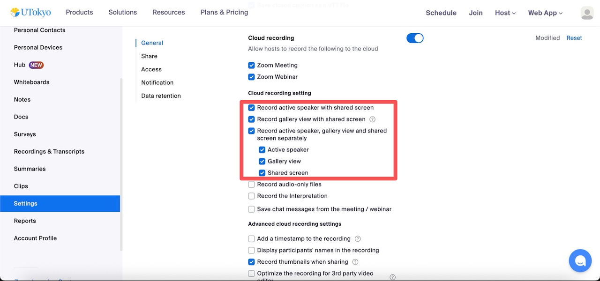{:.border .small}
