Zoom's screen sharing enables you to share your screen with others. You can share the screen you are viewing on your PC or mobile device with all participants. If you open a Word or Power Point file on the shared screen, you can make your presentation showing the document to the participants.

## Start screen sharing

1. Click "Share Screen" in the meeting controls. 

2. You will be given various options for sharing. 
In the "Basic" tab, choose to share your entire desktop or specific application window.  

   * **[Desktop]** Share your full desktop.
   * **[Individual application]** Share an individual application you have opened on your computer such as Word, PowerPoint, web browser, etc.. It is useful when you only want to share an individual file from a specific location.

3. Check the option at the bottom of the window if necessary. (You can also set it up during screen sharing from the "More" in the meeting controls.)
   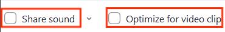
   * **[Share Sound]** If checked, you can share the sound played on your computer during screen sharing.
   * **[Optimize for video clip]** If checked, participants can see the optimized form of video clips played in full screen during screen sharing.

4. Select the screen you want to share and click the blue "Share" button at the bottom right corner.   

## Stop screen sharing

To end the screen sharing, click “Stop Share” at the bottom of the screen sharing controls. This will bring you back to your regular Zoom view.

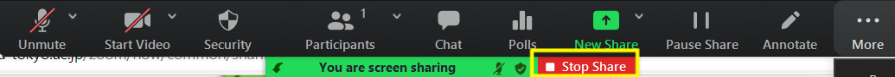

## Screen sharing controls

Screen sharing controls are displayed at either the top or bottom of the screen during screen sharing. The following explains how the controls work.

  
* **[Annotate]** You can annotate the shared screen with the set of annotation tools provided. Tools include a text tool to type text onto the screen, a hand-drawing tool, a stamp tool, and a spotlight tool for highlighting the location of your cursor.
* **[More]** Click to display advanced options.  

  + Advanced options available only for teachers (hosts).
      + **Disable Annotation for Others**: You can prevent participants from annotating the shared screen using the annotation tools.
      + **Show Names of Annotators**: Participants’ names appear next to their annotations on the shared screen.
      + **Start breakout rooms**.
      + **End Meeting**.

## (For teachers) Settings and notes for screen sharing

Settings and notes for screen sharing are summarized as follows.

### Privacy considerations for screen sharing
When you share your desktop, your personal information may be revealed unintentionally. To prevent such a situation, you can share the screen by window.

### Displaying meeting controls during screen sharing
The meeting controls may be hidden at the top or bottom of the window during screen sharing. To display the controls, hover the mouse cursor over the green “You are screen sharing” notification, which is next to “Stop Share” of the in-meeting menu .

### Stop student’s full screen display
During screen sharing, the student's PC screen is basically full screen, and the student cannot move to other windows. If the student double-clicks on the Zoom screen, the screen is no longer full-screen, which is easier to move to other windows. 
If you want the students to use other windows other than Zoom while the teacher’s screen sharing, it is better to instruct them to double-click the Zoom screen.

### Screen sharing controls

#### Setting up who can annotate
You can prevent participants from annotating l by selecting "Disable Annotation for Others" from "More" of the meeting controls.

#### Displaying names of annotators
By selecting "Show/Hide Names of Annotators" from "More" of the meeting controls, participants’ names will appear/disappear next to their annotations on the shared screen. 
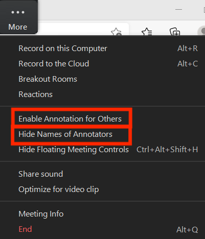

### Configuring screen sharing settings
1. Hit the small green ^ button in the “Share Screen” button and select "Advanced Sharing Options" from the drop-down menu.  
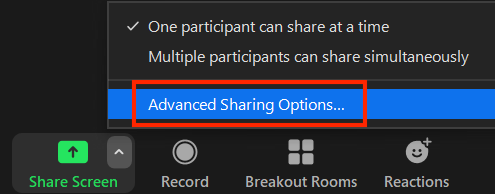

1. "Advanced Sharing Options" window will open.  

#### Settings for sharing multiple screens simultaneously.
+ In “Advanced Sharing Options” under "How many participants can share at the same time?”, you can choose between "One participant can share at a time" and "Multiple participants can share simultaneously (dual monitors recommended).)". 
Hitting the small green ^ button in the “Share Screen” button will also lead you to the setting.
+ If "Multiple participants can share simultaneously (dual monitors recommended)" is selected, "Who can share?” and "Who can start sharing when someone else is sharing?” will be disabled. It suggests that the setting change is applied.
+ When multiple screens are sharing simultaneously, participants using dual monitors will see the two most recently shared screens on each monitor. 
This feature is useful when you want to compare multiple documents at the same time. 
You can set it as default by checking "Use Dual Monitors" in "Settings" →"General" of the Zoom application.
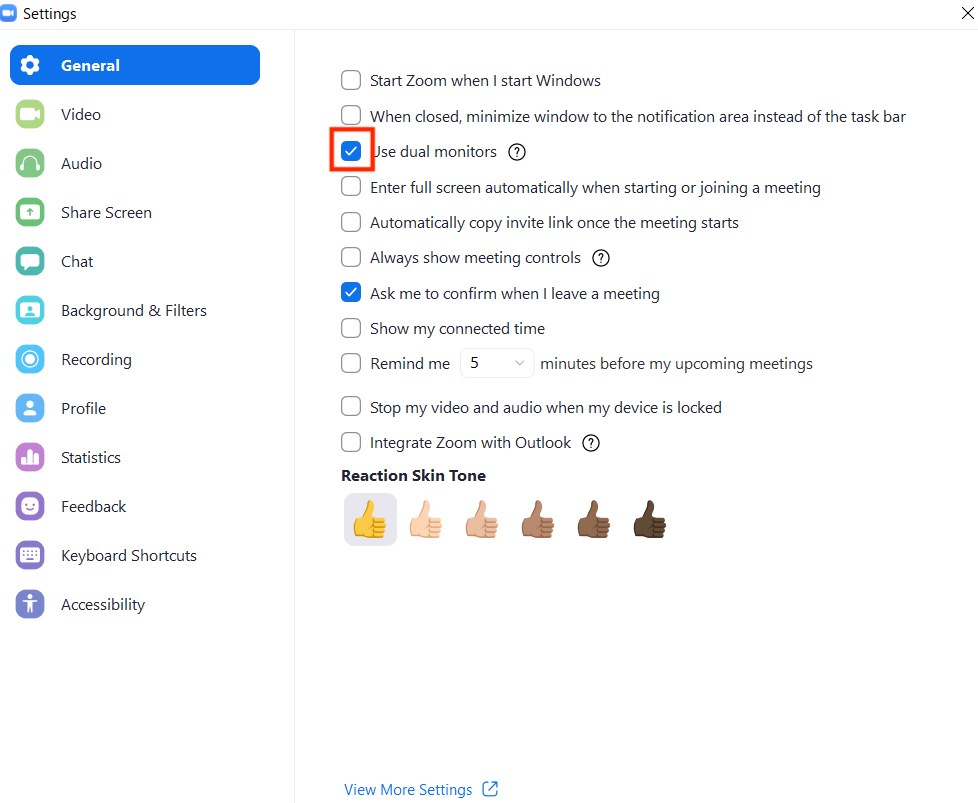
+ Participants using a single monitor will see the most recently shared screen. 
Participants can select “View Options” to change the screen they are viewing.

※Note  
If you select "Multiple participants can share simultaneously (dual monitors recommended)", the option "Optimize screen sharing for video clips" will not be available when sharing the screen. 
Also, when multiple participants are sharing their screens at the same time, the person sharing the screen can only see his own screen.

#### Setting up who can share screen
If "One participant can share at a time" is selected, you can choose between "Only host" and "All participants" under "Who can share?” in “Advanced Sharing Options”. 
For "Host Only", non-teaching participants are prohibited from screen sharing.  
You can also go to “Security” in the meeting controls and check/uncheck the "(Allow participants to Share screen" checkbox from the drop-down menu.
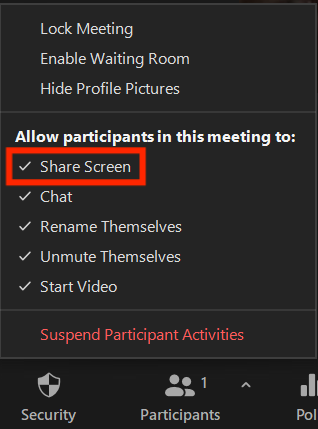

#### Starting a new share when someone is sharing.
If the setting is "Only one participant can share at a time", you can select "Host only" or "All participants" under "Who can start sharing when someone else is sharing?” in “Advanced Sharing Options”. 
If you choose "All participants", everyone can start a new share when someone is sharing.

### Screen Annotation
Click “Annotate” from the screen sharing controls to annotate the shared screen with a set of annotation tools.
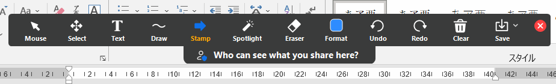

* **[Mouse]** Deactivate annotation tools and switch to your mouse pointer.
* **[Select]** Select, move, or resize your annotations.
* **[Text]** Insert text. Textformat can be changed from "Format".
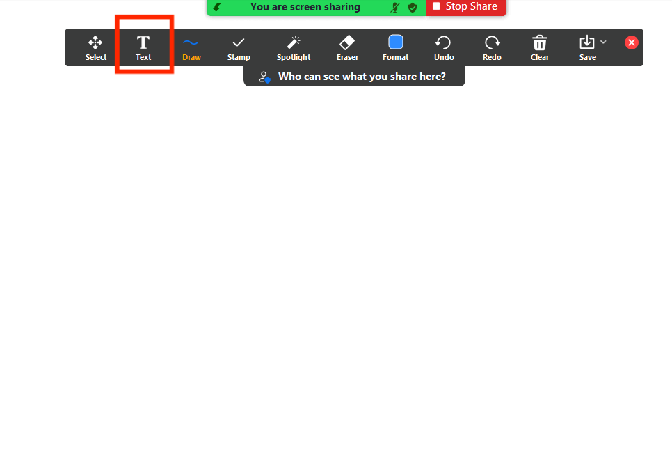  

* **[Draw]** Insert lines, arrows, and shapes..
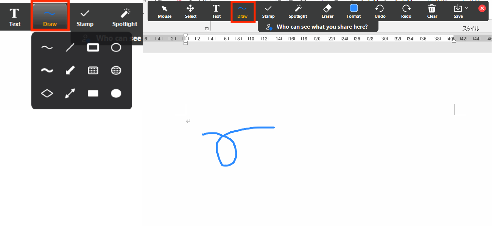

* **[Stamp]** Insert predefined icons like a check mark or star.

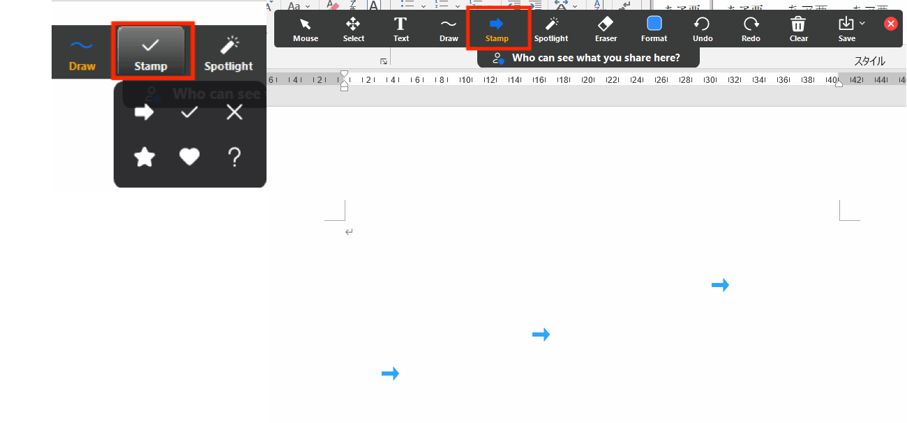

* **[Spotlight]** Turn your cursor into a spotlight or arrow. Display your mouse pointer to all participants when your mouse is within the area being shared. Use this to point out parts of the screen to other participants.
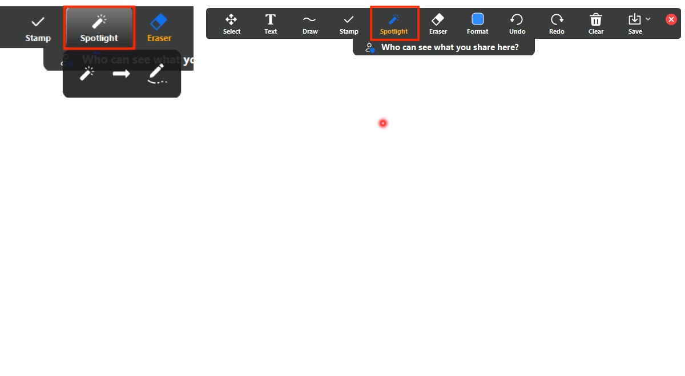

* **[Eraser]** Click and drag to erase parts of your annotation.

* **[Format]** Change the formatting options of annotations tools like color, line width, and font.

* **[Undo]** Undo your latest annotation.
* **[Redo]** Redo your latest annotation that you undid.
* **[Clear]** Delete all annotations. 

  + Clear All Drawings: Clear all annotations on the shared screen.
  + Clear My Drawings: Clear all your annotations.
  + Clear Viewers’ Drawings: (Teachers only) Clear all participants' annotations.
 * **[Save]** Save all annotations on the screen as a screenshot. The screenshot is saved to the local recording location.

## Participants’ controls

Participants can annotate the shared screen and change the screen settings during sharing on their own devices. 
Click the "∨" mark next to "View Options" at the top of the sharing screen, to the right of the green "You are viewing xxxx's screen" field, and open the pulldown.

### Annotation on a shared screen
Click “Annotate” from the screen sharing controls to annotate the shared screen with a set of annotation tools. Details are explained in “Screen Annotation” above.  
However, if "Disable Annotation for Others” is enabled, no annotations can be added.

### Screen settings during sharing
You can choose the window size when screen sharing from the list of “Fullscreen mode”, “Maximize window”, and “Maintain current size”. 
If "Side-by-side Mode" is selected, the shared screen will appear on the left while the speaker on the right. You can adjust the relative space devoted to the shared screen by dragging the vertical gray bar. To set it as default, go to "Settings","Share Screen", and select "Side-by-side Mode" in the Zoom application.

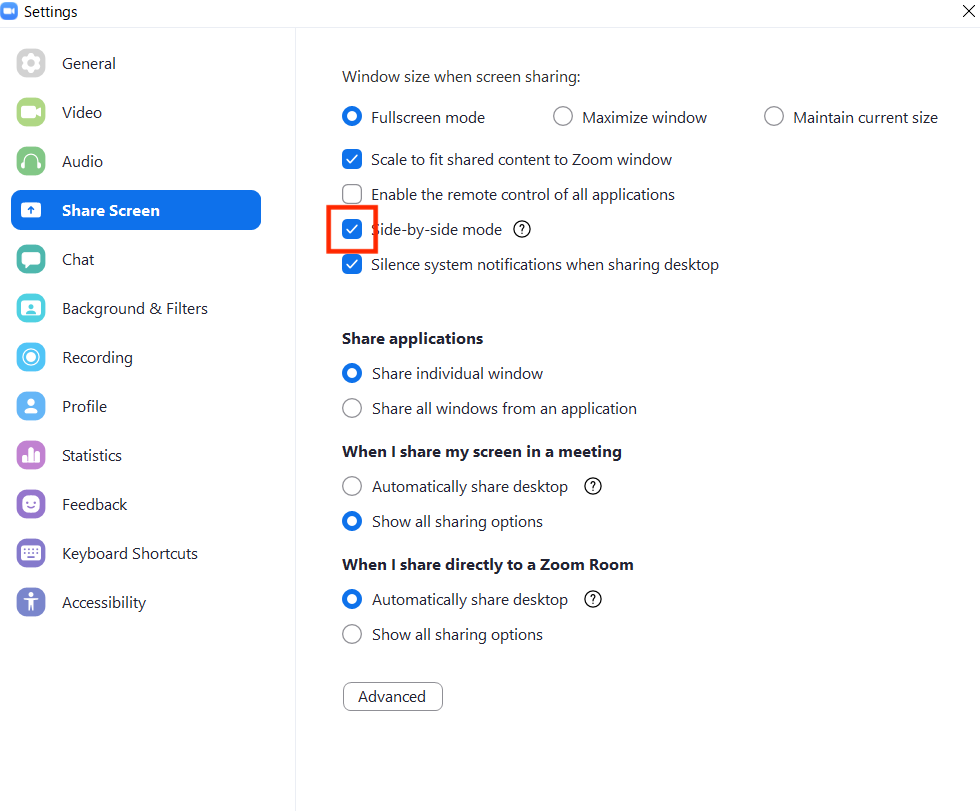
