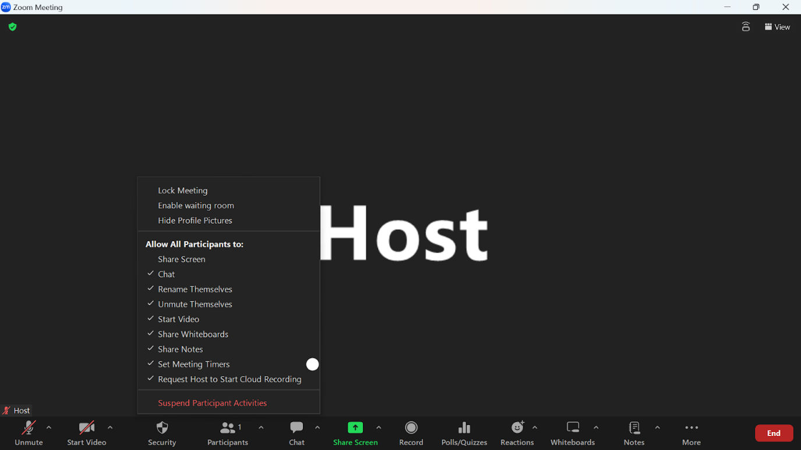

## Introduction
Zoom's screen-sharing feature allows you to display your screen or part of your screen on the other participants' screens. However, since the default setting only allows the host to share their screens, you need to change the settings to enable participants other than the host to share their screens.

This page explains how a host grants screen-sharing capability either by allowing all the other participants or only certain participants to do so. In addition, the latter half explains the relevant settings about granting access so that all participants are able to use the compulsory switching of the shared screen to all participants.

## Granting screen-sharing capability to all participants (Changing the security setting)
The default setting allows only the host to share screens during meetings, but the host can change the settings to grant screen-sharing capability to all participants so that they may share their screens. This is convenient when there are many participants who need to share their screens.

1. Press "Security" in the control toolbar at the bottom of the screen.
2. Press “Share Screen”
{:.border}{:.medium}

※If you repeat step 1 again and see a checkmark next to the “Share Screen”, it means that the changed setting has been validated.

### Granting screen-sharing capability to all participants by default 
If you provide screen-sharing access during a meeting, the screen-sharing capability is only valid for the meeting in progress. However, there is a way to extend its validity not only to the meeting in progress but also to all meetings that you host.

1. Sign in to Zoom according to the steps in  “[Sign-in Methods for Zoom](../../../signin/#browser)”.
2. Press “Settings” in the menu on the left side of the screen.
{:.border}{:.medium}
3. If the settings screen are similar to those in the picture, scroll to “Screen sharing” under “In Meeting (Basic)”.
{:.border}{:.medium}
4. Ensure that the switch on the right of "Screen sharing" is blue and turned on, and change the setting in "Who can share?" to "All Participants".
{:.border}{:.medium}

## Granting screen-sharing capability to specific participants (add co-hosts)
In meetings you host, if you wish to grant screen-sharing capability to specific participants only, adding them as co-hosts is a useful approach. Since the participants being added as co-hosts gain the authority to perform some of the operations that originally only the host is able to perform, they will be able to share their screen. This setting is particularly useful in lectures attended by multiple faculty members or TAs.

Please refer to “[Host and Co-host Controls in a Zoom Meeting](../../../misc/management_roles/)” on how to add co-hosts and the actions that a co-host can perform.

## (Relevant setting) Granting permission to all participants to forcibly switch shared screens
During a meeting where multiple participants are allowed to share their screens, the default setting only allows the host to forcibly share a new screen without waiting for the other participant's screen sharing to end. On the contrary, participants other than the host must wait for the ongoing screen sharing to end before they can start sharing their screen. However, by changing the settings, the hosts can permit the other participants to also be able to forcibly switch the shared screens. This setting can be convenient for smoothly transitioning between presenters during a meeting, but it is important to be aware that it could also enable malicious disruptions. The detailed setting steps are as follows:

1. Press the “^” icon on the right of “Share screen” on the control toolbar at the bottom of the screen.
2. Press “Advanced Sharing Options”
{:.border}{:.medium}
3. When the dialog for “Advanced Sharing Options” appears, make the following selections to allow all participants to forcibly switch to screen sharing.
   - “How many participants can share at the same time?”: “One participant can share at a time”
   - “Who can share?”: “All participants”
   - “Who can start sharing when someone else is sharing”: “All participants”

   {:.border}{:.small}

### Granting permission to all participants to forcibly switch the shared screen by default
You can grant permission to all participants to forcibly switch to screen sharing not only in specific meetings in progress but also in all meetings you host.

1. Sign in to Zoom according to the steps in “[Signing in from the UTokyo Zoom Webpage](../../../signin/#browser)” .
2. Press “Settings” in the menu on the left side of the screen.
{:.border}{:.medium}
3. If the settings screen is similar to that in the picture, scroll to “Screen Sharing” under “In Meeting (Basic)”.
{:.border}{:.medium}
4. For the options within "Screen sharing", make the following selections accordingly and press "Save" to allow all participants to be able to forcibly switch the shared screen.
   - “How many participants can share at the same time?”: “One participant can share at a time”
   - “Who can share?”: “All participants”
   - “Who can start sharing when someone else is sharing”: “All participants”
   
   {:.border}{:.medium}
