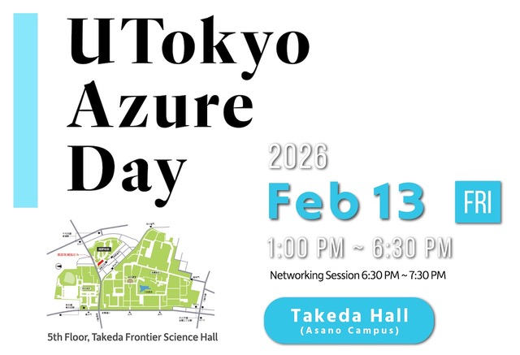

[2026/01/15更新]

## 開催趣旨

2024年10月から2029年9月までの5年間,Microsoft社より本学に対し,Microsoft Azureのギフトクレジットが寄付されることになりました.
これにより,本学の構成員は Azure の各種サービスを利用できる [**「UTokyo Azure」**](/research_computing/utokyo_azure/)を,研究や教育の場で活用いただけます.

本イベントは,UTokyo Azureに関心をお持ちの方が気軽に参加できる学内ネットワーキングイベントです.
クラウド活用の第一歩を踏み出したい方から,すでに導入されている方まで,どなたでも歓迎します.
ポスター発表も募集中ですので,ぜひご検討ください！

特に次のような方はぜひご参加ください：
- UTokyo Azure（GPU,生成 AI,ストレージ など）の利用に関心のある方
- すでにUTokyo Azureを利用中の方
- 他分野との連携・学際研究に関心のあるAI/CS分野の研究者
- AI・データ活用型の分野研究（AI for Science）に取り組む研究者
- AI・データを活用した教育・授業を実施されている方

## 概要
- **日時**：2026/2/13（金） 13:00-18:30
- **開催方法**：対面（オンサイト）
- **会場**：東京大学武田ホール（東京大学浅野キャンパス　武田先端知ビル5F）
- **参加対象**：東京大学の教職員・学生・共同研究者
- **定員**：150名程度（申込先着順）
- **言語**：講演セッションは英語、ポスター発表は日本語または英語（任意）
- **参加費**：無料　
- **情報交換会**：
  - 会場：武田ホール ホワイエ
  - 時間：18:30-19:30
  - 定員：40名程度
  - 参加費：無料（1月9日更新）  ~~1,000円（予定） ※当日受付にて申し受けます~~

- **チラシ**： [UTokyo Azure Day Flyer](/en/events/2026-02-13/Flyer.pdf)

## ポスター発表募集

ポスター発表を広く募集します.
UTokyo Azureをご利用中の方、これから使ってみたい方、教員・職員・学生を問わずエントリーをお待ちしています.学内の異分野の研究者・学生と交流する機会となれば幸いです.

発表頂ける方は、参加登録フォームの発表の有無欄にて”ポスター発表”にチェックの上,発表タイトルをお知らせください.  
- **ポスター募集件数**：30件
- **申込資格**：教員・職員・学生どなたでも歓迎（UTokyo Azure利用の有無は問いません）
- **ポスター発表申込期限**：2026年2月9日(月)正午
- **ボードサイズ**：W 85 cm × H 175 cm（フレーム部分は除く）
- **ポスターサイズ**：A0サイズ1枚でも,A4などを複数枚貼る形でも,形式は問いません
- **Lightning Talk**：ポスター1件あたり1分以内で,ポスターの概要を口頭でご説明頂きます.  
  スクリーンに投影する資料として,各人 PDF 1枚を前日昼12時までに提出をお願いします.
  - 提出いただくPDFは,16:9 や 4:3 といった一般的なスライドのフォーマット,またはポスターそのものの PDF でも問題ありません.
  - ファイル名は自由です.
    - 但し,アップロードする方の氏名が自動でファイル名に付加されるため,発表者とは別の方が代理でアップロードする場合は,ファイル名を「発表者氏名.pdf」としてください.
  - 当日のライトニングトークでは,提出いたただいた資料をこちらで順次スクリーンに投影しますので,1分で簡単な説明をお願いします.1分経過すると自動的に次の資料に切り替わります.投影される画面には次の発表者名 (アップロードされたファイル名) も表示されますので,次の発表者の方は随時登壇の準備をお願いします.
  - アップロード期限：2月12日（木）正午
  - アップロード先： 
  https://univtokyo.sharepoint.com/:f:/t/Teams.azure.adm/IgCG1YR5PuRjQL2VEbiGdITgATvQ1LzGwTJrgE1jCZwt5e8

  
## 参加申込
[**参加登録フォーム**](https://forms.office.com/Pages/ResponsePage.aspx?id=T6978HAr10eaAgh1yvlMhMnMUjT-HAJEmtUvNy6sajtUNlRPWkZUT1BYR1BVSjZITEJXU1ExTlhLQi4u)よりお申し込みください．
- **申込期限**：**2026年2月9日(月)正午**

## プログラム（予定）
※変更する場合があります．

| 時間          | タイトル                                                                 | スピーカー（所属）                                   |
|---------------|---------------------------------------------------------------------------|--------------------------------------------------------|
| 12:30-13:00   | 受付                         | ―
| 13:00-13:20   | UTokyo Azure Status Report What is it? Who uses it and how? Where it stands? | 田浦 健次朗 （執行役・副学長）                         |
| 13:20-13:50   | Azureの代表的なサービスの使い方 | 山肩 洋子 （情報基盤センター・教授）                    |
| 13:50-14:20   | マイクロソフトリサーチアジア東京の紹介                                  | 松下 康之 （Microsoft Research Asia-Tokyo・所長）                      |
| 14:20-14:50   | 行政データの活用とプラットフォームの構築                                  | 川口 大司 （公共政策大学院・教授）                     |
| 14:50-15:05   | 休憩 |     ―             |
| 15:05-15:35   | 情報学を軸とした学際研究の推進 〜知能社会国際卓越大学院（IIW）プログラム〜 | 鶴岡 慶雅 （情報理工学系研究科・教授）                     |
| 15:35-16:05   | Truth and Trust: Enhancing Factual Reliability in LLM Generation for Japanese Medical Text                                                                       |Li Zihui （工学系研究科・特任講師）                                                       |
| 16:05-16:35   |  Using MD simulations to predict protein interactions and oncogenic enzymatic activity                     | Donald Cameron （定量生命科学研究所・准教授）                                                      |
| 16:35-16:55   | 休憩                                  | ―                     |
| 16:55-17:30   | Lightning Talk （ポスター発表者による1分プレゼンテーション）                   |  ポスター発表者                                       |
| 17:30-18:30   | ポスターセッション                                                                | ポスター発表者
| 18:30-19:30   | 情報交換会                                                                | ―                                                      |

## 注意事項
- 現地参加・ポスター発表・情報交換会については,申込期限前であっても定員に達し次第,締め切ります.
- 参加・ポスター発表に係る旅費は,各自でご負担ください.

## 問い合わせ
utokyo-azure-admin-group [at] g.ecc.u-tokyo.ac.jp

