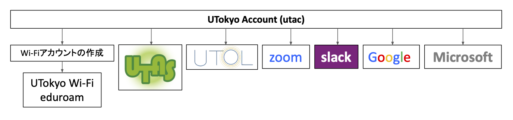

import UTokyoAccountChangePassword from '@components/ja/systems/utokyo_account/ChangePassword.mdx'
import UTokyoAccountMFA from '@components/ja/systems/utokyo_account/MFA.mdx'
import PrelinkingIdentMyna from "@components/ja/systems/utokyo_account/PrelinkingIdentMyna.mdx";
import ZoomSigninBrowser from "@components/ja/systems/zoom/SigninBrowser.mdx";
import InformationSecurity from "@components/ja/InformationSecurity.mdx";
import UtolLogin from '@components/ja/systems/utol/Login.mdx'

<b class="box">
{/* 2025/9/10 15:00から，説明会「<a href="/events/2025-09-10/">東京大学における情報システムとコミュニケーションツール</a>」を開催します．本ページとあわせてご参照ください． */}
2025/9/10 に，説明会「<a href="/events/2025-09-10/">東京大学における情報システムとコミュニケーションツール</a>」を開催しました．説明会の資料と動画をリンク先のページで提供していますので，本ページとあわせてご参照ください．
</b>

## 基本的なご案内

東京大学で授業を行う際には，授業形態が対面型かオンライン型かにかかわらず，さまざまな情報システムを使うことになります．このページでは，そのために必要なアカウントの初期設定と，授業で使われる主なシステムについて説明します．

職員の方は[東京大学における情報システムの準備について（職員向け）](/staff_members/)をご参照ください．

アカウントの初期設定では、以下の3つを行う必要があります．

1. パスワードを初期パスワードから変更する
1. 多要素認証を設定する
1. 情報セキュリティ教育を受講し、テストに合格する

詳細については，後述の説明をご参照ください．

### 授業形態とその取り扱いについて

東京大学で行われている授業にはいくつかの形態があります．基本となるのは従来の対面型授業ですが，それに加えて様々な形態のオンライン授業が活用されています．「[よりよいオンライン授業の実施方法を探す](/online/courses/)」のページにて，各授業形態に関するポイントや実践例，制度上の取り扱いについて説明していますので，ご覧ください．

オンライン授業の場合，「[2021年度Sセメスター以降におけるオンライン授業向けツールの利用ガイドライン](/docs/guideline/)」が定められていますので，参照してください．また，部局ごとにオンライン授業の実施にあたって方針を定めていることもありますので，あわせて確認してください．

### 困ったときは：サポート窓口

東京大学の情報システムの利用にあたり，トラブルや情報システムの利用方法に関する相談などは，**[サポート窓口](/support/)**にご相談ください．チャット・オンライン通話・メールフォーム・対面の4つの方法で相談を受け付けており，学生スタッフと教職員の共同体制により迅速な対応を行っています．

## 東京大学のシステムの全体像

東京大学では，Microsoft, Google等，様々な情報システムを提供しています．こうしたさまざまなシステムを利用するには，UTokyo Accountと呼ばれる全学的なアカウントを用いてサインインを行います．次の図はこのような東京大学の情報システムを表す概要図です．

なお東京大学では，セメスターの開始にあたり，教職員の方向けに，東京大学の各システムの概要についての説明会を実施しています．東京大学で提供している情報システムは多岐にわたり，把握するのが難しいですが，説明会ではそれぞれのシステムとその関係性について説明しておりますのでよりわかりやすくなっています．2025年度Aセメスターに向けた説明会につきましては，「[東京大学における情報システムとコミュニケーションツール](/events/2025-09-10/)」をご覧ください．

以下では，東京大学のシステム，およびその利用方法について個別に説明いたします．

## はじめに：「UTokyo Account」の初期設定など

「UTokyo Account」は，東京大学の情報システムを利用する際に必要となる全学的なアカウントです．この後で説明するZoomやUTOLなどの各システムは，このアカウントでログインして使うのが基本になります．

UTokyo Accountは，`0123456789@utac.u-tokyo.ac.jp`のように，10桁の数字（共通ID）の後に東京大学であることを表す記号`@utac.u-tokyo.ac.jp`を付けたもので表されます．

以下，UTokyo Accountの初期設定について説明します．システムを利用するために必要となる重要な作業ですので，よく読んで作業を行ってください．

### 【必須】UTokyo Accountの初期パスワードを変更する
{:#change-initial-password}

<UTokyoAccountChangePassword variant="faculty_members" />

### 【必須】UTokyo Accountの「多要素認証」を有効化する
{:#setting-up-mfa}

<UTokyoAccountMFA />

{/*
情報システムのセキュリティ向上を目的として，UTokyo Accountには「多要素認証 (Multi-Factor Authentication, MFA)」を導入しています．多要素認証とは，アカウントへのサインイン時に，パスワードに加えて，SMSや専用のアプリなどで本人確認を行う認証方法です．多要素認証を利用すると，なんらかの事情でパスワードが他人に知られた場合でも，アカウントにサインインされる可能性を低くすることができ，セキュリティを向上することができます．

大学全体のセキュリティ向上のため，東京大学では，UTokyo Accountの多要素認証を有効化することを強く推奨しています．特に教職員については，全員が多要素認証を利用することになっています．「**[UTokyo Accountの多要素認証の初期設定手順](/utokyo_account/mfa/initial/)**」のページに記載の手順で，有効化を行ってください．
*/}

### 【必須】情報セキュリティ教育の受講
{:#information-security-education}

<InformationSecurity variant="faculty_members" />

### 【推奨】UTokyo Account本人確認サービスの事前連携
{:#myna-link}

<PrelinkingIdentMyna />

## 学務システム「UTAS」を使う

「[UTAS](https://utas.adm.u-tokyo.ac.jp/campusweb/campusportal.do)」は，東京大学の学務システムです．シラバスの入力や成績の報告などに使われます．具体的な操作については，授業を開講する部局の学務・教務担当からの案内・指示を確認してください．また，UTASにログインして上部のメニューで「その他」を押すと表示される「ダウンロードセンター」からマニュアルをダウンロードすることもできます．

## 学習管理システム「UTOL」を使う

UTOL (UTokyo LMS) は，東京大学の学習管理システムです．授業資料の配布・課題提出・オンライン試験・教員から学生へのお知らせ通知などの機能があります．また，オンライン授業のURLを学生に連絡する際にも，UTOLの機能を使うことになっています．以下では，このUTOLの使い方について説明します．

### UTOLへのログイン

<UtolLogin />

### 授業のページを開く

UTOLにログインすると，「時間割」画面が表示された状態になります．基本的には，自分の担当する授業が既に表示された状態になっているはずです．それぞれの授業をクリックすると，授業のページ（UTOLでは「コース」と呼んでいます）が開きますので，以後の操作はそこで行うことになります．

ヘルプ：授業が表示されていない場合

<ul>
    <li>UTOLに授業の情報が登録されるのは，開講の約1ヶ月前になります．それ以前には表示されません．</li>
    <li>UTAS（学務システム）との連携で自動登録を行っているため，デフォルトではUTAS上で自身が担当教員として登録されている授業のみが表示されます．なお，連携による自動登録のほか，担当教員として登録済みの教員が「[コース参加者登録](/utol/lecturers/settings/course_participants/)」を行うことで，担当教員を手動で追加登録することもできます．</li>
</ul>

### UTOLの各種機能の活用

UTOLには，以下のような機能があります．各機能の詳細は，[UTOLのページ](/utol/)や[マニュアル](https://utol.ecc.u-tokyo.ac.jp/common/support/manual)をご覧ください（マニュアルはUTOLにログイン後，メニュー右上の「Manual」から参照できます）．

- **お知らせ**：教員から学生に連絡を送る機能です．学生側の設定により，メール，LINE，または[UTokyo Slack](/slack/)で届きます．
- **メッセージ**：コース参加者間で連絡をとる機能です．他の参加者からのメッセージは，デフォルトでは職員名簿に登録されているメールアドレスに届きますが，右上の「Settings」で変更できます．
- **教材**：授業資料を配布する機能です．「[UTOLで教材機能を利用する](/utol/lecturers/materials/)」のページで操作方法などを説明しています．
- **課題**：レポートなどの課題をオンラインでアップロードできるようにする機能です．「[UTOLで課題機能を利用する](/utol/lecturers/assignments/)」のページで操作方法などを説明しています．
- **テスト**：オンラインでテストが行える機能です．制限時間を定めて解答させたり，選択式の問題の自動採点をしたりすることができます．「[UTOLでテスト機能を利用する](/utol/lecturers/quizzes/)」のページで操作方法などを説明しています．
- **アンケート**：学生に対してアンケートを行える機能です．「[UTOLでアンケート機能を利用する](/utol/lecturers/surveys/)」のページで操作方法などを説明しています．
- **出席管理**：出席者にZoomなどで「ワンタイムパスワード」を連絡し，それを入力してもらうことで，出欠の管理を行う機能です．「[UTOLで出席機能を利用する](/utol/lecturers/attendances/)」のページで操作方法などを説明しています．
- **掲示板**：学生と教員の間や学生同士で，意見交換などのやり取りが行える「掲示板」の機能です．「[UTOLで掲示板機能を利用する](/utol/lecturers/forums/)」のページで操作方法などを説明しています．

これらの機能は他の授業支援ICTツールと同じようなものですが，UTOLは東京大学のアカウント (UTokyo Account) および履修登録などを行う学務システム (UTAS) と連携しているため，「東京大学の学生だけに」あるいは「その授業の履修者だけに」情報を渡すことが簡単に行えます．学生への浸透率も高いので，授業資料の配布・課題のやり取りなどには，まずUTOLのご利用をお考えください．

### 授業URLの連絡
{:#course-url}

オンライン授業を行う場合，学生へのURLの連絡は，UTOL授業ページの上部にある「オンライン授業情報」欄を利用するのが原則です． 「オンライン授業情報」欄の右にある編集ボタン（ペンのマーク）を押すと，編集画面が開き，情報を入力することができます．

- URLが自動的にリンクになりませんので，お手数ですが，編集画面の{:.inline}ボタンを押してリンク化するようお願いします．
- タブレットなどのアプリから参加する学生に便利なよう，URLだけでなくミーティングIDとパスコードもなるべく記載するようお願いします．

入力を終えたら，最後に下部の「確認画面に進む」から確認画面に進み，「登録する」を押して，データを送信してください．

なお，授業URLの連絡に関しての詳細は，「[授業URLの連絡方法（教員向け）](/faculty_members/url/)」のページもご覧ください．

## Zoomを使う
{:#zoom}

オンライン授業を行う場合，東京大学では，教員が自身でオンラインのミーティングを設定するのが基本です．東京大学でオンラインのミーティングに最も多く使われているシステムはZoomですので，特に理由がない場合には，学生にとって慣れたツールであるZoomの利用をおすすめします．

### Zoomへのサインイン

東京大学ではZoomのライセンス契約を行っており，サインインして利用すると，参加者数の上限が300人・時間の上限が30時間のミーティングを開催できます．

<ZoomSigninBrowser big inlineHelp support/>

なお，アプリからサインインする場合は手順が異なりますので，[Zoom サインイン方法](/zoom/signin/)のページをご覧ください．

### 会議室の作成

続いて，Zoomの会議室を作成する方法を説明します．

1. Zoomにサインインした状態で，右上にある「スケジュール」を押してください．
2. 会議室の設定をする画面が表示されます．
    - 「トピック」欄に会議室の名前（タイトル）を入力してください．
    - 「開催日時」や「期間」などは適宜設定してください．「定期ミーティング」にチェックを入れることで，一つの会議室で（URLを変えずに）複数回の授業を行うことができます．
    - 「参加時に認証を求める」という設定項目がありますが，特に学期開始当初は大学のアカウントの設定が済んでいない学生もいることから，入室制限を行う方法については注意が必要です．詳しくは「[授業におけるZoom会議室の入室制限](/faculty_members/zoom_access_control/)」をご覧ください．
3. 最後に「保存」を押すと，作成された会議室の情報を確認できる画面に移動します．「招待リンク」欄に会議室のURLが表示されており，このURLから会議室に入室できるようになっています．

アプリを使って会議室を作成することもできます．詳細は「[Zoomのアプリについて](/zoom/misc/app/)」のページをご確認ください．
### 詳しい使い方

Zoomの詳しい使い方については，**[本サイトのZoomのページ](/zoom/)**にて説明していますので，ご覧ください．

## 東京大学のシステムを活用する

東京大学では，以上で説明したもののほかにも，授業や教育研究に活用できる各種情報システムを契約・運用しています．

ここでは，代表的なものについて説明します．以下の図は，ここで説明するサービスを簡単にまとめたものです．

{:.medium}

### UTokyo Wi-Fi

UTokyo Wi-Fiは東京大学のキャンパス内で提供されている学内向けWi-Fiで，学内限定のデータベースや電子ジャーナルへのアクセスが可能です．利用するためには事前に準備が必要です．

利用方法などの詳細は，**[UTokyo Wi-Fiのページ](/utokyo_wifi/)**をご覧ください．

### ECCSクラウドメール (Google Workspace)

Googleのシステムを東大のアカウントで利用できるようにしたもの (Google Workspace) です．東大のメールアドレス (`xxxx@g.ecc.u-tokyo.ac.jp`) が使えるGmail，オンラインストレージサービスのGoogleドライブ，文書作成サービスのGoogleドキュメント，表計算サービスのGoogleスプレッドシート，フォーム作成サービスのGoogleフォーム，動画配信サービスのYouTube，Web会議のGoogle Meet，など多くの機能が使用できます．また，東京大学のアカウントに限って公開する，通常のGoogleアカウントにはない共有設定（限定公開）も可能です．

利用方法などの詳細は，**[ECCSクラウドメールのページ](/google/)**をご覧ください．

### UTokyo Microsoft License

東京大学では，Microsoftのシステムを大学のアカウントで利用できるようになっており，WordやExcelなどのMicrosoft Officeアプリのダウンロードが可能です．その他にも，Web版のOffice，ファイル置き場のOneDrive，フォーム作成サービスのMicrosoft Formsなどのさまざまな機能を使うことができます．

利用方法などの詳細は，**[UTokyo Microsoft Licenseのページ](/microsoft/)**をご覧ください．

### UTokyo Slack

ビジネスチャットツールと呼ばれるサービスの一種で，テキストメッセージをやり取りしてコミュニケーションを取るためのツールです．テキストメッセージを投稿できる「チャンネル」という場所を複数作って別々のやり取りを同時並行で行えるのが特徴です．なおUTokyo Slackでは，コミュニケーションを行う人が集まる単位である「ワークスペース」は，教職員からの申請により作成できます．

利用方法などの詳細は，**[UTokyo Slackのページ](/slack/)**をご覧ください．

### Slido

Q&Aやライブ投票・アンケートなど，授業や会議・講演会などでの参加者との双方向コミュニケーションに役立つ機能を提供しているWebサービスです．

利用方法などの詳細は，**[Slidoのページ](/slido/)**をご覧ください．

### MATLAB

MATLABは科学技術計算を目的に開発されたプログラミング言語，およびこれを用いた数値計算・数式処理ソフトウェアです．教育効果の向上，研究の効率化などを支援するため，東京大学では全学でMATLABのライセンスを契約し学生や教職員の方に提供しています．また，ソフトウェア開発元のMathWorks社と連携して利用に関するサポート窓口を提供しているほか，授業利用に関する情報を共有する学内コミュニティの整備を進めています．

利用の方法やサポートの詳細は**[UTokyo MATLAB Campus-Wide Licenseのページ](/matlab/)**をご覧ください．

### UTokyo Portal
[UTokyo Portal](https://login.adm.u-tokyo.ac.jp/utokyoportal)は教職員向けの学内ポータルサイトです．業務に必要な手続きや資料の確認を行えるほか，様々な「やりたいこと」に対応したマニュアルを便利帳としてトップページの下部に掲載しています．また各種通知につきましてもこのページに掲載されますので，ご確認ください．

### その他

- **[ECCS端末](/eccs/)**
    - キャンパス内に設置されているパソコンです．プログラミング環境や統計・3DCGなどの各種ソフトウェアが導入されており，自分でインストール作業をしなくても使うことができます．利用には事前に手続きが必要です．
- **[EZproxy](https://www.lib.u-tokyo.ac.jp/ja/library/literacy/user-guide/campus/offcampus/ezproxy)**
    - 東京大学が契約している学内者限定の電子ジャーナルにキャンパス外からアクセスするためのシステムです（教職員だけでなく学生も利用することができます）．
- **[UTokyo VPN](/utokyo_vpn/)**
    - 東京大学の一部の情報システム（人事情報MyWeb等）は，学内ネットワークからのみアクセスが可能です．UTokyo VPNは，このようなシステムにキャンパス外からアクセスするためのシステムです．
- **[ウイルス対策ソフトウェア包括ライセンス (UTokyo Antivirus License)](/antivirus/)**
    - 教職員・学生を対象に，[ウイルス対策ソフトウェア包括ライセンス (UTokyo Antivirus License) ](/antivirus/)を提供しています．東京大学では，「[情報倫理・コンピュータ利用ガイドライン](https://www.u-tokyo.ac.jp/adm/cie/ja/index.html)」にて，コンピュータについて「適切なウイルス対策」をすることを求めていますので，対策の一環として，適宜利用してください．
    - 2025 年度版の提供は 2025 年 4 月 1 日から開始しました．

## オンライン授業Tips

オンラインで授業を行うにあたり，授業の録画を共有したり出席を記録したりする機会があるかと思います．各種ツールに備わっている機能を利用することで，教員・学生の双方に過大な負担をかけることなくこれらを実施することができますので，以下でその代表的な方法について説明します．

### 録画の共有

ここでは，授業の録画を行い，それを共有する方法を説明します（授業の録画は，機器や回線のトラブルあるいは体調不良などで授業に出席できなかった学生が授業を受けるための手段となるだけでなく，そうでない学生にとっても，復習のために見返すことができる，一時停止をするなど自分のペースで学ぶことができる，といった点において役立つと考えられます）．

- Zoomには，録画を行う「レコーディング」機能があります．特に「クラウド レコーディング」機能では，動画をZoomのクラウド上に保存し，それをそのまま公開することができます．公開の際に閲覧可能な範囲を東京大学のアカウントに限定することも可能です．
    - 詳細は「[（Zoom 教員編）クラウドに録画する](/zoom/how/faculty_members/recording_cloud/)」をご覧ください．
- Zoomで録画した動画について，一部を削除するなどの編集をした上で公開したい場合は，GoogleドライブやYouTubeにアップロードすることが一般的と思われます．この場合も，閲覧可能な範囲を東京大学のアカウントに限定することができます．
    - これらの機能についての詳細は「[Googleドライブ](/google/drive/)」や「[YouTubeのコンテンツを学内構成員限定で公開する](https://www.sodan.ecc.u-tokyo.ac.jp/hack/youtube-utokyo-only/)」をご覧ください．
    - 動画の編集については「[動画を作成・共有する](/articles/create_share_movie/)」もご覧ください．
- これらの動画のURLをUTOLの「教材」欄に掲載することで，学生に録画を共有できます．

### 出席の取り方

ここでは，オンライン授業において学生の出席を記録する方法を説明します．

- UTOLの出席管理機能：出席者にZoomなどで「ワンタイムパスワード」を連絡し，それを入力してもらうことで，出欠の管理を行う機能です．
    - 操作方法などを「[UTOLで出席機能を利用する](/utol/lecturers/attendances/)」のページで説明しています．
    - 出席の登録にはログインが必要ですが，「ワンタイムパスワード」を学生間でやり取りして実際には出席していない学生が登録してしまうことがシステム上は避けられません．
- Zoomのレポート機能：Zoomの会議室に入っていた参加者の一覧を閲覧・ダウンロードできる機能です．
    - 操作方法などを「[（Zoom 教員編）出席管理を行う](/zoom/how/faculty_members/attendance/)」のページで説明しています．
    - 東京大学のZoomアカウントでサインインしている参加者については，実際に本人が参加していたと判断できると考えられます．
    - Zoomにサインインしていない参加者については，名前を参加者自身で設定できるため，誰が参加していたのか確実に分かるわけではありません．
    - 途中で切断されて繋ぎ直すなどした場合に記録が抜け落ちる可能性があるため，本人が自分の出席状況を確認できるようにするなどの方策が必要かもしれません．

また，オンライン授業の性質上，Zoomの会議室に接続していても学生が授業を聞いているとは限らないため，単なる出席の有無だけでなく，リアクションペーパーや小テストなどによって授業内容の理解度を確認することも有力な選択肢であると考えられます（UTOLのアンケート機能やGoogleフォーム・Microsoft Formsなどが利用できます）．なお，オンライン授業では課題が多くなりがちであるため，授業時間内で完結させるなど学生の負担に配慮するようご注意ください．

## オンラインを活用するための情報

このサイト「**情報システムの総合案内サイト @ 東京大学**」，愛称「**utelecon**」では，このページで挙げた情報システムを使いこなすための情報や，その他オンライン授業に役立つ情報をたくさん掲載しています．

特に，「**[オンラインを活用するために](/online/)**」のページでは，各種情報システムの授業での活用方法や，オンライン授業の実践例など，オンライン授業を行うにあたって次の一歩となる情報をまとめています．ぜひご覧ください．

また，**[サポート窓口](/support/)**も設置しています．このページで説明した手順の中でうまくいかないことがあれば，こちらへご相談ください．

さらに，uteleconでは[公式Xアカウント](https://x.com/utelecon_pr)を通じて，更新情報やお知らせなどを発信しています．ぜひフォローして，最新の情報を得てください．
