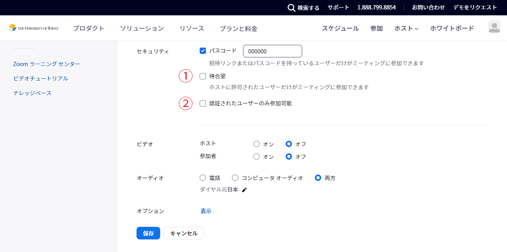
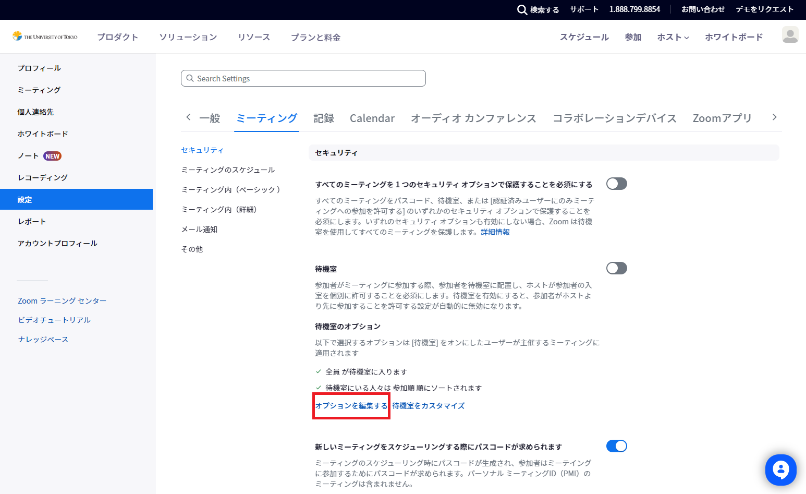
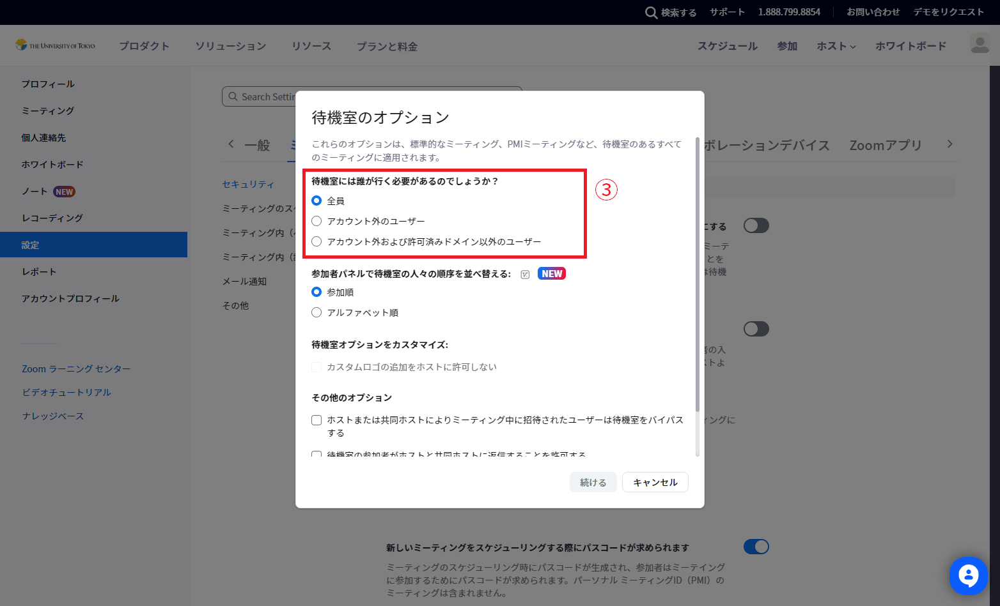

このページでは，授業でZoomを利用する際，意図しない参加者（いわゆる「荒らし」，Zoom Bombing）を防ぐための設定について説明します．

## 概要

Zoomの設定で，会議室に入ることができる参加者を制限するには，概ね次のようなやり方があります．

- (A) Zoom上では制限をかけず，誰でも会議室に直接入れるようにする．URLを東大構成員のみが閲覧できる場所（ITC-LMSなど）に書くことでアクセスを制限する．
- (B) 東京大学のアカウントでサインインしている参加者は直接会議室に入れるようにし，東京大学のアカウントでサインインしていない参加者は一度「待機室（待合室）」に入るようにする．
- (C) **非推奨**：参加者全員が一度「待機室（待合室）」に入るようにする．待機室に入った参加者はホストが許可すると本体の会議室に入ることができる．参加者が誰なのかあらかじめ分かっている場合に特に有効だが，授業にはあまり適さない．
- (D) **非推奨**：東京大学のアカウントでサインインしていないと一切会議室に入れないようにする．特に学期開始当初は，大学のアカウントの設定が済んでいない学生も多いことから，この設定を行う場合は慎重に検討する必要がある．

### 設定の考え方

授業では，特に学期開始当初は大学のアカウントの設定が済んでいない学生もいることから，大学のアカウントが必要な入室制限には慎重になる必要があります．

- (A)の方法では，アカウントの設定が済んでいない人でも入室できますが，一方でURLが漏れた場合に部外者が入ってくるリスクも存在します．
- (B)の方法では，URLが漏れた場合でも部外者は待機室に送られるためリスクはある程度下げることができますが，大学のアカウントにサインインできておらずに待機室に入ってしまう学生が多いと，授業中に入ってきた学生が待機室に取り残されるといった事故の可能性が高まります．

それぞれの授業の性格や参加する学生層などを踏まえ，どちらの設定を採用するか判断してください．なお，部局ごとにどのように設定するかの方針を定めていることもありますので，確認してください．

## 設定方法

### 設定項目

Zoomで入室制限を行う際には，以下の①～③の3つの項目で設定を行う必要があります．

- 「①待合室」「②認証されたユーザーのみ参加可能」：ミーティングをスケジュールする際に，「セキュリティ」の項目で設定を行います．ミーティングをスケジュールする手順は「[会議室の作り方](/zoom/create_room)」のページも参考にしてください．
{:.medium}
- 「③待機室には誰が行く必要があるのでしょうか？」：Zoomの設定ページから設定を行います．
    1. Web ブラウザで[Zoomの設定ページ](https://u-tokyo-ac-jp.zoom.us/profile/setting)へ移動します．
    2. 「待機室のオプション」の「オプションを編集する」を押します．
    {:.medium}{:.medium}

### 方法ごとの具体的な設定

- (A) Zoom上では制限をかけず，誰でも会議室に直接入れるようにする
    - ①待合室: オフ
    - ②参加時に認証を求める：オフ
- (B) 東京大学のアカウントでサインインしていない参加者のみが一度「待機室（待合室）」に入るようにする
    - ①待合室: オン
    - ②参加時に認証を求める：オフ
    - ③待機室には誰が行く必要があるのでしょうか？：「アカウント外および許可済ドメイン以外のユーザー」を選択した上で，入力欄に `*.u-tokyo.ac.jp` と入力
- (C) **非推奨**：参加者全員が一度「待機室（待合室）」に入るようにする
    - ①待合室: オン
    - ②参加時に認証を求める：オフ
    - ③待機室には誰が行く必要があるのでしょうか？：「全員」
- (D) **非推奨**：東京大学のアカウントでサインインしていないと一切会議室に入れないようにする
    - ②参加時に認証を求める：「大学アカウントでサインイン」を選択した上で，その下のドメインが `*.u-tokyo.ac.jp` と表示されていることを確認（[詳細](/zoom/auth)）
