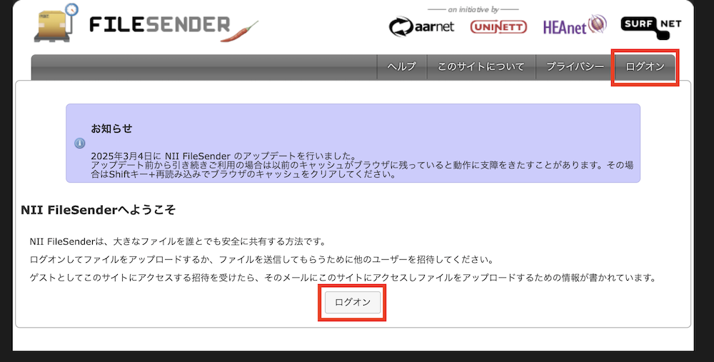
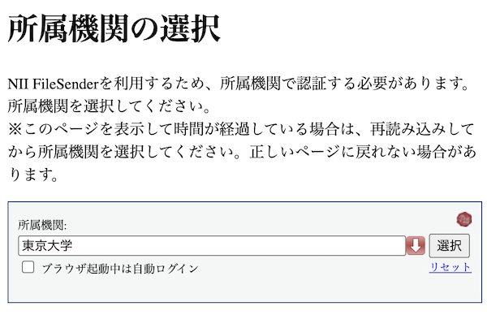

## NII FileSenderとは

NII FileSenderは，国立情報学研究所(NII)が提供するファイル転送サービスです．東京大学の構成員はUTokyo Accountでこれを利用でき，UTokyo Accountを持たない相手との間でファイルを送受信することもできます．

なおNII FileSenderは，東京大学のほか，日本の多くの大学や研究機関等でも，[学術認証フェデレーション「学認（GakuNin）」](https://www.gakunin.jp/)の仕組みを通じて，各大学等のアカウントで利用可能です．利用するには，送信者・受信者のどちらかがアカウントを持っていれば十分です．

### 利用上の制約

- 一度に転送できる最大容量は10GB，最大ファイル数は30個です．
- アップロードしたファイルの有効期限は最長で20日間です．

### 推奨しない利用シーン

NII FileSenderは，一時的なファイルの受け渡しを目的としたサービスです[^1]．そのため，以下のような用途での利用は推奨されません．

- **長期間のファイル共有・公開**: ファイルは最大20日で自動的に削除されます．
- **ファイルの共同編集**: 共同編集や同時編集の機能はありません．
- **多数の人への共有**: 受信者のメールアドレスは同時に100個までしか指定できません（受信者のメールアドレスを指定せず，リンクを知っていれば誰でもダウンロードできるような送信方法もありますが，メールアドレスを指定する方法と比べて安全性が劣ります）．
- **学内の不特定の人への共有**: 「東京大学の構成員であれば誰でもアクセス可能」といった，範囲を限定しての公開はできません（受信者がファイルをダウンロードする際に，単に受け取ったメールやリンクの情報だけを利用するのでなく，NII FileSenderへのログインも必須となるような設定は可能です．しかしNII FileSenderには，東京大学以外の多くの大学等のアカウントでもログインできます）．

上記のような用途では，**[Google Drive](/google/drive/)や[OneDrive](/microsoft/onedrive/)の利用を検討してください**．これらのクラウドストレージによるファイル共有については，「[クラウドストレージを用いた新しいファイル共有方針の提案](/articles/share-policy/)」のページを参照してください．

## 利用方法

サービスの詳細や利用方法については，以下に示すNIIのページをご確認ください．

- [NII FileSenderについて](https://nii-auth.atlassian.net/wiki/x/QoGjAg)
- [NII FileSender ヘルプページ](https://filesender.nii.ac.jp/?s=help)

### ログオン手順

1. [NII FileSenderのアップロードページ](https://filesender.nii.ac.jp/?s=upload)にアクセスしてください．
2. 画面右上または中央にある「ログオン」ボタンを押してください．
    {:.border.medium}
3. 所属機関の選択画面に遷移します．テキストボックスに「東京大学」と入力・選択するか，赤い下矢印ボタンを押して「東京大学」を選択してください．
    {:.border .small}
    - この画面で「ブラウザ起動中は自動ログイン」にチェックを入れた場合，現在利用中のブラウザを起動している間は，再ログオン時に所属機関の選択・UTokyo Accountでのサインインが自動的に行われます．
4. テキストボックスの右側にある「選択」ボタンを押してください．
5. 既にUTokyo Accountにサインイン済みの場合を除き，UTokyo Accountのサインイン画面が表示されるので，サインインしてください．

## 東京大学での固有の設定

NII FileSenderにおける送信者などとしてのメールアドレスは，以下の項目に基づいて設定されています．

- 学生の場合 <small>※学生でも教職員でもあるアカウントの場合を含む</small>：[UTAS](https://utas.adm.u-tokyo.ac.jp/campusweb/campusportal.do)の「学生情報」メニューにある「現住所等変更入力」の「E-MAIL 1」欄（なお，「E-MAIL 2」のアドレスはNII FileSenderでのメールアドレスとしては使えません）
- 教職員の場合<small>※学生でも教職員でもあるアカウントの場合を除く</small>：[人事情報MyWeb](https://univtokyo.sharepoint.com/sites/utokyoportal/wiki/d/Personal_information_and_ID_card.aspx)の「パーソナルメニュー」にある「本人属性変更：登録画面」の「学内メールアドレス」欄（ `u-tokyo.ac.jp` で終わるメールアドレスである必要があります）

なお，この連絡先メールアドレスを変更した場合，NII FileSenderで利用できるようになるのは変更の翌日です．

[^1]: [NII FileSender「このサービスについて」](https://filesender.nii.ac.jp/?s=about)
