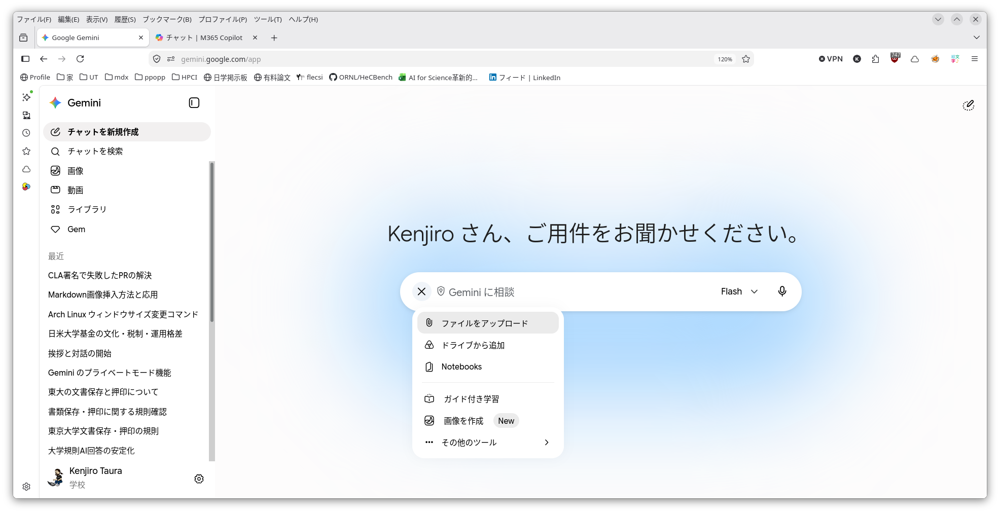
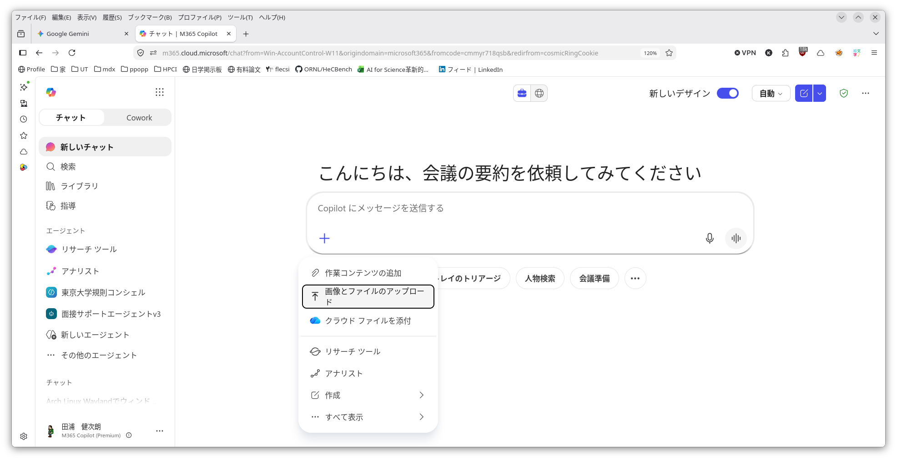
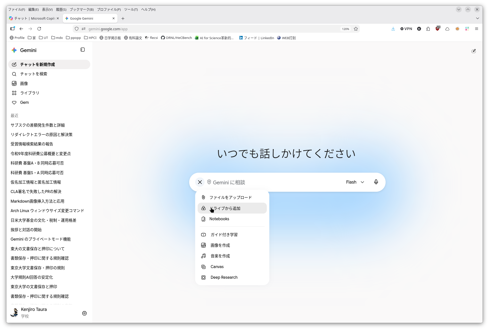
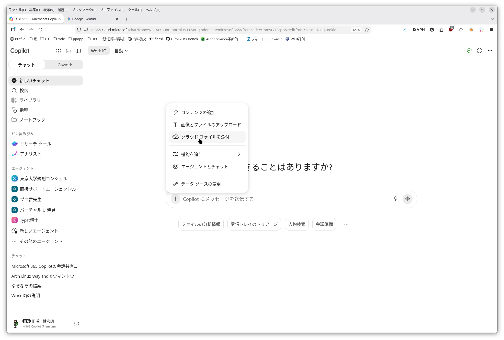

## 資料を読み込ませる

- ファイルやWebページなどの資料を読み込ませることができます
- ファイルには機密情報が含まれることがあります。入力してよい情報かどうかは [情報セキュリティと情報漏洩リスク](../../security/) を確認してください。

### ファイル

- Google Gemini
	- 会話を入力する箱の脇の `+`ボタン -> 「ファイルをアップロード」
- Microsoft Copilot
	- 会話を入力する箱の脇の `+`ボタン -> 「画像とファイルのアップロード」  
  
|                   |                                              |
|-------------------|----------------------------------------------|
| Googl Gemini      |       |
| Microsoft Copilot |  |

- その上で渡したファイルについて質問や指示ができます。

例:

- 長めの、非母語の文書を翻訳させる
	- 論文をアップロード
	- 「○○語（例えば日本語）にして」など
- 分厚い公募要領を読ませて内容を聞く
	- この[科研費公募要領](https://www.jsps.go.jp/file/storage/kaken_kiban_2026_g_4978/r9_7_kobo.pdf) をアップロード
	- 「基盤Sと基盤Aは同時に応募できますか？それはどこに書いてある？」など
- 分厚いマニュアルを読ませて手順を聞く
	- この[マニュアル](https://documentation.extremenetworks.com/CLI_X-Ref/1.0/CLI_X-Ref_Guide_1.0.pdf) をアップロード
	- 「どのポートが同一のVLANに割り当てられているか知るにはどうしたらいい？それはどこに書いてある？」など
- 不規則なデータ（PDFや神エクセル）からデータを抽出する
	- 10件分の概算要求書をExcelをアップロード
	- 「件名、要求額、...を抜き出して表形式でまとめて」など
  
### Google Drive や OneDrive 内のファイル

- Google Gemini であれば Google Drive, Microsoft Copilot であれば OneDrive 内のファイルを直接読ませることもできます
- やり方は普通のファイルのときとほとんど同じです

- Google Gemini
  - 会話を入力する箱の脇の `+`ボタン -> 「ドライブから追加」
- Microsoft Copilot  
  - 会話を入力する箱の脇の `+`ボタン -> 「クラウドファイルを添付」

|                   |                                              |
|-------------------|----------------------------------------------|
| Googl Gemini  |       |
| Microsoft Copilot |  |

### 公開ウェブページ

- そのページの URL (https://... のような文字列) を質問中に入れれば読んでくれます

例:

- 「個人情報保護法 https://laws.e-gov.go.jp/law/415AC0000000057/ で仮名加工情報、匿名加工情報とは何かと、その違いを教えて。それらが第何条に書いてあるかも教えて」
- 続けて、「例えば学生の氏名、学生証番号、科目、成績、を並べた生データがあったとして、どうすれば仮名加工情報、匿名加工情報になるでしょうか」

## 長い文書を読み込ませるときのコツ

- PDF形式は、しばしば正しく中身を読めていないと思うことがあります
- 多くの場合、原因は断定できませんが、多くのAIは、PDFの文字の部分だけを抽出して読もうとするからではないかと思われます
- それにより、ページレイアウトによっては（例えば2段組などの場合）、無意味なテキストが抽出される、図表が無視される、日本語文字列の抽出に失敗するなど、色々な要因が考えられます
- 同様の理由により、ページ（それが何ページ目に書いてあるか？逆に◯◯ページに何が書いてあるか）についても正しく答えられないことがしばしばあります
- 例によって、それでもわかったような顔（？）をして答えるので鵜呑みにしないように注意する必要があります
- そのような場合、**画像として読み込む** よう指示をするとうまく行くことがあります
- また、ページ数や、◯◯ページに何が書いてあるかなど、ページ境界を認識しているかを試す質問をするのもよいでしょう
- 例:
  - アップロード時に「このファイルを画像として読み込んで、内容を理解して下さい」と指示する
  - そのうえで「何ページありますか。30ページに何が書いてありますか？」などの質問をする
  - 良さそうだと思ったら本題の質問をする
  
## 結果をファイルで受け取る

- 出力をファイルの形で受け取ることも可能です。やり方は指示の中に一言加えるだけです。

例：

- 上記：不規則なデータ（PDFや神エクセル）からデータを抽出するの続き
	- 10件分の概算要求書をExcelをアップロード
	- 「件名、要求額、...を抜き出して表形式でまとめて」
	- **「結果を CSV ファイルにして」**

- 受け取った結果はそのまま使うのではなく、内容に誤りがないか自分で確認してから使うことが大切です（[責任あるAI利用](../responsible-use/)）。

## 次

- [AIとの会話を共有する](../share-conversations/)
