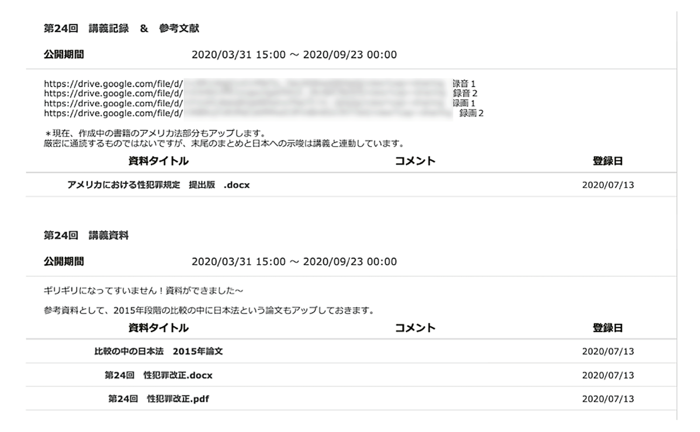

## 授業の基本情報

授業名　　:　刑法第２部 
開講部局　:　法学部 
対象　　　:　学部生 
学生数　　:　約 300 名 
形態　　　:　全てリアルタイム、その録画をオンデマンドで共有 
利用したツール　:

- ITC-LMS: 授業の情報共有、資料・授業の録画配信に利用
- Zoom: Web 会議システム。リアルタイムのオンライン授業に利用。

## 教員の基本情報

<!---->

樋口 亮介 先生 
法学政治学研究科 
教授 

## 学生のコメント: この授業が良かった理由

**学生 A のコメント**  
投票ではなく、チャットに答えを書き込むように、教授が質問を投げかけて、そのチャットで答えてくれた学生のミュートを外して、さらに質問をするなど、双方向的な授業だった。

**学生 B のコメント**  
ライブ授業でしたが、講義形式をベースにしつつ、音声による簡単な学生とのやりとり（一方的に指名することはなく、挙手した学生を指名）、zoom のアンケート機能を使った学生とのやりとり（授業内容に関することもあれば、理解度のチェック、試験の形態についての希望調査なども）、演習、こまめな休憩（毎回２回）など細やかな気配りをしてくださり、なにかと疲れがちな今学期でしたが、特に集中して受講できました。また、毎回ライブ授業の録画はすぐにアップロードされたので、体調や他の授業の課題などの都合に合わせて使い分けて受講していました。

## 授業をオンライン化するにあたって心がけたこと・工夫したところ

### 友人間で授業の見せ合いや情報共有を行った

10 年ほど前から SNS を通じて研究仲間の友人と交流しているのですが、今回オンライン授業を始めるにあたり、その友人たちとの情報共有がとても役に立ちました。SNS で公開している授業方法が気になった友人に個別にアポを取り、授業を見学させてもらうこともしばしばでした。オンラインでなら北海道から沖縄までどこの大学の授業も気軽に覗きに行けますからね。東大ではオンライン授業というのは史上初の試みでしたが、私大では以前から取り入れられているところも多いんです。やはりそのような大学の教員には経験知があるので、とても参考になりました。

### 詳細な講義資料を用意し公開した

講義資料として、個別に独自で作成した資料も用いましたが、中心的には以前から使っていたものを用いました。全ての内容が網羅されるように設計・開発されたもので、行番号を付けて説明場所が明確になるようにされています。毎年改善されており、今年も適宜手を加えました。そういった意味では、オンライン授業のための工夫というのは、これまでの授業の工夫の延長と言えると思います。

### 教科書がなくても分かりやすいよう一般の方向けの講演調で行った

4 月中は、教材を買えていない学生も一定数いたため、一般の方向けの講演調で説明しました。ゆっくり、知識がないことを前提に話すというものです。

また、詳細な講義資料を用意して、ノートを取る量が最小限になるようにしました。

### 学生の反応が見えにくいため、チャットや投票機能でカバーした

法学部の授業は大教室での大人数講義が多いため、元々学生の反応が分かりづらいものではありました。しかし、それでも学生の顔くらいは見えます。オンライン授業では顔さえ見えないので、学生の反応を把握するのには苦労しました。

通常のレクチャー形式の講義では、チャットで随時質問を受け付け、それに対する返答の際にマイクをオンにして発言してもらいました。名前を出して発言することを躊躇する学生も多いようなので、無作為に指名して発言を求めることはしませんでした。従来の大教室での講義では、授業中に学生から質問が出ることはなかったので、オンライン授業では休憩時間を中心に質問数は大きく増えました。

投票機能も適宜使用しました。刑法という授業の性質上、答えのない問題に対する学生の価値判断を問うために用いました。

### ブレイクアウトセッションを用いたディスカッションを取り入れた

4 月には、児童虐待や親同士の子どもの奪い合いなどの事案をテーマとして、ブレイクアウトセッションを用い、ありうる刑事立法を 7〜10 人の少人数で検討してもらいました。学生にとって、ある程度馴染みのあるテーマであり、固有の意見を持ちやすいだろうと思ったことが動機の一つです。学生の立法案を発表してもらって講義でコメントを付け、オンラインで議論もしました。

ブレイクアウトセッションの機能自体は以前から知っていましたが、実際にそれを用いて少人数でのグループ討論を導入しようと思ったのは、一橋大学で教鞭を取っている友人が実施していたためです。

5 月以降は通常のレクチャー形式に戻しました。学生にリラックスして授業を受けてもらうためという意図もありましたが、教えるべき内容が多かったことも理由です。扱う内容としても、横領、背任、性犯罪など、学生にとって馴染みがなかったり気が進まなかったりして議論しづらい内容でした。授業形式を参加型にするかレクチャー型にするかは、扱う素材とのバランスも考慮すべきだと思っています。

その後、セメスター末に再度グループ討論を取り入れましたが、その際には 4 月ほどの盛り上がりは見られなかったので、学生の疲労との兼ね合いも考える必要があると感じました。

### 授業を見られなかった学生のために録画を共有した

学生のオンライン授業を受講するネットワーク環境はあまり良くないことも多く、ただでさえオンライン化により課題等が増え負担が掛かっている中で、学生の負担を軽減するせめてもの策として、授業を録画した動画を Google Drive にアップロードし、ITC-LMS を使って共有しました。

授業は 2〜3 部に分けて小休憩を挟んでいたので、Zoom のレコーディングをその都度停止して、動画を 2〜3 部に分けていました。そうすることで、何かトラブルがあっても被害を最小限にできるためです。

ITC-LMS。事前に独自作成した資料を公開し、授業後に録画を公開しました

## 苦労したところ

### 板書の内容を全てデータ化した

オンライン化にあたり、講義計画を全面的に見直し、また、普段は手書きの板書を全てデータに置き換える作業をしました。尋常ではなく疲弊しました。

### 学生の反応が見えない

学生の反応が見えない中での大講義はかなりのストレスでした。チャットでの反応確認は行いましたが、限られた学生しか反応しないことをどう見るかは難しい気もしました。

## 今後のオンライン授業に向けて

冬学期には、オンデマンド講義を行ってから、Zoom を用いてリアルタイムでディスカッションを行うという形式での授業を実施予定です。

オンデマンド講義は、通信の不安定による影響を受けにくいなどトラブルに強いですし、一方的講義ならそれでいいのではないかと思っています。しかし、自分自身や学生のモチベーションを考えると、学生とのコミュニケーションがある方が望ましいため、両者を組み合わせるつもりです。

## 参考情報

### 本授業の概要

刑法各論について包括的な知識を培う。

### 授業内容

- 生命・身体の保護
- 人身の自由・名誉・業務の保護
- 財産犯
- 文書偽造・放火・風俗犯
- 公務員犯罪

### 具体的な授業 1 回分の流れと方法

**グループ討論実施時**

| 時間| 説明|
| 40〜50 分| 7〜10 人で討論|
| 5 分| 議論の結論の提出と休憩|
| 50〜60 分| 立法案をもとにオンラインで議論|

**グループ討論非実施時**

5 分間の質問・休憩時間を挟みながら 2〜3 部に分けてレクチャーを行いました。

## 評価方法

成績は、2 時間のオンライン試験一本で評価しました。内容は授業内容について自由に論じるというものにしました。

試験方法は、法学部が決めた方式に則りました。事前に UTAS に公開された解答用紙を印刷しておき、試験時間になったら Zoom に入って問題閲覧のためのパスワードを伝達、解答用紙は撮影して顔写真と共にアップロードするという形式で、資料の参照は認めるが他人との相談は認めない方針としました。
