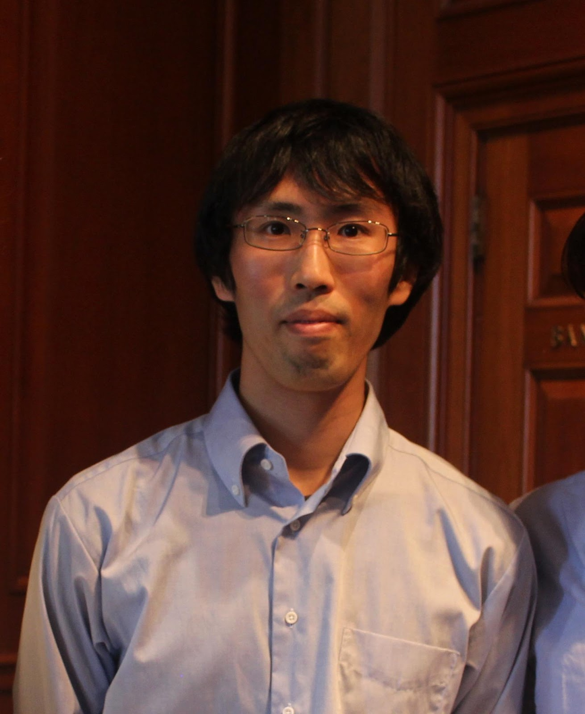

このグッドプラクティスは，2020年度<a href="/events/luncheon/2020-11-18/">オンライン授業情報交換会「第20回 学生の声を活かした授業設計の工夫」</a>にて，入江先生にご登壇いただき，内容をご紹介いただきました．学内限定でランチョンの映像を公開しておりますので，ぜひご活用ください．

## 授業の基本情報

授業名　　:　数理統計 I（S1）、II（S2） 
開講部局　:　経済学部 
対象　　　:　学部生 
学生数　　:　数理統計 I 　約 200 名、数理統計 II 　約 150 名 
形態　　　:　全てリアルタイム
利用したツール　:

- ITC-LMS: 授業情報共有のために利用。
- Zoom: Web 会議システム。リアルタイムでの授業を行うために利用。
- Office OneNote: デジタルノートソフト。板書代わりに利用。

## 教員の基本情報

入江 薫 先生 
経済学研究科 
講師 

## 学生のコメント: この授業が良かった理由

**学生 A のコメント**  
タブレットで板書していて飽きなかった。また、授業のスピードがちょうどよかった。

**学生 B のコメント**  
しっかりとオンライン講義を受けている学生の大変さに寄り添った課題設定などを行ってくださったから。 他の授業にはなかなか見られない姿勢であった。

**学生 C のコメント**  
ライブ授業で、質問等もわかりやすく、板書に合わせてノートなどを取るスタイルが学習効果として高いと感じた。また、録画も配信されており、写し間違いの確認や復習などに活用できる点が良かった。

## 授業をオンライン化するにあたって心がけたこと

実は、特に何かを心がけたということはないんです。こちらとしてもオンライン授業という形態は初めてでしたので、通常の授業をいかにオンライン化するか、と考えて授業を作っていった感じです。

そもそも私は本授業を担当するのが初めてでしたので、授業資料を一から作りました。他に担当していた授業ではスライドを利用することもありましたが、本授業内容は純粋な数学であるため、リアルタイムで板書して配信することは譲れないと考え、事前に準備した授業ノートを手書きで板書して配信する形態を採用しました。

板書を配信するにあたり、他の先生に、一番望ましいのは Overhead のカメラで手元を映す方法だと伺いました。というのも、手元を映す方式であれば、数式を指で差すことができるからです。しかし、全国的なオンライン化の時勢の中で、春休みの時点でカメラが品薄になってしまっていたんです。入荷がいつになるか分からないいうことで、泣く泣く Microsoft OneNote を使用することにしました。

## 工夫したところ

### Surface の OneNote を用いて板書を実現した

音声を配信するのに用いていたノート PC とは別に、Microsoft Surface を用いて専用のタッチペン（別売）で板書しました。２端末で Zoom に入室し、ノート PC をホスト、Surface を共同ホストに設定して、画面共有機能を使って配信する形式です。OneNote を使うのはこれが初めてでしたが、すぐにある程度使いこなすことができました。手書きとは感覚が異なるので、多少の慣れが必要だったくらいです。特定部分を指示するために指差しができないのは不便でしたが、マーカー機能で代用しました。

<iframe style="position:absolute;top:0;left:0;width:100%;height:100%;" src="https://www.youtube.com/embed/wOnLs_zwJho" title="2020年度Sセメスター グッドプラクティスの共有｜入江薫先生　数理統計I・II｜Microsoft SurfaceのOneNoteを用いた数式の板書｜utelecon" frameborder="0" allow="accelerometer; autoplay; clipboard-write; encrypted-media; gyroscope; picture-in-picture; web-share" allowfullscreen></iframe>

公開された授業の録画。色を使い分かりやすい板書がなされています

ところで、こちらとしても初めてのオンライン授業ということで、学生にもチャット等を用いての授業運営に対するアドバイスを積極的に求めていたのですが、この板書の方式は、学生のアドバイスによって授業が改善されたものの好例です。

というのも、当初、板書は端末を横向きにして板書を行っていたんです。そうすると学生の画面いっぱいに板書が表示され、見やすいのではないかという配慮によるものでした。しかし、画面を横向きに使用すると一度に表示できる量が少なくなり、スクロールが早くなるため、縦向きに使ってはどうかという提案を頂きました。そうすると文字が小さくなって読みにくくなると思いきや、学生は Zoom の画面上部から自分で画面を拡大し調節することができるんです。そういうわけで学生の提案を採用し、板書は縦向きに行うことにしました。

授業で実施したアンケート（後述）によれば、スライド方式の授業を望む学生も一定数はいましたが、少数でした。

### 期末試験に加え、演習問題を課題として課した

例年の本授業では、期末試験一発で成績評価を行っていました。今年度は試験が行えない可能性があるということで、セメスターの初め頃の段階で、成績評価に利用できる課題を設定するようにと事務の方からアドバイスがありました。それを受けて、今年はレポート 40％、期末試験 60％の配分で評価を行うことにしました。

レポートは、毎週指定する演習問題 2 ～ 3 問から 1 問を選んで回答するというものでした。問題数としては、1 タームの合計で 7 問ということになります。テキストデータの他に、手書きやタブレットで書いたものの画像データでの提出も認め、ITC-LMS にアップロードする形態を取りました。

### 独自のアンケートで学生の意見を把握した

もともと学部が実施している授業運営に関するアンケートはあったのですが、結果の共有がスムーズでなかったり、自分が知りたい項目が含まれていなかったりしたので、S1 タームに Google Forms を用いて独自のアンケートを実施しました。回答者は履修者 200 名のうち 70 名ほどでしたので、多少の偏りはあるかもしれませんが、それでも大変参考になりました。このアンケート結果を生かして S2 タームの授業運営を行いました。

各トピックの難易度の体感を問う質問では、学生が難しいと感じている部分が把握できたので、S2 タームの初めに丁寧に復習して解説しました。

また、授業は数学的な内容であるため、13 回を通して単調な授業を行うのは学生側にとっても苦痛だろうと思い、自分の研究内容について授業内で 60 分程度話す回を S1 タームから設けていました。需要がなければ廃止しようと思い学生の評価を問うたところ、好評だったため、S2 タームにも取り入れました。

講義に関する質問については、授業中のチャットの他、メールを用いて質問することも許可していましたが、アンケートにより、質問が TA に行かず教員に集まってしまいがちだったという問題点が明らかになりました。学生には TA のことももっと活用するようにとお伝えしました。

アンケートには自由記述欄を設けていたのですが、授業形態について、板書の形式がありがたいというコメントが非常に多くありました。数学的な内容であるため、スライドでの説明だけだと理解しづらく、辛いのだそうです。これを受け、S2 タームも板書中心で続けていこうと決めました。

アンケート結果

### 授業の録画配信を行った

授業を録画した動画は Google Drive にアップロードし、ITC-LMS で共有しました。1 週間など短い単位での公開期間は設定せず、セメスター末までの公開としました。

録画を公開したことで、リアルタイムで授業に出席する学生は減るかと思ったのですが、アンケートによるとほとんどの人がリアルタイムで出席していました。授業動画については、半分の人は復習用に活用し、もう半分の人は全く見ていなかったということです。あくまで授業を補完する役割だったようです。

## 苦労したところ

### オンラインでの期末試験実施は難しかった

期末試験では、他人との相談は禁止したものの、オンライン試験である都合上、資料の持ち込みを許可せざるを得ませんでした。持ち込み不可の場合は簡単な問題を出題することができますが、今回はそれができないため、問い作りには苦労しました。簡単な問題は出せないからといって、ひねりすぎると難しくなりすぎます。

結局、授業内で扱った演習問題をやっていれば解けるレベルを目指しました。先述の通りこの授業を担当するのは今年が初めてだったため、前任の先生に適宜アドバイスを受けつつ、前年度の試験も参考にして問題を作成しました。S1 タームの試験を例にとると、全部で大問が 7 問、最初の 2〜3 問は易しめ、6、7 問目はチャレンジングな問題としました。

試験方法としては、ビデオ OFF の状態で Zoom に接続してもらって説明を行い、ITC-LMS で問題を公開、100 分間の試験後に答案提出の時間を少々取って提出してもらいました。手書きやタブレットで書いたものの画像データでの提出も認め、ITC-LMS にアップロードする形態をとりました。アップロードできない場合はすぐにチャットで伝えてもらい、提出期間に猶予を与えることとしました。

学生の結果を見てみると、ケアレスミスの多さが目立つように感じました。自粛期間は図書館などが開いておらず、一人暮らしの学生などは特に学習環境やテストを受ける環境が悪くなっていたのではないかと思います。それがケアレスミスの原因の一つであると考えています。ケアレスミスにより実力が正確に測りきれなかったことは教員側の反省点でもあり、配布した問題に 3〜4 時間、もしくは 1 日ほど与えて回答してもらう形式でも良かったのではないかと思っています。

また、対面の試験であれば不受験者の見分けが簡単に付きますが、オンラインの試験ではその判断が難しくなってしまっています。学生本人は提出したつもりでも ITC-LMS 上では未受験となってしまっていた事案があり、提出画面のスクリーンショットを撮っておいてもらうことが必要だと感じました。

## 今後のオンライン授業に向けて

### 数理統計を担当する場合

数理統計の授業を再び担当するなら、基本的に同じ形式をとるつもりです。

### 学生のアドバイスを進んで採用すべき

オンライン授業に関する教員側の経験値は自分の担当分の数コマのみですが、学生は多くの授業をオンラインで受講しており、教員より慣れているはずです。教員は、豊富な経験知を持っている学生に積極的に授業運営に関する意見を聞くのが良いのではないかと思います。

### 大人数講義ではオンライン授業を敢えて取り入れることも有用

オンライン授業ならではの良さもあると考えています。経済学部に進学する 2 年生向けに駒場で開かれている「統計」の授業は、履修者が 400 名ほどいる大人数講義で、例年は大教室で開講されているため、オンラインになってむしろ板書が見やすくなった、授業が聞きやすくなったという肯定的な意見が見られました。対面講義が全面的に再開してからもオンライン授業を適宜取り入れることで学習効率が上がると考えられ、そのハイブリッド方法に関しては検討が必要です。

## 参考情報

### 本授業の概要（シラバスより）

数理統計学の基本的な事項について講義する。具体的には、確率論、分布論、極限定理、標本分布、推定論、検定論。専門科目 1「統計 I, II」で省略された数理的な内容（再生性、中心極限定理の証明、標本分布の導出など）もカバーする。これらの内容は「計量経済学」を含む経済学部専門科目および大学院科目を学ぶ上で重要な基礎知識となる。

### 授業内容

※例として、数理統計 ⅠⅠ（S2）のものを紹介します。

- 正規母集団の標本平均・分散に関する定理（証明）、t 分布、マルコフの不等式
- 確率収束の定義、マルコフの不等式、チェビシェフの不等式、大数の（弱）法則、概収束の定義、大数の（強）法則、分布収束の定義、中心極限定理
- 中心極限定理の証明、収束に関する諸結果、デルタ法とその証明、最大値・最小値の分布と密度
- （復習：中心極限定理とデルタ法）、最大値・最小値の同時分布、順序統計量 X(k)の分布、尤度関数と十分統計量、母集団分布が正規分布・ポアソン分布の例
- （復習：十分統計量）、点推定の考え方、最尤法、尤度方程式、最尤法の不変性、母集団が一様分布の例：尤度方程式が使えない例、モーメント法、ガンマ分布の形状パラメータの推定
- ベイズ法（事前分布と事後分布、ベイズ推定量、正規分布の平均の推定、無情報事前分布、ハイパーパラメータ）、推定量の評価（不偏性、MSE、一致性）
- スコア関数と Fisher 情報量および性質、CR 不等式
- CR 下限の例：正規母集団の平均の推定、最尤推定量の一致性の証明（途中まで）
- 最尤推定量の一致性の証明（使用した補題の証明）、漸近正規性の証明（概要のみ）
- 仮説検定に関する用語の整理、二標本問題における平均の差の検定
- 二標本問題における分散の比の検定、尤度比検定統計量の定義と解説
- 尤度比検定統計量の漸近的な帰無分布、尤度比検定の例題、Score/Wald 検定の例
- Wald 検定、Score 検定
- （試験範囲外）ベイズ統計学による検定・モデル確率

### 具体的な授業 1 回分の流れと方法

| 時間| 内容|
|:---|:---|
| 2 ～ 3 分| 授業に関する連絡（試験に関する 最新情報の伝達）|
| 55 分| 講義 + 適宜質問対応|
| 5 分| 質疑応答|
| 40 分| 講義|

### 評価方法

例年は期末試験のみで成績を評価していましたが、前述の通り、今年はレポート 40％、期末試験 60％の配分で評価を行いました。

レポートは、毎週指定する演習問題 2 ～ 3 問から 1 問を選んで回答するというもので、1 タームの合計で 7 問を出題しました。

期末試験にはその類題を出題し、ITC-LMS を用いて 100 分 7 問の形式で行いました。
