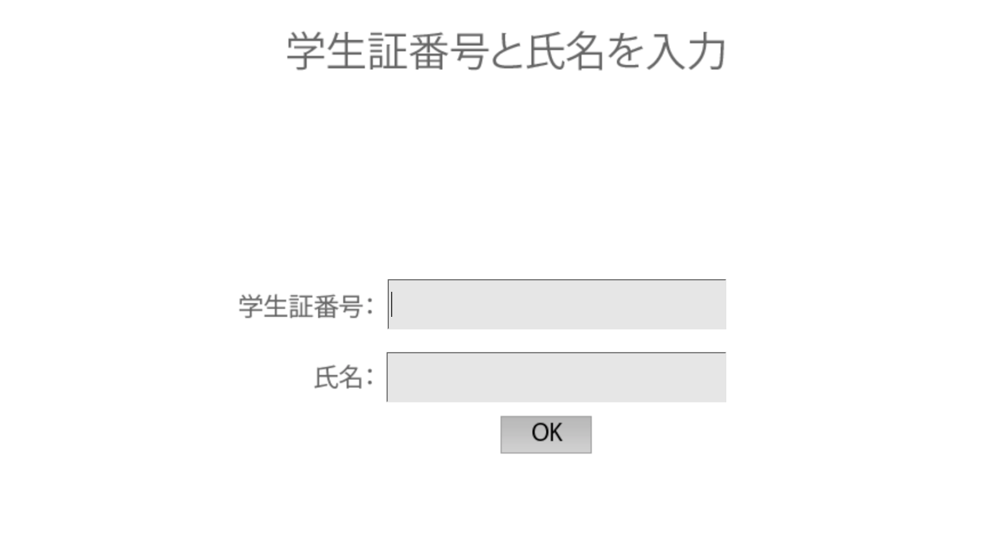

このグッドプラクティスは，2020年度<a href="/events/luncheon/2021-02-03/">オンライン授業情報交換会「第29回 実習形式の授業のオンライン化の工夫」</a>にて，河野先生にご登壇いただき，内容をご紹介いただきました．学内限定でランチョンの映像を公開しておりますので，ぜひご活用ください．

## 授業の基本情報

授業名　　:　薬学実習 IV（生体物質取扱いの基礎実験） 
開講部局　:　薬学部 
対象　　　:　学部生 
学生数　　:　約 80 人 
形態　　　:　リアルタイム 
利用したツール　:

- ITC-LMS: 学習管理システム（教材の配布、講義の URL 共有、課題の提出のために利用）
- Zoom: オンライン会議システム（リアルタイム授業）
- Adobe Captivate: e ラーニングのための教材作成ソフト（オンライン教材作成のために使用）
- iMovie: 動画編集ソフト（実験動画の編集のために使用）

## 教員の基本情報

河野 望 先生 
薬学系研究科 
准教授

## 学生のコメント: この授業が良かった理由

**学生 A のコメント**  
教材がしっかりオンライン専用に作られてて感動した。唯一オンラインだからこそ理解度が上がったと思えた。

**学生 B のコメント**  
オンラインならではのオンライン教材（URL へアクセス → スタート画面から進む → 実験の説明を聞く → 進む → 質問に答える → 進む → 実験の説明をきく →…）を使用していて面白かった。自分のペースで進められ、無駄が少ないところが良かった。内容がよく理解できた。まさにオンラインに対応できた授業といった印象だった。

## 授業をオンライン化するにあたって心がけたこと

実験のエッセンスをオンラインの中でも、できる限り体験してもらえるようにするということを一番意識していました。「オンラインで実習をやるのは流石に難しいのでは」という声もありましたが、学生に「オンラインだったからあまりいい実習ができなかった」というイメージを持って欲しくないという思いがあって頑張ることができました。

## 工夫したところ

### zoom のブレークアウトを使って質問しやすい環境を作った

授業開始時に zoom のブレークアウトルーム機能を用いて、学生 10 人と TA2 人からなる部屋を複数個作成しました。そこで学生はオンライン教材（後述）を各自で進めるのですが、プライベートチャットを使えるようにしたことで、学生から TA への質問が活発になりました。  
薬学部では各研究室の実習の運営方法を随時共有しています。ブレークアウトルームへの振り分けの手法に関しては、私達より先に実習をおこなった研究室のノウハウが大変役に立ちました。

### 独自の e ラーニング教材を 0 から作った

実験の要素を学習できるような授業にするため、オンライン教材の作成に力を入れました。

具体的な構造は、次のようになっています。

**1. 当日に学生に伝えるパスワードを入力する画面**

**2. 学生証番号と氏名を入力する画面**

この画面で入力した情報が、全ての実習を終えた時に表示される画面

に表示されるようにし、この画面を受講完了の証明書として ITC-LMS に提出してもらうことで、学生が教材を終了したことを確実に確認できるようにしました。

**3. 本日の内容**

**4. 実験の様子を撮影した動画**

研究室の院生に実験をしてもらい、その様子を撮影＆編集したものを見られるようにしました。実験の操作を理解してもらいたいという思いから導入しました。

**5. 実験に関するクイズ**

学生が能動的に学習できるように、実験内容に関するクイズに答えてもらいました。具体的には、実験の手順を並び替える問題や実験の原理を問うような問題、出てきたデータから計算をする問題などを作成しました。

**6. 終了画面**

対面授業では 5~6 人のグループになって学生が実際に実験を行うのですが、分業体制になってしまい、実験全体を理解している学生が少なくなるという問題点がありました。しかし、今回のオンライン教材では 1 人で一通りの流れを学ぶことができ学習効果が高かったのではないかと思います。学生からもポジティブなコメントが多かったです。

上記のオンライン教材は Adobe Captivate という e ラーニングのための Adobe ソフトを使用して作成しました。最初の 30 日間は無料で使うことができ、その後は月額 4000 円程度で使用することができました。少しプログラミングの知識があった方が使いやすいですが、基本的には前提知識は必要とされない使いやすいソフトだったと思います。難点は日本語が打ち込めないところですが、コピーアンドペーストはできるのでそれを使って対応していました。また、教材内に入れ込んだ実験動画は iMovie を使って編集しました。動画が重くならないように、最後に解像度を下げるアレンジをしました。（960×540 の解像度）

オンライン教材を置いておくサーバーは、アクセスの分散を目的に、研究室のサーバーと情報基盤センターのサーバー（[https://lecture.ecc.u-tokyo.ac.jp/](https://lecture.ecc.u-tokyo.ac.jp/)）の 2 つを用意しました。

### 実習終わりの研究室紹介にブレークアウトルーム機能を活用した

zoom のブレークアウトルームの機能を使用し、実験室のツアーをする部屋と研究室紹介のプレゼンテーションが行われている部屋とその他の雑談をする部屋を作りました。そして、学生に共同ホスト権限を付与することによって学生が自由に部屋を行き来することができるような仕組みを作りました。学生からは「研究室のことがよくわかりました」といったポジティブな反応を多く得ることができました。

## 苦労したところ

### e ラーニング教材を知識 0 から作った

どのソフトを使って教材を作成するかを決めたり、実際に教材を作ったりするのにかなりの時間がかかりました。Adobe Captivate 以外のソフトも使ってみたのですが、使用感的に一番良いかなということでこれを選びました。Adobe Captivate に慣れて使いこなせるようになって、教材の仕様を決めるまでが大変でした。1 日目の教材を作るのには 1 週間程度かかりました。ただ一度教材のテンプレートができてしまうと意外と楽で、2 日目・3 日目の教材を作るのは 2, 3 日で完了しました。

### 成功するまで実験を行いその様子を撮影した

実験動画の撮影は大学院生に任せていたのですが、実験を成功させねばならず苦労したようです。普段は人に見せるということを意識せずに実験をしているということもあり、成功するまでに何度か撮り直さなければならなかった実験もあったようです（笑）

## 今後のオンライン授業に向けて

今回の形式は概ねよかったのではないかと思っています。ただ、実験動画にさらに詳しい解説を盛り込んだり、完全個別作業ではなくグループワーク等を盛り込んだ構成にしたりという改善点も出てきているので、それを導入するコストについて検討しながら、より良い授業が実現できればいいかなと思っています。

## 参考情報

### 本授業の概要（シラバスより）

（１）生体物質取扱いの基礎実験 
酵素学実験、脂質化学実験 
（２）生理化学実験 
代謝生理学実験、アイソトープ実験 
（３）微生物実験 
微生物基礎実験、抗生物質、遺伝子操作の基礎実験 
（４）分子生物学実験 
分子生物学実験、細胞を用いた細胞生物学実験、組織標本を用いた免疫組織学実験 
（５）遺伝学実験 
個体表現型観察実験、変異体同定実験

これらの実験から、生物をミクロなレベルで理解するために、細胞の機能や生命活動を支える分子の役割についての基本的知識を修得し、併せてそれらの生体分子を取り扱うための基本的技能と態度を身につける。
（このうち、河野先生は（１）生体物質取扱いの基礎実験を担当されていました。）

### 授業内容

この授業は各研究室がオムニバス形式で 1 セクションずつ授業を担当するという形をとっており、私は第 5 部の【生体物質取扱いの基礎実験】を担当しました。第 5 部は計 3 日間に渡る授業で、最初の 2 日間で 4 つの実験について扱い、最終日は最新の研究手法を学ぶ新しい内容に取り組みました。

| | 説明|
|:---|:---|
| 第 1 部| 【微生物実験】 消毒薬の適正使用・滅菌法・無菌操作の修得、大腸菌及び黄色ブドウ球菌の分離培養、グラム染色・その他の試験法による細菌の同定、プラスミドによる細菌の形質転換、ファージの増殖、DNA の制限酵素処理産物ゲル電気泳動による分析。|
| 第 2 部| 【生理化学実験】 細胞外シグナルに対する細胞応答を測定し定量的に解析する。また、放射性同位体を用いる実験系として、ホルモンによる細胞内情報物質（環状 AMP） の生成をラジオイムノアッセイにより測定する。さらに、シグナル伝達系に影響を与える細菌毒素の作用機序について考察を加える。|
| 第 3 部| 【遺伝学実験】 ショウジョウバエ野生型系統および変異体系統を用いて、遺伝学的モデル生物の取り扱い方法の理解、組織観察・遺伝子発現分析による個体表現型観察、および変異体の同定を通じて一連の遺伝学的手法を習得する。|
| 第 4 部| 【分子生物学実験】 哺乳類（マウス）培養細胞を用い、増殖因子による細胞の応答を生化学・細胞生物学的に検出する。また、組織標本を用い、免疫組織学的な実験を通して脳の発生を理解する。|
| 第 5 部| 【生体物質取扱いの基礎実験】 脂質、タンパク質など、生体物質取扱いの基礎の習得、生体膜の理解、および生体膜から生じる脂質メディエーターの機能解析。|

### 具体的な授業の流れと方法

| 時間| カテゴリ| 説明|
|:---|:---|
| 1 分| はじめ| 学生と TA をブレイクアウトルームに振り分ける|
| 1 時間〜2 時間| 作業| 学生が各自でオンライン教材を進める|
|| 終わり| 終わった人から修了証を ITC-LMS に提出して解散|
