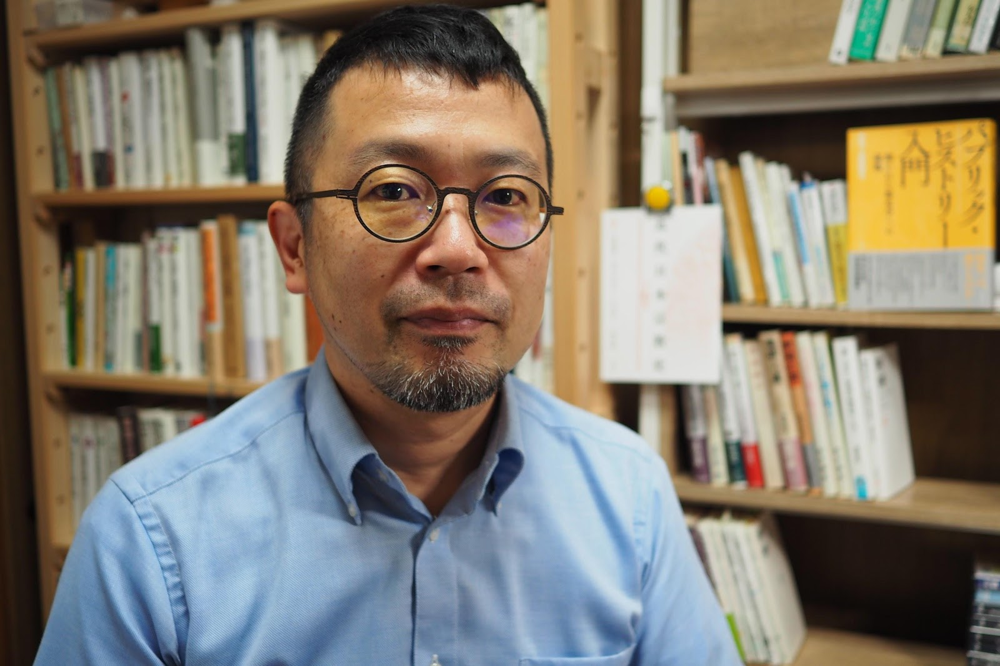
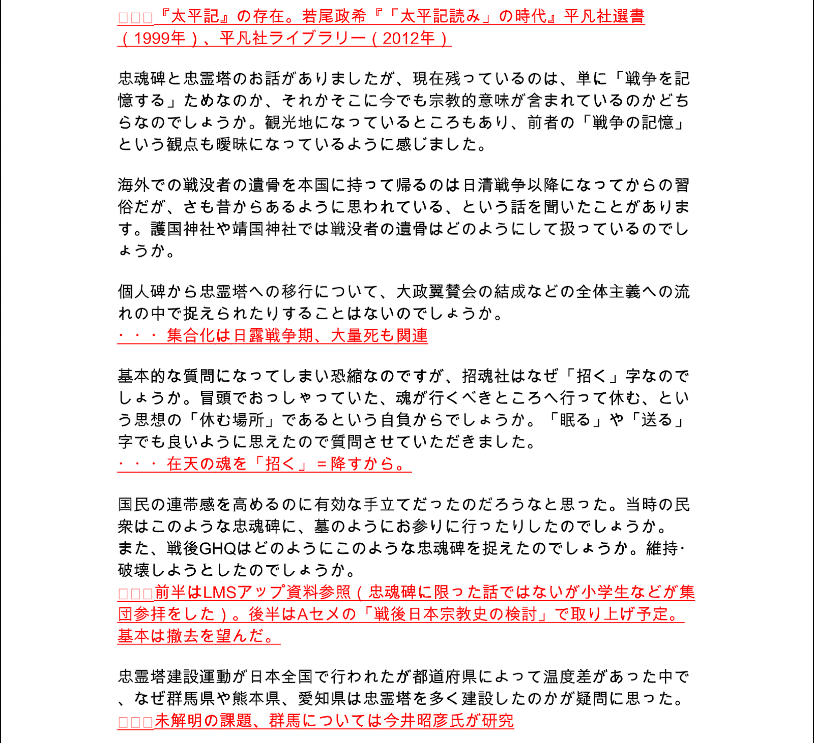

このグッドプラクティスは，2020年度<a href="/events/luncheon/2021-01-20/">オンライン授業情報交換会「第27回 オンデマンド教材の制作の取り組み」</a>にて，西村先生にご登壇いただき，内容をご紹介いただきました．学内限定でランチョンの映像を公開しておりますので，ぜひご活用ください．

## 授業の基本情報

授業名　　:　宗教学概論 II  
開講部局　:　文学部  
対象　　　:　学部生（文学部生、法学部生、工学部生）  
学生数　　:　約 70 名  
形態　　　:　リアルタイムとオンデマンドの組み合わせ  
利用したツール　:

- ITC-LMS：東京大学情報基盤センター学習管理システム（YouTube リンク、PowerPoint スライドリンク、スライド PDF の共有）
- Zoom：オンライン会議システム（リアルタイム授業）
- PowerPoint：プレゼンテーションソフトウェア（mp4 に変換。オンデマンド授業のスライドショー）
- YouTube：動画共有サイト（リンクを知っている人のみ見られる動画の限定公開）

## 教員の基本情報

西村 明 先生 
人文社会系研究科 
准教授 

## 学生のコメント: この授業が良かった理由

**学生 A のコメント**  
YouTube に授業の動画をアップロードしてくださったため、自分が受けたい時に受講でき、また速度変更、自動生成字幕等を利用することでレジュメにメモを取りやすかった。また出席代わりの授業後のアンケートに質問を書いておけば、かなり丁寧な回答を lms に載せてくださった。今まで受けたどの授業よりも充実していたと感じる。

**学生 B のコメント**  
前半にリアクションペーパーへの回答、後半は事前録画した講義を受講できた。リアクションペーパーを書くと講師が答えてくれる。録画授業は YouTube での公開なので接続の不安がなく、受講の時間も選べる。資料も ITC-LMS で上げられており、毎回削除されるわけではなくずっと上げられたままであるため復習もしやすく大変良かった。

## 授業をオンライン化するにあたって心がけたこと

### 教員と学生の負担をできる限り軽減した

教員と学生の負担をできる限り軽減することを心がけました。

以前からオンラインでの授業には慣れていました。鹿児島大学に所属していた時に、「奄美サテライト教室」の一環として、大学院の科目等履修生を受け入れて、オンラインで演習を行っていました（主に大学独自のツールと Skype で実施していました）。また、今年の 2 月にデュポール大学での宮本ゆき先生の授業に、ゲストスピーカーとして Zoom で参加した経験もありました。

一方、途中で映像が途切れてしまう、学生の反応が分からない、学生の声が聞き取りづらいといった、オンラインのデメリットも感じていました。そのため、授業を準備する段階で、従来の教室での授業をそのままオンラインで行うことに不安を覚えていました。また、私自身、緊急事態宣言以降オンラインでの会議が増え、疲れを感じていました。演習ならば、学生が発言してストレスを発散する機会もありますが、概論のような講義形式の授業では、学生は教員の話を聞き続けることになるので、より大きな負担を感じるだろうと思いました。

学生の通信環境等の問題や、データ量の負担についても考慮した結果、リアルタイム授業とオンデマンド授業を組み合わせた形式を採用することに決めました。

### 授業にライブの要素を残した

授業にライブの要素を残すことも心がけました。

冒頭の 30 分間はリアルタイム授業を実施しました。リアルタイム授業では、前回の授業後 ITC-LMS 上で送られてきた質問に回答しました。こうした質疑応答の時間は対面授業の時にも設けていました。また前回の復習や今回の授業への導入も行いました。

「宗教学概論 II」は近代日本の宗教史を扱っており、各回がつながりを持っています。そのため、「教員が教材を出しっぱなしにするだけの授業になっていないだろうか」「学生が授業をちゃんと聞いているのだろうか」という懸念がありました。オンデマンド授業だけだと、ITC-LMS 上でアンケートをとることはできても、学生の受講の有無を確認できません。リアルタイム授業を組み込み、オンタイムで授業に参加している学生の存在を把握したことで、授業を学生に提供できているという安心感が得られました。

## 工夫したところ

### データ量の小さいオンデマンド動画を事前に用意した

授業はリアルタイム 30 分（質疑応答・復習・導入）＋オンデマンド 75 分（授業動画の配信、前半・後半の 2 動画に分割）という形式で実施しました。
対面授業ではプリントを配布していましたが、オンデマンド配信では PowerPoint のスライドに音声を付けて配布する方法をとりました（PowerPoint の「スライドショー」機能を使い、ビデオをオフ、マイク音声のみをオンにして録画）。この方式だと、動画をアップロードするよりはデータ量が小さくなります。ただし、PowerPoint を使えない学生のことを考慮して、スライドを動画に変換したものも配布しました。

動画教材を作り続けていくうちに、PowerPoint で資料を作るメリットも発見しました。最初の頃は文字を中心とした資料を作っていましたが、資料作りに慣れてきたところで、画像も入れた方が良いと思い、授業に関連した画像や YouTube の動画を取り入れるようになりました。対面授業でもスクリーン上に画像資料を出すことはありました。ですが、プリントを中心に進めていた対面授業の時よりも、全て PowerPoint で資料を作った今回の方が、私の話から関連資料に切り替わるときの流れがスムーズだったと思います。ただ YouTube の動画を資料に埋め込むと、データ量が多いため、うまく再生されないということがあったので、途中からは動画のリンクを紹介するようにしました。

オンデマンドの資料は学期末まで公開し、期末レポートを執筆するときに学生が復習できるようにしました。

オンデマンドの授業動画

### リアクションペーパーを用いて質疑応答をした

対面授業と同様、学生には授業の最後にリアクションペーパーを書いてもらいました。ITC-LMS の「アンケート」機能をリアクションペーパーとして使いました。「アンケート」機能は、エクセルで回答の一覧表を作ることができるので、学生からの質問をピックアップするときに便利でした。「宗教学概論 II」は水曜日の授業なので、提出期限は週末に設定して、週明けに学生からの質問に答えるための準備をしました。

リアクションペーパーを通して寄せられた質問は、毎週 30 ～ 40 個ほどありました。一覧表を見ながら、質問を 10 問程度ピックアップし、翌週のリアルタイム授業の中で回答しました。時間的な制約もあるので、学生にはあらかじめピックアップした質問にだけ答えると伝えておきました。
リアルタイム授業の目的の一つは、学生同士で質問内容の共有を行うことでした。ですので、学生にはピックアップした質問の内容を紹介するようにしました。具体的には、PDF ファイルに質問をまとめ、あらかじめ学生に配布しました。リアルタイム授業では、教員の手元にある Word ファイルを画面共有して解説しました。余力がある時は、資料に簡単な回答や参考文献も加えましたが、余力が無い時は授業中に、Word ファイルに直接解説を書き込み、口頭で解説をしました。画面共有を板書のように使いました。

授業が概論のため、学生からは教員の専門領域外の内容についての質問も寄せられました。ですが、守備範囲外の詳細な質問には答えられないので、CiNii や J-STAGE に PDF で参照可能な論文がある場合はそれらを紹介し、自分で調べてもらうように促しました。

リアルタイム授業で用意した質疑応答用資料

## 苦労したところ

### オンデマンドの動画作成に時間がかかった

オンデマンドの動画作成には労力を要しました。当初は PowerPoint の「スライドショー」機能の仕組みも理解できていませんでした。また、自分はパソコンに強い方ではないので、動画の作成にあたり、高校時代に放送部で映像編集を担当していた息子の助けを借りました。

授業の動画は、スライドショーを録音するという方法で作りました。あらかじめ録音した mp3 の音声ファイルをスライドに貼り付ける方法の方が編集自体はやりやすいだろうと思いましたが、そこまで手間をかける余力はありませんでした。

PowerPoint の機能を利用して録音すると、一枚のスライドの途中で録音をやり直すことはできません（スライド単位での録音のやり直しは可能）。そのため、途中で間違えてしまった場合、もう一度初めから録音し直すか、音声ファイルを抜き出して編集ソフトで修正しなければなりません。自分は音声を修正する際には、スライドごとに録音された音声を mp3 で書き出して、iMovie で編集し、再度スライドに貼り付けていたのですが、やはり手間がかかりましたね。内容を半分くらい話したところで、録音ができていないと気付いたこともありました。その時はショックでしたね。

録音をし直しても、音声ファイルを抜き出して編集しても、かかる時間自体はあまり変わらないと思います。ですが、もう一度同じ内容を話す方が、精神的な負担は大きいです。今回の作業を通じて、動画教材を作るときは、とりあえず最後まで一通り録音し、後から間違えた箇所を部分的に修正する方が楽なのではないかと思いました。

### 録音環境が自宅のリビングだった

リビングで録音をしていたので、環境音が入ってしまわないようにするのが大変でした。録音を開始するときには、家族にもあらかじめ知らせていました。家族みんなの協力と理解を得ながら作業を進めていましたね。

## 今後のオンライン授業に向けて

今回は急遽オンライン授業を実施することになったので、妥協してしまった部分もありました。

今後の課題の一つは、PowerPoint 資料のデザインです。毎回少し凝ったデザインにしていたのですが、学生の期末アンケ―ト、リアクションペーパーでは賛否両論でした。凝ったデザインの方が見やすいという意見と、データが重くなるという意見に分かれていました。改善の余地があると思っています。

また、教員の顔出しも今後の課題です。今回のオンライン授業は、音声と Word の画面共有だけで行い、教員の顔は出しませんでした。ですが、全ての学生が教員の顔を知っているわけではないので、教員の顔を見せずに、ずっと音声だけで授業をするのも困難だと感じました。今後のオンラインでのリアルタイム授業では、PowerPoint などの画面を共有しつつ、小窓で教員の顔を出したいと思っています。具体的には、手元の資料を写すための書画カメラも組み合わせられる OBS（Open Broadcaster Software）や、mmhmm といったソフトを使って、データ量が大きくなりすぎない範囲で顔の映像を入れることを検討しています。

## 参考情報

### 本授業の概要（シラバスより）

近年、近代の宗教史像の見直し作業が目覚ましい。この授業では、近代日本の宗教史を理解する上での基本的なトピックを概説的に紹介しながら、近年の研究動向を紹介する。受講者には、それを通して固定的で平板な「宗教」の捉え方から脱して、新たなアプローチ法を見出してほしい。

### 授業内容

- 説明
- ガイダンス　前史としての近世宗教史概要
- 明治政府の宗教
- 神々の再編成と神社神道
- 神々の再編成と教派神道
- 仏教の近代化
- キリスト教をめぐる動向
- 「淫祀邪教」と民間信仰
- 宗教の社会参加
- 戦争と諸宗教
- 靖国・護国神社、英霊・忠霊をめぐる動き
- 宗教団体法と宗教の戦時動員

### 具体的な授業 1 回分の流れと方法

**前半 30 分：リアルタイム授業**

前回の授業内容についての質問に答えました。

**後半 75 分：オンデマンドの講義**

オンデマンドの動画は前半と後半の二つに分けました。一つのファイルは 10 枚～ 15 枚のスライドで構成し、1 スライドにつき 4 ～ 5 分ほど話しました。オンデマンドの講義を三分割することも検討しましたが、mp4 に変換したり、YouTube に動画をアップロードしたりする手間を考慮して、二分割にしました。
前半・後半の分け方は回によって異なりました。内容を基準にして分割したため、前半と後半の長さがちょうど同じくらいになる事もあれば、前半 30 分・後半 45 分、前半 25 分・後半 50 分になることもありました。

**授業後：リアクションペーパーの提出**

### 評価方法

各回のレポート（40%）および期末レポート（60%）
※例年は各回のレポート（20%）および期末レポート（80%）。毎回のレポート作成の比率が高くなるため、上記のように評価割合を変更。

**各回のレポート**

授業に対する感想・コメント・質問を書く

**期末レポート**

授業に関連したテーマやキーワードを各自で設定し、それについて 2000〜4000 字で論じる。
例年行なっている、電子通信機器以外持込可の試験に相当するものとして実施しました。また内容も例年と同様のものにしました。レポートに関するやりとりは、すべて ITC-LMS 上で行いました。

ガイダンスで期末レポートについて告知したため、期末レポートを意識して授業を受けていた学生もいたと思います。
