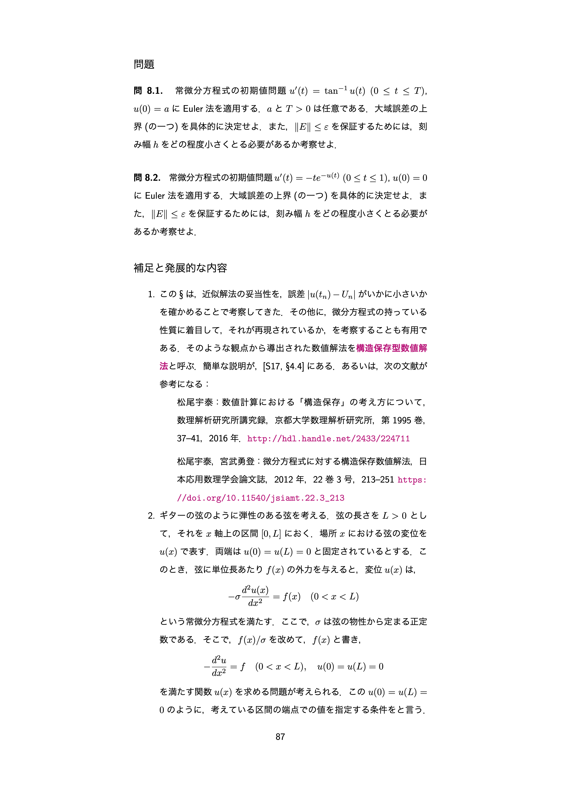

## 授業の基本情報
授業名　　:　計算数理I・計算数理  
開講部局　:　理学部数学科・教養学部（後期課程）  
対象　　　:　学部生（理学部数学科、教養学部後期課程はおおよそ同数）  
学生数　　:　約70人  
形態　　　:　全てオンデマンド  
利用したツール:

* ITC-LMS: 学習管理システム（連絡、教材のアップロード、質問、アンケート）
* Slack: チームコミュニケーションツール（質問対応）
* YouTube: 動画共有サイト（オンデマンド授業。リンクを知っている人のみ見られる限定公開で利用）
* Google ドライブ: オンラインストレージサービス（音声ファイルのアップロード）
* Zoom: オンライン会議システム（オンデマンド授業の収録に使用）
* iPad Pro: 動画編集や描画などPCと同等の作業に対応したタブレット（講義ノートの画面共有に使用）
* GoodNotes 5: ノートアプリケーション（iPad Proで講義ノートを作成するために使用）
* Apple Pencil 2: デジタルペン（収録中、iPad Proで画面共有している講義ノートに書き込むために使用）

## 教員の基本情報
 

齊藤 宣一 先生 
数理科学研究科 
教授

## 学生のコメント: この授業が良かった理由

**学生 A のコメント**  

講義が録画だったので、他の教科との兼ね合いを取りやすく自分のペースで学習を進められた。また、講義中に動画を止めて考えたり、分からない所は巻き戻したり、逆に分かるところは2倍速で見たりと自由が利いた。また、質問用のSlackを用意してくださったので、過去の講義に関する質問もしやすかった(対面だと昔の内容に関する質問が心理的にしづらい)。

**学生 B のコメント**  

あらかじめ投稿されいつでも見られる講義録画、授業内容を理解するのに十分な資料にいつでもアクセスできる環境、それらの理解を的確に問うレポート問題など、授業に関わるすべてが、学生が学びたいものを、学ぶことが可能なタイミングで得られるように用意されており、オンライン授業として非常に完成度の高いものだった。 

## 授業をオンライン化するにあたって心がけたこと
### 学生・教員それぞれの立場から現状を認識した
学生・教員の現状を認識することを心がけました。オンライン授業を開始する前に、学生の立場・教員の立場の両方から、この講義の客観的な位置付けについて考えました。

「計算数理Ⅰ・計算処理」はコンピュータを用いた計算の数学的な背景を学ぶ授業です。数学科の学生にとっては選択必修（数学科の7～8割の学生が履修）ですが、様々な分野で必要となる基礎的な内容を含むため、教養学部の、数学を主体としないコースの学生も履修します。バックグラウンドが異なる学生が集まる講義ですので、教員の立場からすると、学生には数学の基礎知識があるという前提で授業をするわけにはいきませんでした。

学生のオンラインによる疲労と、自宅の環境についても考慮しました。教員同士でZoomの練習をする中で、オンラインによる疲れを実感しました。自分の授業だけがオンライン化されるわけではなく、時間割上の全ての授業がオンライン化されるため、13週続けて、月曜から金曜まで複数の授業を受ける学生はかなり疲れるだろうと予想しました。また、学生は自宅で授業を受けるので、ネットワーク環境や集中できる時間帯・場所など、教員は個別の事情にも配慮をする必要がありました。さらに、学生が図書館で本を読むことができないという現状もありました。

当初はZoomでリアルタイム授業を実施しようと考えていました。ですが、これらの現状を踏まえて、完全なオンデマンド授業に切り替えました。

### 学生の学ぶ意欲を信頼して授業の方針を決めた
学生を信頼して、オンデマンド授業を受ける時間帯・タイミングは任意としました。学生がサボること・不正をすることを前提にして、学ぶ意欲を持つ「真面目」な学生がしらけてしまうことは避けなければならないと思いました。

授業のやり方を具体的に決めて早いうちにアナウンスすることで、学生に環境を整えてもらうようにしました。さらに、学習のタイミングを逃しても、学生が自学自習できる材料を提供することと、学生が質問や要望を発言しやすい環境を作ることを心がけました。オンデマンド授業は、学生ごとに学習のタイミングが違うために、質問が出るタイミングも異なります。質疑応答における時間差が不利にならないように、なるべく発言しやすい環境を作ろうと思い、質疑応答用にSlackを導入しました。

## 工夫したところ
### Apple Pencil 2で講義ノートに書き込みを入れた

<iframe style="position:absolute;top:0;left:0;width:100%;height:100%;" src="https://www.youtube.com/embed/hPtz0fHigNk" title="2020年度Sセメスター グッドプラクティスの共有｜齊藤宣一 先生　計算数理I・計算数理｜GoodNotes 5とApple Pencil 2を用いた講義ノートへの書き込み｜utelecon" frameborder="0" allow="accelerometer; autoplay; clipboard-write; encrypted-media; gyroscope; picture-in-picture; web-share" allowfullscreen></iframe>

授業日程に合わせて、講義ノートと、授業を録画した動画ファイル・録音した音声ファイルをITC-LMSにアップロードしました。授業の核は講義ノートとし、動画の視聴や音声の利用は任意としました。

講義ノートの文章を視覚化して説明するために、1本1時間程度の動画を準備しました（1時間を超える場合は2回に分けました）。この動画はZoomで録画しました。参加者を教員1人だけにして、画面共有をしながら録画をしました。対面授業では板書をするスタイルでしたので、オンデマンド授業の動画でも、iPad ProでGoodNotes 5を使い、講義ノートに書き込みながら説明をしました。書き込みを入れた後のPDFも閲覧可にしました。動画作成途中に誤植を見付けた場合は、赤文字で修正し、後ほど講義ノートの修正版をアップロードしました。

ノートにメモを書き込む際には、Apple Pencil 2を使用しました。数学科の人は鉛筆を使うことが多いのですが、Apple Pencil 2は書き心地が鉛筆に似て滑らかで、いろんな色やマーカーが使えるので非常に良かったです。

### 今後の授業でも使いやすい教材をつくった

「計算数理I・計算数理」の授業は10年以上、自分が担当しており、夏学期の間は長期間の空きが作れず、出張に行きにくい状況が続いていました。そのため、以前からオンデマンドの要素を授業に取り入れたいと思っており、講義ノートの準備を数年前から進めていました。今回、今まで執筆してきた講義ノートを初めてオンデマンド教材として学生に配布しました。レイアウトを修正するだけでしたので、教材の準備はやりやすかったです。
講義ノートは、数学科の学生が読めば分かる程度の詳しさにして、学生が手を動かして例などをトレースできるものにしました。対面授業だと図を黒板に書くことが多いので、講義ノートにも図をたくさん盛り込むようにしました。講義ノートを自分のWebページに載せようと思っていたため、図は全て一から自作しました。教員が執筆した本に掲載してある例題の図も、念の為に再作成しました。

基本的には講義ノートだけで学習が完結するような作りにしました。講義ノートが授業の核になるので、板書のような箇条書きではなく、基礎の部分を文章でしっかり丁寧に説明するようにしました。また、参考文献を提示する際はページ番号や章節の番号なども指定し、意欲のある学生が発展した内容を学びやすいようにしました。解説用の動画は、講義ノートのセクションごとに作成しました。また、動画が始まるページの右上に「〜セクション」という文字を入れて見出しを作りました。

動画はいつでも見られるようにしましたが、なるべく学習のペースは守ってもらいたいと思ったため、ITC-LMSにアップロードする際には、希望の学習期間（一週間）を書きました。一つの動画ファイルはなるべく500MB以下にし、全ての学生が確実にダウンロードして勉強できるようにしました。

なるべく早めに動画をアップロードしようと思っていたので、4月から動画作成を始めて、5月中旬までには全ての動画を作成しました。今回学生に配布した講義ノートや動画は、今学期の授業に依存するような部分（学生からの質問への回答など）は含まないので、今後の授業でも再利用がしやすいものになっていると思います。　

以下、各回の講義動画の再生回数です。

|第0回（ガイダンス）|211|
|第1回|154| 
|第2回|106| 
|第3回|98|
|第4回|90|
|第5回|64|
|第6回|112|
|第7回|66|
|第8回|34|
|第9-1回|43|
|第9-2回|36|

講義ノート

注釈付きの講義ノート

### 学習ペースを作るため、また進捗を把握するため授業後にアンケートをとった
毎回の授業後に、講義ノートを読んだかどうか確認するため、任意のアンケートをとりました。アンケートでは「～であることを～という。○か×か？」といった簡単な用語の確認を行いました。学習ペースを作るために、アンケートには回答期間を設けていました。学期末のレポートを出した学生のほぼ全員が回答していました。

アンケートは、学生がちゃんと講義ノートを見てくれているという安心の材料になりました。またアンケートを通じて、自分では単純なことを聞いていたつもりでも、意外と学生に伝わっていなかった箇所を発見することもありました。従来の授業では、ここまで単純な部分を学生に理解しているかどうかを確認していなかったので、対面のときと比べて説明の仕方が変わりましたね。

### Slack上で授業内容に関する質問を募った
Slack上で授業内容に関する質問を募り、Slack上で回答しました。対面のときよりも質問は多かったです。初めの方は特に質問件数が多く、毎日数件の質問が来ました。徐々に質問件数は落ち着いてきましたが、それでも週に5件ほどの質問が来ました。

講義についての質問はもちろん、講義ノートの表現に関する質問もありました。例えば、「Aのような問題に対して、従来の方法Bではなく、新たに方法Cを導入する」といった動機を説明する文章に対して、学生が教員の想定とは違う解釈をしていることがありました。自分が「この説明のしかたなら学生に伝わっている」と長年思っていた表現が、学生からすると二重三重に解釈できるものだった、ということに気付くきっかけになりました。これは学生の側にじっくり考える時間があり、対面授業であれば喋って終わりの部分も文章に起こしてある、オンデマンドという授業形態ならではの出来事だったと思っています。

Slackを管理者として利用するのは初めてでしたが、Slackでは発言を取り消したり修正したりすることができるので、心理的な負担が少ないと思いました。

### アナウンスはこまめに、早めに
コミュニケーションが取れないと学生が不安になると思ったので、こまめに、早めに、具体的な情報をアナウンスしました。学期末のレポートに関しては、課題を出すかなり前から、レポートの内容や課題を出す時期、締め切りについてアナウンスしていました。

Slackに参加していたのは、最終レポートを提出した55名のうち30名程度で、履修者の全員ではありませんでした。ですので、TAにSlackでの議論を全てITC-LMS上にコピーしてもらっていました。ITC-LMSは、大学が導入したときからずっと、演習の課題の提示やレポートの提出で利用していたので、その使い勝手には慣れていました。

## 苦労したところ
### 不慣れな動画編集に苦労した
動画の編集方法が分からず苦労しました。計算結果のアニメーション動画は作り慣れていましたが、授業の動画を撮るのは初めてでした。学期の始めには動画編集について勉強する余裕がなかったので、Zoom上で通して話し、それを録画する方法をとりました。録画の途中に気に入らない場所があれば、もう一度初めから説明し直しました。平均2、3回は撮り直し、一番多いときは5回やり直しました。

将来的には、動画編集ソフトを購入して、部分的に編集するほうが良いだろうと思っています。

### 学生の反応がわかりにくい
完全オンデマンドにしたので、学生の反応はわかりづらかったです。

ただ、反応が分かりづらくなることは予想していたので、対策としてアンケートやSlackを導入し、質疑応答ができる場を設けました。それでも一度、10日間Slack上で何も質問がない時がありました。心配になったので、学生に「講義ノートを見てくれているのか」「何か反応して欲しい」とSlackに投稿したことがあります。すると何人かの学生が、質問を書くなどの反応をしてくれました。

### レポートの採点が大変だった
期末レポートでは、成績の差を付けるために、約50点分は難易度の高い問題を出題しました。この問題はほとんどの生徒が手を付けないだろうと考えていました。ですが、教員の予想以上に、学生が難易度の高い問題を解いてきたので、採点が大変でした。
　
## 今後のオンライン授業に向けて
### 今後もオンラインの要素は残したい　

来年度も「計算数理I・計算数理」をSセメスターで担当する予定です。元々授業をオンライン化したいと考えていたので、対面授業が一部可能になったとしても、オンデマンドの要素は残したいと思っています。

対面では板書を中心とした授業を行っていましたが、今回講義ノート中心の授業でも、学生は丁寧に教材を見てくれていました。対面授業が可能になっても、元の授業形式には戻さないと思います。あらかじめ何らかの形で学生に講義ノートや動画を提供し、対面の授業では黒板を使ったり、パソコンでシミュレーション動画を見せたりして、プラスαの内容を教えることができれば良いと考えています。

授業内で実施したアンケートの結果を見て、教員が意図した内容を、学生にうまく伝えられていない箇所があると気付きました。この授業を長く担当するということであれば、教員の意図とは違う伝わり方をしていた箇所を補うために、20〜30分くらいの動画を作成し、それぞれの授業の導入部分に付け加えれば良いかなと思っています。
　
## 参考資料
### 本授業の概要（シラバスより）

線形代数学では、正則な行列を係数行列とする連立一次方程式は、一意な解を持ち、それはクラメールの公式を用いて表現できることを学んだ。しかし、もし、クラメールの公式をそのまま用いて、未知数が30個の連立一次方程式を解こうとすれば、現在利用できる最も速いスーパーコンピュータを用いても、100億年以上かかる見積もりになってしまい、現実的ではない。一方、それをガウスの消去法で求めれば、手頃なラップトップ型パーソナルコンピュータを用いても、1/100秒もかからない。このように、数学的に解が表現できる、あるいは解が存在するということと、実際に数値を得ることの間には、大きな溝があるのである。数学的な概念や方法を通じて、現実問題を研究する際には、当然、数値的な答えが要求される。そのような問題に対処するために、様々な数学的な概念を、具体的に数値を計算するという立場から研究する分野を数値解析と言う。本講義は、数値解析への入門を目的とし、1年および2年次に学んだ微分積分学や線形代数学に現れる諸問題、例えば、連立一次方程式、非線形方程式、定積分、常微分方程式、最適化（関数の最小化）などを、コンピュータを用いて数値的に解くための方法とその背景にある数学理論の解説を行う。

### 授業内容

* 数値計算と数学，計算機における数の表現
* 非線形方程式：Newton法
* 非線形方程式：多変数Newton法と代数方程式
* 行列のノルム
* 固有値問題：固有値の包み込みとRayleigh商
* 固有値問題：冪乗法，逆反復法，シフト法
* 補間多項式と数値積分：Lagrange補間多項式とNewton-Cotes積分公式
* 補間多項式と数値積分：直交多項式とGauss型積分公式
* 常微分方程式：Euler法と一段法
* 常微分方程式：Runge-Kutta法
* 常微分方程式：連立系への適用
* 関数の最良近似
* 無制約最適化とその応用

### 具体的な授業1回分の流れと方法
　
ITC-LMSを利用したオンデマンド方式で行いました。

1. 講義日程に合わせて、講義ノート、講義を録画した動画ファイル、講義を録音した音声ファイルをITC-LMSの教材にアップロードしました。それぞれ一回の講義につき一つずつアップロードし、動画ファイルなどはそのものではなくURLをアップロードしました。動画はYouTubeにおける限定公開の形で公開し、音声ファイルはGoogle　ドライブ上に置きました。動画は、講義ノートに沿ってその内容を説明するものです。

2. 学生は、講義ノート、講義を録画した動画ファイル、講義を録音した音声ファイルを用いて学習した後、ITC-LMSのアンケートに進んでアンケートに答えます。アンケートは任意回答です。

3. 学生には、不明点があった場合、ITC-LMSの掲示板やSlackのワークスペースで質問や議論をするように勧めました。

### 評価方法

期末レポートで評価しました。

例年は試験を行なっていました。バックグラウンドが異なる学生が集まる講義なので、これまでも単位取得のハードルは低めにし、準備すべき内容は事前に伝えていました。
今回も、単位取得という点については、学生にプレッシャーをかけないようにしました。他の参考書を使わなくても講義ノートの演習問題を解いておけば50点程度は取れるようにしました。残り50点分は、優・優上を目指している学生のために、差を付ける問題にしました。参考書を見ることを前提にしたレポート課題ですので、例年とは傾向を変え、解き方は大体想像が付くけれども実際に計算をしようとすると簡単には解けない（2～3日かかる）問題を出しました。

差を付ける問題はほとんどの学生が手を付けないだろうと考えていましたが、レポートを提出したほとんどの学生が解いていました。採点に時間がかかりましたし、成績に差を付けるのも大変でした。YouTubeを確認すると、教員がレポート内で提示した計算の内容に該当する動画が最も再生されていたので、多くの学生が動画を復習しながらレポートの問題を解いたのだと思います。そのため、答えのみではなく過程なども含めて評価するようにしました。動画・参考書を見て問題を解くことは認めましたが、レポートについて学生同士で相談することは禁止としました。ただ、学生を信頼して禁止事項として提示するだけに留めました。

締め切りは他のレポートよりも遅めにしました。従来レポートを課す場合は、事務を経由するので、学期内（7月末まで）を締め切りにしていました。ですが、オンライン授業だとITC-LMSに提出してもらったものを私がダウンロードすれば良く、事務を経由する必要がないので、締め切りを遅らせることができました。

学生は従来よりも良くできていました。教員が自信を持って話している時よりも、迷いながら話している時のほうが、学生の反応が良いように感じています。

**「レポートについて」（齊藤先生のWebサイト参考）**

[http://www.infsup.jp/saito/ns/20keisan1.html](http://www.infsup.jp/saito/ns/20keisan1.html)

> 6月29日(月）の朝に期末レポート問題を『課題』で公開します。締め切りは8月5日(水) 23:55です。配点は各問に記してあります。成績の評価はこのレポートの得点のみに基づいて行います。必ず提出してください。

> レポートは、手書きでも、LaTeXやワープロで清書しても良い。ただし、単独のPDFファイル（書類のサイズはA4）にまとめて提出すること。他人に教えてもらったり、他人と相談するのは禁止します。本、講義ノート、インターネット上の情報を参照することは、禁止しません．ただし、参照した後に、自分自身で考察し、完全に納得してから答案を書くこと。また、参照した場合は、必ず、出典を詳しく記すこと。質問は、xxxxx[AT]g.ecc.u-tokyo.ac.jp（注: 先生のメールアドレス）、あるいは、講義Slackで受け付けます。

### 講義ノート
[http://www.infsup.jp/saito/ns/notes.html](http://www.infsup.jp/saito/ns/notes.html)

### 講義映像（UTokyo OCWで公開中）
[https://ocw.u-tokyo.ac.jp/course_11452/](https://ocw.u-tokyo.ac.jp/course_11452/)

