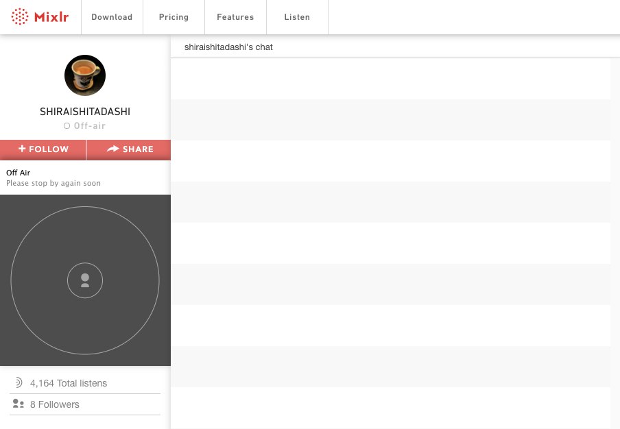
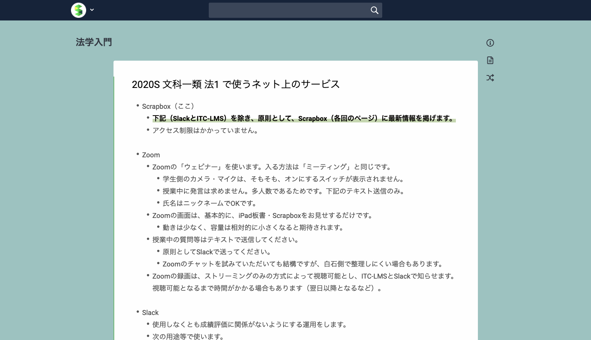

このグッドプラクティスは，2020年度<a href="/events/luncheon/2020-12-23/">オンライン授業情報交換会「第25回 多様なツールを用いて授業を活発化・円滑化する工夫」</a>にて，白石先生にご登壇いただき，内容をご紹介いただきました．学内限定でランチョンの映像を公開しておりますので，ぜひご活用ください．

## 授業の基本情報

授業名　　:　法 Ⅰ  
開講部局　:　教養学部 前期課程  
対象　　　:　教養学部 文一 1 年・2 年  
学生数　　:　約 400 名（Zoom 参加者は 360 名～ 380 名）  
形態　　　:　全てリアルタイム  
利用したツール　:

- ITC-LMS：学習管理システム（受講生全員が利用できるため、資料の配布手段の一つとして利用）
- Scrapbox：文書共有サービス（一般に公開できるレジュメや授業内容のノート、受講生からの質問への返答に利用）
- Zoom：Web 会議システム（画面共有を用いたリアルタイムの授業を行うために利用）
- Mixlr：音声配信サービス（音声のみでのリアルタイムの授業を行うために利用）
- TwitCasting：音声配信サービス（音声のみでのリアルタイムの授業を行うために利用）
- YouTube：動画配信サービス（Scrapbox に掲載する動画資料の公開に利用）
- GoodNotes 5：ノートアプリケーション（iPad で板書をするために利用）
- Google Forms：アンケート作成・集計サービス（課題の回収に利用）
- Slack：コミュニケーションツール（資料の配布や学生とのコミュニケーションに利用）

## 教員の基本情報

白石 忠志 先生 
法学政治学研究科 
教授 

## 学生のコメント: この授業が良かった理由

**学生 A のコメント**  
あらゆるツールを試し、学生の意見も聞きながら最適な方法を模索して、画面共有の仕方などもつねに工夫しながら素晴らしい授業を展開していた。

**学生 B のコメント**  
Slack や Scrapbox を通した事前の資料配布、ミーティングより軽く学生の操作によるトラブルも起きにくい Zoom ウェビナーの活用など、様々なツールを組み合わせ、通信トラブル等に起因する問題のリスクが最低限に抑えられていた。

**学生 C のコメント**  
Scrapbox での資料配布や URL の提示、Slack での迅速な個別対応など、ITC-LMS 以外の様々なツールを使って授業が構築されていた。そのため、他の講義の情報と混乱することがなく、かなり便利だった。またオンラインを活用して、多数のゲスト参加の回を設けてくださり、非常に興味深く授業に集中できた。他の授業は対面の方がわかりやすいかなと思うこともあったが、この法 Ⅰ はオンラインだからこそだなと思う面が多々あった。

## 授業をオンライン化するにあたって心がけたこと

### まずは学生が安心して授業を受けられる環境を作った

まずは学生に対して、コロナ禍でも「安心していいんだよ」というメッセージを伝えることを心がけました。特にこの授業では、入学して間もない 1 年生の受講が中心なので、学生は授業に限らず様々な不安を持っていたはずです。そのため、「ITC-LMS の使い方で困っている人はいませんか？」であるとか、「授業について質問や不安があったら連絡してください」といった問いかけを重ねました。ネットワーク環境に不安を抱える学生も多かったため、「録画は後でも確認できる」であるとか、「今つながっていなくても問題ない」といったことも、授業内で繰り返し伝えてきました。

また、Slack や ITC-LMS を利用して学生から質問を募集し、寄せられた質問に対してほぼ全てに答えたり、Zoomでオフィスアワーを実施したりするなど、学生とのコミュニケーションを密に取ろうとしました。これは学生の声を直接聞くことができるだけではなく、逆に学生からツールを紹介してもらうこともあるなど、自分自身の情報収集の場としても機能しており、非常に良かったと思っています。

## 工夫したところ

### 様々な配信ツールを使って授業を行った

今回のオンライン授業では、様々なツールを使って授業を行いましたが、ほとんどのツールは今回初めて利用するものでした。
まず、授業の配信方法については、データダイエットの必要性やセキュリティの問題から、4 月当初は Zoom 以外の方法を採用した方が良いのではないかと考え、音声配信サービスでの授業検討を始めました。

初めに利用したツールが Mixlr です。自分自身、音楽のライブ配信を、Mixlr を使って聞いたことがあったのですが、まさか自分が配信をする立場になるとは思ってもいませんでした。また、他の大学の実践例などを情報収集する中で、ツイキャスの存在を知り、ツイキャスの利用も始めました。学生からお茶（視聴者から配信者に対して応援の気持ちを伝えることができるツイキャスの機能）が来るといったコミュニケーションが取れるだけではなく、音声だけの方が負担が少なく「癒される」といった学生からの声もありました。

音声配信サービス「Mixir」の画面

一方で、音声だけでは板書を見せることができないという問題があります。コロナ以前の対面の授業では、iPad に板書を書き込み、それを教室のスクリーンに投影するといった形で授業を進めていましたが、音声だけではそれができません。当初は、先に板書だけ用意しておいて、文書共有サービスである Scrapbox（詳しくは後述）で共有するなどの工夫をしていたのですが、できる限りリアルタイムで板書を見せたいと考えるようになりました。

他の授業では Zoom が定着して学生も慣れてきたこと、またセキュリティやデータ使用量の懸念も払拭されつつあったことから、ゴールデンウィーク前の授業で学生に対して説明をし、5月からは完全に Zoom に移行しました。

Zoom では、一般的な会議室ではなくウェビナーを利用しました。自分自身、学生に顔を見せてもらう必要はないと考えていたことや、一般的な会議室ではボタン一つでビデオやマイクがオンになってしまうリスクがあり、受講生が不安に感じる一つの要因になると考えたためです。授業中の学生の表情が見えないという経験は初めてで、学生の反応が分からず不安を感じることもありましたが、他のコミュニケーション方法を併用することで補うことができたと感じています。

### Scrapbox を使った資料共有を進めた

授業資料の共有方法としては、主に Scrapbox を利用しました。文書共有ツールである Scrapbox は、画像の埋め込みや他の文書へのリンクなどが容易で、ウェブページとして公開できるといった特徴があります。これはオンライン授業になる前から利用していたツールで、この授業を担当すると決まった昨年秋にこの授業の「プロジェクト」（編者注　Scrapboxにおいてファイルをまとめるフォルダのようなもの。プロジェクトごとに公開できる。）を開設して少しずつ準備をしてきました。

授業前には、授業内容をレジュメとしてまとめて公開し、公開したページを共有しながら授業を行いました。また、授業後には、授業中の板書の画像や、受講生からの質問とその回答などを追記することで、授業内容の振り返りをしやすくしました。
また、著作権法上不特定多数に公開することが難しい資料については、ITC-LMS と Slack（後述）を利用して共有していました。

### 学生とのコミュニケーションのために Slack を導入した

学生とのコミュニケーション方法の確立も、オンライン授業を行うにあたって特に工夫をした点です。大学の公式として提供されている ITC-LMS やメールを利用する教員も多いとは思いますが、今回はそれらの方法に加えて Slack を導入しました。Slack も今回初めて利用したツールでしたが、学生とのコミュニケーションが非常に取りやすくなりました。

4 月当初は ITC-LMS を利用するつもりでいましたが、一時期、非常に負荷が高く、動作が不安定だったこともあり、学生からの質問やメッセージが確認できないことが続きました。そのため、違う方法を検討することにしました。

メールでのやりとりをするであるとか、Twitter のハッシュタグを使ってコメントをもらうなどの方法も検討しましたが、自分のメールアドレスやアカウントを教員に知られることを好まない学生も多いのではないかと考えました。そのため、ある程度の匿名性が担保されつつ、学生であることの確認が取れる連絡手段として、Slack の導入を決めました。「授業をオンライン化するにあたって心がけたこと」でお話しした事にも通じますが、なるべく安心できる方法を取ることで、学生が教員に連絡を取るハードルを下げようと意識していました。

Scrapbox 上で、利用するネット上のサービスについてもまとめた

Slack は任意利用としたため、実際に登録した受講生は 1 割程度でしたが、DM では非常に多くの質問や相談が寄せられました。他の人の目を気にせずに連絡を取れるという点も、教員への連絡を取りやすくした理由だと思っています。

授業の 5 日前には Slack と ITC-LMS に資料をアップロードして、前日の昼までに Slack に質問を送ってもらうことにしていました。そのため、授業ではその質問への回答や、質問を踏まえた説明ができるようになり、授業の構成にも役立ちました。

対面で授業を行っている時は、授業後に質問へ対応することはあったものの、授業以外での学生とのコミュニケーションはほとんどありませんでした。対面授業では、学生がどのようなデバイスを利用しているかが分からず、ツールの導入を提案しにくいと感じていたという経緯もあります。オンライン授業が推進されたからこそ、学生との双方向のコミュニケーションが容易になったと思っています。

### 様々な方のゲスト講義を行った

教養学部では最初の 2 週間が試行期間と位置付けられていたことを活用し、友人の弁護士を授業に呼んでライブトークをしようと準備をしました。彼は駒場時代のクラスメイトだったこともあり、1 年生を中心とする受講生に大学生活のイメージを持ってもらうことも意図していました。
授業の中で質問や感想を募集したところ、非常に多くの声が集まりました。新しい世界を、そこで働く人に直接語ってもらうと、こんなにも関心を持ってもらえるのかということが分かり、それから様々なゲストの方をお呼びすることにしました。

Scrapbox に残っている学生からの質問

この授業は平日の朝に設定されているため、対面の授業ではなかなかお呼びしにくいのですが、オンライン授業という形態も相まって、今回は合計 6 人もの様々な方に来ていただくことができました。

もう一つ、オンライン授業だからこそ実現したこととして、海外からのゲスト講義が挙げられます。授業準備でやりとりをする中で、是非直接講義をしたいと申し出をいただき、ドイツとシンガポールからそれぞれゲストとして参加いただきました。もともと自分から法学入門を話そうとして準備を進めていたこの授業ですが、様々な人から直接話を聞くという体験を作ることができたことは、オンライン授業だからこそ実現した工夫と言えます。

毎回、学生から非常に多くの質問が寄せられていたため、ゲストの方には「テンポよく答えていってください」と伝えることも多くありました。また、必ずしもゲストの方にずっと話していただくのではなく、専門用語や必要な前提知識を適宜補うなどの「ちゃちゃ」をいれることで、学生が置いていかれないように注意していました。

### 画面共有の方法を工夫した

ゴールデンウィーク明けから Zoom を用いた授業を始めたため、カメラや画面共有の方法についても検討しました。授業のレジュメとしての Scrapbox の画面と、板書としての iPad 上のアプリケーション（GoodNotes 5）の画面をそれぞれどのように配信するかの工夫が必要でした。

様々な学校での実践例を情報収集する中で、スイッチャーとして ATEM Mini を利用する方法を知り、セメスターの途中から導入しました。Zoom の映像の配信方法としては、主にカメラ出力と画面共有の二つが存在しますが、前者は後者に比べて画質が低くなりやすいという特徴があります。そのため、細かい文字の多いレジュメは画面共有で、大きな文字が多い板書は ATEM Mini を経由したカメラ出力で配信する形に落ち着きました。

もちろん、iPad で Scrapbox と板書の両方を切り替えながら配信することも可能ではありますが、アプリケーションの切り替えが容易であるが故に、授業に関係しないものを誤って配信してしまうリスクがあり、授業においては、iPad は板書専用として使いました。

授業後には、GoodNotes 5 でとった板書を Scrapbox に掲載しました。

## 苦労したところ

### 質問対応に時間がかかった

準備自体は、担当が決まった昨年の秋から始めていたため、オンライン化にあたっても大きな負担ではありませんでした。時間がかかったとすると、学生からの質問等への対応でしょうか。ツールの工夫をしたこともあり、学生から非常にたくさんのコメントが寄せられました。返事を書くことは非常に楽しいのですが、気が付くと夕方になっていたこともありました。この点についても、Slack は学生だけでなく教員も使いやすいツールであるため、導入後は対応時間を短くすることができました。

### 成績評価に苦労した

もう一つ苦労したこととしては、成績評価が挙げられます。

課題は、任意課題として 3 回、最終課題として 1 回、計 4 回出しました。任意課題については、日々の課題が負担になっているという学生の声も聞いていたため、140〜280 字程度の短めのレポートにしました．1〜2 ツイート程度の文字数であれば学生も書きやすいかなと考えたためです。回収には Google Forms を利用しましたが、提出率は約 8 割近くとなり、多くの学生に取り組んでもらうことができました。また、Slack のダイレクトメッセージで同文を送信した場合はコメントをして返却する旨を伝えたところ、1 割程度の学生は Slack でも提出をしました。これはオンラインツールを導入したからこそ実現したことで、対面では難しかったと思っています。

最終課題は、任意課題よりは少し長く、840 字程度のレポートを課しました。一般的な最終レポートで課される文字数よりは大分短いと感じるかもしれませんが、これまでの経験から、十分に成績評価ができることは分かっていました。

セメスターの途中には、「課題を必須にしないでください」と受講生から直接言われたこともあり、課題の扱い方にはかなり苦心しましたが、最終的には、原則として最終課題で評価し、優と良の判断が必要となった場合に任意課題を使うという形で成績評価を行いました。

6 月末には対面での期末試験ができないことが分かり、オンラインでの期末試験の方法も検討されていましたが、400 名の受講生に対して自分が円滑に行うことは大変だと考えました。最初から期末試験をしないと決めていれば、任意課題を必須にするということもできたとは思いますが、今回は最後までどうなるかが不明確であったため、成績評価には苦心した部分も多々ありました。

## 今後のオンライン授業に向けて

### 教養学部長の力強いメッセージが心の支えとなった

非常に多くの教員がいる東京大学では、先の見えないコロナ禍において、オンライン授業という新しい形態に向けて、全員の方向性を合わせることは困難なことであったと思っています。特に教養学部においては、学部長の太田先生から早い段階で、教員・学生に対して力強いメッセージをいただいていたことが、オンライン授業の実現に向けて心の支えになりました。メッセージの発信と同時に、オンライン授業にあたって注意すべき点であるとか、工夫の仕方といったことを教員間で共有していただいたことは、オンライン授業の実現に非常に役に立ったと思っています。

### オンライン授業だからこそできることをする

今回、大人数のオンライン授業を半年間行ってきましたが、オンライン授業ならではの良い点もたくさんあると思っています。例えば、学生との双方向のコミュニケーションが非常に取りやすいこと。これまでの授業の経験から、学生は大人数になればなるほど、他の人の目を気にして質問をしにくいのではないかと考えていました。オンライン授業で様々なツールを導入して、教員と個別にコミュニケーションを取ることのできるチャンネルを構築したことにより、質問の数は大きく増えました。A セメスターでは、ゼミのような少人数の授業しか持ちませんが、これまでと同様に様々なツールを試しながら、手作りの授業を作っていくことになるのだと思います。次は Google Classroom を活用してみようと考えています。

## 参考情報

### 本授業の概要（シラバスより）

文科一類の学生が現代において法を学ぶための見晴らしを得るきっかけを、できるだけ幅広い範囲から提供することを目標とします。立法・行政・司法などのいずれかに偏ることなく広やかに、漠然とした知識だけでなく実際に具体的な文書等に接する経験も積み、また、外国との比較・交流・発信などの状況も紹介します。

### 授業内容

授業のスケジュールやそれぞれの授業内容は、授業で使った Scrapbox（[2020S 文科一類 法 1 - 法学入門](https://scrapbox.io/ho/2020S_%E6%96%87%E7%A7%91%E4%B8%80%E9%A1%9E_%E6%B3%951)）にもまとまっています。

- 立法・行政
- 司法
- 国内法と国際法
- 外国法
- 過去・現在・未来

### 具体的な授業 1 回分の流れと方法

|時間|カテゴリ|説明|
|:---|:---|
|50 分|講義|Scrapbox 上のレジュメと、iPad 上の板書を共有しながら、Zoom で配信|
|5 分|休憩|休憩|
|50 分|講義|Scrapbox 上のレジュメと、iPad 上の板書を共有しながら、Zoom で配信（ゲストなしの場合） ゲスト講師と教員のトークセッションを、Zoom で配信（ゲストありの場合）|

### 評価方法

- 「必須課題」を中心として評価します。
- 「任意課題」に対する評価を補助的に用います。
- 「任意課題」は、「必須課題」の評価において「優」と「良」との間の境界エリアにいる履修者について、参照します。
  - 教養学部が「優上・優」の上限割合の定めを置いているために「良」とせざるを得ない可能性がある履修者がいる場合に、当該履修者について、参照します。
  - 「任意課題」の状況を参照する場合、提出したうち最も良い評価のもの 2 回分を参照します。
- 成績評価においては、法的な文章を読み・書くのに慣れ、意味が明瞭で読みやすい文章を書けているか否かが、最も重要な考慮要素となります。また、内容の具体性、どのくらい考えて書いているか、なども重要な考慮要素となります。
- 些細な誤記や、法律文書の約束事とは異なる表記（送り仮名や条・項・号の表記など、文章の意味に大きく影響しないもの）は、減点対象とはしません。
