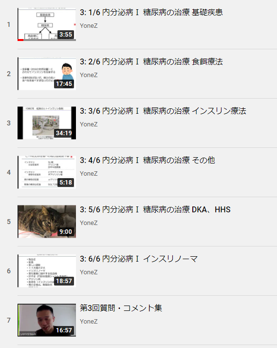

このグッドプラクティスは，2020年度<a href="/events/luncheon/2021-01-28/">オンライン授業情報交換会「第28回 オンデマンドとライブ形式を組み合わせた授業設計の工夫」</a>にて，米澤先生にご登壇いただき，内容をご紹介いただきました．学内限定でランチョンの映像を公開しておりますので，ぜひご活用ください．

## 授業の基本情報

授業名　　:　内分泌病学 Ⅰ 
開講部局　:　農学部 
開講期間　:　S1 ターム 
対象　　　:　学部生（獣医学課程 4 年生） 
学生数　　:　約 30 名 
形態　　　:　オンデマンドとリアルタイムの組み合わせ 
利用したツール　:

- ITC-LMS：学習管理システム（教材の配布、講義動画の URL 共有、期末試験の実施）
- Zoom：オンライン会議システム（リアルタイム授業）
- LINE：コミュニケーションアプリ（テキストチャット機能を主に利用。授業に関する連絡、学生からの質問受付、学生とのコミュニケーション）
- YouTube：動画共有サイト（講義動画を配信するためのプラットフォーム）
- Bandicam（有料版）：動画編集ソフト（講義動画の録画）
- Windows Movie Maker：動画編集ソフト（動画中の不要な音声をカット）
- Audacity：音声編集ソフト（ホワイトノイズ除去）
- EcoDecoTooL：音声編集ソフト（音量の調整）

## 教員の基本情報

米澤 智洋 先生 
農学生命科学研究科 
准教授

## 学生のコメント: この授業が良かった理由

**学生 A のコメント**  
録画動画を自分の好きな時間に見られるので、集中できる時間帯にみたり、また、メモを取るのに一時停止したりできたりしたので、学習しやすかった。また、質問対応もしっかりしてくれたことや、LINE でのやりとりだったので質問も気軽にしやすく、とても良かった。

**学生 B のコメント**  
授業の始めはオンラインで質疑応答の時間、残りは配信された動画を好きな時間に視聴するというものでした。動画が配信されているものは何度も復習を行うことができ、且つ、自分の体調や集中力などの面で良いタイミングで受講することができました。また、前の週の授業の質問に次週の最初に答えていただけたことで、配信型の授業のデメリットである双方向性を保ちにくいという問題を解消していただけました。

## 授業をオンライン化するにあたって心がけたこと

### 双方向性を担保するためにライブ配信でオンデマンド教材を補足する

授業の双方向性を担保することを最重視していました。今年 3 月に開催いただいたオンライン授業に関する講習や説明会で、オンライン講義の形式は、

- A) zoom を使いオンラインでライブ配信をするか
- B) オンデマンド＋ α（α では双方向性の担保が必要）にするか

どちらかだ、と教わりました。

しかし A を選んだとしても、通信障害等でアクセスできなかった学生のために録画を残しておいて共有する必要があると知り、個人的には A に魅力を感じなかったので B を選択しました。具体的には、講義動画のオンデマンド配信と、動画の内容を補足するライブ配信（zoom で実施）を組み合わせることにしました。

### オンデマンド教材で授業の質を向上させる

実は以前から、授業の一部をオンデマンド形式にすることを検討していました。時代の流れも、オンデマンドによる学習形式への移行を後押ししているように感じていました。内分泌病学の授業は、獣医のライセンス教育でもあるので、基礎的な知識＝授業の「コア」の部分は毎年同じです。ですので、基礎知識や教科書で学べることはオンデマンドにして各自が学び、ライブ配信は「なぜ・そもそも」に特化して掘り下げたり、質疑応答を主軸にしたりしたものにできないかと思っていました。

教科書は一人で黙読するだけでは内容が頭に入りづらいです。教員がメリハリをつけて音読することで、内容も理解しやすくなると思います。とはいえ対面授業では「コア」の知識を解説していると、それだけで 105 分（1 コマ分の時間）になるので、「なぜ・そもそも」を掘り下げる時間がなくなっていました。言いよどんだ箇所を編集できるオンデマンド形式にすれば、同じ授業内容をより短い時間の動画に凝縮することができるので、より充実した授業ができると考えました。

### 15 分間のライブ配信で学生と教員の一体感を高める

授業は学生が教員の考え方を知る時間でもあります。これはアーティストのライブとファンの関係に近いと思っています。ファンは音源を家で再生するほうが、曲を良い音質で聴くことができますし、歌詞カードをじっくりと読むこともできます。でもライブに行くほうがより楽しいですよね。ライブには一体感がありますし、そこから歌詞の意味がわかることもあります。授業でもライブ感を楽しむことは重要だと思っています。
15 分もあれば、自分が感じていることを学生にもつかんでもらえます。ですので、15 分間のリアルタイム授業を導入しました。この時間を質疑応答にあてることで、授業の双方向性を担保しました。

## 工夫したところ

### オンデマンドとリアルタイム授業を組み合わせる

zoom を利用した 15 分程度のリアルタイム授業と、別撮りした講義動画（全部で 90 分程度）を用いたオンデマンド授業という組み合わせで授業を行いました。

授業の開始時間になったら、zoom でのライブ配信を行いました。リアルタイム授業では、前回授業から当日までにもらった質疑に対する応答の時間を設けました。授業の終了時には、 次回の講義動画の URL を告知しました。学生には、これをオンデマンドで好きな時に視聴して、次回の授業までに質問・コメントがあれば、米澤に個別に連絡をください、と伝えました。

リアルタイム授業では、学生のカメラをオフにしていました。もちろん、学生の顔が見えない状況で、出席をどう担保するかという問題はありました。ですがこれまでの対面授業でも、話を聞いてない人は聞いていませんでしたし、僕はそもそも出席点をほとんど加味していませんでした（学生にも周知していました）。加えて、カメラをオンにすると、部屋の様子や自分の姿勢が映ってしまうので、学生にとっては相当なプレッシャーになると思いました。そのような状況を踏まえると、カメラオンの必要性は感じませんでした。その分、「獣医系 YouTuber」になったつもりで、明るく学生に語り掛け、学生からの質問がないと授業が成り立たない、と強調して伝えました。

オンデマンドの講義動画は別撮りして、YouTube で限定公開にしてアップロードしました。ひとつ 20 分～ 30 分くらいの動画にして、再生リストとして配信しました。その中では、教科書にはない「そもそも論」を、オンデマンドにも盛り込むことができました。

（第 1 回講義動画、米澤先生の手描きスライド）

（第 2 回講義動画、目次スライド）

（第 3 回講義動画の YouTube プレイリスト）

### 学生の利用しやすさを考えたオンデマンド教材を準備する

学生が好きなところだけ聞きなおすといったことがしやすくなるように、講義動画に細かく目次をつけたり、動画ファイルを分けたりしました。

zoom でのリアルタイム授業(質疑応答)も録画しました。後でこの動画を再生リストに加えることで、学生が繰り返し見られるようにしました。

また、これらの動画教材とは別に、ITC-LMS の教材欄に、使用したスライドの pdf ファイルと、講義動画の音声(mp3 ファイル)をアップしました。pdf ファイルは 10MB を超えるとコンビニで印刷できないという声があったので、図・写真を除いた軽量版ファイルも用意しました。

### リアルタイム授業ではフランクな雰囲気をつくる

リアルタイム授業では、フランクな雰囲気づくりを心がけました。くだけた内容から始めて緩急をつけたり、話し方に抑揚をつけたりしながら、学生が臨場感を持って一緒に考えながら聞いていられる内容になるよう気を配りました。

どんな質問にも対応して、できるだけ楽しそうな味付けにしました。具体的には、深夜ラジオの投稿コーナーや、YouTuber の質問コーナーをイメージしていました。学生にも質問はペンネームで投稿してもらいました。質問に答えるときは、「鋭い！」「最高です！」といった言葉を挟んで、雰囲気を盛り上げていました。雑談をしつつ送ってもらった質問に答えていくと、学生にも喜んでもらえました。

学生からの質問がなければ、双方向性を担保できなくなってしまうので不安でした。ですが、毎回、10 ～ 15 人から感想や質問が届きました。 鋭い質問や教員が唸るようなコメントが多く、大変よい質疑応答になりました。これまでの対面授業よりも、ずっと多くの反響がありましたし、手応えがあったという印象を持っています。

（第 3 回授業への質問・コメント集動画　※Zoom でのライブ配信の録画）

（第 5 回授業への質問・コメント集より引用）

### 専修で導入していた LINE をコミュニケーションツールとして活用した

授業に関する情報は、グループ LINE で発信しました。他の実習の調整や就職関連情報の伝達の都合上、「獣医学専修の各学年の全員＋米澤」で構成されるグループ LINE を持っていました。獣医学課程の授業はほぼ必修で、学生もほとんど全員が顔見知りです。普段から「何かあったら個人 LINE を送ってほしい」と学生には伝えていました。学生が発言しやすい空気が既にあったので、この授業でも LINE を活用しました。

時間の制約は特に設けず、授業時間外でも LINE のやり取りをしていました。大人数授業ではないので、業務に支障がでるような量のメッセージが送られてくることはありませんでした。

リアルタイム授業の zoom URL は、ITC-LMS のお知らせ欄に前もって掲載するとともに、数日前から何度かにわたり LINE で学生に伝えました。また、LINE で送られてきた学生からの質問に、次週 zoom で返信をしました。さらに、授業に出席した学生から、LINE で「先生面白かったですよ」という反応が送られてきたときは、「あれは実は……」と突っ込んだ返信をしていました。教員が大きな手間をかけなくても、学生には双方向のコミュニケーションができたと感じてもらえたようです。

## 苦労したところ

### 動画としてのクオリティを追求した

オンデマンドの講義動画の別撮りには、とても時間かかりました。動画はいくらでも編集可能なので、ちょっと言いよどんだり、齟齬のある言い方したりをするたびに、撮りなおして編集していたら、1 本の講義動画を作るのに何日もかかりました。普段から、105 分の授業の資料を作るために数日かけていましたが、動画の録画・編集にもかなりの時間がかかりました。

20 分の講義動画 1 本に対して、編集前の録画映像はその 3 倍ぐらいの長さでした。これまでは主にスライドを使い、一部板書をするというスタイルで授業をしていました。1 回の授業で使うスライドは 120 枚ぐらいあり、教員もすべての内容を覚えているわけではなかったので、毎年言うことが少し変わってしまったり、言いよどんでしまったりする箇所がありました。普段いかにへたくそに講義していたのかを思い知りました。オンデマンド化によって、学生に安定した内容の教材を提供できて良かったと思っています。

講義動画の音声の調節にも時間をかけました。撮り終わった動画を確認してみると、音声には改善の余地がありました。自分の PC（Let’s Note）のマイクはあまり性能が良いものではなく、教員の声が割れてしまいました。また、マイクが HDD のファンの音も拾ってしまい、動画には常にホワイトノイズが入っていました。動画を再度録画しなおすと負担が大きいので、専用のソフトを使って音声の編集をしました。具体的な作業と使用したソフトは以下のとおりです。

- Bandicam で、PowerPoint の画面と音声を録画しました。教員の姿は映さずに音声のみとして、画面にはスライドだけ映るようにしました（Bandicam の一部機能は有料ですが、以前たまたまライセンスを購入していたので、ロゴの透かしが入らない動画を作ることができました）
- Windows Movie Maker で、「えーっと」などの不要な感動詞をカットしました
- Audacity で、ホワイトノイズを除去しました
- EcoDecoTooL で、音のゲインを調整し、ボリュームを上げました

音声だけを抜き出した mp3 のファイルも作りました。ですが、音質の良くないファイルになっていたそうで、恐らく学生は利用していなかったと思います。また、動画にテロップをつけることも検討しましたが、作業量が多くなってしまうので断念しました。

在宅勤務状態でしたので、通常勤務時と比べると、作業にかけられる時間がありました。動画の編集は大変でしたが、楽しい作業でもありました。

## 今後のオンライン授業に向けて

### 今までの授業の中で最も手応えがあった

今回のオンライン授業は、自分が今まで行ってきた授業の中で、一番学生からの反響が大きかったです。学生たちは「あの部分が面白かったです」という感想から、突っ込んだ質問まで、さまざまなコメントを送ってくれました。学生からねぎらってもらったことも初めてだったので、嬉しかったです。自分にとってこの授業は成功体験になりました。

授業を開始した当初は学生たちもずっと家に籠っていて、不安を感じていたと思います。「いつ学校に行くことができますか？」という質問が、自分のところにも届きました。学生たちからは「勉強がしたい！ 授業を受けさせてほしい！」という熱意を感じました。これまで以上の意欲を学生から感じたので、オンデマンドで講義動画を流せばついてきてくれるのではないかと感じました。学生たちの要求と授業形式が一致したから、大きな反響があったのかもしれないと思っています。

### オンデマンドとライブの二刀流は検討の価値あり

講義動画のオンデマンド配信とリアルタイムの授業の「二刀流」は、今後の講義のあり方として良いのではないか、という感触があります。この手応えには、「内分泌病学」という科目が獣医のライセンス教育に関わるものであり、指導要領的な教科書が存在し、到達目標が明確であることも関係していると思います。
可能であれば、一度作った講義動画は、必要に応じてアップデートしつつ使い続けていきたいです。なかでも、10 年以上前から変わらない内容については、年度ごとの授業のクオリティのばらつきをなくして、良い動画を安定して学生に提供したいです。オンデマンド配信の長所を利用していこう、という雰囲気が生まれているのは、良いことだと思っています。

### 結局は手法ではなく中身

アンケートの回答が他よりわずかに多かったため、この授業がインタビュー案件として取り上げられたそうです。しかしだからといって、他に比べ優れているとか、見習ったほうがいい授業だとか、全くそういうものではありません。取り上げられると変な風に捉えられそうに思ったので、正直言ってインタビューを受けるか大変迷いました。

僕個人としては、オンラインでも対面でも、オンデマンドでもライブでも、そういうのはツールというか「小手先の手法」の問題であり、結局もっとも肝心なのは授業の内容だと思っています。インタビューはその「小手先の手法」についての話で終始していて、そういった意味では不本意です。

ただ、そうした核心と違うところで学生のやる気がそがれたり、先生方が余計な時間を割かれたりするのはあまりにももったいないので、他山の石になればと思い、恥ずかしさを忍んでお答えさせていただきました。「もっとこうしたほうがいい」とか「これは違うんじゃないか」というご意見がありましたらお寄せいただけますと幸いです。

## 参考情報

### 本授業の概要（シラバスより）

S1 タームの内分泌病学 1 と A1 タームの内分泌病学 2 を通して、小動物における内分泌疾患（甲状腺疾患、上皮小体疾患、膵臓疾患、副腎疾患、脳下垂体疾患、生殖器疾患）の病態、診断法と治療法を学ぶ。

### 授業内容

- ガイダンス　※Zoom で実施
- 内分泌病総論（歴史、背景）
- 膵臓の内分泌疾患１（猫の糖尿病）
- 膵臓の内分泌疾患２（糖尿病性ケトアシドーシス、インスリノーマ）
- 副腎の疾患１（副腎皮質機能亢進症）
- 副腎の疾患２（副腎皮質機能低下症）
- 副腎の疾患３（褐色細胞腫と多様な内分泌性腫瘍、グルココルチコイド治療）

### 具体的な授業 1 回分の流れと方法

15 分程度のリアルタイム授業と、90 分程度の講義動画を組み合わせていました。

最初の 15 分（リアルタイム）では、zoom で前回の講義についての質疑応答を行いました。あらかじめ、学生からの質問と回答をまとめた pdf ファイルを作成しておき、授業の冒頭で配布しました。質疑応答の時間では、この pdf ファイルを参照しつつ、「〇〇さんから～という質問が届いています」「『先生こんにちは』こんにちは！」というように、できるだけくだけた対応を心がけつつ、学生の質問を共有して回答をしました。

90 分程度の講義動画は、ひとつあたり 20 分～ 30 分くらいの動画にして、再生リストにして配信しました。毎週、ITC-LMS の教材欄に、スライドの pdf ファイル・講義動画の音声(mp3 ファイル)・YouTube プレイリストへの URL をアップしました。

### 評価方法

期末試験 とレポート課題で評価しました。

初回の授業で評価方法を学生に通知しました。オンデマンド授業では学生の自主性を尊重するので、出席管理を行わないことと、期末試験は実施することを伝えました。

**期末試験**

期末試験は ITC-LMS 上で行いました。概要は以下のとおりです。

- 5 択問題(20 問、10 分)
- 知識を問う記述問題(6 問、15 分)
- 症例を使った応用問題(3 問、15 分)

ITC-LMS の機能を用いて、時間制限を設けました。また、一度回答を送信したら、前の問題には戻れないように設定しました。どんな資料を見ても良いけれども、その場で調べていたら間に合わないような時間設定になっています。

**レポート課題**

レポート課題 の概要は以下のとおりです。

- テーマは自分で設定する（例：象の内分泌系）
- 何を調べて書いてきても良い
- 800~1200 字（字数厳守、図の使用 OK）
- Microsoft Word、Text、pdf のいずれかのファイル形式
- メールで提出

ITC-LMS 上で課題の提出ができることは知りませんでした。学生との距離感が近かったこともあって、メールで提出という形にしました。
