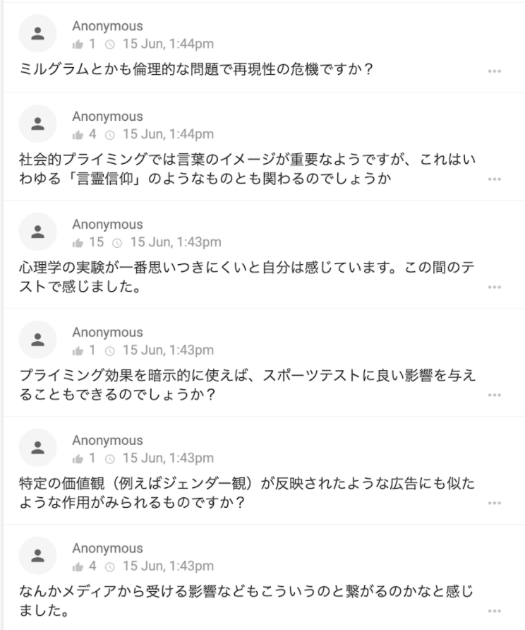
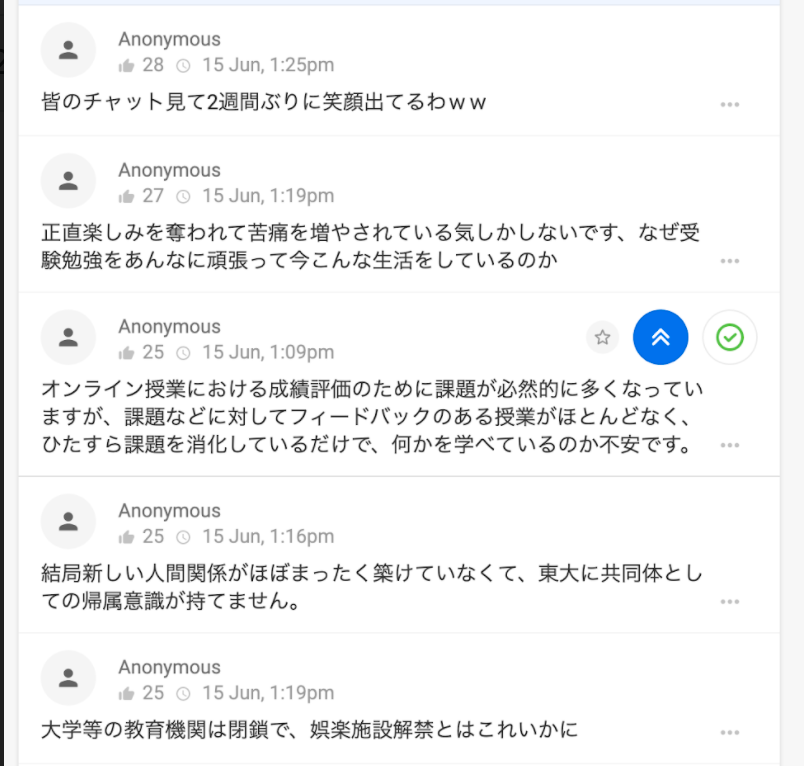
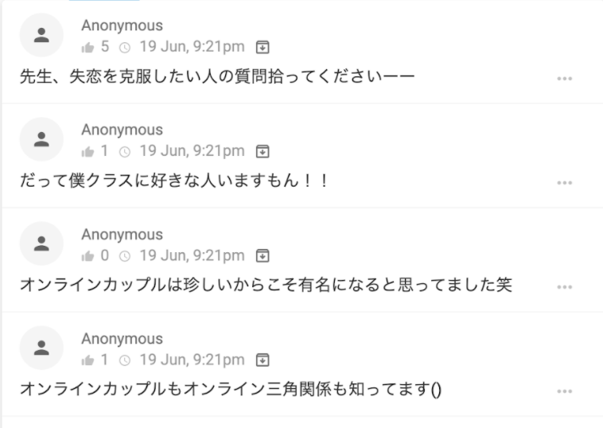

このグッドプラクティスは，2020年度<a href="/events/luncheon/2020-11-10/">オンライン授業情報交換会「第19回 大人数のオンライン授業におけるインタラクションの工夫」</a>にて，四本先生にご登壇いただき，内容をご紹介いただきました．学内限定でランチョンの映像を公開しておりますので，ぜひご活用ください．

## 授業の基本情報

授業名　　:　心理 Ⅰ 
開講部局　:　教養学部 前期課程 
対象　　　:　学部生 
学生数　　:　約 350 名 
形態　　　:　リアルタイム 
利用したツール :

- ITC-LMS: 学習管理システム（教材の配布、講義の URL 共有、学期中の小課題の提示・提出のために利用）
- Zoom: オンライン会議システム（リアルタイム授業）
- Slido: 質問投稿 Web サービス。質疑応答や感想共有のために利用
- Google Forms: 期末レポート（試験時間中に作成）の提出のために利用

## 教員の基本情報

四本 裕子 先生 
総合文化研究科 
准教授

## 学生のコメント: この授業が良かった理由

**学生 A のコメント**  
スライドの使い方が上手く、合間に動画を挟むといったオンラインならではのものも活用した授業方法だった。質問対応は zoom でない媒体を用いて適切に行なっていたため、見やすい資料たちと合わせて非常によく授業が理解できた。大人数の講義であるため、オンライン授業の方が講義の理解はしやすいと思う。

**学生 B のコメント**  
質問が Slido 上で行われるので、その匿名性ゆえに発言・質問がしやすかったし、実際他の学生のコメント数も他の授業と比較にならないくらい多かった。またオンライン授業下の課題量の増加を考慮して課題を少なめに設定して下さったり、期末試験の前の週を試験勉強時間として休講にして下さったりと、学生への配慮がとても感じられて、毎週前向きな気持ちで授業に取り組めたのがよかった。

**学生 C のコメント**  
Slido を採用し学生間の議論を促進した点、学生に最大限配慮し授業やテストを設計してくださった点、slido での雑談コーナーを設け、相談するべき友達もいない 1 年生に愚痴を吐ける場を作ってくださった点（特に最後者には精神的に非常に救われた、当初私は鬱症状が出かかっていたが先生のおかげで少し気力が湧いた）

## 授業をオンライン化するにあたって心がけたこと

一番意識していたのは学生の負担にならない授業設計をすることでした。特に学期後半になるにつれ、学生が課題の多さに疲弊しているという情報が入ってきたため、学生の負担にならないよう、課題や授業の設計を行っていました。

## 工夫したところ

### Slido を活用し学生からの質問・感想を集めた

元々授業中の Slido 活用は行っていましたが、オンライン授業になってから学生の Slido 使用法に違いが生まれているように感じました。最も印象に残っているのは、質問だけではなく授業の感想を投稿する学生が多かったという点です。対面授業では、ほぼ全ての投稿が授業内容に関する質問だったのですが、今年の投稿には、質問：感想＝ 2：1 程度の割合で感想が含まれていました。中にはポエムを投稿してくる学生もいて面白かったです。また、ある学生の質問に他の学生が答えてくれている様子が、対面授業の時よりも多く見られました。

（授業中の Slido の様子）

授業を行う際は配信用の PC と Slido チェック用の PC の 2 台を用意し、学生からの投稿を常にチェックできるようにしていました。質問は最新の投稿の順（Recent 順）に表示されるようにし、適宜学生からの質問に答える形で説明が足りない部分を補いながら授業を進めていました。

### スライドに動画を挿入して区切りを明確にした

これも以前から行っていたことではあるのですが、授業内容の区切れ目に休憩も兼ねて、内容に関連した動画を zoom の画面共有で流しました。具体的には、著名な心理学者の TED Talks の映像や、YouTube 上にアップロードされている精神疾患の患者さんのドキュメンタリー動画などを使用しました。

### 学生の不安な思いを軽減するために談話会を開催した

授業中、前述の Slido に学生から「もう辛いです」といった書き込みが相次いだことをきっかけに、愚痴を言い合う会を開催しました。

（授業中の Slido への書き込み）

希望者だけで、6 月 19 日の夜 21:00 ～ 23:13 まで zoom に集まり、愚痴・政治・恋愛・映画といった様々なテーマで雑談をする会でした。Slido の投稿数は 1200 件にのぼり、その内容は「失恋の乗り越え方が分かりません」といったものから「常に気持ちが落ち込んでいて涙が出てきます」といったものまで多岐に渡りました。

（座談会での Slido の様子）

学生にとって、匿名で同じ授業を受けている人との繋がりを持てたという点でとても良い機会だったのではないかと思います。私自身にとっても、オンライン授業になってから授業以外で学生と触れ合うことのできる機会がなくなっていたため、学生の人間味を感じられるいい機会になりました。

## 苦労したところ

### オンラインに最適な試験の実施方法について検討した

オンライン上でテストを行うということで、公平性の保ち方や成績をばらけさせる方法、できる限り学生のストレスにならない方法で行うことなど、さまざまなことに配慮しました。結果的には、学生に定められた試験時間（60 分）でレポートを作成してもらうという形式に落ち着きました。こちら側で学生のモニタリングは行わず、学生はどのような資料を参照しても良いという条件でした。このような形式にしたのは、単にレポートでの評価にしてしまうと公平性や成績の正規分布を作り出せない危険性があり、一方で例年通りの試験をオンラインで行おうとすると、学生をモニタリングする必要が出てきてしまい、学生へのストレスが大きくなってしまうと考えたからです。

試験当日は、試験開始時間に学生に zoom につないでもらい、zoom のチャット欄・画面共有や ITC-LMS といったあらゆる手段で試験問題を共有しました。試験中に質問がある学生には zoom のチャットで対応しました。学生が解答を送信する Google Forms は 3 つ用意しておき、学生証番号末尾の数字で学生を 3 つのグループに分けて、各学生に自分の学生証番号に適した Google Forms を使用してもらいました。（Google Forms への負荷を分散させるため）さらに、解答が送信できているかどうか不安という学生にはメールや ITC-LMS 上で提出することも認めました。

学生には、Google Forms に直接解答を打ち込むのではなく、一旦ローカルで解答を作成してから、Google Forms にコピーアンドペーストするように勧めました。また、PC での回答作成に苦手意識のある学生に対しては、事前に申請しておけば、手書き回答を写真に撮ったものを提出しても良いということにしました。

時間管理の面では、Google Forms 自体には時間制限を設けず、口頭で試験時間終了前に解答送信を促すという方法を取りました。このことにより、Google Forms のボット確認など思わぬトラブルで解答送信が間に合わなかったという学生をなくすことができました。

### オンライン上で課すのに最適なレポート内容について検討した

インターネット上の情報を含むどんな資料を参考にしても良いという条件で行ったため、検索ですぐ答えが出ないような問題にするということを意識しました。また、学生の解答時間を厳密に管理できるわけではなかったので、解いている時間が 1, 2 分違うからといって点数に大きな差が生まれることがないように気を付けました。全体としては、レポートを書きながら授業全体を振り返ることができるような問題にしようと考えていました。

> （実際のレポート問題）
>
> [問 1] あなたの日常生活の中での例を一つあげて、講義の内容をふまえて注意が知覚に及ぼす効果について概説せよ。
>
> [問 2] 進学選択とそれにかかる成績評価の公平・公正性および、コロナ禍におけるオンライン試験またその際のモニタリングの必要性について考えると、学生および教職員を含めたコミュニティにおいて社会的ジレンマ様の状況にあることがわかる。講義で述べたことを踏まえ、この社会的ジレンマ様の状況を考察せよ。
>
> [問 3] 心理 1 の講義で学んだことの中で、問 1 と問 2 に関すること以外で印象に残った内容を一つあげて印象に残った理由とともに記述せよ。

結果的には、学生の点数は従来よりも少し幅の狭い正規分布になりました。

## 今後のオンライン授業に向けて

### 授業の録画を残すのが重要

Google Drive で動画をダウンロードできない設定にして共有するのがいいのではないかと思います。学期途中から公開したところ、学生からの評判が良く、試験前に全て聞き直したという学生もいたため、学習効果も高いのではないかと感じました。組織的に授業のデータを整理されデータベース化されてしまう危険性に対しては、単位剥奪等の罰則を設けることによって解決できると思います。

### 学生とのコミュニケーションを意識

雑談を通して、学生が何に困っているのかということを吸収することが大切だと思います。また、ライブ授業の良さである双方向性（質疑応答から話が広がるなど）をこれからも大切にしていきたいと考えています。

## 参考資料

### 本授業の概要（シラバスより）

ヒトや動物の心や行動を対象とする心理学は、その科学的測定の特殊さゆえ、誤った理解や理論が社会に広がることも多い。心理学は、人間の心と行動の理解を目指す歴史ある学問であるが、心理学における研究手法は、科学技術の発達とともに常に変容しつづけている。本講義では、これまでの心理学実験の例やそこから導きだされた理論を学ぶことにより、心理学の基礎を学術的に理解することを目標とする。

### 授業内容

- 心理学の成り立ち
- 人の心の基本的な仕組み及び働き
- 心理学実験法
- 情動
- 記憶
- 注意・記憶
- 社会心理
- 精神疾患
- 感覚、知覚
- 脳損傷と心のはたらき
- 課題

### 具体的な授業 1 回分の流れと方法

| 時間| カテゴリ| 説明|
|2 ～ 3 分| 雑談| 雑談・愚痴など（最近どう？）|
| 3 分| 復習| 前回の復習|
| 10 分| トピック| 1 つのトピックについて解説|
|5 分| 質疑応答・動画| トピックに関連した質疑応答もしくは動画を流す|
| | |このトピック →  質疑応答・動画の流れをトピックを変えながら何回か繰り返す|
| 2 ～ 3 分| まとめ| まとめ・雑談 （試験どうすれば良い？、課題が多いって聞いたけどどう？など）|

### 評価方法

60 分の試験時間中に作成するレポートを評価の対象としました。
参考書やインターネット上の情報など、どんなものでも参照可としました。

> （実際のレポート問題）
>
> [問 1] あなたの日常生活の中での例を一つあげて、講義の内容をふまえて注意が知覚に及ぼす効果について概説せよ。
>
> [問 2] 進学選択とそれにかかる成績評価の公平・公正性および、コロナ禍におけるオンライン試験またその際のモニタリングの必要性について考えると、学生および教職員を含めたコミュニティにおいて社会的ジレンマ様の状況にあることがわかる。講義で述べたことを踏まえ、この社会的ジレンマ様の状況を考察せよ。
>
> [問 3] 心理 1 の講義で学んだことの中で、問 1 と問 2 に関すること以外で印象に残った内容を一つあげて印象に残った理由とともに記述せよ。
