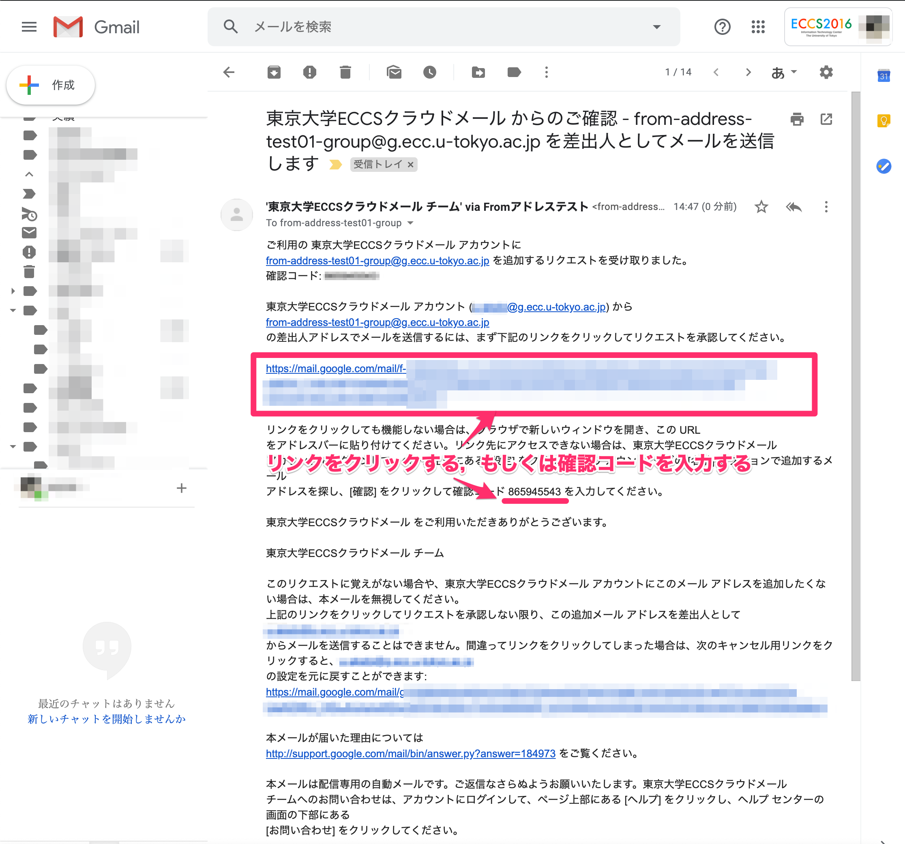
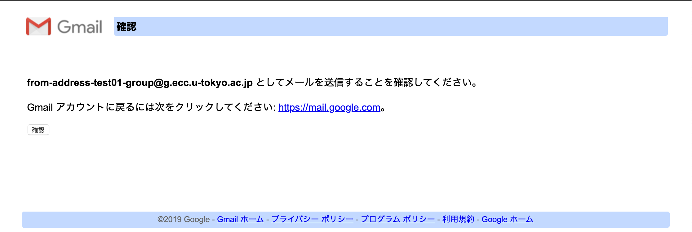
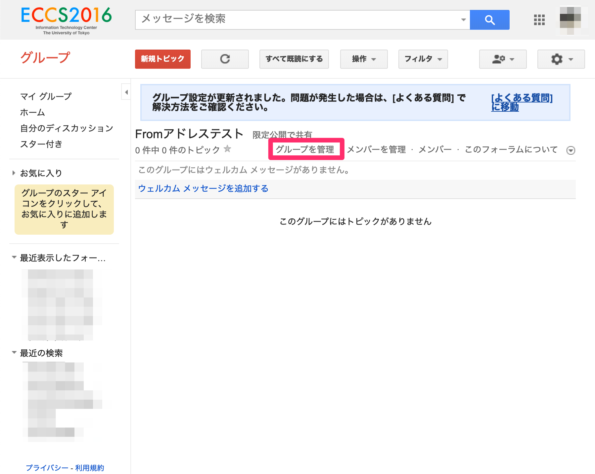

## 概要

ECCSクラウドメール内で作成したGoogleグループをメーリングリストとして用いる際，そのメールアドレスを差出人としてメールを送信することが可能です．

そのためには，事前に下記のような設定が必要です．
1. Googleグループの設定で，「ウェブ上の全てのユーザー」に投稿する権限を与える
2. ECCSクラウドメール（Gmail）のアカウント設定で，「他のメールアドレスを追加」を行う
3. 「自分のメールアドレスを追加」の確認のメールに記載されたリンクをクリックするか，確認コードを入力する

ECCSクラウドメールのGoogleグループでは，デフォルトでは「ウェブ上のすべてのユーザー」には投稿する権限が付与されていません．「自分のメールアドレスを追加」の確認のメールはメーリングリスト外のアドレスから送信されるため，「ウェブ上のすべてのユーザー」には投稿する権限が必要となります．

## 詳細

以下の手順で行います．

1. グループを作成します

2. 「ウェブ上のすべてのユーザー」に投稿権限を与えて，作成します

3. 確認して，作成します
{:.small}
4. ECCSクラウドメールから「設定」を開きます

5. アカウント-他のメールアドレスを追加，を開きます

6. 「名前」に送信時に表示したい名前を，「メールアドレス」にメーリングリストのアドレスを入力して，次のステップに移ります
{:.small}
7. 「確認メールの送信」を行います
{:.small}
8. 次のようなメールが送信されます．リンクをクリックするか，確認コードを入力します

9. 確認コードを入力する画面
{:.small}
10. メーリングリストのアドレスとしてメールを送信することを確認します

11. ECCSクラウドメールの送信アドレスとして追加されたことを確認します

12. メール送信時に，メーリングリストのアドレスを選択できることを確認します

13. メーリングリストの設定を見直します．「グループを管理」を選択します

14. 「ウェブ上のすべてのユーザー」から投稿する権限を外します

対外的な問い合わせ先メーリングリストとして運用する場合，「ウェブ上のすべてのユーザー」の投稿する権限はデフォルトに戻さず，そのまま運用してください．
