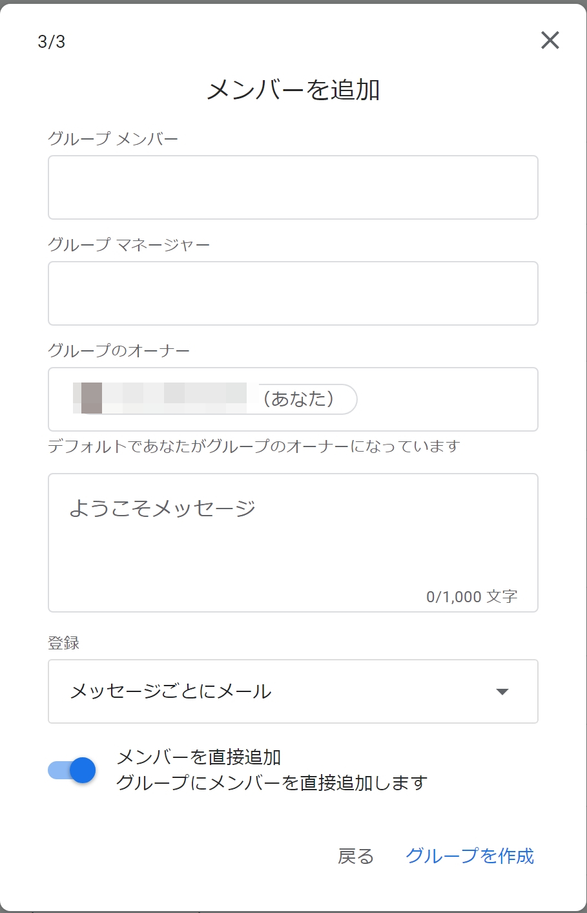

## はじめに

Googleグループ（Google Groups）は，共通の話題について話し合う場を提供するGoogleのサービスです．メーリングリストを作成してグループのメンバー全員に一斉メールを送信できるなど，グループでの活動に便利な機能があります．

ECCSクラウドメールでは，一般のGoogleアカウントで利用できる機能のGoogleグループのほかに，組織向けの機能が追加されたGoogleグループ（ECCSクラウドメール利用者向けのGoogleグループ）を利用できます．どちらを利用するかは選択できますが，東京大学としての活動で利用する場合は，ECCSクラウドメール利用者向けのGoogleグループを使うと便利です．

Googleグループでは，権限設定を誤ると無関係の人に情報が漏洩する危険性があります．本ページや[Googleグループのプライバシー設定に関する資料（UTokyo Accountでのサインインが必要）](https://univtokyo.sharepoint.com/:b:/r/sites/Security/Shared%20Documents/CISO\_Notices/r030525-ciso-besshi.pdf)を参照して，適切に設定してください．

## ECCSクラウドメール利用者向けのGoogleグループの特徴

ECCSクラウドメール利用者向けのGoogleグループと，一般のGoogleアカウントで利用できるGoogleグループ（一般のGoogleグループ）では基本的な機能は同じです．ただし，以下の部分に関して違いがあります．

- Googleグループのメールアドレス：
  - 一般のGoogleグループ：`(任意の文字列)@googlegroups.com`
  - ECCSクラウドメール利用者向けのGoogleグループ：`(任意の文字列)-group@g.ecc.u-tokyo.ac.jp`
    - 情報基盤センターの[メールホスティングサービス](https://mh.ecc.u-tokyo.ac.jp/)を利用する部局・研究室等の場合，ECCSクラウドメール利用者向けのGoogleグループとして，`(任意の文字列)@(その組織のドメイン)`も利用できます．詳しくはメールホスティングサービスのドメイン管理者の方に相談してください．
- グループの設定：
  - ECCSクラウドメール利用者向けのGoogleグループのみ，利用者を「組織」，すなわちECCSクラウドメールの利用者に限定する設定ができます．
    - 例えば，「グループを検索できるユーザー」を「組織全体」にすると，ECCSクラウドメールの利用者のみがそのグループを検索して発見できるようになります．
- グループの管理者：
  - 一般のGoogleグループ：任意のユーザー
  - ECCSクラウドメール利用者向けのGoogleグループ：ECCSクラウドメールの利用者
    - ECCSクラウドメール以外のユーザーに「オーナー」や「マネージャー」等の管理権限を与えるのは，できるだけ避けてください．
- 情報基盤センターの運用の関知：
  - 一般のGoogleグループ：情報基盤センターが運用に関知することはありませんし，システム上関知できません．
  - ECCSクラウドメール利用者向けのGoogleグループ：情報基盤センターは原則として運用に関知しません．ただし，利用状況によって設定を変更することや，法律上の問題がある場合にグループを削除することがあります．

## Googleグループの使い方

### 基本操作

Webブラウザから利用する際は，Googleのサイトでログインした状態で右上の3x3のマスが並んだアイコンを押して表示されるメニューで「グループ」を選択してください．

{:.border}

もし見つからない場合は，以下のリンクを押して下さい．

<b class="box center">[Googleグループ](https://groups.google.com/)</b>

#### グループ
{:#group}

「グループ」は，Googleグループのデフォルトの画面で，自身が所属しているグループが表示されます．画面右側の「グループ」を選択することによっても表示されます．

{:.border}

スクショ内の番号をつけたアイコンには，それぞれ以下の機能があります．

- ①グループの作成
  - 新規のGoogleグループを作成することができます．
  - 詳しい説明は，[グループを作成する](#create-group)を参照してください．
- ②グループの登録設定の変更
  - メール配信の仕方を以下の中から選択し，設定できます．
    - メッセージごとにメール：グループにメッセージが投稿されるたびに，そのメッセージがメールで配信されます．
    - ダイジェスト：最大25件のメッセージが1通のメールにまとめられ，毎日配信されます．
    - 要約：最大150件のメッセージの要旨が1通のメールにまとめられ，毎日配信されます．
    - メールなし：グループからのメールは届きません．
  - [メール配信と全体設定を管理する - Googleグループ ヘルプ](https://support.google.com/groups/answer/9792489?hl=ja)も参照してください．
- ③グループの設定
  - グループ名や説明の編集，プライバシー設定の変更，投稿設定の変更等が可能です．
  - このアイコンが表示されるのはグループのオーナーとマネージャーのみです．
- ④グループメンバーの追加
  - このアイコンが表示されていればメンバーを追加することができます．
- ⑤グループの退出
  - 登録されているグループから自分自身を除くことができます．
- ⑥お気に入りグループの登録
  - お気に入りに登録することで，画面左側の「お気に入りのグループ」リンクから探すことができるようになります．

#### すべてのグループ

画面右側の「すべてのグループ」を選択すると， 検索結果での表示を許可している組織内のすべてのグループが表示されます．ただし，アクセスするためにはそのグループのオーナーまたはマネージャーの許可が必要な場合があります．

{:.border}

### グループを作成する
{:#create-group}

グループを作成する際の手順を説明します．

1. 「グループを作成」ボタンを押してください．表示される画面で以下の内容を入力して，「次へ」を押してください．
   - グループ名：グループの名前です．
   - グループメール：グループのメールアドレスです．グループメンバーのメールアドレスを統合したものと考えてください．このアドレス宛てのメールはグループメンバー全員に送信されます．
     - ドメイン名（＠以下）は組織のもの（`@g.ecc.u-tokyo.ac.jp`）と一般のもの（`@googlegroups.com`）から選べます．
       - 情報基盤センターの[メールホスティングサービス](https://mh.ecc.u-tokyo.ac.jp/)を利用している部局や研究室で，その組織のドメイン名を利用する場合，この画面からはグループを作成できません．詳しくはドメイン管理者の方に相談してください．
   - グループの説明：グループの利用目的や概要などを入力できる欄です．一覧画面や検索結果に表示されます．
   {:.border}{:.medium}

2. プライバシー設定を選択して，「次へ」を押してください．設定にあたっては，関係者以外が内部情報にアクセスできる状態にならないよう，注意してください．
   - ECCSクラウドメール利用者向けのGoogleグループにおいて，グループ設定でユーザを限定する項目は以下のように設定すると良いです．
     - グループのメンバー向けの機能であれば「グループメンバー」
     - 管理的な機能であれば「グループのオーナー」もしくは「グループのマネージャー」
   - 問い合わせ対応用のグループなどでグループメンバー以外の投稿が必要な場合であっても，「組織全体」や「ウェブ上のすべてのユーザー」に変更するのは「投稿できるユーザー」のみにするなど，必要最小限の設定に留めてください．
  {:.border}{:.medium}

3. 「グループ メンバー」にグループに追加したいメンバーのメールアドレスを入力してください．
   - グループの管理の役割を割り当てたい場合は，「グループ マネージャー」や「グループのオーナー」として追加してください．
   - 「登録」では，メッセージの配信方法を選択できます．選択肢の詳細については，[グループ](#group)の②グループの登録設定の変更をご覧ください．
  {:.border}{:.medium}

4. 「グループを作成」を選択すると，グループが作成されます．

### メーリングリストとして使う

Googleグループをメーリングリストとして使うには，メールの送信先にグループのメールアドレスを指定してください．ただし，以下で説明するように，送信者が送信先のグループに参加していることが必要な場合があります．

- 送信先のグループに参加している必要がある場合：グループの設定で「投稿できるユーザー」が「グループメンバー」になっている場合です．多くのグループで当てはまります．
- 送信先のグループに参加しなくても良い場合：グループの設定で「投稿できるユーザー」が「ウェブ上のすべてのユーザー」になっている場合です．例えば，問い合わせ対応用のGoogleグループでは，この設定になっていることがあります．

送信先のグループに参加している必要がある場合で，既存のグループに参加する場合は，グループの管理者に自分のメールアドレスを伝え招待してもらってください．「すべてのグループ」での検索結果では，グループへの参加をリクエストができないことがあります．自分でグループを作成する場合は，[グループを作成する](#create-group)を参照してください．

### Googleグループのメールアドレスを使ってメールを送信する

Googleグループに割り当てられたメールアドレスを利用して，メールを送信することができます．これにより，複数人で一つのアドレスを共有して利用するような使い方ができます．設定方法は，「[Googleグループのメールアドレスを差出人に指定してメールを送信する](./mail_sender/)」を参照してください．

### 共同トレイとして利用する

Googleグループの共同トレイ機能を使うことで，会話にラベル付けを行ったり，メンバーに会話を割り当てたりすることができます．ヘルプデスク等での活用が考えられます．

この機能は，ECCSクラウドメール利用者向けのGoogleグループでのみ利用できる機能です．使用するためにはオーナーまたはマネージャーが，グループの設定から共同トレイの機能を有効にする必要があります．詳しくは「[グループを共同トレイとして使用する - Google Workspace ラーニング センター](https://support.google.com/a/users/answer/167430?hl=ja)」をご覧ください．

## Googleの他サービスとの連携

Googleの他のサービスで，Googleグループのメールアドレスを共有相手に指定することで，当該グループのメンバー全員にまとめて権限を与えることができます．

- Googleドライブの場合：[アクセスできる人の範囲の設定方法（Googleドライブでファイルを共有する）](/google/drive/share#target)
- Googleカレンダーの場合：[他のユーザーとカレンダーを共有する - Google カレンダー ヘルプ](https://support.google.com/calendar/answer/37082)
