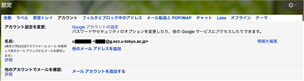
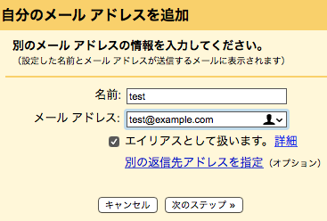

## はじめに

ECCSクラウドメールのGmailでは，アカウント所持者が設定を行うことで，ECCSクラウドメールのアドレス (`xxx@g.ecc.u-tokyo.ac.jp`) 以外のメールアドレスを送信アドレスとしたメールをGmail経由で送ることができます．

設定と利用にあたっては，パスワードの入力を求められる場合とそうでない場合があります．パスワードを入力する場合は下記の点に十分にご留意をいただきご利用ください．

- この設定ではメールアカウントの情報をGoogle社のサービスに入力・保存することとなる点にご注意ください．
- UTokyo AccountやECCSクラウドメールのアカウントが悪意のある第三者に漏れた場合は，ECCSクラウドメールのアドレスのみならず，設定されている他のアドレスが悪意のある第三者に利用され，標的型攻撃の送信やその他のサイバー攻撃に利用される可能性があります．

なお，メールサービスによっては，本ページで案内する方法での送信に対応していない場合がありますのでご注意ください．

## 設定

設定の手順は以下の通りです．

1. ECCSクラウドメールのGmailにアクセスし，画面右上の歯車のアイコンを押してください．

1. 「クイック設定」画面が開くので，「すべての設定を表示」を押してください．

1. 「設定」画面が開くので，「アカウント」を押してください．

1. 「他のメールアドレスを追加」を押し，表示されたフォームに従って必要な情報を入力してください．
    - 初期状態では「エイリアスとして扱います。」にチェックが入っており，登録するメールアドレスがECCSクラウドメールのメールアドレスと同等として扱われます（例えば，登録するメールアドレスに送られたメールが，ECCSクラウドメールのGmailの受信トレイにも表示されます）．ただし，他のアカウントの代理でメールを送信する場合など，「エイリアスとして扱います。」のチェックを外すことが推奨される場合があります．設定の詳細については，Googleのヘルプ「[Gmail の「エイリアスとして扱います」の使用方法](https://support.google.com/a/answer/1710338)」を参照してください．

<figure class="center">
    
    <figcaption>設定画面</figcaption>
</figure>

<figure class="center">
    
    <figcaption>メールアドレス追加画面</figcaption>
</figure>
