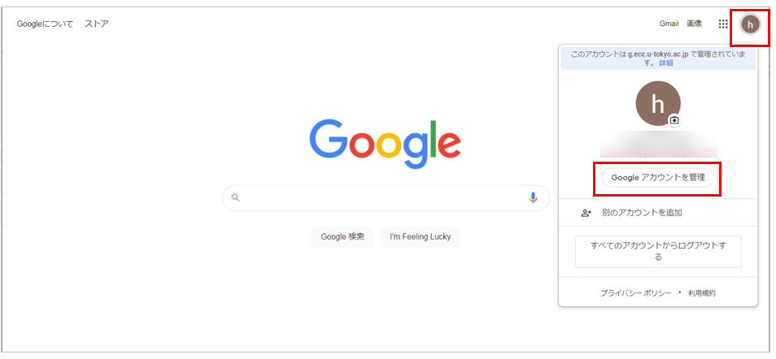
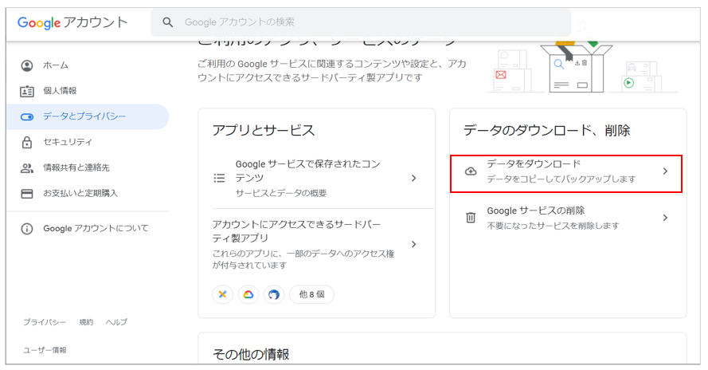
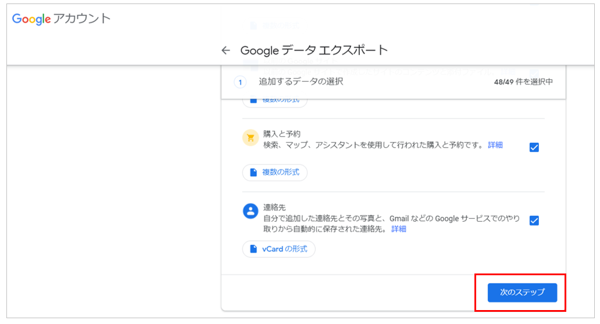
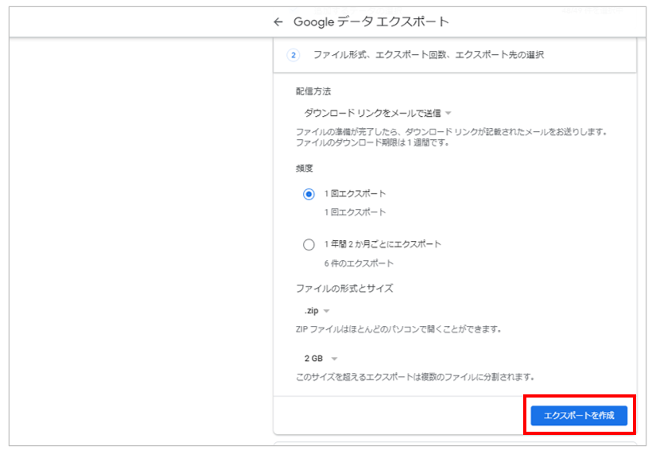
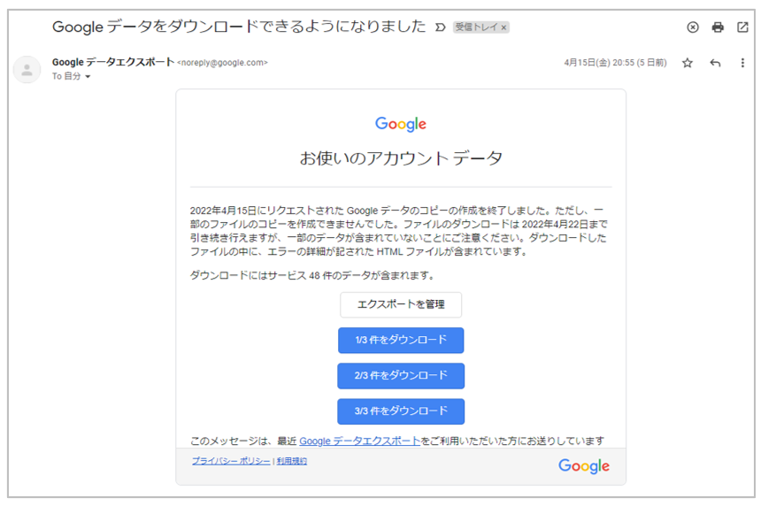

本ページではバックアップ方法の例を掲載しています．詳しくは，[Googleアカウントヘルプ>Googleデータをダウンロードする方法](https://support.google.com/accounts/answer/3024190?hl=ja)を参照にしてください．

メールデータの移行方法は，[ECCSクラウドメールから別のGoogleアカウントにコンテンツを移行する](../transfer/)を参照してください．

1. ECCSクラウドメールにログインしてください．
1. 右上に表示されるプロフィール画像またはイニシャルを押し，「Googleアカウントを管理」を押してください．

   

1. 左メニューから「データとプライバシー」を選択し，「データをダウンロード」を押してください.

   

1. どのサービスのエクスポートデータを作成するかを選択し，「次のステップ」を押してください．

   

1. ファイル形式やファイルのサイズ，配信方法を選択し，「エクスポートを作成」を選択してください．
   - エクスポートの作成には数時間から数日程度かかることがあります．「エクスポート先」に「ダウンロード リンクをメールで送信」を選択すると，作成終了後に通知をECCSクラウドメールで受け取れます．

   

1. 「エクスポート先」に「ダウンロード リンクをメールで送信」を選択した場合，エクスポートデータの作成が完了するとメールが届きます．メールに記載されているダウンロードリンクを押して，データをダウンロードしてください.

   
