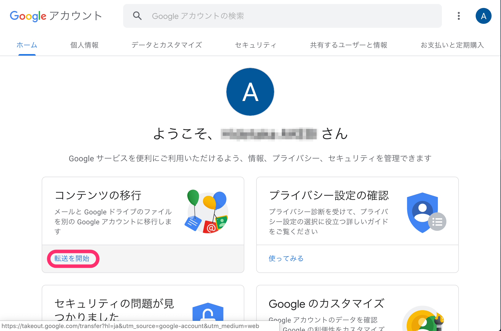

卒業などによりECCSアカウントを喪失する場合，事前にメールやGoogle Driveのデータをバックアップする必要があります．

## Googleアカウントの，**コンテンツの移行**を用いたデータの移行について

Googleアカウントの**コンテンツの移行**により，ECCSクラウドメールのデータを他のGoogleアカウント（GMailでお使いのアカウントや，他の大学，企業などでお使いのG Suiteのアカウント）にコピーすることができます．\
\
また，次のヘルプもご参照ください．\
[学校のアカウントから別のアカウントにコンテンツをコピーする（Google アカウント ヘルプ）](https://support.google.com/accounts/answer/6386856)

### 対象

ECCSクラウドメールの，以下のデータをコピーすることができます

* メール
* ドライブ

### 制限

* コンテンツの移行を実施する時点で，ECCSクラウドメール外のGoogleアカウントを持っている必要があります．（ECCSクラウドメールのアカウント喪失後は行えません）
* 移行先のGoogleアカウントに，十分な容量が必要です
  * ECCSクラウドメールには容量の制限がありません．大量のデータをお持ちの場合，移行できない可能性があります．（通常，GMailなどの無料で使えるGoogleアカウントは15GB程度です）

### 手順

* ECCSクラウドメールのアカウントにログインしてから \[コンテンツの移行] に移動する\
  <https://takeout.google.com/transfer>
* **Googleアカウント** を選択\
  
* **転送を開始** を選択\
  
* データを移行する先のGoogleアカウントを入力して，**コードを送信** を選択\
  

***

データを移行する先のGoogleアカウントに対して，以下のようなメールが送られます

* 転送元のGoogleアカウント（ECCSクラウドメール ）を確認して，**確認コードを取得** を選択\
  
* 確認コード（A5\*\*D\*\*9，一部マスク）をメモ\
  

***

* メモした確認コードを入力して，**確認** を選択\
  
* コピーして移行するコンテンツを選択して，**転送を開始** を選択\
  
* 移行が開始されます\
  \
  \
  移行が完了するまでには，しばらく時間がかかります．\
  進行状況については，**移行の履歴** で確認することができます．\
  
