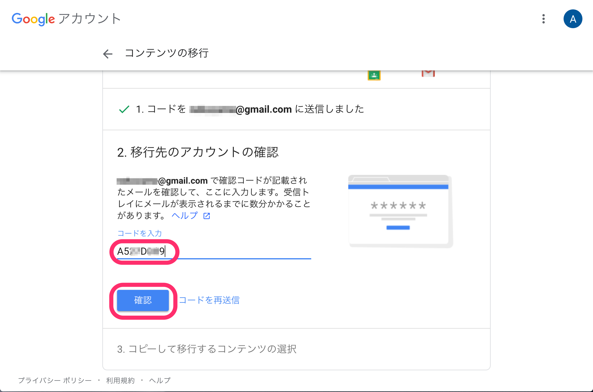

Googleアカウントの「コンテンツの移行」を行うと，ECCSクラウドメールのデータを他のGoogleアカウント（GMailでお使いのアカウントや，他の大学，企業などでお使いのG Suiteのアカウント）にコピーすることができます．

また，次のヘルプもご参照ください．
[学校のアカウントから別のアカウントにコンテンツをコピーする（Google アカウント ヘルプ）](https://support.google.com/accounts/answer/6386856)

## 対象

コピーできるのは以下のデータです．

* メール
* ドライブ

その他のデータをバックアップする方法は，「[ECCSクラウドメールに保存されたデータをダウンロードする](../download/)」を参照してください．

## 制限

* ECCSクラウドメールのアカウント喪失後は行えません．
* コンテンツの移行を実施する時点で，ECCSクラウドメール外のGoogleアカウントを持っている必要があります．
* 移行先のGoogleアカウントに十分な空き容量が必要です．
  * ECCSクラウドメールでは無料で保存できていたサイズでも，移行先では追加料金がかかる場合があります．

## 手順

### 1. コピー先のアカウントにコードを送信する

1. ECCSクラウドメールにログインしてください．
1. コピー元のGoogleアカウントを選択してください．
   {:.small}
1. [コンテンツの移行](https://takeout.google.com/transfer)を開いてください．
1. データを移行する先のGoogleアカウントを入力して，「コードを送信」を押してください．
   {:.small}

### 2. 確認コードを取得する

1. データを移行する先のGoogleアカウントに対して，以下のようなメールが送られます．転送元のGoogleアカウント（ECCSクラウドメール）が正しいか確認して，「確認コードを取得」を押してください．
   {:.small}
1. 確認コード（以下の例では`A5\*\*D\*\*9`のように表示されています）をメモしてください．
   {:.small}

### 3. 確認コードを入力し，データを移行する

1. 「1. コピー先のアカウントにコードを送信する」の画面を開いてください．
1. 「2. 確認コードを取得する」で取得した確認コードを入力して，「確認」を押してください．
   {:.small}
1. コピーするコンテンツを選択して，「転送を開始」を押してください．
   {:.small}
1. 移行が開始されます．
   {:.small}
   - 移行が完了するまでには，しばらく時間がかかります．
   - 進行状況は，「移行の履歴」で確認することができます．
     {:.small}
