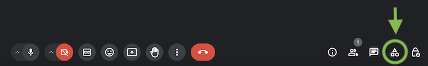
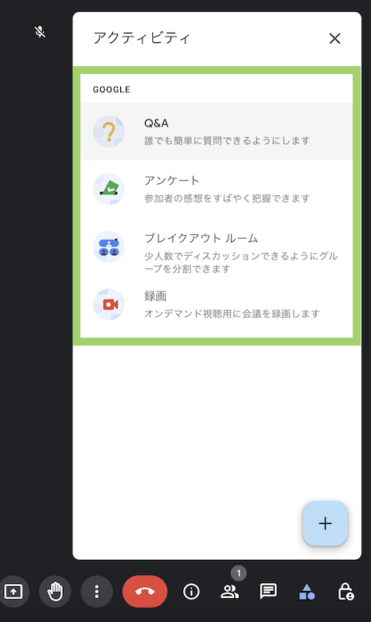
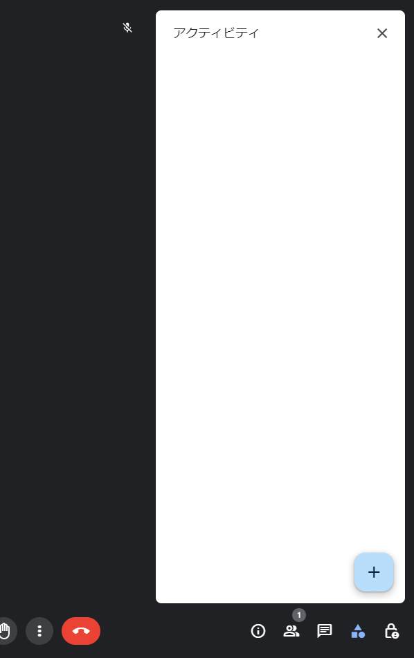

## 概要
{:#overview}

東京大学では、Google Workspace for Education Plusのライセンスを契約しています。これは、[Google Workspace for Education（ECCSクラウドメール）の容量制限](https://www-old.ecc.u-tokyo.ac.jp/announcement/2021/10/29_3366.html)に伴い、大学全体でのストレージ容量を増やすため、2023年11月1日から契約しているもので、当面の間は毎年契約を更新する予定です。

Google Workspace for Education Plusは，大学全体でのストレージ容量の増加，管理者向けの機能強化以外にも，個人にライセンスを付加することにより，ECCSクラウドメールの機能が以下のように強化されます．

- Google Meetでの多人数会議，ライブストリーミング，録画機能が利用可能
- Google Classroom，Google Assignmentでの独自性レポートの制限の緩和
- AppSheetが利用可能

その他の機能の違いは，[Google Workspace for Educationのエディションの比較](https://edu.google.com/intl/ALL_jp/workspace-for-education/editions/compare-editions/)をご覧ください．

なおGoogle Workspace for Education Plusは、学生と教職員で異なるライセンスとなっており、ライブストリーミング機能の使用可否など、一部機能に差異があります。

## ライセンスの申請・付加
{:#apply-and-grant}

ECCSクラウドメールのアカウントに対するGoogle Workspace for Education Plusのライセンスの付加は、利用者からの申請に基づいて行なっています。

申請フォームを送ってください。
氏名のほか、学生教職員の別を正しく申請してね

- もし間違えたり変わったりしたら再送してね
  そしたら自動で付与します
  不要な場合でも、特に取り消しとかは不要です
  すでに身分に応じたライセンスがきちんと付いてる人はそれでOK

<b class="box center"><a href="https://docs.google.com/forms/d/e/1FAIpQLSd2rXNIL_grmiDU_XG5uFMCNNfWhoqDpK5iemvFUsBN2RUeaA/viewform?usp=sf_link">Google Workspace for Education Plusライセンス申請フォーム</a></b>

## ライセンスの確認方法

ライセンスが付与されているかどうかは，[Google Meet](../../meet/)の一部機能の利用可否から確認できます．なお，以下で紹介する機能は，学生向けと教職員向けのいずれもで利用可能なものです．

### 確認手順

1. Google Meetで、[トップページから会議を作成](../../meet/#create_meeting_from_meet_page)します。
2. 画面右下の「アクティビティ」のアイコンをクリックします．
   {:.medium}
3. 機能の利用可否を確認します．
    - ライセンスが付与されている場合，Q&Aやアンケート，ブレイクアウトルームなどの機能が利用可能になっています．
      {:.small}
    - ライセンスが付与されていない場合，Q&A, アンケート，ブレイクアウトルームなどの機能は利用できなくなっています．
      {:.small}
